# beta_v003 시스템 종합 분석 보고서

**분석일**: 2025-10-29
**분석 대상**: beta_v003 (LangGraph 0.6)
**분석 범위**: 전체 시스템 (진입점 → 응답 생성)
**분석 방법**: 실제 코드 추적 + 문서 검증
**분석자**: Claude Code

---

## 🎯 분석 목적

beta_v003 시스템을 **처음부터 끝까지** 실제 코드를 추적하면서 완전히 이해하고 문서화합니다.

**핵심 질문:**
1. ✅ 시스템의 진입점은 어디인가?
2. ✅ 사용자 쿼리가 어떻게 처리되는가?
3. ✅ Supervisor의 각 노드는 무엇을 하는가?
4. ✅ Execution Teams는 어떻게 동작하는가?
5. ✅ 최종 응답은 어떻게 생성되는가?

---

## 📊 시스템 개요

### 버전 정보
- **프로젝트 버전**: beta_v003
- **LangGraph 버전**: 0.6
- **Python**: 3.11+
- **데이터베이스**: PostgreSQL
- **프레임워크**: FastAPI + WebSocket

### 아키텍처 계층

```
┌─────────────────────────────────────────────┐
│  Frontend (React)                           │
│  - WebSocket Client                         │
│  - ExecutionProgressPage                    │
│  - AgentStepsCard                           │
└─────────────────────────────────────────────┘
                    ↕ WebSocket
┌─────────────────────────────────────────────┐
│  Backend - API Layer (FastAPI)              │
│  - chat_api.py: WebSocket endpoint          │
│  - ws_manager.py: ConnectionManager         │
│  - postgres_session_manager.py              │
└─────────────────────────────────────────────┘
                    ↕
┌─────────────────────────────────────────────┐
│  Backend - Service Agent (LangGraph)        │
│  ├─ Supervisor (TeamBasedSupervisor)        │
│  ├─ Cognitive Agents (PlanningAgent)        │
│  ├─ Execution Teams (Search/Analysis/Doc)   │
│  └─ Foundation (Memory, State, Tools)       │
└─────────────────────────────────────────────┘
                    ↕
┌─────────────────────────────────────────────┐
│  Database (PostgreSQL)                      │
│  - chat_sessions                            │
│  - chat_messages                            │
│  - checkpoints (LangGraph)                  │
└─────────────────────────────────────────────┘
```

### 디렉토리 구조 (beta_v003)

```
beta_v003/
├── backend/
│   └── app/
│       ├── api/
│       │   ├── chat_api.py          # WebSocket 엔드포인트
│       │   ├── ws_manager.py        # ConnectionManager
│       │   └── postgres_session_manager.py
│       │
│       ├── service_agent/
│       │   ├── supervisor/
│       │   │   └── team_supervisor.py    # TeamBasedSupervisor
│       │   │
│       │   ├── cognitive_agents/
│       │   │   ├── planning_agent.py     # PlanningAgent
│       │   │   └── query_decomposer.py   # QueryDecomposer
│       │   │
│       │   ├── execution_agents/
│       │   │   ├── search_executor.py    # SearchTeam
│       │   │   ├── analysis_executor.py  # AnalysisTeam
│       │   │   └── document_executor.py  # DocumentTeam (HITL)
│       │   │
│       │   ├── foundation/
│       │   │   ├── separated_states.py   # State 정의
│       │   │   ├── simple_memory_service.py  # 3-Tier Memory
│       │   │   ├── checkpointer.py       # LangGraph Checkpointer
│       │   │   └── ...
│       │   │
│       │   ├── llm_manager/
│       │   │   ├── llm_service.py
│       │   │   ├── prompt_manager.py
│       │   │   └── prompts/
│       │   │       ├── cognitive/        # LLM #1, #2, #3
│       │   │       ├── execution/        # LLM #4, #5, #6, #8, #9, #10
│       │   │       └── common/           # LLM #11
│       │   │
│       │   └── tools/                    # 14+ Tools
│       │
│       ├── models/
│       │   └── chat.py                   # DB Models
│       │
│       └── db/
│           └── postgre_db.py             # DB Connection
│
├── frontend/
│   └── src/
│       ├── components/
│       │   ├── ExecutionProgressPage.tsx
│       │   └── AgentStepsCard.tsx
│       └── hooks/
│           └── useWebSocket.ts
│
└── Manual/                               # 📚 분석 문서들
    ├── SYSTEM_FLOW_DIAGRAM_251029.md
    ├── DEEP_ANALYSIS_SUPPLEMENT_251029.md
    └── BETA_V003_COMPREHENSIVE_ANALYSIS_251029.md (이 파일)
```

---

## 🔍 Part 1: 진입점 분석

### 1.1 WebSocket 엔드포인트

**파일**: `backend/app/api/chat_api.py`
**위치**: 606행
**진입점**: `@router.websocket("/ws/{session_id}")`

```python
@router.websocket("/ws/{session_id}")
async def websocket_chat(
    websocket: WebSocket,
    session_id: str,
    session_mgr: SessionManager = Depends(get_session_manager),
    conn_mgr: ConnectionManager = Depends(get_connection_manager)
):
    """
    실시간 채팅 WebSocket 엔드포인트

    URL: ws://localhost:8000/api/v1/chat/ws/{session_id}
    """
```

**처리 흐름:**

#### Step 1: 세션 검증 (640-650행)

```python
validation_result = await session_mgr.validate_session(session_id)

if not validation_result:
    await websocket.close(code=4004, reason="Session not found or expired")
    return
```

**검증 내용:**
- PostgreSQL `chat_sessions` 테이블 조회
- 세션 만료 여부 확인
- 검증 실패 시 WebSocket 연결 거부 (4004 코드)

#### Step 2: WebSocket 연결 (653행)

```python
await conn_mgr.connect(session_id, websocket)
```

**ConnectionManager 동작** (`ws_manager.py:34-45`):
1. `websocket.accept()` 호출
2. `active_connections[session_id] = websocket` 등록
3. 로그: `[WebSocket] Connected: {session_id}`

#### Step 3: "connected" 메시지 전송 (656-660행)

```python
await conn_mgr.send_message(session_id, {
    "type": "connected",
    "session_id": session_id,
    "timestamp": datetime.now().isoformat()
})
```

**프론트엔드 수신:**
```json
{
    "type": "connected",
    "session_id": "sess_abc123...",
    "timestamp": "2025-10-29T14:30:00.123Z"
}
```

#### Step 4: 메시지 수신 루프 (664-776행)

```python
try:
    while True:
        data = await websocket.receive_text()
        data = json.loads(data)
        message_type = data.get("type")

        if message_type == "query":
            # 쿼리 처리
        elif message_type == "interrupt_response":
            # HITL 재개
        elif message_type == "todo_skip":
            # Todo 스킵
        else:
            # 에러
except WebSocketDisconnect:
    logger.info(f"WebSocket disconnected: {session_id}")
finally:
    await conn_mgr.disconnect(session_id)
```

**지원하는 메시지 타입:**

| 메시지 타입 | 설명 | 필수 필드 |
|-----------|------|---------|
| `query` | 사용자 쿼리 전송 | `query`, `enable_checkpointing` |
| `interrupt_response` | HITL 사용자 피드백 | `action`, `feedback` |
| `todo_skip` | 작업 건너뛰기 | `todo_id` |

---

### 1.2 Query 처리 시작

**위치**: `chat_api.py:676-708`

```python
if message_type == "query":
    query = data.get("query")
    enable_checkpointing = data.get("enable_checkpointing", True)

    if not query:
        await conn_mgr.send_message(session_id, {
            "type": "error",
            "error": "Query cannot be empty"
        })
        continue

    # Progress callback 정의
    async def progress_callback(event_type: str, event_data: dict):
        """실시간 진행 상황 전송"""
        await conn_mgr.send_message(session_id, {
            "type": event_type,
            **event_data,
            "timestamp": datetime.now().isoformat()
        })

    # 비동기 쿼리 처리 시작
    asyncio.create_task(
        _process_query_async(
            supervisor=supervisor,
            query=query,
            session_id=session_id,
            enable_checkpointing=enable_checkpointing,
            progress_callback=progress_callback,
            conn_mgr=conn_mgr,
            session_mgr=session_mgr
        )
    )
```

**핵심 포인트:**

1. **progress_callback 정의**
   - 모든 진행 상황 메시지가 이 함수를 통해 전송됨
   - Supervisor → progress_callback → WebSocket → Frontend

2. **asyncio.create_task**
   - 백그라운드 비동기 처리
   - WebSocket 메인 루프는 블로킹되지 않음
   - 여러 쿼리 동시 처리 가능

3. **supervisor 싱글톤**
   - `get_supervisor()` 함수로 생성
   - 전역에서 하나의 인스턴스만 유지
   - Checkpointer 포함

---

### 1.3 _process_query_async 함수

**파일**: `chat_api.py`
**위치**: 871-1040행

**역할:**
1. 사용자 메시지 DB 저장
2. User ID 추출
3. Supervisor.process_query_streaming() 호출
4. HITL 인터럽트 감지 및 처리
5. 최종 응답 전송 및 저장

#### Phase 1: 메시지 저장 (900-901행)

```python
await _save_message_to_db(session_id, "user", query)
```

**DB 저장:**
- 테이블: `chat_messages`
- 필드:
  - `session_id`: WebSocket session
  - `role`: "user"
  - `content`: 쿼리 텍스트
  - `created_at`: 자동 타임스탬프

#### Phase 2: User ID 추출 (904-908행)

```python
user_id = 1  # 🔧 임시: 테스트용 하드코딩
session_data = await session_mgr.get_session(session_id)
if session_data:
    if user_id:
        logger.info(f"User ID {user_id} extracted from session {session_id}")
```

**목적:**
- Long-term Memory (3-Tier) 로딩에 사용
- user_id가 없으면 Memory 로딩 생략

#### Phase 3: Supervisor 호출 (911-917행)

```python
result = await supervisor.process_query_streaming(
    query=query,
    session_id=session_id,
    chat_session_id=session_id,
    user_id=user_id,
    progress_callback=progress_callback
)
```

**파라미터 설명:**
- `query`: 사용자 쿼리
- `session_id`: HTTP/WebSocket session (임시)
- `chat_session_id`: Checkpointing thread_id로 사용
- `user_id`: Long-term Memory용
- `progress_callback`: 실시간 메시지 전송 함수

**반환값:**
```python
{
    "final_response": {...},        # 최종 응답
    "workflow_status": "completed", # "completed" or "interrupted"
    "interrupt_data": {...}         # HITL 인터럽트 데이터
}
```

#### Phase 4: HITL 인터럽트 감지 (920-1006행)

```python
workflow_status = result.get("workflow_status")
final_response = result.get("final_response")

if workflow_status == "interrupted" or final_response is None:
    logger.info(f"⏸️  Workflow interrupted for session {session_id}")

    # LangGraph 0.6 API로 State 조회
    config = {"configurable": {"thread_id": session_id}}
    state_snapshot = await supervisor.app.aget_state(config)

    # interrupt_value 추출
    if state_snapshot.tasks and len(state_snapshot.tasks) > 0:
        first_task = state_snapshot.tasks[0]
        if hasattr(first_task, 'interrupts') and first_task.interrupts:
            interrupt_value = first_task.interrupts[0].value
            # ... extract metadata

    # 인터럽트 상태 저장
    async with _interrupted_sessions_lock:
        _interrupted_sessions[session_id] = {
            "config": config,
            "interrupt_data": interrupt_data,
            "interrupted_by": interrupted_by,
            "interrupt_type": interrupt_type,
            "timestamp": datetime.now().isoformat()
        }

    # 클라이언트에 알림 전송
    await conn_mgr.send_message(session_id, {
        "type": "workflow_interrupted",
        "interrupted_by": interrupted_by,
        "interrupt_type": interrupt_type,
        "interrupt_data": interrupt_data,
        "message": "워크플로우가 사용자 승인을 기다리고 있습니다."
    })

    return  # 최종 응답 전송하지 않고 대기
```

**LangGraph 0.6 HITL 패턴:**
1. DocumentExecutor가 `interrupt()` 호출
2. Supervisor가 `workflow_status="interrupted"` 반환
3. `aget_state()` API로 interrupt 데이터 추출
4. `_interrupted_sessions`에 상태 저장
5. 클라이언트에 `workflow_interrupted` 메시지 전송
6. 사용자 승인 대기

#### Phase 5: 최종 응답 전송 (1008-1040행)

```python
await conn_mgr.send_message(session_id, {
    "type": "final_response",
    "response": final_response,
    "timestamp": datetime.now().isoformat()
})

# AI 응답 DB 저장
response_content = (
    final_response.get("answer") or
    final_response.get("content") or
    final_response.get("message") or
    ""
)
structured_data = final_response.get("structured_data")

if response_content:
    await _save_message_to_db(session_id, "assistant", response_content, structured_data)
```

**DB 저장:**
- role: "assistant"
- content: 응답 텍스트
- structured_data: 구조화된 답변 (sections, metadata 등)

---

## 🔍 Part 2: Supervisor 분석

### 2.1 Supervisor.process_query_streaming

**파일**: `team_supervisor.py`
**위치**: 1763-1863행

**역할:**
1. Checkpointer 초기화
2. Progress callback 등록
3. 초기 상태 생성
4. LangGraph 워크플로우 실행 (`app.ainvoke`)

#### Phase 1: Checkpointer 초기화 (1792행)

```python
await self._ensure_checkpointer()
```

**_ensure_checkpointer 내부:**
```python
async def _ensure_checkpointer(self):
    if self.enable_checkpointing and self.checkpointer is None:
        async with self._checkpointer_lock:
            if self.checkpointer is None:
                from app.service_agent.foundation.checkpointer import create_checkpointer
                self.checkpointer = await create_checkpointer()
                self.app_with_checkpointer = self._build_graph_with_hitl()
                self.app = self.app_with_checkpointer
```

**Checkpointer 역할:**
- PostgreSQL에 워크플로우 상태 저장
- HITL 인터럽트 지점 보존
- 재연결 시 State 복원 가능
- LangGraph 0.6 AsyncPostgresSaver 사용

#### Phase 2: Progress Callback 등록 (1795-1797행)

```python
if progress_callback:
    self._progress_callbacks[session_id] = progress_callback
```

**중요:**
- `_progress_callbacks`: dict[session_id → callback]
- State에 포함하지 않음 (Callable은 직렬화 불가)
- 각 노드에서 `self._progress_callbacks.get(session_id)`로 조회

#### Phase 3: 초기 상태 생성 (1800-1827행)

```python
initial_state = MainSupervisorState(
    query=query,
    session_id=session_id,
    chat_session_id=chat_session_id,
    user_id=user_id,
    planning_state=None,          # → PlanningAgent 결과
    active_teams=[],              # → ["search", "analysis"]
    team_results={},              # → {"search": {...}}
    final_response=None,          # → 최종 응답
    # ... 기타 필드
)
```

**핵심 필드:**
- `query`: 사용자 쿼리
- `user_id`: Long-term Memory용
- `planning_state`: PlanningAgent 결과 저장
- `active_teams`: 실행할 팀 목록
- `team_results`: 팀별 실행 결과
- `final_response`: 최종 응답

#### Phase 4: 워크플로우 실행 (1832-1846행)

```python
if self.checkpointer:
    thread_id = chat_session_id if chat_session_id else session_id
    config = {
        "configurable": {
            "thread_id": thread_id
        }
    }
    final_state = await self.app.ainvoke(initial_state, config=config)
else:
    final_state = await self.app.ainvoke(initial_state)
```

**app.ainvoke 동작:**
```
START
  ↓
initialize_node (상태 초기화)
  ↓
planning_node (의도 분석 & 계획)
  ↓
_route_after_planning (라우팅 결정)
  ↓
execute_teams_node (팀 실행) or 스킵
  ↓
aggregate_results_node (결과 통합)
  ↓
generate_response_node (응답 생성)
  ↓
END
```

---

## 🔍 Part 3: Supervisor 노드 상세 분석

### 3.1 initialize_node

**위치**: `team_supervisor.py:209-238`

```python
async def initialize_node(self, state: MainSupervisorState) -> MainSupervisorState:
    logger.info("[TeamSupervisor] Initializing")

    state["start_time"] = datetime.now()
    state["status"] = "initialized"
    state["current_phase"] = "initialization"
    state["active_teams"] = []
    state["completed_teams"] = []
    state["failed_teams"] = []
    state["team_results"] = {}
    state["error_log"] = []

    # Supervisor Phase Change: dispatching (5%)
    session_id = state.get("session_id")
    progress_callback = self._progress_callbacks.get(session_id)
    if progress_callback:
        await progress_callback("supervisor_phase_change", {
            "supervisorPhase": "dispatching",
            "supervisorProgress": 5,
            "message": "질문을 접수하고 있습니다"
        })

    return state
```

**WebSocket 메시지:**
```json
{
    "type": "supervisor_phase_change",
    "supervisorPhase": "dispatching",
    "supervisorProgress": 5,
    "message": "질문을 접수하고 있습니다",
    "timestamp": "2025-10-29T14:30:00.123Z"
}
```

**프론트엔드 동작:**
- ExecutionProgressPage 생성 또는 업데이트
- Progress bar: 5%
- "질문을 접수하고 있습니다" 메시지 표시

---

### 3.2 planning_node (Part 1: Supervisor Phase)

**위치**: `team_supervisor.py:240-590`

#### Phase 1: Supervisor Phase Change (250-262행)

```python
state["current_phase"] = "planning"

# Supervisor Phase Change: analyzing (10%)
if progress_callback:
    await progress_callback("supervisor_phase_change", {
        "supervisorPhase": "analyzing",
        "supervisorProgress": 10,
        "message": "질문을 분석하고 계획을 수립하고 있습니다"
    })
```

#### Phase 2: Legacy Messages (264-296행)

```python
# Legacy: planning_start
if progress_callback:
    await progress_callback("planning_start", {
        "message": "계획을 수립하고 있습니다..."
    })

# Chat history 조회 (최근 3개 대화 쌍)
chat_history = await self._get_chat_history(
    session_id=chat_session_id,
    limit=3
)

# Context 생성
context = {"chat_history": chat_history} if chat_history else None

# Legacy: analysis_start
if progress_callback:
    await progress_callback("analysis_start", {
        "message": "질문을 분석하고 있습니다...",
        "stage": "analysis"
    })
```

**주의:**
- `planning_start`, `analysis_start`는 Legacy 메시지
- 현재는 `supervisor_phase_change`로 대체 가능
- 하위 호환성을 위해 유지

---

### 3.3 planning_node (Part 2: PlanningAgent 호출 & Memory 로딩)

#### Phase 3: PlanningAgent - Intent Analysis (298-299행)

```python
intent_result = await self.planning_agent.analyze_intent(query, context)
```

**PlanningAgent 위치**: `cognitive_agents/planning_agent.py:160-256`

**분석 흐름:**

1. **LLM 기반 분석** (`_analyze_with_llm`, 183-256행)
   ```python
   result = await self.llm_service.complete_json_async(
       prompt_name="intent_analysis",  # LLM #1
       variables={
           "query": query,
           "chat_history": chat_history_text
       },
       temperature=0.0,
       max_tokens=500
   )
   ```

2. **Intent Type 파싱** (218-223행)
   ```python
   intent_str = result.get("intent", "UNCLEAR").upper()
   intent_type = IntentType[intent_str]
   # IntentType: LEGAL_CONSULT, MARKET_INQUIRY, LOAN_CONSULT,
   #             CONTRACT_CREATION, CONTRACT_REVIEW, COMPREHENSIVE,
   #             RISK_ANALYSIS, UNCLEAR, IRRELEVANT
   ```

3. **Agent Selection** (226-234행)
   ```python
   if intent_type in [IntentType.IRRELEVANT, IntentType.UNCLEAR]:
       suggested_agents = []  # Performance optimization
   else:
       suggested_agents = await self._suggest_agents(
           intent_type=intent_type,
           query=query,
           keywords=result.get("keywords", [])
       )
   ```

4. **Data Reuse Flag 추가** (236-242행)
   ```python
   reuse_previous_data = result.get("reuse_previous_data", False)
   if reuse_previous_data:
       entities["reuse_previous_data"] = reuse_previous_data
   ```

**반환값:**
```python
IntentResult(
    intent_type=IntentType,
    confidence=float,
    keywords=List[str],
    reasoning=str,
    entities=dict,  # reuse_previous_data 포함
    suggested_agents=List[str],
    fallback=False
)
```

---

#### Phase 4: Data Reuse Logic (300-385행)

**목적**: 이전 대화에서 검색 결과를 재사용하여 성능 최적화

```python
reuse_intent = intent_result.entities.get("reuse_previous_data", False)
state["reuse_intent"] = reuse_intent

if reuse_intent and chat_history:
    # 최근 메시지에서 검색 데이터 확인
    message_limit = settings.DATA_REUSE_MESSAGE_LIMIT  # 기본값: 3
    recent_messages = chat_history[-message_limit * 2:]  # user + assistant 쌍

    # 검색 데이터 감지
    for msg in recent_messages:
        if msg["role"] == "assistant" and self._has_reusable_data(msg):
            has_search_data = True
            break

    if has_search_data:
        # SearchTeam 결과를 team_results에 미리 저장
        state["data_reused"] = True
        state["team_results"]["search"] = {
            "data": msg["content"],
            "reused": True
        }

        # suggested_agents에서 SearchTeam 제거
        intent_result.suggested_agents = [
            agent for agent in intent_result.suggested_agents
            if agent != "search_team"
        ]
```

**WebSocket 메시지:**
```json
{
    "type": "data_reuse_notification",
    "message": "search 데이터를 재사용합니다",
    "reused_teams": ["search"],
    "reused_from_message": 2
}
```

---

#### Phase 5: 3-Tier Hybrid Memory 로딩 (387-446행)

**Memory 구조:**
- **Short-term (1-5 sessions)**: 전체 메시지 (raw messages)
- **Mid-term (6-10 sessions)**: LLM 요약
- **Long-term (11-20 sessions)**: LLM 요약

```python
if user_id:
    async for db_session in get_async_db():
        memory_service = LongTermMemoryService(db_session)

        # 3-Tier Memory 로드
        tiered_memories = await memory_service.load_tiered_memories(
            user_id=user_id,
            current_session_id=chat_session_id  # 현재 세션 제외
        )

        # User Preferences 로드
        user_preferences = await memory_service.get_user_preferences(user_id)

        # State 저장
        state["tiered_memories"] = tiered_memories
        state["loaded_memories"] = (  # 하위 호환성
            tiered_memories.get("shortterm", []) +
            tiered_memories.get("midterm", []) +
            tiered_memories.get("longterm", [])
        )
        state["user_preferences"] = user_preferences
```

**로그 출력:**
```
[TeamSupervisor] 3-Tier memories loaded - Short(3), Mid(2), Long(1)
```

---

#### Phase 6: IRRELEVANT/UNCLEAR 조기 종료 (447-488행)

**성능 최적화**: 불필요한 처리 건너뛰기 (3초 → 0.6초)

```python
if intent_result.intent_type == IntentType.IRRELEVANT:
    state["planning_state"] = {
        "analyzed_intent": {...},
        "execution_steps": [],  # 빈 리스트
    }
    state["active_teams"] = []
    return state  # 조기 종료

if intent_result.intent_type == IntentType.UNCLEAR and intent_result.confidence < 0.3:
    # 동일한 조기 종료 로직
    return state
```

---

#### Phase 7: Execution Plan 생성 (490-544행)

```python
# PlanningAgent로 실행 계획 생성
execution_plan = await self.planning_agent.create_execution_plan(intent_result)

# PlanningState 생성
planning_state = PlanningState(
    raw_query=query,
    analyzed_intent={
        "intent_type": intent_result.intent_type.value,
        "confidence": intent_result.confidence,
        "keywords": intent_result.keywords,
        "entities": intent_result.entities
    },
    execution_steps=[
        {
            "step_id": f"step_{i}",
            "step_type": self._get_step_type_for_agent(step.agent_name),
            "agent_name": step.agent_name,
            "team": self._get_team_for_agent(step.agent_name),
            "priority": step.priority,
            "task": self._get_task_name_for_agent(step.agent_name, intent_result),
            "description": self._get_task_description_for_agent(step.agent_name, intent_result),
            "status": "pending",
            "progress_percentage": 0,
            "started_at": None,
            "completed_at": None,
            "result": None,
            "error": None
        }
        for i, step in enumerate(execution_plan.steps)
    ],
    execution_strategy=execution_plan.strategy.value,
    parallel_groups=execution_plan.parallel_groups,
    estimated_total_time=execution_plan.estimated_time
)

state["planning_state"] = planning_state
```

---

#### Phase 8: Active Teams 결정 (546-575행)

**Priority 순서 보장:**

```python
active_teams = []
seen_teams = set()

# Priority 순으로 정렬
sorted_steps = sorted(
    planning_state["execution_steps"],
    key=lambda x: x.get("priority", 999)
)

for step in sorted_steps:
    team = step.get("team")

    # Data Reuse 시 SearchTeam 스킵
    if state.get("data_reused") and team == "search":
        exec_step["status"] = "skipped"
        exec_step["result"] = {"message": "Reused previous data"}
        continue

    if team and team not in seen_teams:
        active_teams.append(team)
        seen_teams.add(team)

state["active_teams"] = active_teams  # 순서 보장!
```

**로그 출력:**
```
[TeamSupervisor] Plan created: 2 steps, 2 teams
[TeamSupervisor] Active teams (priority order): ['search', 'analysis']
```

---

#### Phase 9: plan_ready 전송 (584-599행)

```python
await progress_callback("plan_ready", {
    "intent": intent_result.intent_type.value,
    "confidence": intent_result.confidence,
    "execution_steps": planning_state["execution_steps"],
    "execution_strategy": execution_plan.strategy.value,
    "estimated_total_time": execution_plan.estimated_time,
    "keywords": intent_result.keywords
})
```

**WebSocket 메시지:**
```json
{
    "type": "plan_ready",
    "intent": "법률상담",
    "confidence": 0.95,
    "execution_steps": [
        {
            "step_id": "step_0",
            "agent_name": "search_team",
            "team": "search",
            "task": "법률 정보 검색",
            "status": "pending"
        },
        {
            "step_id": "step_1",
            "agent_name": "analysis_team",
            "team": "analysis",
            "task": "검색 결과 분석",
            "status": "pending"
        }
    ],
    "execution_strategy": "sequential",
    "estimated_total_time": 15.0,
    "keywords": ["전세", "보증금", "계약"]
}
```

---

## 🔍 Part 4: PlanningAgent 상세 분석

### 4.1 PlanningAgent 아키텍처

**파일**: `cognitive_agents/planning_agent.py`

**역할:**
1. **Intent Analysis**: 사용자 의도 분석 (LLM #1)
2. **Agent Selection**: 실행할 팀 추천 (LLM #2)
3. **Execution Plan**: 실행 계획 생성

---

### 4.2 analyze_intent 메서드

**위치**: `planning_agent.py:160-256`

**LLM 호출 (LLM #1):**
```python
result = await self.llm_service.complete_json_async(
    prompt_name="intent_analysis",
    variables={
        "query": query,
        "chat_history": chat_history_text
    },
    temperature=0.0,
    max_tokens=500
)
```

**Prompt 파일**: `llm_manager/prompts/cognitive/intent_analysis.txt`

**LLM 응답 형식:**
```json
{
    "intent": "LEGAL_CONSULT",
    "confidence": 0.95,
    "keywords": ["전세", "보증금", "계약"],
    "reasoning": "전세 계약 관련 법률 상담 질문",
    "entities": {
        "contract_type": "전세",
        "amount": "1억 원"
    },
    "reuse_previous_data": false
}
```

---

### 4.3 _suggest_agents 메서드

**위치**: `planning_agent.py:305-397`

**3-Layer Fallback 전략:**

#### Layer 0: 키워드 필터 (322-348행)

```python
if intent_type == IntentType.LEGAL_CONSULT:
    analysis_keywords = [
        "비교", "분석", "계산", "평가", "추천", "검토",
        "어떻게", "방법", "차이", "장단점"
    ]

    needs_analysis = any(kw in query for kw in analysis_keywords)

    if not needs_analysis:
        return ["search_team"]  # 단순 검색만
    else:
        return ["search_team", "analysis_team"]  # 검색 + 분석
```

#### Layer 1: Primary LLM (350-363행)

```python
agents = await self._select_agents_with_llm(
    intent_type=intent_type,
    query=query,
    keywords=keywords,
    attempt=1
)
```

**LLM 호출 (LLM #2):**
```python
result = await self.llm_service.complete_json_async(
    prompt_name="agent_selection",
    variables={
        "intent": intent_type.value,
        "query": query,
        "keywords": ", ".join(keywords)
    }
)
```

**Prompt 파일**: `llm_manager/prompts/cognitive/agent_selection.txt`

#### Layer 2: Simplified Prompt (365-376행)

Primary LLM 실패 시 간소화된 프롬프트로 재시도

#### Layer 3: Safe Defaults (378-397행)

```python
safe_defaults = {
    IntentType.LEGAL_CONSULT: ["search_team"],
    IntentType.MARKET_INQUIRY: ["search_team", "analysis_team"],
    IntentType.LOAN_CONSULT: ["search_team", "analysis_team"],
    IntentType.CONTRACT_CREATION: ["document_team"],
    IntentType.CONTRACT_REVIEW: ["search_team", "analysis_team"],
    IntentType.COMPREHENSIVE: ["search_team", "analysis_team"],
    IntentType.RISK_ANALYSIS: ["search_team", "analysis_team"],
    IntentType.UNCLEAR: ["search_team", "analysis_team"],
    IntentType.IRRELEVANT: ["search_team"],
    IntentType.ERROR: ["search_team", "analysis_team"]
}
```

---

### 4.4 create_execution_plan 메서드

**위치**: `planning_agent.py:586-671`

**실행 계획 생성 흐름:**

```python
# 1. IRRELEVANT 체크
if intent.intent_type == IntentType.IRRELEVANT:
    return ExecutionPlan(steps=[], ...)

# 2. Low-confidence UNCLEAR 체크
if intent.intent_type == IntentType.UNCLEAR and intent.confidence < 0.3:
    return ExecutionPlan(steps=[], ...)

# 3. Available Agents 확인
available_agents = AgentRegistry.list_agents(enabled_only=True)

# 4. Agent 필터링
selected_agents = [
    agent for agent in intent.suggested_agents
    if agent in available_agents
]

# 5. Execution Steps 생성
steps = self._create_execution_steps(selected_agents, intent)

# 6. Strategy 결정
strategy = self._determine_strategy(intent, steps)

# 7. Parallel Groups 생성
parallel_groups = self._create_parallel_groups(steps)

return ExecutionPlan(
    steps=steps,
    strategy=strategy,
    intent=intent,
    estimated_time=self._estimate_execution_time(steps),
    parallel_groups=parallel_groups
)
```

---

## 🔍 Part 5: Execution Teams 분석

### 5.1 execute_teams_node

**위치**: `team_supervisor.py:986-1049`

#### Phase 1: Supervisor Phase Change (995-1007행)

```python
await progress_callback("supervisor_phase_change", {
    "supervisorPhase": "executing",
    "supervisorProgress": 30,
    "message": "작업을 실행하고 있습니다"
})
```

#### Phase 2: execution_start 전송 (1009-1026행)

```python
await progress_callback("execution_start", {
    "message": "작업 실행을 시작합니다...",
    "execution_steps": planning_state.get("execution_steps", []),
    "intent": analyzed_intent.get("intent_type", "unknown"),
    "confidence": analyzed_intent.get("confidence", 0.0),
    "execution_strategy": planning_state.get("execution_strategy", "sequential"),
    "estimated_total_time": planning_state.get("estimated_total_time", 0),
    "keywords": analyzed_intent.get("keywords", [])
})
```

#### Phase 3: Strategy 결정 (1028-1043행)

```python
execution_strategy = state.get("execution_plan", {}).get("strategy", "sequential")
active_teams = state.get("active_teams", [])

if execution_strategy == "parallel" and len(active_teams) > 1:
    # 병렬 실행
    results = await self._execute_teams_parallel(active_teams, shared_state, state)
else:
    # 순차 실행
    results = await self._execute_teams_sequential(active_teams, shared_state, state)
```

---

### 5.2 _execute_teams_sequential

**위치**: `team_supervisor.py:1147-1249`

**순차 실행 흐름:**

```python
for team_name in teams:
    # Step ID 찾기
    step_id = self._find_step_id_for_team(team_name, planning_state)

    # 1. Status: in_progress
    planning_state = StateManager.update_step_status(
        planning_state,
        step_id,
        "in_progress",
        progress=0
    )
    await progress_callback("todo_updated", {
        "execution_steps": planning_state["execution_steps"]
    })

    # 2. 팀 실행
    result = await self._execute_single_team(team_name, shared_state, main_state)

    # 3. Status: completed
    planning_state = StateManager.update_step_status(
        planning_state,
        step_id,
        "completed",
        progress=100
    )
    await progress_callback("todo_updated", {
        "execution_steps": planning_state["execution_steps"]
    })

    # 4. 다음 팀으로 데이터 전달
    if team_name == "search" and "analysis" in teams:
        main_state["team_results"][team_name] = result
```

**WebSocket 메시지 (todo_updated):**
```json
{
    "type": "todo_updated",
    "execution_steps": [
        {
            "step_id": "step_0",
            "agent_name": "search_team",
            "status": "in_progress",
            "progress_percentage": 50
        },
        {
            "step_id": "step_1",
            "agent_name": "analysis_team",
            "status": "pending",
            "progress_percentage": 0
        }
    ]
}
```

---

### 5.3 _execute_single_team

**위치**: `team_supervisor.py:1251-1285`

```python
team = self.teams[team_name]

# Progress Callback 설정
progress_callback = self._progress_callbacks.get(session_id)
if progress_callback:
    team.progress_callback = progress_callback

# 팀별 실행
if team_name == "search":
    return await team.execute(shared_state)

elif team_name == "document":
    doc_type = self._extract_document_type(main_state)
    return await team.execute(shared_state, document_type=doc_type)

elif team_name == "analysis":
    input_data = main_state.get("team_results", {})
    return await team.execute(
        shared_state,
        analysis_type="comprehensive",
        input_data=input_data
    )
```

---

### 5.4 SearchExecutor 서브그래프

**파일**: `execution_agents/search_executor.py`

**노드 구조 (5 nodes):**

```
START
  ↓
prepare_node (검색 쿼리 준비)
  ↓
route_node (검색 타입 결정)
  ↓
search_node (실제 검색 실행)
  ↓
aggregate_node (결과 집계)
  ↓
finalize_node (최종 결과 생성)
  ↓
END
```

**WebSocket 메시지 (agent_step_change):**
```json
{
    "type": "agent_step_change",
    "team": "search",
    "step": "prepare",
    "status": "in_progress",
    "message": "검색 쿼리를 준비하고 있습니다",
    "progress": 20
}
```

---

## 🔍 Part 6: Response Generation 분석

### 6.1 aggregate_results_node

**위치**: `team_supervisor.py:1321-1365`

#### Phase 1: Supervisor Phase Change (1329-1341행)

```python
await progress_callback("supervisor_phase_change", {
    "supervisorPhase": "finalizing",
    "supervisorProgress": 75,
    "message": "결과를 정리하고 있습니다"
})
```

#### Phase 2: 팀 결과 집계 (1343-1356행)

```python
aggregated = {}
team_results = state.get("team_results", {})

for team_name, team_data in team_results.items():
    if team_data:
        aggregated[team_name] = {
            "status": "success",
            "data": team_data
        }

state["aggregated_results"] = aggregated
```

#### Phase 3: 실행 통계 (1358-1364행)

```python
total_teams = len(state.get("active_teams", []))
succeeded_teams = len([name for name, data in aggregated.items()
                       if data.get("status") == "success"])
failed_teams = len([name for name, data in aggregated.items()
                    if data.get("status") == "failed"])

logger.info(f"Aggregation complete: {succeeded_teams}/{total_teams} teams succeeded")
```

---

### 6.2 generate_response_node

**위치**: `team_supervisor.py:1367-1516`

#### Phase 1-5: Supervisor Phase Change (1375-1449행)

```python
# 85%: 최종 답변 생성 시작
await progress_callback("supervisor_phase_change", {
    "supervisorPhase": "finalizing",
    "supervisorProgress": 85,
    "message": "최종 답변을 생성하고 있습니다"
})

# 87%: 답변 내용 작성
await progress_callback("supervisor_phase_change", {
    "supervisorPhase": "finalizing",
    "supervisorProgress": 87,
    "message": "답변 내용을 작성하고 있습니다"
})

# 90%: 답변 검증
await progress_callback("supervisor_phase_change", {
    "supervisorPhase": "finalizing",
    "supervisorProgress": 90,
    "message": "답변을 검증하고 있습니다"
})

# 92%: 대화 저장 (Memory)
await progress_callback("supervisor_phase_change", {
    "supervisorPhase": "finalizing",
    "supervisorProgress": 92,
    "message": "대화를 저장하고 있습니다"
})

# 95%: 답변 생성 완료
await progress_callback("supervisor_phase_change", {
    "supervisorPhase": "finalizing",
    "supervisorProgress": 95,
    "message": "답변 생성 완료"
})
```

#### Phase 6: IRRELEVANT/UNCLEAR 처리 (1389-1400행)

```python
if intent_type == "irrelevant" or (intent_type == "unclear" and confidence < 0.3):
    response = self._generate_out_of_scope_response(state)
```

**Out of Scope Response:**
```json
{
    "type": "guidance",
    "answer": "죄송합니다. 저는 부동산 전세 관련 법률, 시세, 대출 상담 전문 AI입니다...",
    "suggestions": [
        "전세 계약서 작성 및 검토",
        "전세 시세 조회",
        "전세 대출 상담"
    ]
}
```

#### Phase 7: LLM 응답 생성 (1418-1423행)

```python
if self.planning_agent.llm_service:
    response = await self._generate_llm_response(state)
```

**_generate_llm_response 내부 (LLM #10, #11):**

```python
# LLM #10: Response Generation
result = await self.planning_agent.llm_service.complete_json_async(
    prompt_name="response_generation",
    variables={
        "query": state["query"],
        "aggregated_results": aggregated_results,
        "tiered_memories": state.get("tiered_memories", {}),
        "user_preferences": state.get("user_preferences", {})
    }
)

# LLM #11: Response Validation (Optional)
if settings.ENABLE_RESPONSE_VALIDATION:
    validation_result = await self.planning_agent.llm_service.complete_json_async(
        prompt_name="response_validation",
        variables={"response": result}
    )
```

**Prompt 파일:**
- LLM #10: `llm_manager/prompts/execution/response_generation.txt`
- LLM #11: `llm_manager/prompts/common/response_validation.txt`

#### Phase 8: Long-term Memory 저장 (1460-1513행)

```python
if user_id and intent_type not in ["irrelevant", "unclear"]:
    async for db_session in get_async_db():
        memory_service = LongTermMemoryService(db_session)

        # 백그라운드 요약 시작
        await memory_service.summarize_conversation_background(
            session_id=chat_session_id,
            user_id=user_id,
            messages=[]
        )

        # 대화 저장
        await memory_service.save_conversation(
            user_id=user_id,
            session_id=chat_session_id,
            messages=[],
            summary=response_summary
        )
```

---

## 🔍 Part 7: 전체 흐름 다이어그램

### 7.1 Complete End-to-End Flow

```mermaid
graph TD
    Start([Client: Query 전송]) --> WS[WebSocket Endpoint<br/>chat_api.py:606]

    WS --> Val{Session 검증}
    Val -->|실패| Close[WebSocket Close 4004]
    Val -->|성공| Conn[WebSocket Connect]

    Conn --> Msg1[Connected 메시지]
    Msg1 --> PCB[Progress Callback 정의]
    PCB --> Async[asyncio.create_task<br/>_process_query_async]

    Async --> SaveUser[User Message DB 저장]
    SaveUser --> SupCall[Supervisor.process_query_streaming]

    SupCall --> Init[initialize_node<br/>dispatching 5%]

    Init --> Plan[planning_node<br/>analyzing 10%]

    Plan --> P1[Intent Analysis<br/>LLM #1]
    P1 --> P2[Agent Selection<br/>LLM #2]
    P2 --> P3[Data Reuse Check]
    P3 --> P4[3-Tier Memory Load]
    P4 --> P5{IRRELEVANT or<br/>Low UNCLEAR?}

    P5 -->|Yes| Skip1[Empty Plan<br/>조기 종료]
    P5 -->|No| P6[Create Execution Plan]

    P6 --> P7[Determine Active Teams]
    P7 --> P8[plan_ready 전송]

    P8 --> Route{Route Decision}

    Route -->|Empty Plan| Agg
    Route -->|Has Teams| Exec[execute_teams_node<br/>executing 30%]

    Exec --> ExS[execution_start 전송]
    ExS --> Strat{Strategy?}

    Strat -->|Sequential| Seq[_execute_teams_sequential]
    Strat -->|Parallel| Par[_execute_teams_parallel]

    Seq --> T1[Team 1: Search]
    T1 --> T1a[agent_step_change: prepare]
    T1a --> T1b[agent_step_change: search]
    T1b --> T1c[agent_step_change: finalize]
    T1c --> T1d[todo_updated: completed]

    T1d --> T2[Team 2: Analysis]
    T2 --> T2a[agent_step_change: analyze]
    T2a --> T2b[todo_updated: completed]

    Par --> P1P[Team 1 & 2 병렬 실행]
    P1P --> P2P[todo_updated: 각각 완료]

    T2b --> Agg
    P2P --> Agg
    Skip1 --> Agg

    Agg[aggregate_results_node<br/>finalizing 75%]

    Agg --> Gen[generate_response_node<br/>finalizing 85-95%]

    Gen --> G1{Intent?}

    G1 -->|IRRELEVANT/UNCLEAR| OOS[Out of Scope Response]
    G1 -->|Normal| G2[LLM Response Generation<br/>LLM #10]

    G2 --> G3[LLM Response Validation<br/>LLM #11 Optional]
    G3 --> G4[Long-term Memory 저장]

    OOS --> Final
    G4 --> Final[final_response 생성]

    Final --> Check{HITL Interrupt?}

    Check -->|Yes| Int[workflow_interrupted 전송]
    Check -->|No| FR[final_response 전송]

    Int --> Wait[사용자 승인 대기]
    FR --> SaveAI[AI Response DB 저장]
    SaveAI --> End([Complete])
```



---

### 7.2 WebSocket Messages Timeline

**전체 메시지 흐름:**

```
1. connected (chat_api)
   ↓
2. supervisor_phase_change: dispatching 5%
   ↓
3. supervisor_phase_change: analyzing 10%
   ↓
4. planning_start (Legacy)
   ↓
5. analysis_start (Legacy)
   ↓
6. data_reuse_notification (Optional)
   ↓
7. plan_ready
   ↓
8. supervisor_phase_change: executing 30%
   ↓
9. execution_start
   ↓
10. todo_updated: step_0 in_progress
    ↓
11. agent_step_change: search/prepare in_progress
    ↓
12. agent_step_change: search/search in_progress
    ↓
13. agent_step_change: search/finalize completed
    ↓
14. todo_updated: step_0 completed
    ↓
15. todo_updated: step_1 in_progress
    ↓
16. agent_step_change: analysis/analyze in_progress
    ↓
17. agent_step_change: analysis/finalize completed
    ↓
18. todo_updated: step_1 completed
    ↓
19. supervisor_phase_change: finalizing 75%
    ↓
20. supervisor_phase_change: finalizing 85%
    ↓
21. supervisor_phase_change: finalizing 87%
    ↓
22. supervisor_phase_change: finalizing 90%
    ↓
23. supervisor_phase_change: finalizing 92%
    ↓
24. supervisor_phase_change: finalizing 95%
    ↓
25. final_response (or workflow_interrupted)
```

---

### 7.3 LLM Call Points Summary

**11개 LLM 호출 지점:**

| LLM # | 노드/팀 | 프롬프트 파일 | 역할 |
|-------|---------|-------------|------|
| #1 | planning_node | cognitive/intent_analysis.txt | 의도 분석 |
| #2 | planning_node | cognitive/agent_selection.txt | Agent 선택 |
| #3 | planning_node | cognitive/plan_generation.txt | 계획 생성 (Optional) |
| #4 | SearchExecutor | execution/search_query.txt | 검색 쿼리 생성 |
| #5 | SearchExecutor | execution/result_filtering.txt | 결과 필터링 |
| #6 | AnalysisExecutor | execution/analysis.txt | 분석 수행 |
| #7 | DocumentExecutor | execution/document_draft.txt | 문서 초안 |
| #8 | DocumentExecutor | execution/document_review.txt | 문서 검토 |
| #9 | LongTermMemory | common/conversation_summary.txt | 대화 요약 |
| #10 | generate_response_node | execution/response_generation.txt | 응답 생성 |
| #11 | generate_response_node | common/response_validation.txt | 응답 검증 (Optional) |

---

## 📊 시스템 특징 요약

### 핵심 강점

1. **2-Layer Progress System**
   - Layer 1: Supervisor Phase (5% → 95%)
   - Layer 2: Agent Steps (각 팀의 세부 진행)

2. **3-Tier Hybrid Memory**
   - Short (1-5): Raw messages
   - Mid (6-10): LLM summaries
   - Long (11-20): LLM summaries

3. **Data Reuse Optimization**
   - 이전 검색 결과 재사용
   - SearchTeam 자동 스킵
   - 성능 향상: 30-50%

4. **HITL (Human-in-the-Loop)**
   - LangGraph 0.6 interrupt() 패턴
   - DocumentExecutor에서 사용자 승인
   - State 보존 및 재개

5. **Multi-Level Fallback**
   - LLM 실패 시 안전한 기본값
   - 3-Layer Agent Selection
   - Pattern Matching Fallback

6. **실시간 진행 상황 전송**
   - 16가지 WebSocket 메시지
   - ExecutionProgressPage 실시간 업데이트
   - AgentStepsCard 세부 진행률

---

## 🎯 성능 최적화

### 조기 종료 (Early Return)

```python
# IRRELEVANT: 3초 → 0.6초 (80% 개선)
if intent_type == IntentType.IRRELEVANT:
    return empty_plan

# Low UNCLEAR: 3초 → 0.8초 (73% 개선)
if intent_type == IntentType.UNCLEAR and confidence < 0.3:
    return empty_plan
```

### Data Reuse

```python
# SearchTeam 스킵: 15초 → 5초 (67% 개선)
if reuse_intent and has_search_data:
    skip_search_team()
```

### Agent Selection Skip

```python
# IRRELEVANT/UNCLEAR: Agent Selection 생략
if intent_type in [IntentType.IRRELEVANT, IntentType.UNCLEAR]:
    suggested_agents = []  # LLM #2 호출 생략
```

---

## 📝 개선 제안

### 1. user_id 하드코딩 제거

**현재 상태** (`chat_api.py:904`):
```python
user_id = 1  # 🔧 임시: 테스트용 하드코딩
```

**개선안:**
```python
session_data = await session_mgr.get_session(session_id)
user_id = session_data.get("user_id") if session_data else None
```

### 2. Message 타입 정리

**미사용 메시지:**
- `todo_created` (현재 미사용)
- `planning_start`, `analysis_start` (Legacy, 삭제 고려)

**개선안:**
- 미사용 메시지 제거
- 프론트엔드와 백엔드 메시지 타입 통일

### 3. 문서 버전 통일

**현재 상태:**
- 일부 문서에 "beta_v001" 참조 (수정 완료)

**개선안:**
- 모든 문서 버전 통일 검증
- 자동 버전 체크 스크립트 추가

---

**작성 진행률: 100%**
**전체 분석 완료**

---

**작성자**: Claude Code
**분석 기준**: beta_v003 실제 코드
**분석일**: 2025-10-29
**문서 버전**: 1.0 (Final)
