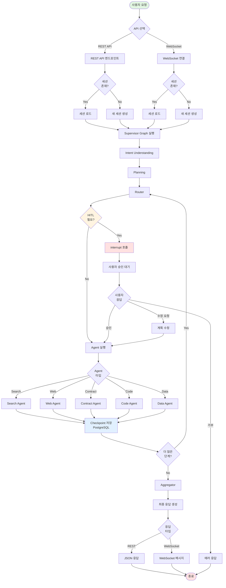
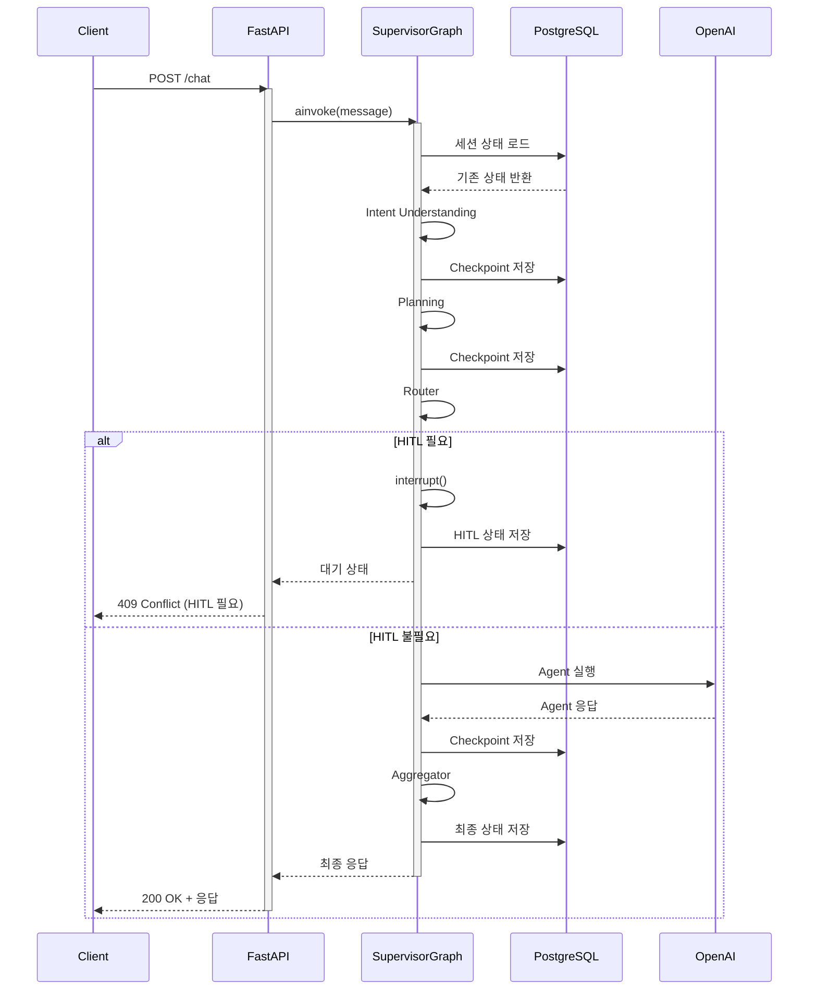
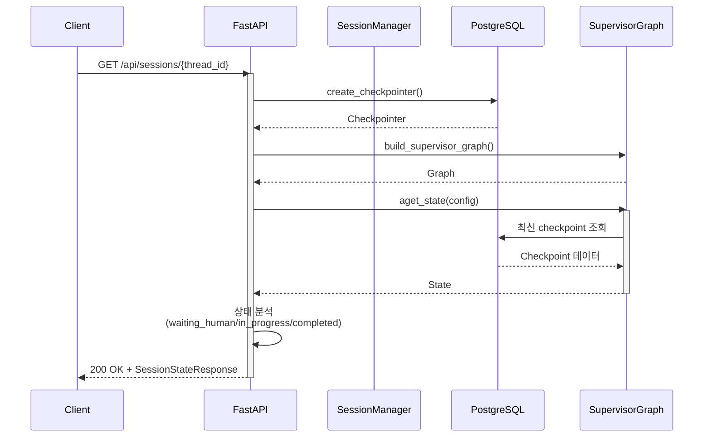
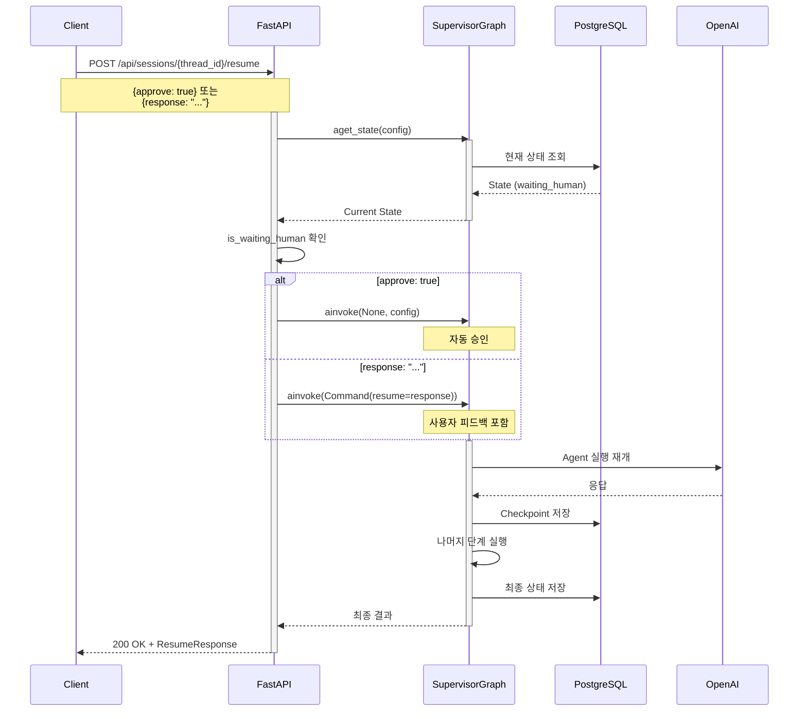
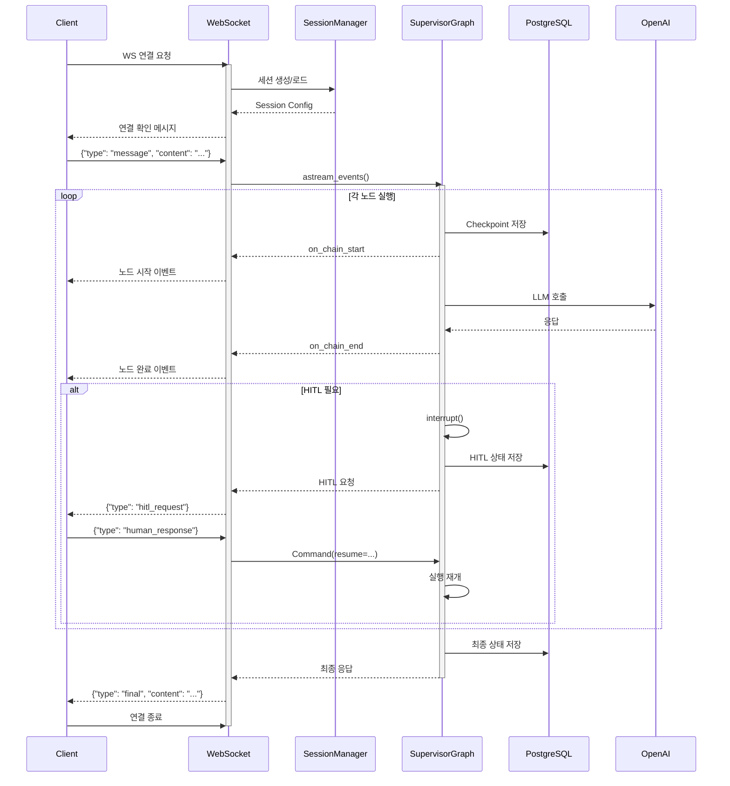
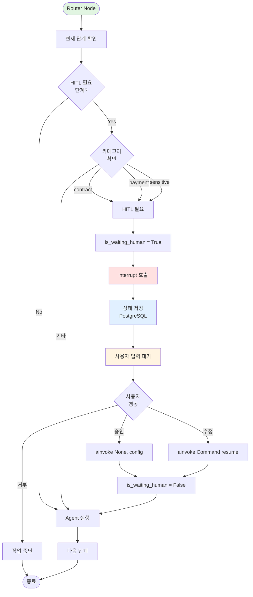
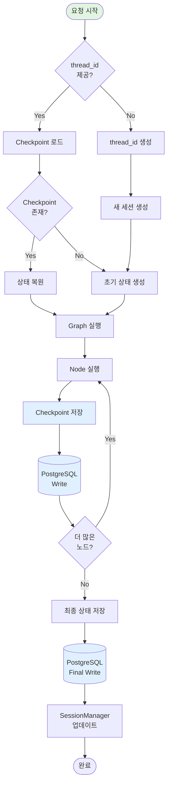
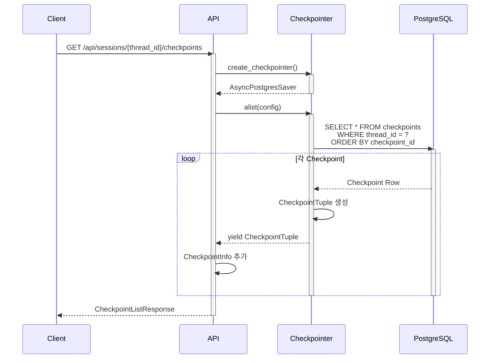
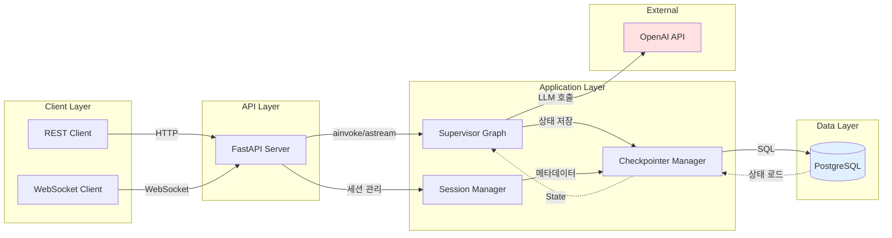

# 시스템 플로우차트

**작성일**: 2025-11-03
**버전**: 0.4.0

---

## 목차

1. [전체 시스템 플로우](#전체-시스템-플로우)
2. [REST API 플로우](#rest-api-플로우)
3. [WebSocket API 플로우](#websocket-api-플로우)
4. [HITL 플로우](#hitl-플로우)
5. [세션 관리 플로우](#세션-관리-플로우)

---

## 전체 시스템 플로우

---

## REST API 플로우

### 1. 채팅 메시지 처리 (POST /chat)

---

### 2. 세션 상태 조회 (GET /api/sessions/{thread_id})

---

### 3. HITL 재개 (POST /api/sessions/{thread_id}/resume)

---

## WebSocket API 플로우

---

## HITL 플로우

---

## 세션 관리 플로우

### 세션 생성 및 체크포인트 관리

---

### Checkpoint 조회 플로우

---

## 데이터 플로우

---

## 참조

- [시스템 아키텍처 명세서](./시스템_아키텍처_명세서_251103.md)
- [에이전트 플로우차트](./에이전트_플로우차트_251103.md)
- [API 명세서](./API_명세서_251103.md)
