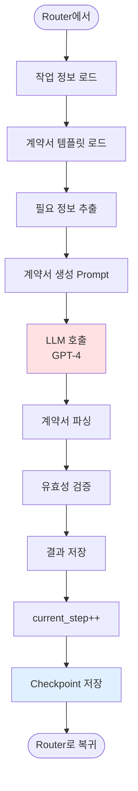

# 에이전트 플로우차트

**작성일**: 2025-11-03
**버전**: 0.4.0

---

## 목차

1. [Supervisor Pattern 개요](#supervisor-pattern-개요)
2. [전체 에이전트 플로우](#전체-에이전트-플로우)
3. [개별 노드 상세](#개별-노드-상세)
4. [에이전트 라우팅 로직](#에이전트-라우팅-로직)
5. [상태 전파](#상태-전파)

---

## Supervisor Pattern 개요

Supervisor Pattern은 LangGraph 1.0에서 제공하는 멀티 에이전트 오케스트레이션 패턴입니다.

### 핵심 개념

- **Supervisor**: 전체 워크플로우를 조율하는 중앙 제어 노드
- **Worker Agents**: 특정 작업을 수행하는 전문 에이전트
- **StateGraph**: 상태 기반 워크플로우 관리
- **Checkpoint**: 각 단계마다 상태 저장

---

## 전체 에이전트 플로우


---

## 개별 노드 상세

### 1. Intent Understanding Node

**목적**: 사용자의 의도를 분석하고 카테고리 분류


**상태 업데이트**:
```python
{
    "user_intent": {
        "category": "contract",
        "description": "계약서 작성 요청",
        "key_entities": ["계약서", "작성"],
        "complexity": "medium"
    }
}
```

---

### 2. Planning Node

**목적**: 실행 계획 수립 및 에이전트 할당


**상태 업데이트**:
```python
{
    "plan": {
        "total_steps": 3,
        "steps": [
            {
                "step": 1,
                "agent": "contract",
                "task": "계약서 초안 작성",
                "estimated_time": "2분"
            },
            {
                "step": 2,
                "agent": "hitl",
                "task": "사용자 승인",
                "estimated_time": "5분"
            },
            {
                "step": 3,
                "agent": "contract",
                "task": "최종 계약서 생성",
                "estimated_time": "1분"
            }
        ]
    },
    "current_step": 0,
    "is_planning": False,
    "is_executing": True
}
```

---

### 3. Router Node

**목적**: 현재 단계에 맞는 에이전트 선택 및 HITL 체크


**라우팅 로직**:
```python
def route_to_agent(state):
    plan = state["plan"]
    current_step = state["current_step"]
    step_info = plan["steps"][current_step]
    agent_name = step_info["agent"]

    # HITL 체크
    if agent_name == "hitl":
        if not state.get("is_waiting_human"):
            state["is_waiting_human"] = True
            interrupt("HITL 승인 필요")

    # 에이전트 라우팅
    return agent_name  # "search", "web", "contract", etc.
```

---

### 4. Worker Agents

#### Search Agent


#### Web Agent


#### Contract Agent



---

### 5. Aggregator Node

**목적**: 모든 에이전트 결과를 통합하고 최종 응답 생성


**상태 업데이트**:
```python
{
    "final_result": "[최종 응답] 계약서 작성이 완료되었습니다...",
    "is_executing": False,
    "aggregated_data": {
        "summary": "...",
        "steps_completed": 3,
        "execution_time": "8분"
    }
}
```

---

## 에이전트 라우팅 로직

### 조건부 엣지 (Conditional Edge)


### 라우팅 구현 코드

```python
def should_continue(state: SupervisorState) -> str:
    """다음 노드 결정"""
    current_step = state.get("current_step", 0)
    plan = state.get("plan")

    if not plan:
        return END

    total_steps = plan.get("total_steps", 0)

    # 모든 단계 완료
    if current_step >= total_steps:
        return "aggregator"

    # 다음 단계 실행
    return "router"


def route_to_agent(state: SupervisorState) -> str:
    """에이전트 선택"""
    plan = state["plan"]
    current_step = state["current_step"]
    step_info = plan["steps"][current_step]
    agent = step_info["agent"]

    # HITL 체크
    if agent == "hitl" or step_info.get("requires_approval"):
        if not state.get("is_waiting_human"):
            interrupt("사용자 승인이 필요합니다")

    # 에이전트 매핑
    agent_map = {
        "search": "search_agent",
        "web": "web_agent",
        "contract": "contract_agent",
        "code": "code_agent",
        "data": "data_agent"
    }

    return agent_map.get(agent, "search_agent")
```

---

## 상태 전파

### StateGraph 상태 흐름


### 상태 스키마

```python
class SupervisorState(TypedDict):
    # 메시지 히스토리
    messages: Annotated[list, add_messages]

    # 의도 분석 결과
    user_intent: Optional[dict]
    # {
    #     "category": "contract",
    #     "description": "...",
    #     "key_entities": [...],
    #     "complexity": "medium"
    # }

    # 실행 계획
    plan: Optional[dict]
    # {
    #     "total_steps": 3,
    #     "steps": [...]
    # }

    # 현재 단계
    current_step: int

    # 플래그
    is_planning: bool
    is_executing: bool
    is_waiting_human: bool  # HITL 대기

    # 결과 데이터
    aggregated_data: Optional[dict]
    final_result: Optional[str]

    # 출력 형식
    output_format: str  # "chat", "json", "markdown"
```

---

## 에이전트 간 통신

### 메시지 전달


---

## 참조

- [시스템 아키텍처 명세서](./시스템_아키텍처_명세서_251103.md)
- [시스템 플로우차트](./시스템_플로우차트_251103.md)
- [API 명세서](./API_명세서_251103.md)
