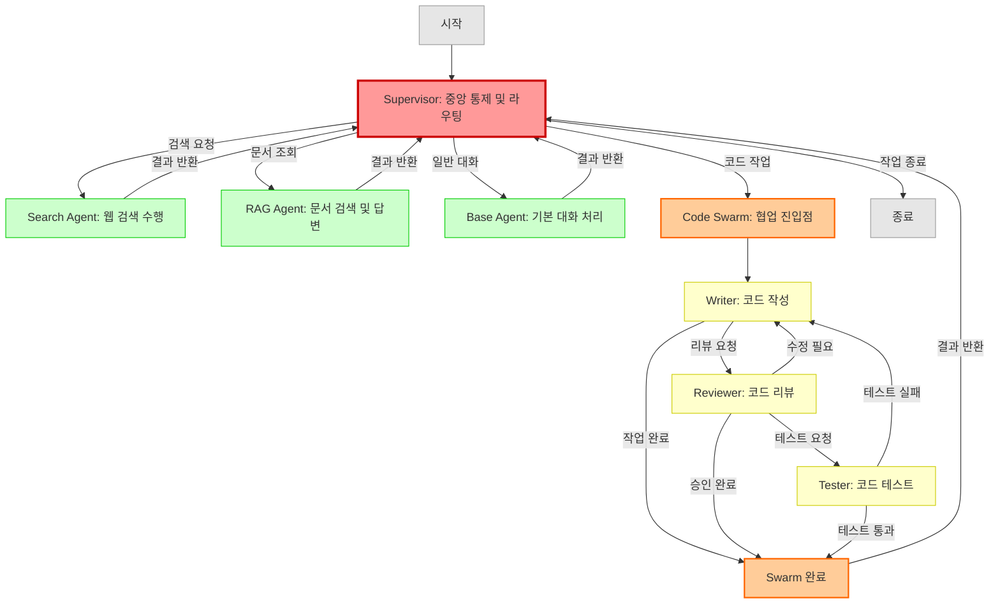

# Cognitive vs Execute 패턴 - 에이전트 로직 분리

**작성일**: 2025-01-03
**프로젝트**: Octostrator
**목적**: 에이전트의 사고(Cognitive)와 실행(Execute)을 분리하여 명확하고 효율적인 아키텍처 구축

---

## 1. 개념 정의

### Cognitive (인지/사고 단계)
- **역할**: 생각, 판단, 계획, 분석, 추론
- **구현**: LLM 호출
- **비용**: 높음 (LLM API 비용)
- **속도**: 느림 (LLM 추론 시간)
- **예시**:
  - "사용자가 날씨를 물었으니 웹 검색이 필요하다"
  - "검색 결과를 바탕으로 답변을 구성해야 한다"
  - "다음 단계는 X를 실행해야 한다"

### Execute (실행 단계)
- **역할**: 실제 행동, 툴 실행, API 호출, 데이터 처리
- **구현**: 함수 호출, API 요청, DB 쿼리
- **비용**: 낮음 (계산 비용만)
- **속도**: 빠름 (즉시 실행)
- **예시**:
  - 웹 검색 API 호출
  - 데이터베이스 쿼리
  - 파일 읽기/쓰기
  - 계산 수행

---

## 2. 구현 패턴 7가지

### Pattern 1: Sequential (순차 실행)

**구조**:
```
Cognitive → Execute → Cognitive → Execute → ... → END
```

**특징**:
- 가장 기본적인 ReAct 패턴
- Thought → Action → Observation 반복
- LangGraph의 tools_condition과 유사

**장점**:
- ✅ 간단하고 직관적
- ✅ 디버깅 용이
- ✅ 각 단계별 로깅 가능

**단점**:
- ❌ 느림 (순차 실행)
- ❌ LLM 호출이 많아 비용 증가
- ❌ 병렬 실행 불가

**적용 시나리오**:
- 단순한 Task
- 단계별 검증이 필요한 경우
- 디버깅 중인 개발 단계

**코드 예시**:
```python
from langgraph.graph import StateGraph, START, END
from langgraph.prebuilt import ToolNode, tools_condition

workflow = StateGraph(State)

# Cognitive 노드 (LLM)
async def cognitive_node(state: State) -> dict:
    """생각하고 계획 세우기"""
    messages = state["messages"]
    response = await llm_with_tools.ainvoke(messages)
    return {"messages": [response]}

# Execute 노드 (Tools)
tool_node = ToolNode([search_tool, calculator_tool])

# 순차 실행
workflow.add_node("cognitive", cognitive_node)
workflow.add_node("execute", tool_node)

workflow.add_edge(START, "cognitive")
workflow.add_conditional_edges("cognitive", tools_condition, {
    "execute": "execute",
    END: END
})
workflow.add_edge("execute", "cognitive")  # 다시 생각
```

---

### Pattern 2: Batch Execute (일괄 실행)

**구조**:
```
Cognitive (계획) → Execute (병렬 실행) → Cognitive (결과 분석) → END
```

**특징**:
- Cognitive에서 여러 작업을 한 번에 계획
- Execute에서 모든 작업을 병렬로 실행
- 다시 Cognitive로 돌아가 결과 분석

**장점**:
- ✅ 빠름 (병렬 실행)
- ✅ LLM 호출 횟수 감소
- ✅ 비용 절감

**단점**:
- ❌ 실행 중 에러 처리 어려움
- ❌ 동적 조정 불가 (계획 변경 어려움)
- ❌ 복잡한 Task에는 부적합

**적용 시나리오**:
- 독립적인 여러 작업 (예: 여러 문서 동시 검색)
- 빠른 응답이 필요한 경우
- 작업 간 의존성이 없는 경우

**코드 예시**:
```python
async def cognitive_planner(state: State) -> dict:
    """한 번에 여러 작업 계획"""
    # LLM이 여러 tool_calls를 한 번에 반환
    response = await llm_with_tools.ainvoke(state["messages"])
    # response.tool_calls = [call1, call2, call3, ...]
    return {"messages": [response]}

async def batch_executor(state: State) -> dict:
    """모든 tool_calls를 병렬 실행"""
    last_message = state["messages"][-1]
    tool_calls = last_message.tool_calls

    # 병렬 실행
    import asyncio
    results = await asyncio.gather(*[
        execute_tool(call) for call in tool_calls
    ])

    # ToolMessage로 반환
    tool_messages = [ToolMessage(content=r, tool_call_id=c.id)
                     for r, c in zip(results, tool_calls)]
    return {"messages": tool_messages}

workflow.add_node("cognitive_planner", cognitive_planner)
workflow.add_node("batch_executor", batch_executor)
workflow.add_edge(START, "cognitive_planner")
workflow.add_edge("cognitive_planner", "batch_executor")
workflow.add_edge("batch_executor", "cognitive_planner")  # 결과 분석
```

---

### Pattern 3: Hierarchical (계층적 분리)

**구조**:
```
Supervisor (Cognitive만)
    ↓ (라우팅)
┌─────────┬─────────┬─────────┐
Agent1    Agent2    Agent3
(Cog+Exe) (Cog+Exe) (Cog+Exe)
```

**특징**:
- Supervisor는 Cognitive만 담당 (어느 Agent로 보낼지 결정)
- 각 Agent는 자체적으로 Cognitive + Execute
- Octostrator의 현재 계획과 유사

**장점**:
- ✅ 명확한 역할 분리
- ✅ 확장성 (Agent 추가 용이)
- ✅ Agent별 독립적 개발 가능

**단점**:
- ❌ Supervisor가 단순 라우팅만 하면 비효율
- ❌ Agent 간 협업 어려움
- ❌ 구조가 복잡

**적용 시나리오**:
- **Octostrator 프로젝트** (지금 구조)
- 전문화된 Agent가 많은 경우
- 멀티 도메인 Task

**코드 예시**:
```python
# Supervisor: Cognitive만
async def supervisor_cognitive(state: State) -> Command:
    """어느 Agent로 보낼지만 결정"""
    decision = await router_llm.ainvoke(state["messages"])

    # 라우팅 결정만
    return Command(
        update={"messages": [decision]},
        goto=decision.next_agent  # "search" or "rag" or "base"
    )

# Search Agent: Cognitive + Execute
async def search_agent_cognitive(state: State) -> dict:
    """검색 계획"""
    response = await llm_with_search.ainvoke(state["messages"])
    return {"messages": [response]}

async def search_agent_execute(state: State) -> dict:
    """검색 실행"""
    # ToolNode 사용
    return await search_tool_node.ainvoke(state)

# Graph 구성
workflow.add_node("supervisor", supervisor_cognitive)
workflow.add_node("search_cognitive", search_agent_cognitive)
workflow.add_node("search_execute", search_agent_execute)

workflow.add_edge(START, "supervisor")
workflow.add_conditional_edges("supervisor", lambda s: s["next"])
workflow.add_conditional_edges("search_cognitive", tools_condition)
workflow.add_edge("search_execute", "search_cognitive")
```

---

### Pattern 4: Stream Processing (스트리밍)

**구조**:
```
Cognitive (스트리밍) → Execute (즉시) → Cognitive (계속) → ...
```

**특징**:
- LLM 응답을 스트리밍으로 받음
- tool_call이 나오는 즉시 Execute
- 나머지 응답 계속 처리

**장점**:
- ✅ 매우 빠름 (실시간)
- ✅ 사용자 경험 향상 (점진적 응답)
- ✅ 병렬성 극대화

**단점**:
- ❌ 구현 복잡
- ❌ 에러 처리 어려움
- ❌ 디버깅 어려움

**적용 시나리오**:
- 실시간 대화형 UI
- 긴 응답이 필요한 경우
- 사용자 대기 시간 최소화

**코드 예시** (개념적):
```python
async def streaming_cognitive_execute(state: State):
    """Cognitive와 Execute를 동시에"""
    messages = state["messages"]

    # LLM 스트리밍
    stream = llm_with_tools.astream(messages)

    tool_results = []
    text_chunks = []

    async for chunk in stream:
        # Tool call이 나오면 즉시 실행
        if chunk.tool_calls:
            for call in chunk.tool_calls:
                result = await execute_tool_async(call)
                tool_results.append(result)

        # 텍스트는 모음
        if chunk.content:
            text_chunks.append(chunk.content)

    # 최종 결과 반환
    final_text = "".join(text_chunks)
    return {
        "messages": [
            AIMessage(content=final_text),
            *tool_results
        ]
    }
```

---

### Pattern 5: Cache-Optimized (캐싱 최적화)

**구조**:
```
Cognitive (계획 + 캐시 확인) → Execute (캐시 miss만) → END
```

**특징**:
- Cognitive 단계에서 이전 결과 캐시 확인
- 캐시 hit이면 Execute 건너뜀
- 캐시 miss만 Execute

**장점**:
- ✅ 중복 작업 제거
- ✅ 비용 절감 (LLM + Tool 모두)
- ✅ 빠른 응답

**단점**:
- ❌ 캐시 관리 복잡
- ❌ 캐시 무효화 로직 필요
- ❌ 메모리 사용 증가

**적용 시나리오**:
- 반복적인 쿼리 (예: "날씨" 같은 자주 묻는 질문)
- 비용이 높은 Tool (예: 복잡한 DB 쿼리)
- 변경 빈도가 낮은 데이터

**코드 예시**:
```python
from functools import lru_cache
import hashlib

# 캐시 (간단한 메모리 캐시)
RESULT_CACHE = {}

async def cached_cognitive(state: State) -> dict:
    """계획하고 캐시 확인"""
    messages = state["messages"]
    response = await llm_with_tools.ainvoke(messages)

    # Tool calls가 있으면 캐시 확인
    if response.tool_calls:
        cached_calls = []
        execute_calls = []

        for call in response.tool_calls:
            # 캐시 키 생성
            cache_key = hashlib.md5(
                f"{call.name}:{call.args}".encode()
            ).hexdigest()

            if cache_key in RESULT_CACHE:
                # 캐시 hit
                cached_calls.append(RESULT_CACHE[cache_key])
            else:
                # 캐시 miss - 실행 필요
                execute_calls.append(call)

        # 캐시 hit 결과는 바로 state에 추가
        # execute_calls만 Execute 노드로 전달
        response.tool_calls = execute_calls

    return {"messages": [response]}

async def cached_executor(state: State) -> dict:
    """실행하고 캐시에 저장"""
    last_message = state["messages"][-1]
    tool_calls = last_message.tool_calls

    results = []
    for call in tool_calls:
        result = await execute_tool(call)

        # 캐시에 저장
        cache_key = hashlib.md5(
            f"{call.name}:{call.args}".encode()
        ).hexdigest()
        RESULT_CACHE[cache_key] = result

        results.append(ToolMessage(content=result, tool_call_id=call.id))

    return {"messages": results}
```

---

### Pattern 6: Swarm Agent (스웜 에이전트)

**구조**:
```
Agent1 (Cog+Exe) ⇄ Agent2 (Cog+Exe) ⇄ Agent3 (Cog+Exe)
   ↓ handoff          ↓ handoff          ↓ handoff
 Agent4              Agent1              Agent2
 (자율적 협업)
```

**특징**:
- 여러 자율 에이전트가 **동등한 관계**로 협업
- 에이전트 간 **직접 통신 및 작업 전달(handoff)**
- 중앙 컨트롤러 없음 (분산형)
- 각 에이전트는 독자적으로 Cognitive + Execute

**장점**:
- ✅ 높은 유연성 (동적 협업)
- ✅ 에이전트 간 자유로운 작업 전달
- ✅ 복잡한 멀티 스텝 Task 처리
- ✅ 에이전트 자율성 극대화

**단점**:
- ❌ 매우 복잡한 구현
- ❌ 디버깅 어려움 (비결정적 흐름)
- ❌ 무한 루프 위험 (에이전트 간 핑퐁)
- ❌ 비용 높음 (모든 에이전트가 LLM 사용)
- ❌ 작업 흐름 예측 어려움

**Batch Execute와의 차이**:
| 구분 | Batch Execute | Swarm Agent |
|------|---------------|-------------|
| 제어 | 중앙 집중형 (단일 LLM이 계획) | 분산형 (각 에이전트 자율) |
| 통신 | 없음 (독립적 병렬 실행) | 있음 (에이전트 간 handoff) |
| 협업 | 불가능 | 가능 (동적 협업) |
| 흐름 | 결정적 (예측 가능) | 비결정적 (동적) |
| 복잡도 | 낮음 | 매우 높음 |

**적용 시나리오**:
- 복잡한 멀티 에이전트 협업 (예: AutoGen)
- 에이전트 간 작업 전달이 필요한 경우
- 연구 프로젝트 (프로덕션 부적합)
- 고도로 복잡한 Task (예: 코드 리뷰 → 수정 → 테스트 → 배포)

**코드 예시** (OpenAI Swarm 스타일):
```python
from typing import Literal

# 에이전트 정의
class SwarmAgent:
    def __init__(self, name: str, llm, tools):
        self.name = name
        self.llm = llm
        self.tools = tools

    async def execute(self, state: State) -> dict:
        """자율적으로 Cognitive + Execute"""
        messages = state["messages"]
        response = await self.llm.ainvoke(messages)

        # Handoff 결정
        if response.handoff_to:
            return {
                "messages": [response],
                "next_agent": response.handoff_to
            }

        # Tool 실행
        if response.tool_calls:
            tool_results = await execute_tools(response.tool_calls)
            return {
                "messages": [response, *tool_results],
                "next_agent": self.name  # 다시 본인에게
            }

        # 완료
        return {"messages": [response], "next_agent": None}


# 에이전트 생성
search_agent = SwarmAgent("search", llm, [tavily_search])
code_agent = SwarmAgent("code", llm, [python_repl])
review_agent = SwarmAgent("review", llm, [])

# Swarm 실행 (LangGraph 없이 순수 로직)
async def run_swarm(initial_message: str):
    state = {"messages": [HumanMessage(content=initial_message)]}
    current_agent = search_agent  # 시작 에이전트

    max_steps = 10
    for step in range(max_steps):
        result = await current_agent.execute(state)
        state["messages"].extend(result["messages"])

        # Handoff
        if result["next_agent"] == "search":
            current_agent = search_agent
        elif result["next_agent"] == "code":
            current_agent = code_agent
        elif result["next_agent"] == "review":
            current_agent = review_agent
        elif result["next_agent"] is None:
            break  # 완료

        # 무한 루프 방지
        if step == max_steps - 1:
            print("Max steps reached!")
            break

    return state["messages"]


# LangGraph로 구현 시 (더 복잡)
async def swarm_router(state: State) -> str:
    """다음 에이전트 결정"""
    last_message = state["messages"][-1]
    if hasattr(last_message, "handoff_to"):
        return last_message.handoff_to
    return END

workflow = StateGraph(State)
workflow.add_node("search", search_agent.execute)
workflow.add_node("code", code_agent.execute)
workflow.add_node("review", review_agent.execute)

# 모든 노드에서 모든 노드로 전환 가능 (복잡!)
for source in ["search", "code", "review"]:
    workflow.add_conditional_edges(source, swarm_router, {
        "search": "search",
        "code": "code",
        "review": "review",
        END: END
    })

workflow.add_edge(START, "search")
```

**Octostrator 적용 여부**:
- ❌ **단독 사용 권장하지 않음** (과도하게 복잡)
- ✅ **Supervisor와 결합 시 유용** (Pattern 7 참고)

---

### Pattern 7: Hierarchical + Swarm Hybrid (하이브리드)

**구조**:
```
Supervisor (중앙 통제, Cognitive만)
    ↓ 라우팅
┌────────────────┬────────────────┬──────────────────┐
Search Agent     RAG Agent        Code Swarm (협업)
(단순)           (단순)           ├─ Writer
                                  ├─ Reviewer  ⇄
                                  └─ Tester
    ↓                ↓                  ↓
         모두 Supervisor로 결과 반환
```

**특징**:
- Supervisor가 **중앙 통제** (큰 방향성 결정)
- **단순 Agent**: 독립적 실행 (Search, RAG 등)
- **Swarm Agent**: 복잡한 Task만 Swarm으로 처리 (Code, Planning 등)
- Swarm은 **제한된 scope** 내에서만 동작 (무한 루프 방지)
- 최종 제어권은 항상 Supervisor

**장점**:
- ✅ **중앙 통제 + 자율성 균형** (최고의 장점)
- ✅ 무한 루프 위험 감소 (Supervisor가 제어)
- ✅ 복잡도 선택적 적용 (필요한 곳만 Swarm)
- ✅ 디버깅 가능 (Supervisor 레벨에서 추적)
- ✅ 확장성 (Agent 추가/Swarm 추가 모두 용이)

**단점**:
- ❌ 구현 복잡도 중간 (Hierarchical보다 복잡)
- ❌ Swarm 설계 필요 (어떤 Agent를 Swarm으로?)
- ❌ 비용 증가 (Swarm 사용 시)

**Hierarchical vs Swarm vs Hybrid 비교**:
| 구분 | Hierarchical (Pattern 3) | Swarm (Pattern 6) | Hybrid (Pattern 7) |
|------|--------------------------|-------------------|-------------------|
| 중앙 통제 | ✅ Supervisor | ❌ 없음 (분산) | ✅ Supervisor |
| Agent 협업 | ❌ 불가능 | ✅ 자유로운 협업 | ✅ 필요 시만 협업 |
| 무한 루프 위험 | ❌ 없음 | ⚠️ 높음 | ⚠️ 낮음 (제한) |
| 복잡도 | ⭐⭐ | ⭐ | ⭐⭐ |
| 비용 | ⭐⭐⭐ | ⭐ | ⭐⭐ |
| 확장성 | ⭐⭐⭐⭐⭐ | ⭐⭐⭐⭐ | ⭐⭐⭐⭐⭐ |

**적용 시나리오**:
- **Octostrator 프로젝트** (Phase 4+)
- 대부분의 Task는 단순하지만, 일부 복잡한 협업이 필요한 경우
- 예: 검색/RAG는 단순, Code 생성/리뷰는 복잡

**코드 예시** (Octostrator 구조):
```python
from langgraph.graph import StateGraph, START, END
from langgraph.types import Command

# ============================================
# Supervisor: 중앙 통제
# ============================================
async def supervisor_node(state: SupervisorState) -> Command:
    """중앙 통제 - 어디로 보낼지 결정"""
    decision = await router_llm.ainvoke(state["messages"])

    # 단순 Agent vs Swarm 선택
    if decision.task_type == "search":
        return Command(goto="search_agent")  # 단순 Agent
    elif decision.task_type == "rag":
        return Command(goto="rag_agent")     # 단순 Agent
    elif decision.task_type == "code":
        return Command(goto="code_swarm")    # Swarm으로
    else:
        return Command(goto=END)


# ============================================
# 단순 Agent: Search
# ============================================
async def search_agent_node(state: State) -> dict:
    """검색 Agent - Sequential 패턴"""
    response = await llm_with_search.ainvoke(state["messages"])
    return {"messages": [response]}


# ============================================
# Swarm: Code Agent (Writer → Reviewer → Tester)
# ============================================
async def code_swarm_entry(state: State) -> dict:
    """Code Swarm 진입점 - Supervisor로부터 위임받음"""

    # Swarm 초기 상태
    swarm_state = {
        **state,
        "swarm_current_agent": "writer",
        "swarm_iteration": 0
    }

    # Swarm 제한 설정 (무한 루프 방지)
    MAX_SWARM_STEPS = 5
    SWARM_TIMEOUT = 60  # seconds

    import time
    start_time = time.time()

    for step in range(MAX_SWARM_STEPS):
        # 타임아웃 체크
        if time.time() - start_time > SWARM_TIMEOUT:
            swarm_state["messages"].append(
                AIMessage(content="[Swarm Timeout] 시간 초과로 종료")
            )
            break

        current_agent = swarm_state["swarm_current_agent"]

        # Writer
        if current_agent == "writer":
            result = await code_writer_node(swarm_state)
            swarm_state["messages"].extend(result["messages"])

            # Handoff 결정
            if result.get("handoff_to") == "reviewer":
                swarm_state["swarm_current_agent"] = "reviewer"
            elif result.get("complete"):
                break  # 작업 완료

        # Reviewer
        elif current_agent == "reviewer":
            result = await code_reviewer_node(swarm_state)
            swarm_state["messages"].extend(result["messages"])

            if result.get("needs_revision"):
                swarm_state["swarm_current_agent"] = "writer"
            elif result.get("handoff_to") == "tester":
                swarm_state["swarm_current_agent"] = "tester"
            elif result.get("complete"):
                break

        # Tester
        elif current_agent == "tester":
            result = await code_tester_node(swarm_state)
            swarm_state["messages"].extend(result["messages"])

            if result.get("tests_failed"):
                swarm_state["swarm_current_agent"] = "writer"
            elif result.get("complete"):
                break  # 모든 테스트 통과

        swarm_state["swarm_iteration"] += 1

    # Supervisor에게 결과 반환 (Swarm 내부 상태 제거)
    return {
        "messages": swarm_state["messages"],
        "swarm_iterations": swarm_state["swarm_iteration"]
    }


# ============================================
# Swarm 내부 Agent들
# ============================================
async def code_writer_node(state: dict) -> dict:
    """코드 작성 Agent"""
    messages = state["messages"]
    response = await code_writer_llm.ainvoke([
        SystemMessage(content="You are a code writer. Write clean, tested code."),
        *messages
    ])

    # Handoff 로직
    if "review" in response.content.lower():
        return {
            "messages": [response],
            "handoff_to": "reviewer"
        }
    elif "done" in response.content.lower():
        return {
            "messages": [response],
            "complete": True
        }

    return {"messages": [response]}


async def code_reviewer_node(state: dict) -> dict:
    """코드 리뷰 Agent"""
    messages = state["messages"]
    response = await code_reviewer_llm.ainvoke([
        SystemMessage(content="You are a code reviewer. Check for bugs and best practices."),
        *messages
    ])

    if "needs revision" in response.content.lower():
        return {
            "messages": [response],
            "needs_revision": True
        }
    elif "test" in response.content.lower():
        return {
            "messages": [response],
            "handoff_to": "tester"
        }
    elif "approved" in response.content.lower():
        return {
            "messages": [response],
            "complete": True
        }

    return {"messages": [response]}


async def code_tester_node(state: dict) -> dict:
    """코드 테스트 Agent"""
    messages = state["messages"]

    # 실제 테스트 실행 (ToolNode 사용 가능)
    test_result = await run_tests(state)

    if test_result["failed"]:
        return {
            "messages": [AIMessage(content=f"Tests failed: {test_result['errors']}")],
            "tests_failed": True
        }
    else:
        return {
            "messages": [AIMessage(content="All tests passed!")],
            "complete": True
        }


# ============================================
# LangGraph 구성
# ============================================
workflow = StateGraph(SupervisorState)

# Supervisor
workflow.add_node("supervisor", supervisor_node, ends=["search_agent", "rag_agent", "code_swarm", END])

# 단순 Agents
workflow.add_node("search_agent", search_agent_node)
workflow.add_node("rag_agent", rag_agent_node)

# Swarm (진입점만 노드로)
workflow.add_node("code_swarm", code_swarm_entry)

# 모든 Agent → Supervisor로 복귀
workflow.add_edge(START, "supervisor")
workflow.add_edge("search_agent", "supervisor")
workflow.add_edge("rag_agent", "supervisor")
workflow.add_edge("code_swarm", "supervisor")

# 컴파일
graph = workflow.compile()
```

**Swarm 종료 조건 (중요!)**:
```python
# 1. 최대 반복 횟수
MAX_SWARM_STEPS = 5

# 2. 타임아웃
SWARM_TIMEOUT = 60  # seconds

# 3. 명시적 완료 신호
result.get("complete") == True

# 4. Supervisor 강제 종료
# Supervisor가 다른 작업으로 라우팅
```

**Octostrator 적용 계획**:
- ✅ **Phase 2-3**: Hierarchical만 사용 (단순 Agents)
- ✅ **Phase 4+**: Code Agent를 Swarm으로 전환
  - Writer → Reviewer → Tester 협업
  - 나머지는 단순 유지
- ✅ **Phase 5+**: Planning Swarm 추가 (선택적)
  - Planner → Researcher → Executor

**실제 사례**:
- **Microsoft AutoGen**: UserProxy (Supervisor) + Assistant Swarm
- **LangGraph Examples**: Multi-agent collaboration with supervisor
- **CrewAI**: Hierarchical process with agent delegation

---

## 3. 패턴 비교표

| 패턴 | 속도 | 비용 | 복잡도 | 확장성 | 적용 시나리오 |
|------|------|------|--------|--------|---------------|
| **Sequential** | ⭐⭐ | ⭐ | ⭐⭐⭐⭐⭐ | ⭐⭐⭐ | 단순 Task, 개발 단계 |
| **Batch Execute** | ⭐⭐⭐⭐ | ⭐⭐⭐⭐ | ⭐⭐⭐ | ⭐⭐ | 독립적 병렬 작업 |
| **Hierarchical** | ⭐⭐⭐ | ⭐⭐⭐ | ⭐⭐ | ⭐⭐⭐⭐⭐ | 멀티 도메인 (단순) |
| **Stream Processing** | ⭐⭐⭐⭐⭐ | ⭐⭐⭐ | ⭐ | ⭐⭐ | 실시간 대화, UX 중요 |
| **Cache-Optimized** | ⭐⭐⭐⭐⭐ | ⭐⭐⭐⭐⭐ | ⭐⭐ | ⭐⭐⭐ | 반복 쿼리, 비용 최적화 |
| **Swarm Agent** | ⭐⭐⭐⭐ | ⭐ | ⭐ | ⭐⭐⭐⭐ | 복잡한 협업, 연구 프로젝트 |
| **Hierarchical+Swarm** | ⭐⭐⭐⭐ | ⭐⭐ | ⭐⭐ | ⭐⭐⭐⭐⭐ | **Octostrator** (권장) |

**별점**: ⭐ (낮음/나쁨) ~ ⭐⭐⭐⭐⭐ (높음/좋음)

**Octostrator 권장**: Pattern 7 (Hierarchical + Swarm Hybrid)
- Phase 2-3: Hierarchical만 사용
- Phase 4+: 필요한 Agent만 Swarm으로 전환

---

## 4. Octostrator 적용 권장안

### 최종 아키텍처: Pattern 7 (Hierarchical + Swarm Hybrid)



### Phase별 진화 로드맵

#### Phase 1 (완료)
- ✅ Supervisor 기본 구조
- ✅ Context 지원
- ✅ LangGraph 1.0 문법

---

#### Phase 2: Sequential Pattern (단순 Agents)
- **목표**: 첫 번째 Agent 추가 (Search)
- **패턴**: Hierarchical (Pattern 3)
- **구현**: Supervisor → Search Agent (Sequential)

```python
# Supervisor: Cognitive만 (라우팅)
async def supervisor_node(state: SupervisorState) -> Command:
    decision = await router_llm.ainvoke(state["messages"])
    return Command(goto=decision.next_agent)  # "search" or END

# Search Agent: Sequential
async def search_agent_node(state: State) -> dict:
    response = await llm_with_search.ainvoke(state["messages"])
    return {"messages": [response]}

workflow.add_node("supervisor", supervisor_node, ends=["search", END])
workflow.add_node("search", search_agent_node)
workflow.add_edge(START, "supervisor")
workflow.add_edge("search", "supervisor")  # Supervisor로 복귀
```

---

#### Phase 3: Hierarchical Pattern 확장
- **목표**: 여러 Agent 추가 (Search + RAG + Base)
- **패턴**: Hierarchical (Pattern 3)
- **구현**: 모든 Agent는 Sequential

```python
async def supervisor_node(state: SupervisorState) -> Command:
    decision = await router_llm.ainvoke(state["messages"])
    # "search" or "rag" or "base" or END
    return Command(goto=decision.next_agent)

workflow.add_node("supervisor", supervisor_node, ends=["search", "rag", "base", END])
workflow.add_node("search", search_agent_node)
workflow.add_node("rag", rag_agent_node)
workflow.add_node("base", base_agent_node)

# 모든 Agent → Supervisor로 복귀
workflow.add_edge("search", "supervisor")
workflow.add_edge("rag", "supervisor")
workflow.add_edge("base", "supervisor")
```

---

#### Phase 4: Hierarchical + Swarm Hybrid (핵심!)
- **목표**: Code Agent를 Swarm으로 전환
- **패턴**: Hierarchical + Swarm Hybrid (Pattern 7)
- **구현**: Search/RAG/Base는 단순 유지, Code만 Swarm

```python
async def supervisor_node(state: SupervisorState) -> Command:
    decision = await router_llm.ainvoke(state["messages"])

    # 단순 Agent vs Swarm 선택
    if decision.task_type in ["search", "rag", "base"]:
        return Command(goto=decision.next_agent)
    elif decision.task_type == "code":
        return Command(goto="code_swarm")  # Swarm!
    else:
        return Command(goto=END)

# Code Swarm 진입점
async def code_swarm_entry(state: State) -> dict:
    """Writer → Reviewer → Tester 협업"""
    swarm_state = {**state, "swarm_agent": "writer"}

    for step in range(MAX_SWARM_STEPS):
        if swarm_state["swarm_agent"] == "writer":
            result = await code_writer_node(swarm_state)
            if result.get("handoff_to") == "reviewer":
                swarm_state["swarm_agent"] = "reviewer"
            # ... (Pattern 7 코드 참고)
        elif swarm_state["swarm_agent"] == "reviewer":
            # ...
        elif swarm_state["swarm_agent"] == "tester":
            # ...

    return {"messages": swarm_state["messages"]}

workflow.add_node("code_swarm", code_swarm_entry)
workflow.add_edge("code_swarm", "supervisor")
```

---

#### Phase 5: Cache-Optimized 추가
- **목표**: 비용 절감 및 성능 향상
- **패턴**: Cache-Optimized (Pattern 5)
- **구현**: 자주 사용되는 Agent에 캐싱

```python
# RAG Agent에 캐싱 (문서 검색 결과)
workflow.add_node(
    "rag",
    rag_agent_node,
    cache=True  # LangGraph 1.0 기능
)

# Code Swarm 내부에도 캐싱 가능
```

---

#### Phase 6+: Stream Processing (선택적)
- **목표**: 사용자 경험 향상
- **패턴**: Stream Processing (Pattern 4)
- **구현**: 실시간 대화형 UI

```python
# Supervisor에서 스트리밍
async def supervisor_node_streaming(state: SupervisorState):
    stream = router_llm.astream(state["messages"])
    async for chunk in stream:
        yield chunk
```

---

## 5. 구현 시 고려사항

### 5.1 에러 처리
```python
async def cognitive_with_retry(state: State) -> dict:
    """Cognitive 실패 시 재시도"""
    for attempt in range(3):
        try:
            return await cognitive_node(state)
        except Exception as e:
            if attempt == 2:
                raise
            await asyncio.sleep(2 ** attempt)

async def execute_with_fallback(state: State) -> dict:
    """Execute 실패 시 폴백"""
    try:
        return await tool_node.ainvoke(state)
    except ToolExecutionError as e:
        # 에러를 메시지로 반환
        return {
            "messages": [ToolMessage(
                content=f"Tool execution failed: {e}",
                tool_call_id=state["messages"][-1].tool_calls[0].id
            )]
        }
```

---

### 5.2 로깅 및 모니터링
```python
async def cognitive_with_logging(state: State) -> dict:
    """Cognitive 단계 로깅"""
    logger.info(f"[Cognitive] Starting with {len(state['messages'])} messages")
    start_time = time.time()

    result = await cognitive_node(state)

    elapsed = time.time() - start_time
    logger.info(f"[Cognitive] Completed in {elapsed:.2f}s")
    logger.debug(f"[Cognitive] Tool calls: {result['messages'][-1].tool_calls}")

    return result
```

---

### 5.3 비용 추적
```python
class CostTracker:
    def __init__(self):
        self.cognitive_cost = 0.0
        self.execute_cost = 0.0

    async def track_cognitive(self, state: State) -> dict:
        result = await cognitive_node(state)

        # LLM 비용 계산 (예: GPT-4o-mini)
        tokens = count_tokens(result["messages"][-1])
        cost = tokens * 0.00015 / 1000  # $0.15 per 1M tokens
        self.cognitive_cost += cost

        return result

    async def track_execute(self, state: State) -> dict:
        result = await tool_node.ainvoke(state)

        # Tool 비용 (예: Tavily API)
        self.execute_cost += 0.001  # $0.001 per search

        return result

tracker = CostTracker()
```

---

## 6. 결론 및 권장사항

### Octostrator 프로젝트 최종 아키텍처

**선택된 패턴**: Pattern 7 (Hierarchical + Swarm Hybrid)

```
Phase 1 (완료)     → Supervisor 기본
Phase 2            → Hierarchical (Search Agent)
Phase 3            → Hierarchical 확장 (Search + RAG + Base)
Phase 4 (목표)     → Hierarchical + Swarm (Code Swarm 추가)
Phase 5+           → Cache-Optimized + Stream (최적화)
```

### 적용 로드맵

1. **Phase 2**: Hierarchical Pattern (단순 Agents)
   - Supervisor → Search Agent
   - Command 사용하여 라우팅
   - Sequential 패턴으로 Agent 구현

2. **Phase 3**: Hierarchical Pattern 확장
   - RAG Agent, Base Agent 추가
   - 모든 Agent는 Supervisor로 복귀
   - 중앙 통제 확립

3. **Phase 4**: Hierarchical + Swarm Hybrid ⭐
   - **핵심 Phase!**
   - Code Agent를 Swarm으로 전환
   - Writer → Reviewer → Tester 협업
   - 나머지 Agent는 단순 유지

4. **Phase 5**: Cache-Optimized 추가
   - Node-level caching 활성화
   - 비용 절감 및 성능 향상

5. **Phase 6+**: Stream Processing (선택적)
   - 실시간 대화형 UI
   - LLM 스트리밍 활용

---

### 핵심 원칙

1. **중앙 통제 유지**: Supervisor가 항상 최종 제어권
2. **선택적 복잡도**: 필요한 곳만 Swarm, 나머지는 단순
3. **명확한 경계**: Swarm 시작/종료 조건 명확히
4. **무한 루프 방지**: MAX_STEPS, TIMEOUT 설정
5. **점진적 진화**: Sequential → Hierarchical → Hierarchical+Swarm

---

## 7. 참고 자료

### LangGraph 공식 문서
- [LangGraph Tools Condition](https://langchain-ai.github.io/langgraph/how-tos/tool-calling/)
- [LangGraph Command](https://langchain-ai.github.io/langgraphjs/how-tos/command/)
- [LangGraph Multi-Agent Collaboration](https://langchain-ai.github.io/langgraph/how-tos/multi-agent/)

### 논문 및 연구
- [ReAct Pattern](https://arxiv.org/abs/2210.03629)
- [Chain of Thought](https://arxiv.org/abs/2201.11903)

### 실제 구현 사례
- [Microsoft AutoGen](https://microsoft.github.io/autogen/)
- [OpenAI Swarm](https://github.com/openai/swarm)
- [CrewAI](https://github.com/joaomdmoura/crewAI)

---

**다음 단계**: Phase 2 구현 - Hierarchical Pattern으로 Search Agent 개발 (Supervisor → Search Agent)
