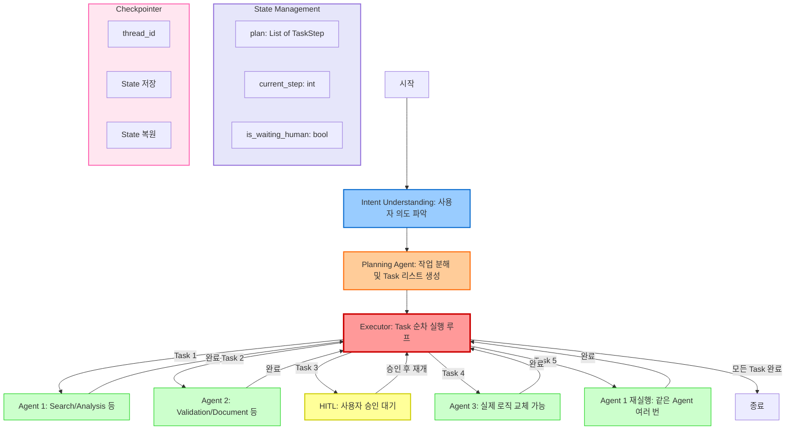

# Octostrator: Planning-Based Multi-Agent Execution Framework

**작성일**: 2025-01-03
**버전**: 2.0
**LangGraph**: 1.0+

---

## 개요

Octostrator는 **어떤 도메인으로든 확장 가능한 Base Framework**입니다.

### 핵심 철학

- **Agent는 교체 가능** - 사용자가 나중에 실제 로직으로 교체
- **인프라가 핵심** - Planning, Execution Loop, HITL, State Management 완벽 구현
- **확장 가능** - 새로운 Agent, Tool을 쉽게 추가

### LangGraph 1.0 문법 사용

✅ **START, END 상수 사용** - `set_entry_point()` 대신 `add_edge(START, "node_name")` 사용
✅ **Command 기반 라우팅** - 동적 라우팅을 위한 Command 객체 활용
✅ **Structured Output** - Pydantic 모델로 구조화된 출력 강제

### 시스템 특징

✅ **Planning-Based** - 사용자 의도 파악 → 작업 분해 → Task 리스트 생성
✅ **State Management** - `plan` 배열로 전체 작업 추적 (Todo Management)
✅ **Multi-Step Execution** - 같은 Agent를 여러 번 실행 가능
✅ **HITL (Human-in-the-Loop)** - 중간 승인/수정 가능
✅ **Checkpointer** - HITL 대기 중 State 저장 및 재개
✅ **Tool Management** - 수십 개의 Tool 관리
✅ **운영 기능** - 비용 추적, 로깅, 에러 처리

---

## 아키텍처 다이어그램



---

## 핵심 컴포넌트

### 1. Intent Understanding Node (의도 파악)

**역할**: 사용자 요청을 분석하여 의도 파악

```python
from langchain_core.messages import SystemMessage, HumanMessage

async def intent_understanding_node(state: SupervisorState) -> dict:
    """사용자 의도 파악"""
    messages = state["messages"]

    # LLM으로 의도 분석
    intent_prompt = SystemMessage(content="""
    Analyze the user's request and extract the intent.

    Examples:
    - "지난 분기 매출 분석 후 보고서 작성" → "multi-step analysis and reporting"
    - "데이터 검색해줘" → "simple data search"
    - "문서 생성" → "document generation"
    """)

    response = await intent_llm.ainvoke([intent_prompt, *messages])

    return {
        "user_intent": response.content,
        "is_planning": True  # Planning으로 전환
    }
```

---

### 2. Planning Agent (작업 분해)

**역할**: 사용자 의도를 Task 리스트로 분해

**핵심 기능**:
- 작업을 순차적 Task로 분해
- 같은 Agent를 여러 번 사용 가능
- HITL 지점 자동 결정

```python
from pydantic import BaseModel
from typing import List, Literal, Optional

class TaskStep(BaseModel):
    """개별 작업 단계"""
    step_id: int
    agent: str  # "search", "analysis", "document", "hitl"
    status: Literal["pending", "running", "completed", "failed", "waiting_human"] = "pending"
    tool: Optional[str] = None  # 특정 툴 지정
    description: str  # 무엇을 하는 단계인지
    result: Optional[str] = None
    error: Optional[str] = None
    hitl_question: Optional[str] = None
    hitl_response: Optional[str] = None


class Plan(BaseModel):
    """전체 계획"""
    steps: List[TaskStep]
    reasoning: str  # 왜 이렇게 계획했는지


async def planning_node(state: SupervisorState) -> dict:
    """전체 작업을 Task로 분해"""
    user_intent = state["user_intent"]

    planning_prompt = SystemMessage(content="""
    You are a planning agent. Break down the user's request into sequential tasks.

    Available agents:
    - search: 데이터 검색
    - validation: 데이터 검증
    - analysis: 데이터 분석
    - comparison: 비교 분석
    - document: 문서 생성
    - hitl: 사용자 승인 필요 (중요한 결정 전)

    Rules:
    1. 같은 Agent를 여러 번 사용 가능 (예: analysis → hitl → analysis)
    2. HITL은 중요한 결정 전에 배치
    3. 각 Task는 명확한 description 필요

    Example plan for "지난 분기 매출 분석 후 문제점 찾고 해결 방안 제시":
    [
        {"step_id": 1, "agent": "search", "description": "지난 분기 매출 데이터 검색"},
        {"step_id": 2, "agent": "validation", "description": "데이터 완전성 검증"},
        {"step_id": 3, "agent": "analysis", "description": "매출 트렌드 분석"},
        {"step_id": 4, "agent": "hitl", "description": "분석 결과 확인", "hitl_question": "이 분석 결과가 맞나요?"},
        {"step_id": 5, "agent": "analysis", "description": "문제점 식별 및 해결 방안 도출"},
        {"step_id": 6, "agent": "document", "description": "최종 보고서 생성"},
        {"step_id": 7, "agent": "hitl", "description": "최종 승인", "hitl_question": "보고서를 승인하시겠습니까?"}
    ]
    """)

    # Structured Output으로 계획 생성
    planner_llm = llm.with_structured_output(Plan)
    plan = await planner_llm.ainvoke([planning_prompt, HumanMessage(content=user_intent)])

    return {
        "plan": [step.model_dump() for step in plan.steps],
        "current_step": 0,
        "is_planning": False,
        "is_executing": True,
        "messages": [AIMessage(content=f"계획 생성 완료:\n{plan.reasoning}")]
    }
```

---

### 3. Execution Loop (실행 루프)

**역할**: 계획에 따라 Agent를 순차적으로 실행

**핵심 기능**:
- `plan` 배열을 순회하며 Task 실행
- 각 Task 상태 업데이트
- HITL 대기 처리
- 에러 핸들링

```python
from langgraph.types import Command

async def executor_node(state: SupervisorState) -> Command:
    """계획에 따라 Agent를 순차적으로 실행"""
    plan = state["plan"]
    current_step = state["current_step"]

    # 모든 단계 완료 확인
    if current_step >= len(plan):
        final_result = "\n".join([
            f"Step {s['step_id']}: {s['description']} - {s['status']}"
            for s in plan
        ])
        return Command(
            update={"final_result": final_result},
            goto=END
        )

    # 현재 단계 가져오기
    step = plan[current_step]

    # HITL 체크
    if step["agent"] == "hitl":
        return Command(
            update={
                "is_waiting_human": True,
                "plan": update_step_status(plan, current_step, "waiting_human")
            },
            goto="hitl_handler"
        )

    # Agent 선택
    agent_name = step["agent"]

    # 현재 단계를 "running"으로 업데이트
    updated_plan = update_step_status(plan, current_step, "running")

    return Command(
        update={"plan": updated_plan},
        goto=agent_name  # "search", "analysis", "document" 등
    )


def update_step_status(plan: List[dict], step_id: int, status: str) -> List[dict]:
    """계획의 특정 단계 상태 업데이트"""
    new_plan = [s.copy() for s in plan]
    new_plan[step_id]["status"] = status
    return new_plan
```

---

### 4. Agents (교체 가능한 구조)

**역할**: 기본 구조만 제공, 사용자가 실제 로직으로 교체

**핵심 원칙**:
- 모든 Agent는 동일한 인터페이스
- 입력: `SupervisorState`
- 출력: `{"plan": updated_plan, "current_step": next_step, "messages": [...]}`

```python
async def search_agent_node(state: SupervisorState) -> dict:
    """Search Agent - 사용자가 실제 검색 로직으로 교체"""
    plan = state["plan"]
    current_step = state["current_step"]
    step = plan[current_step]

    # TODO: 사용자가 실제 검색 로직으로 교체 (벡터DB, SQL 등)
    result = f"[Placeholder] Search Agent executed: {step['description']}"

    # State 업데이트
    plan[current_step]["status"] = "completed"
    plan[current_step]["result"] = result

    return {
        "plan": plan,
        "current_step": current_step + 1,
        "messages": [AIMessage(content=result)]
    }


async def analysis_agent_node(state: SupervisorState) -> dict:
    """Analysis Agent - 여러 번 호출 가능!"""
    plan = state["plan"]
    current_step = state["current_step"]
    step = plan[current_step]

    # 몇 번째 Analysis 호출인지 확인
    analysis_count = sum(
        1 for s in plan[:current_step]
        if s["agent"] == "analysis" and s["status"] == "completed"
    )

    result = f"[Placeholder] Analysis #{analysis_count + 1}: {step['description']}"

    plan[current_step]["status"] = "completed"
    plan[current_step]["result"] = result

    return {
        "plan": plan,
        "current_step": current_step + 1,
        "messages": [AIMessage(content=result)]
    }


async def validation_agent_node(state: SupervisorState) -> dict:
    """Validation Agent"""
    plan = state["plan"]
    current_step = state["current_step"]
    step = plan[current_step]

    result = f"[Placeholder] Validation Agent: {step['description']}"

    plan[current_step]["status"] = "completed"
    plan[current_step]["result"] = result

    return {
        "plan": plan,
        "current_step": current_step + 1,
        "messages": [AIMessage(content=result)]
    }


async def document_agent_node(state: SupervisorState) -> dict:
    """Document Agent"""
    plan = state["plan"]
    current_step = state["current_step"]
    step = plan[current_step]

    result = f"[Placeholder] Document Agent: {step['description']}"

    plan[current_step]["status"] = "completed"
    plan[current_step]["result"] = result

    return {
        "plan": plan,
        "current_step": current_step + 1,
        "messages": [AIMessage(content=result)]
    }
```

---

### 5. HITL (Human-in-the-Loop)

**역할**: 중간 승인/수정 대기

**핵심 기능**:
- 사용자에게 질문 제시
- Checkpointer로 State 저장
- 사용자 응답 후 재개

```python
async def hitl_handler_node(state: SupervisorState) -> dict:
    """HITL 핸들러 - 사용자 승인 대기"""
    plan = state["plan"]
    current_step = state["current_step"]
    step = plan[current_step]

    # 사용자에게 질문
    question = step.get("hitl_question", "승인해주세요")

    # State만 업데이트하고 대기
    # 실제 사용자 응답은 별도 API로 받음
    return {
        "messages": [AIMessage(content=f"[HITL] {question}\n\n사용자 응답을 기다리는 중...")]
    }


# FastAPI 엔드포인트에서 사용자 응답 처리
async def hitl_resume_endpoint(thread_id: str, response: str):
    """사용자 응답을 받아 그래프 재개"""
    # Checkpointer에서 State 로드
    state = await load_state_from_checkpoint(thread_id)

    # HITL 응답 저장
    plan = state["plan"]
    current_step = state["current_step"]
    plan[current_step]["hitl_response"] = response
    plan[current_step]["status"] = "completed"

    # 그래프 재개
    result = await graph.ainvoke(
        {
            "plan": plan,
            "current_step": current_step + 1,
            "is_waiting_human": False
        },
        config={"configurable": {"thread_id": thread_id}}
    )

    return result
```

---

### 6. State Management (상태 관리)

**역할**: 전체 작업 상태를 `plan` 배열로 추적

```python
from typing import TypedDict, List, Optional, Literal
from langchain_core.messages import BaseMessage

class SupervisorState(TypedDict):
    """Supervisor State with Plan Management"""

    # 대화 히스토리
    messages: List[BaseMessage]

    # Planning
    user_intent: Optional[str]  # 파악된 사용자 의도
    plan: List[dict]  # 전체 작업 계획 (TaskStep 리스트)
    current_step: int  # 현재 실행 중인 단계

    # Execution Flags
    is_planning: bool  # 계획 수립 중인가?
    is_executing: bool  # 실행 중인가?
    is_waiting_human: bool  # HITL 대기 중인가?

    # Results
    final_result: Optional[str]  # 최종 결과
```

**State 업데이트 패턴**:

```python
# 1. Intent 파악 후
{
    "user_intent": "복잡한 멀티 스텝 분석",
    "is_planning": True
}

# 2. Planning 완료 후
{
    "plan": [
        {"step_id": 1, "agent": "search", "status": "pending", ...},
        {"step_id": 2, "agent": "analysis", "status": "pending", ...},
        ...
    ],
    "current_step": 0,
    "is_planning": False,
    "is_executing": True
}

# 3. Task 실행 중
{
    "plan": [
        {"step_id": 1, "agent": "search", "status": "completed", "result": "..."},
        {"step_id": 2, "agent": "analysis", "status": "running", ...},
        ...
    ],
    "current_step": 1
}

# 4. HITL 대기 중
{
    "plan": [
        ...,
        {"step_id": 3, "agent": "hitl", "status": "waiting_human", "hitl_question": "..."},
        ...
    ],
    "current_step": 3,
    "is_waiting_human": True
}
```

---

### 7. Checkpointer (세션 관리)

**역할**: HITL 대기 중 State 저장 및 재개

```python
from langgraph.checkpoint.postgres.aio import AsyncPostgresSaver
import psycopg

# Checkpointer 초기화
async def init_checkpointer():
    conn = await psycopg.AsyncConnection.connect(
        config.postgres_url,
        autocommit=True,
        row_factory=psycopg.rows.dict_row
    )
    checkpointer = AsyncPostgresSaver(conn)
    await checkpointer.setup()  # 자동 테이블 생성
    return checkpointer


# Graph 컴파일 시 연결
checkpointer = await init_checkpointer()
graph = workflow.compile(checkpointer=checkpointer)


# Thread ID로 세션 관리
async def execute_with_thread(user_message: str, thread_id: str):
    """Thread ID로 세션 관리"""
    result = await graph.ainvoke(
        {"messages": [HumanMessage(content=user_message)]},
        config={"configurable": {"thread_id": thread_id}}
    )
    return result


# HITL 재개
async def resume_from_hitl(thread_id: str, user_response: str):
    """HITL에서 재개"""
    # State는 자동으로 복원됨
    result = await graph.ainvoke(
        {"hitl_response": user_response},
        config={"configurable": {"thread_id": thread_id}}
    )
    return result
```

---

## LangGraph 구성

```python
from langgraph.graph import StateGraph, START, END

workflow = StateGraph(SupervisorState)

# 1. Intent Understanding
workflow.add_node("intent", intent_understanding_node)

# 2. Planning
workflow.add_node("planning", planning_node)

# 3. Executor (라우터)
workflow.add_node("executor", executor_node, ends=[
    "search", "validation", "analysis", "comparison", "document", "hitl_handler", END
])

# 4. Agents (교체 가능)
workflow.add_node("search", search_agent_node)
workflow.add_node("validation", validation_agent_node)
workflow.add_node("analysis", analysis_agent_node)
workflow.add_node("comparison", comparison_agent_node)
workflow.add_node("document", document_agent_node)

# 5. HITL
workflow.add_node("hitl_handler", hitl_handler_node)

# Edges
workflow.add_edge(START, "intent")
workflow.add_edge("intent", "planning")
workflow.add_edge("planning", "executor")

# 모든 Agent → Executor로 복귀
workflow.add_edge("search", "executor")
workflow.add_edge("validation", "executor")
workflow.add_edge("analysis", "executor")
workflow.add_edge("comparison", "executor")
workflow.add_edge("document", "executor")

# HITL → 대기 (재개는 별도 API)
# hitl_handler는 END로 가지 않고, 사용자 응답 후 executor로 재개

# 컴파일
graph = workflow.compile(checkpointer=checkpointer)
```

---

## Phase별 구현 계획

### Phase 1 (완료 ✅)
- ✅ Supervisor 기본 구조
- ✅ Context 지원
- ✅ LangGraph 1.0 문법

---

### Phase 2: Intent + Planning (핵심!)

**목표**: 사용자 의도 파악 및 작업 분해

**구현**:
1. Intent Understanding Node
2. Planning Agent (Structured Output)
3. SupervisorState에 `plan`, `current_step` 추가

**완료 기준**:
- 사용자 입력 → 의도 파악 → Task 리스트 생성 동작 확인

**예상 결과**:
```
User: "지난 분기 매출 분석해줘"
→ Intent: "data analysis"
→ Plan: [
    {step_id: 1, agent: "search", description: "매출 데이터 검색"},
    {step_id: 2, agent: "analysis", description: "트렌드 분석"}
  ]
```

---

### Phase 3: Execution Loop + Agents

**목표**: 계획에 따라 Agent 순차 실행

**구현**:
1. Executor Node (Task 순회)
2. Agents (search, analysis, validation, document)
3. State 업데이트 로직

**완료 기준**:
- Plan의 Task들이 순차적으로 실행되고 State 업데이트 확인

**예상 결과**:
```
Step 1: search → status: completed
Step 2: analysis → status: completed
→ 최종 결과 출력
```

---

### Phase 4: HITL (Human-in-the-Loop)

**목표**: 중간 승인 대기 및 재개

**구현**:
1. HITL Handler Node
2. FastAPI 엔드포인트 (`/hitl/resume`)
3. `is_waiting_human` 플래그

**완료 기준**:
- HITL 단계에서 대기 → 사용자 응답 → 재개 동작 확인

**예상 결과**:
```
Step 3: hitl → status: waiting_human → "분석 결과가 맞나요?"
User: "네"
→ Step 4로 재개
```

---

### Phase 5: Checkpointer + Thread Management

**목표**: 세션 관리 및 State 저장/복원

**구현**:
1. AsyncPostgresSaver 초기화
2. Thread ID 관리
3. HITL 재개 로직

**완료 기준**:
- HITL 대기 → 서버 재시작 → State 복원 → 재개 동작 확인

---

### Phase 6: Tool Management

**목표**: 수십 개의 Tool 관리

**구현**:
1. Tool Registry (툴 등록 시스템)
2. Dynamic Tool Loading
3. Tool 실행 결과를 State에 반영

**예시**:
```python
# Tool Registry
tools = {
    "tavily_search": tavily_tool,
    "sql_query": sql_tool,
    "vector_search": vector_tool,
    "python_repl": python_tool,
    # ... 수십 개
}

# Planning에서 Tool 지정
{
    "step_id": 1,
    "agent": "search",
    "tool": "tavily_search",  # 특정 툴 지정
    "description": "웹 검색"
}
```

---

### Phase 7: 운영 기능

**목표**: 비용 추적, 로깅, 에러 처리

**구현**:

#### 7.1 비용 추적
```python
class CostTracker:
    def __init__(self):
        self.total_cost = 0.0
        self.call_count = 0

    def track(self, model: str, input_tokens: int, output_tokens: int):
        cost = calculate_cost(model, input_tokens, output_tokens)
        self.total_cost += cost
        self.call_count += 1

        # DB에 저장
        await save_cost_log(model, input_tokens, output_tokens, cost)
```

#### 7.2 구조화된 로깅
```python
import structlog

logger = structlog.get_logger()

# 각 노드 실행 시 로깅
logger.info(
    "node_executed",
    node="search_agent",
    step_id=1,
    status="completed",
    duration=0.5
)
```

#### 7.3 에러 처리 및 재시도
```python
async def agent_with_retry(agent_func, state: SupervisorState, max_retries=3):
    """Agent 실행 + 재시도"""
    for attempt in range(max_retries):
        try:
            result = await agent_func(state)
            return result
        except Exception as e:
            logger.error("agent_error", error=str(e), attempt=attempt)
            if attempt == max_retries - 1:
                # 최종 실패 시 plan에 에러 기록
                plan = state["plan"]
                current_step = state["current_step"]
                plan[current_step]["status"] = "failed"
                plan[current_step]["error"] = str(e)
                return {"plan": plan, "current_step": current_step + 1}
            await asyncio.sleep(2 ** attempt)  # Exponential backoff
```

---

## 실전 예시: 복잡한 요청 처리

**사용자 요청**:
```
"지난 3개월 매출 데이터를 분석하고, 전년 동기 대비 비교해서 문제점을 찾고,
해결 방안을 제시한 후 보고서를 작성해줘. 각 단계마다 확인할게."
```

### 처리 흐름

**1. Intent Understanding**
```json
{
  "user_intent": "multi-step analysis with comparison and reporting, requiring approvals at each stage"
}
```

**2. Planning**
```json
{
  "plan": [
    {"step_id": 1, "agent": "search", "description": "최근 3개월 매출 데이터 검색"},
    {"step_id": 2, "agent": "search", "description": "전년 동기 매출 데이터 검색"},
    {"step_id": 3, "agent": "validation", "description": "데이터 완전성 검증"},
    {"step_id": 4, "agent": "hitl", "hitl_question": "검색된 데이터가 맞나요?"},
    {"step_id": 5, "agent": "analysis", "description": "최근 3개월 트렌드 분석"},
    {"step_id": 6, "agent": "comparison", "description": "전년 동기 대비 비교"},
    {"step_id": 7, "agent": "hitl", "hitl_question": "분석 결과를 확인해주세요"},
    {"step_id": 8, "agent": "analysis", "description": "문제점 식별 및 해결 방안 도출"},
    {"step_id": 9, "agent": "hitl", "hitl_question": "해결 방안이 적절한가요?"},
    {"step_id": 10, "agent": "document", "description": "최종 보고서 생성"},
    {"step_id": 11, "agent": "hitl", "hitl_question": "보고서를 승인하시겠습니까?"}
  ]
}
```

**3. Execution**
```
Executor → search (step 1) → [Placeholder] 데이터 검색 완료
Executor → search (step 2) → [Placeholder] 전년 데이터 검색 완료
Executor → validation (step 3) → [Placeholder] 검증 완료
Executor → hitl (step 4) → "검색된 데이터가 맞나요?" → 대기
[사용자 응답: "네"]
Executor → analysis (step 5) → [Placeholder] 트렌드 분석 완료
Executor → comparison (step 6) → [Placeholder] 비교 완료
Executor → hitl (step 7) → "분석 결과를 확인해주세요" → 대기
[사용자 응답: "좋습니다"]
Executor → analysis (step 8) → [Placeholder] 문제점 및 해결 방안 도출 완료
Executor → hitl (step 9) → "해결 방안이 적절한가요?" → 대기
[사용자 응답: "네"]
Executor → document (step 10) → [Placeholder] 보고서 생성 완료
Executor → hitl (step 11) → "보고서를 승인하시겠습니까?" → 대기
[사용자 응답: "승인"]
Executor → END
```

---

## FastAPI 엔드포인트 예시

```python
from fastapi import FastAPI, HTTPException
from pydantic import BaseModel

app = FastAPI()


class ChatRequest(BaseModel):
    message: str
    thread_id: str


class HITLResponse(BaseModel):
    thread_id: str
    response: str


@app.post("/chat")
async def chat(request: ChatRequest):
    """새로운 대화 시작 또는 이어서 진행"""
    result = await graph.ainvoke(
        {"messages": [HumanMessage(content=request.message)]},
        config={"configurable": {"thread_id": request.thread_id}}
    )

    # HITL 대기 중인지 확인
    if result.get("is_waiting_human"):
        plan = result["plan"]
        current_step = result["current_step"]
        hitl_question = plan[current_step].get("hitl_question")

        return {
            "status": "waiting_human",
            "question": hitl_question,
            "thread_id": request.thread_id
        }

    return {
        "status": "completed",
        "result": result.get("final_result"),
        "messages": [m.content for m in result["messages"]]
    }


@app.post("/hitl/resume")
async def hitl_resume(response: HITLResponse):
    """HITL 응답 후 재개"""
    result = await graph.ainvoke(
        {"hitl_response": response.response},
        config={"configurable": {"thread_id": response.thread_id}}
    )

    # 다음 HITL이 있는지 확인
    if result.get("is_waiting_human"):
        plan = result["plan"]
        current_step = result["current_step"]
        hitl_question = plan[current_step].get("hitl_question")

        return {
            "status": "waiting_human",
            "question": hitl_question,
            "thread_id": response.thread_id
        }

    return {
        "status": "completed",
        "result": result.get("final_result")
    }


@app.get("/plan/{thread_id}")
async def get_plan(thread_id: str):
    """현재 계획 상태 조회"""
    state = await load_state_from_checkpoint(thread_id)

    return {
        "plan": state.get("plan", []),
        "current_step": state.get("current_step", 0),
        "is_waiting_human": state.get("is_waiting_human", False)
    }
```

---

## 핵심 원칙

### 1. Agent는 교체 가능
- 모든 Agent는 동일한 인터페이스
- 사용자가 실제 로직으로 교체
- 예: `search_agent_node` 내부에 벡터DB 검색, SQL 쿼리 등 추가

### 2. 인프라가 완벽
- Planning Agent가 작업 분해
- Execution Loop가 Task 실행
- HITL이 승인 관리
- Checkpointer가 세션 관리
- State가 모든 것을 추적

### 3. 확장 가능
- 새로운 Agent 추가: `workflow.add_node("new_agent", new_agent_node)`
- 새로운 Tool 추가: Tool Registry에 등록
- 새로운 HITL 지점: Planning에서 자동 결정

### 4. 운영 친화적
- 비용 추적으로 예산 관리
- 구조화된 로깅으로 디버깅
- 에러 처리 및 재시도로 안정성

---

## 다음 단계

### 즉시 시작 (Phase 2)
1. SupervisorState 확장 (`plan`, `current_step` 추가)
2. Intent Understanding Node 구현
3. Planning Agent 구현 (Structured Output)

### 예상 작업 시간
- Phase 2: 1-2일
- Phase 3: 2-3일
- Phase 4: 1-2일
- Phase 5: 1일
- Phase 6: 2-3일
- Phase 7: 1-2일

**총 예상 시간**: 8-13일

---

## 참고 자료

### LangGraph 공식 문서
- [LangGraph Command](https://langchain-ai.github.io/langgraphjs/how-tos/command/)
- [LangGraph Checkpointer](https://langchain-ai.github.io/langgraph/reference/checkpoints/)
- [LangGraph Human-in-the-Loop](https://langchain-ai.github.io/langgraph/how-tos/human-in-the-loop/)

### 실제 구현 사례
- [LangGraph Multi-Agent System](https://langchain-ai.github.io/langgraph/how-tos/multi-agent/)
- [CrewAI Planning](https://github.com/joaomdmoura/crewAI)

---

## 결론

Octostrator는 **Planning-Based Multi-Agent Execution Framework**입니다.

**핵심 가치**:
1. ✅ **Agent는 교체 가능** - 어떤 도메인으로든 확장 가능
2. ✅ **인프라가 핵심** - Planning, Execution, HITL, State Management 완벽 구현
3. ✅ **운영 친화적** - 비용 추적, 로깅, 에러 처리
4. ✅ **확장 가능** - 새로운 Agent, Tool을 쉽게 추가

**다음 단계**: Phase 2 구현 시작 - Intent Understanding + Planning Agent
