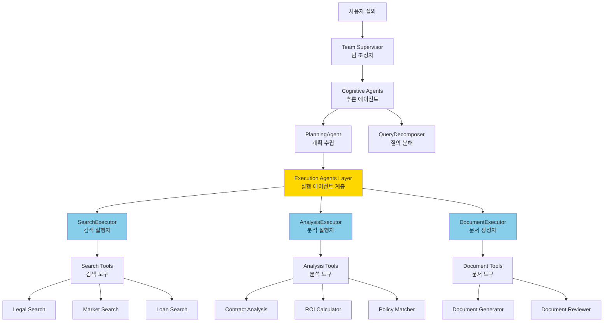
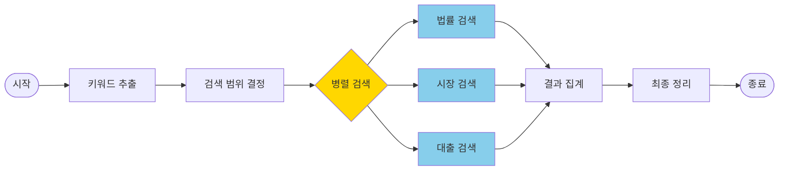
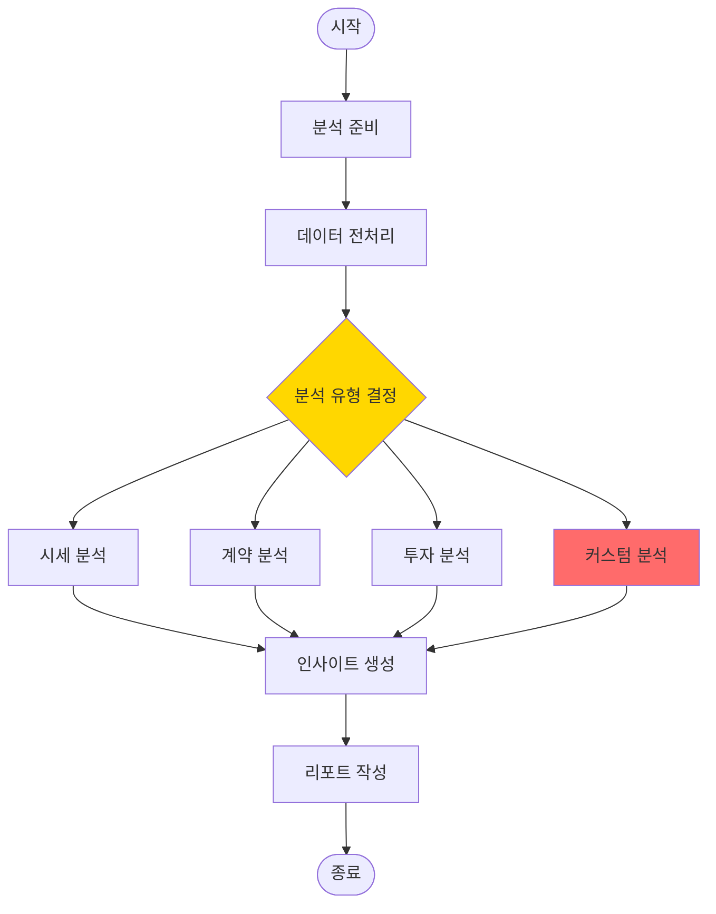

# 실행 에이전트(Execution Agents) 아키텍처 분석 보고서

## 목차
1. [개요](#개요)
2. [실행 에이전트의 역할과 목적](#실행-에이전트의-역할과-목적)
3. [왜 실행 에이전트가 필요한가?](#왜-실행-에이전트가-필요한가)
4. [주요 기능 상세 분석](#주요-기능-상세-분석)
5. [실제 코드 분석](#실제-코드-분석)
6. [아키텍처 다이어그램](#아키텍처-다이어그램)
7. [결론](#결론)

---

## 개요

본 보고서는 LangGraph 0.6 기반 챗봇 시스템에서 실행 에이전트(Execution Agents)의 역할, 필요성, 그리고 주요 기능을 분석합니다. 시스템 아키텍처상 실행 에이전트가 단순한 툴 호출자가 아닌 핵심 미들웨어 역할을 수행하는 이유를 상세히 설명합니다.

### 분석 대상 시스템
- **Framework**: LangGraph 0.6.7
- **Architecture**: 4-Layer Hierarchical Agent System
- **실행 에이전트 종류**:
  - SearchExecutor (검색 실행)
  - AnalysisExecutor (분석 실행)
  - DocumentExecutor (문서 생성 실행)

---

## 실행 에이전트의 역할과 목적

### 1. 핵심 역할

실행 에이전트는 **고수준 계획(High-level Planning)과 저수준 도구 실행(Low-level Tool Execution) 사이의 중요한 브릿지** 역할을 합니다.

```
추론 에이전트: "무엇을(WHAT) 해야 하는가?" → 계획 수립
     ↓
실행 에이전트: "어떻게(HOW) 실행할 것인가?" → 실행 오케스트레이션
     ↓
도구(Tools): "실제 작업 수행" → 기능 구현
```

### 2. 주요 목적

#### 2.1 복잡한 오케스트레이션 관리
- 다수의 도구를 조합하여 사용
- 병렬/순차 실행 전략 구현
- 조건부 도구 선택 로직

#### 2.2 도메인 특화 비즈니스 로직 캡슐화
- 산업/도메인별 특수 규칙 구현
- 법규 준수 검증 (예: 전세금 5% 인상 제한)
- 커스텀 분석 알고리즘

#### 2.3 상태 관리와 워크플로우 구현
- LangGraph StateGraph를 통한 상태 추적
- 멀티스텝 프로세스 관리
- 진행 상황 모니터링

---

## 왜 실행 에이전트가 필요한가?

### 1. 추론 에이전트의 한계

추론 에이전트(PlanningAgent)는 다음과 같은 고수준 결정만 내립니다:

```python
# backend/app/service_agent/cognitive_agents/planning_agent.py (Line 129-151)
async def analyze_intent(self, query: str) -> IntentResult:
    return {
        "intent_type": "법률상담",  # 무엇을 원하는지
        "suggested_agents": ["search_team", "analysis_team"]  # 어떤 팀을 사용할지
    }
```

하지만 **구체적인 실행 방법은 결정하지 않습니다**:
- ❌ 어떤 도구를 사용할지
- ❌ 어떤 순서로 실행할지
- ❌ 실패 시 어떻게 처리할지
- ❌ 결과를 어떻게 집계할지

### 2. 도구(Tools)의 한계

도구는 **단일 기능만 수행**하는 순수 함수입니다:

```python
# backend/app/service_agent/tools/market_analysis_tool.py
class MarketAnalysisTool:
    async def execute(self, query: str, data: Dict) -> Dict:
        # 단순히 시세 분석만 수행
        return {"average_price": 500000000, "trend": "상승"}
```

도구는 다음을 수행하지 **않습니다**:
- ❌ 다른 도구와의 협업
- ❌ 복잡한 비즈니스 로직
- ❌ 에러 복구
- ❌ 결과 포맷팅

### 3. 실행 에이전트가 채우는 공백

실행 에이전트는 이 두 계층 사이의 **모든 복잡성을 처리**합니다:

```python
# backend/app/service_agent/execution_agents/analysis_executor.py (Line 152-206)
async def analyze_data_node(self, state: AnalysisTeamState):
    results = {}

    # 1. 쿼리 분석하여 필요한 도구 결정
    if "시세" in query or analysis_type == "market":
        results["market"] = await self.market_tool.execute(...)

    if "계약" in query:
        results["contract"] = await self.contract_tool.execute(...)

    if "투자" in query or "수익" in query:
        results["roi"] = await self.roi_tool.execute(...)

    # 2. 커스텀 비즈니스 로직 적용
    if "전세금" in query and "인상" in query:
        results["custom"] = self._perform_custom_analysis(query, data)

    # 3. 모든 결과 집계
    state["raw_analysis"] = results
    return state
```

---

## 주요 기능 상세 분석

### 1. SearchExecutor - 멀티소스 검색 오케스트레이션

#### 주요 기능
```python
# backend/app/service_agent/execution_agents/search_executor.py
```

##### 1.1 지능형 키워드 추출 (Line 126-166)
```python
async def extract_keywords_node(self, state: SearchTeamState):
    # LLM 또는 패턴 매칭으로 키워드 추출
    keywords = SearchKeywords(
        legal_terms=["임대차보호법", "전세"],
        real_estate_terms=["강남구", "아파트"],
        loan_terms=["주택담보대출"],
        general_terms=["보증금"]
    )
    state["keywords"] = keywords
```

##### 1.2 병렬 검색 실행 (Line 256-407)
```python
async def execute_search_node(self, state: SearchTeamState):
    # 3개 검색을 병렬로 실행
    tasks = []

    if "legal" in search_scope:
        tasks.append(self.legal_search_tool.search(query))
    if "real_estate" in search_scope:
        tasks.append(self.market_data_tool.search(query))
    if "loan" in search_scope:
        tasks.append(self.loan_data_tool.search(query))

    # 병렬 실행 및 결과 수집
    results = await asyncio.gather(*tasks, return_exceptions=True)
```

##### 1.3 에러 복구 메커니즘 (Line 268-290)
```python
try:
    legal_result = await self.legal_search_tool.search(query)
    if legal_result.get("status") == "success":
        state["legal_results"] = legal_result["data"]
        state["search_progress"]["legal_search"] = "completed"
except Exception as e:
    logger.error(f"Legal search failed: {e}")
    state["search_progress"]["legal_search"] = "failed"
    # 다른 검색은 계속 진행
```

### 2. AnalysisExecutor - 복합 분석 파이프라인

#### 주요 기능

##### 2.1 도메인 특화 비즈니스 로직 (Line 287-319)
```python
def _perform_custom_analysis(self, query: str, data: Dict) -> Dict:
    # 전세금 인상 법적 검토
    if "전세금" in query and any(x in query for x in ["올", "인상"]):
        amounts = re.findall(r'(\d+)억', query)
        if len(amounts) >= 2:
            old_deposit = float(amounts[0])
            new_deposit = float(amounts[1])
            increase_rate = ((new_deposit - old_deposit) / old_deposit) * 100

            return {
                "analysis_type": "전세금_인상_검토",
                "current_deposit": f"{old_deposit}억원",
                "requested_deposit": f"{new_deposit}억원",
                "increase_rate": f"{increase_rate:.1f}%",
                "legal_limit": "5%",
                "is_legal": increase_rate <= 5,
                "assessment": f"법정 한도 5%를 {'초과' if increase_rate > 5 else '준수'}",
                "recommendation": "법정 한도 초과시 세입자는 인상 거부 가능"
            }
```

##### 2.2 조건부 도구 선택 (Line 152-206)
```python
async def analyze_data_node(self, state: AnalysisTeamState):
    # 쿼리 내용에 따라 도구 선택
    analysis_tools_used = []

    # 5개 분석 도구 중 선택적 사용
    if self._needs_market_analysis(query):
        results["market"] = await self.market_tool.execute(...)
        analysis_tools_used.append("market_analysis")

    if self._needs_contract_analysis(query):
        results["contract"] = await self.contract_tool.execute(...)
        analysis_tools_used.append("contract_analysis")

    # 사용된 도구 추적
    state["analysis_metadata"] = {
        "tools_used": analysis_tools_used,
        "total_tools": len(analysis_tools_used)
    }
```

##### 2.3 인사이트 생성 (Line 351-384)
```python
async def generate_insights_node(self, state: AnalysisTeamState):
    # LLM을 사용한 종합 인사이트 생성
    insights_prompt = f"""
    분석 결과: {state['raw_analysis']}
    질문: {state['query']}

    주요 인사이트 3가지를 도출하세요:
    """

    insights = await self.llm_client.generate(insights_prompt)
    state["insights"] = insights
    state["confidence_score"] = self._calculate_confidence(state)
```

### 3. DocumentExecutor - 문서 생성 파이프라인

#### 주요 기능

##### 3.1 템플릿 선택 및 관리
```python
async def select_template_node(self, state: DocumentTeamState):
    # 문서 타입에 따른 템플릿 선택
    if doc_type == "contract":
        template = self.contract_template
    elif doc_type == "report":
        template = self.report_template
```

##### 3.2 검토 워크플로우
```python
def _build_subgraph(self):
    workflow = StateGraph(DocumentTeamState)

    # 생성 → 검토 → 수정 → 최종화
    workflow.add_node("generate", self.generate_document_node)
    workflow.add_node("review", self.review_document_node)
    workflow.add_node("finalize", self.finalize_document_node)

    # 조건부 검토 (필요시에만)
    workflow.add_conditional_edges(
        "generate",
        self.should_review,
        {
            True: "review",
            False: "finalize"
        }
    )
```

---

## 실제 코드 분석

### SearchExecutor의 전체 워크플로우

```python
# backend/app/service_agent/execution_agents/search_executor.py (Line 68-85)

def _build_subgraph(self):
    """검색 팀 서브그래프 구성"""
    workflow = StateGraph(SearchTeamState)

    # 노드 추가 - 각 단계별 처리
    workflow.add_node("extract_keywords", self.extract_keywords_node)
    workflow.add_node("determine_scope", self.determine_search_scope_node)
    workflow.add_node("execute_search", self.execute_search_node)
    workflow.add_node("aggregate_results", self.aggregate_results_node)
    workflow.add_node("finalize", self.finalize_node)

    # 엣지 설정 - 순차 실행
    workflow.add_edge(START, "extract_keywords")
    workflow.add_edge("extract_keywords", "determine_scope")
    workflow.add_edge("determine_scope", "execute_search")
    workflow.add_edge("execute_search", "aggregate_results")
    workflow.add_edge("aggregate_results", "finalize")
    workflow.add_edge("finalize", END)

    self.app = workflow.compile()
```

### AnalysisExecutor의 상태 관리

```python
# backend/app/service_agent/execution_agents/analysis_executor.py (Line 34-49)

class AnalysisTeamState(TypedDict):
    """분석 팀 상태 정의"""
    task_id: str
    query: str
    search_results: Optional[Dict]
    preprocessing_done: bool
    preprocessed_data: Optional[Dict]
    raw_analysis: Optional[Dict]
    metrics: Optional[Dict]
    insights: Optional[List[str]]
    recommendations: Optional[List[str]]
    confidence_score: Optional[float]
    report: Optional[str]
    analysis_progress: Dict[str, str]
    error: Optional[str]
    analysis_complete: bool
```

각 필드가 워크플로우의 다른 단계에서 채워지며, 실행 에이전트가 이 복잡한 상태를 관리합니다.

---

## 아키텍처 다이어그램

### 전체 시스템 아키텍처



### SearchExecutor 내부 워크플로우



### AnalysisExecutor 내부 워크플로우



---

## 결론

### 1. 실행 에이전트는 필수 컴포넌트

실행 에이전트는 단순한 "툴 반복 호출자"가 아닙니다. 다음과 같은 핵심 기능을 수행합니다:

1. **복잡한 오케스트레이션**: 5개 이상의 도구를 조건부로 선택하고 조합
2. **비즈니스 로직 구현**: 도메인 특화 규칙과 법규 준수 검증
3. **상태 관리**: LangGraph를 통한 복잡한 멀티스텝 워크플로우
4. **에러 복구**: 부분 실패 처리 및 대체 경로 실행
5. **결과 집계**: 다수 도구의 출력을 의미있는 형태로 통합

### 2. 관심사 분리 원칙 준수

현재 4계층 아키텍처는 각 계층의 책임을 명확히 분리합니다:

| 계층 | 책임 | 예시 |
|------|------|------|
| **Supervisor** | 팀 조정 | 어떤 팀을 언제 호출할지 |
| **Cognitive** | 추론과 계획 | 무엇을 해야 하는지 (WHAT) |
| **Execution** | 실행 오케스트레이션 | 어떻게 실행할지 (HOW) |
| **Tools** | 순수 기능 | 실제 작업 수행 |

### 3. 실행 에이전트 제거 시 문제점

만약 실행 에이전트를 제거하면:

- **추론 에이전트 과부하**: 모든 실행 로직이 PlanningAgent로 이동
- **코드 중복**: 각 도구 호출마다 오케스트레이션 로직 반복
- **테스트 어려움**: 계획과 실행이 섞여 단위 테스트 불가능
- **유지보수성 저하**: 비즈니스 로직이 여러 곳에 분산
- **확장성 제한**: 새 도구 추가 시 여러 곳 수정 필요

### 4. 최종 평가

**실행 에이전트는 LangGraph 0.6 기반 계층적 에이전트 시스템에서 필수적인 미들웨어 계층**입니다. 이들은 고수준 계획과 저수준 도구 실행 사이의 모든 복잡성을 처리하며, 시스템의 모듈성, 테스트 가능성, 유지보수성을 보장합니다.

현재 아키텍처는 **구조적 문제가 아닌 올바른 설계 패턴**을 따르고 있으며, LangGraph의 베스트 프랙티스에 부합합니다.

---

*작성일: 2025-10-05*
*작성자: System Architecture Analysis Team*
*버전: 1.0*