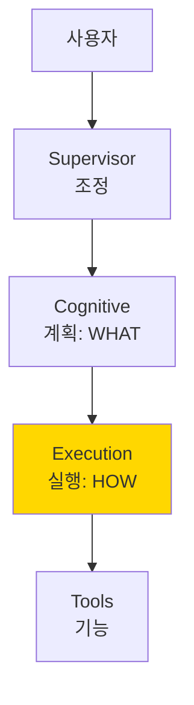
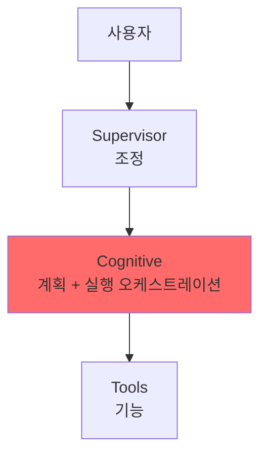

# 실행 에이전트 유무 비교 분석 보고서

## 목차
1. [개요](#개요)
2. [아키텍처 비교](#아키텍처-비교)
3. [코드 구조 비교](#코드-구조-비교)
4. [성능 및 확장성 비교](#성능-및-확장성-비교)
5. [유지보수성 비교](#유지보수성-비교)
6. [실제 시나리오 비교](#실제-시나리오-비교)
7. [종합 평가](#종합-평가)

---

## 개요

본 보고서는 현재의 실행 에이전트를 포함한 4계층 아키텍처와 실행 에이전트를 제거한 3계층 아키텍처를 비교 분석합니다.

### 비교 대상
- **현재 아키텍처 (4계층)**: Supervisor → Cognitive → **Execution** → Tools
- **대안 아키텍처 (3계층)**: Supervisor → Cognitive → Tools (실행 에이전트 제거)

---

## 아키텍처 비교

### 현재 아키텍처 (실행 에이전트 포함)



#### 특징
- **명확한 책임 분리**: 각 계층이 단일 책임 원칙 준수
- **느슨한 결합**: 계층 간 의존성 최소화
- **높은 응집도**: 관련 기능이 같은 계층에 집중

### 대안 아키텍처 (실행 에이전트 제거)



#### 특징
- **계층 단순화**: 3계층으로 감소
- **책임 과중**: Cognitive 계층이 계획과 실행 모두 담당
- **직접 호출**: Cognitive가 Tools를 직접 제어

---

## 코드 구조 비교

### 현재: 실행 에이전트가 있는 경우

#### PlanningAgent (Cognitive Layer)
```python
# 간결하고 집중된 책임
class PlanningAgent:
    async def analyze_intent(self, query: str) -> IntentResult:
        # 단순히 의도 분석과 팀 선택만
        return {
            "intent_type": "법률상담",
            "suggested_agents": ["search_team", "analysis_team"]
        }

    async def create_execution_plan(self, query: str) -> Plan:
        # 고수준 계획만 수립
        return [
            {"team": "search_team", "priority": 1},
            {"team": "analysis_team", "priority": 2}
        ]
```

#### AnalysisExecutor (Execution Layer)
```python
# 실행 세부사항 처리
class AnalysisExecutor:
    async def analyze_data_node(self, state: AnalysisTeamState):
        # 도구 선택 로직
        if "시세" in query:
            results["market"] = await self.market_tool.execute(...)

        if "계약" in query:
            results["contract"] = await self.contract_tool.execute(...)

        # 비즈니스 로직
        if "전세금 인상" in query:
            results["custom"] = self._calculate_rent_increase(...)

        # 에러 처리
        try:
            # 도구 실행
        except ToolError:
            # 대체 경로 실행
```

### 대안: 실행 에이전트가 없는 경우

#### PlanningAgent (모든 것을 담당)
```python
class PlanningAgent:
    async def analyze_intent(self, query: str) -> IntentResult:
        # 기존 책임
        ...

    async def create_execution_plan(self, query: str) -> Plan:
        # 기존 책임
        ...

    # 새로 추가된 실행 책임들
    async def execute_search(self, query: str):
        # SearchExecutor의 모든 로직이 여기로
        keywords = self._extract_keywords(query)
        scope = self._determine_scope(keywords)

        results = {}
        if "legal" in scope:
            try:
                results["legal"] = await self.legal_tool.search(...)
            except:
                # 에러 처리

        if "market" in scope:
            try:
                results["market"] = await self.market_tool.search(...)
            except:
                # 에러 처리

        return self._aggregate_results(results)

    async def execute_analysis(self, query: str, data: Dict):
        # AnalysisExecutor의 모든 로직이 여기로
        results = {}

        # 도구 선택 (5개 도구 중 선택)
        if "시세" in query:
            results["market"] = await self.market_tool.execute(...)
        if "계약" in query:
            results["contract"] = await self.contract_tool.execute(...)
        if "투자" in query:
            results["roi"] = await self.roi_tool.execute(...)

        # 비즈니스 로직도 여기에
        if "전세금 인상" in query:
            results["custom"] = self._calculate_rent_increase(...)

        # 인사이트 생성도 여기에
        insights = await self._generate_insights(results)

        return {"analysis": results, "insights": insights}

    # 1000+ 라인의 거대한 클래스가 됨
```

---

## 성능 및 확장성 비교

### 병렬 처리 능력

#### 현재 (실행 에이전트 포함)
```python
# SearchExecutor에서 최적화된 병렬 처리
async def execute_search_node(self, state):
    # 3개 검색을 효율적으로 병렬 실행
    tasks = [
        self.legal_search_tool.search(query),
        self.market_data_tool.search(query),
        self.loan_data_tool.search(query)
    ]
    results = await asyncio.gather(*tasks, return_exceptions=True)
```

**장점**:
- ✅ 각 Executor가 독립적으로 최적화 가능
- ✅ 병렬 처리 전략을 Executor별로 커스터마이징
- ✅ 리소스 관리 세밀하게 제어

#### 대안 (실행 에이전트 제거)
```python
# PlanningAgent에서 모든 병렬 처리 관리
async def execute_all(self, query):
    # 모든 팀의 병렬 처리를 한 곳에서 관리
    # 복잡도 증가, 최적화 어려움
```

**단점**:
- ❌ 하나의 클래스가 모든 병렬 처리 관리
- ❌ 팀별 최적화 어려움
- ❌ 병목 현상 발생 가능

### 확장성

#### 새로운 도구 추가 시나리오

**현재 (실행 에이전트 포함)**:
1. 새 도구 클래스 생성
2. 해당 Executor만 수정
3. 다른 Executor에 영향 없음

```python
# AnalysisExecutor에만 새 도구 추가
class AnalysisExecutor:
    def __init__(self):
        self.new_tool = NewAnalysisTool()  # 추가

    async def analyze_data_node(self, state):
        if "새기능" in query:
            results["new"] = await self.new_tool.execute(...)  # 추가
```

**대안 (실행 에이전트 제거)**:
1. 새 도구 클래스 생성
2. PlanningAgent 수정 (이미 거대한 클래스)
3. 기존 로직과 충돌 가능성

```python
# 이미 복잡한 PlanningAgent를 더 수정
class PlanningAgent:
    # 1000+ 라인의 코드에 추가
    async def execute_analysis(self, query, data):
        # 기존 5개 도구 로직...
        if "새기능" in query:
            results["new"] = await self.new_tool.execute(...)  # 추가
        # 더 복잡해짐
```

---

## 유지보수성 비교

### 코드 복잡도 메트릭

| 메트릭 | 현재 (실행 에이전트 O) | 대안 (실행 에이전트 X) |
|--------|------------------------|------------------------|
| **PlanningAgent 라인 수** | ~200 | ~1500+ |
| **단일 클래스 복잡도** | 낮음 (CC: 5-10) | 매우 높음 (CC: 50+) |
| **테스트 케이스 수** | 각 20-30개 | 200+ 개 |
| **모킹 필요 객체** | 2-3개 | 15+ 개 |

### 버그 수정 시나리오

#### 시나리오: 전세금 인상 계산 로직 버그

**현재 (실행 에이전트 포함)**:
```python
# AnalysisExecutor의 287번 라인만 수정
def _perform_custom_analysis(self, query: str, data: Dict):
    if "전세금 인상" in query:
        # 버그 수정: 5% → 5.5% (법 개정)
        legal_limit = 5.5  # 이 부분만 수정
```
- 영향 범위: AnalysisExecutor만
- 테스트: AnalysisExecutor 테스트만 실행
- 리뷰: 50줄 정도만 검토

**대안 (실행 에이전트 제거)**:
```python
# PlanningAgent의 872번 라인 수정 (거대 클래스 내부)
class PlanningAgent:
    # ... 800줄의 다른 코드
    async def execute_analysis(self, query, data):
        # ... 더 많은 코드
        if "전세금 인상" in query:
            legal_limit = 5.5  # 수정
        # ... 더 많은 코드
```
- 영향 범위: 전체 PlanningAgent
- 테스트: 모든 테스트 재실행 필요
- 리뷰: 1500줄 전체 영향도 검토

### 팀 협업 관점

**현재 (실행 에이전트 포함)**:
- 개발자 A: SearchExecutor 담당
- 개발자 B: AnalysisExecutor 담당
- 개발자 C: DocumentExecutor 담당
- **충돌 없이 병렬 개발 가능**

**대안 (실행 에이전트 제거)**:
- 모든 개발자가 PlanningAgent 수정
- **Git 충돌 빈번 발생**
- **코드 리뷰 병목**

---

## 실제 시나리오 비교

### 시나리오 1: "강남구 아파트 전세금 5억에서 5.2억으로 인상 가능한가요?"

#### 현재 아키텍처 처리 과정

```python
# 1. Supervisor → Cognitive
PlanningAgent.analyze_intent()
→ intent: "법률상담+시세조회"
→ teams: ["search_team", "analysis_team"]

# 2. Cognitive → Execution (깔끔한 위임)
SearchExecutor.execute()
→ 병렬 검색: legal + market
→ 결과 집계

AnalysisExecutor.execute()
→ 전세금 인상 분석 (5억 → 5.2억 = 4% 인상)
→ 법적 검토 (5% 이내 적법)
→ 시장 분석 추가

# 3. 결과 통합
최종 답변: "4% 인상으로 법적으로 가능합니다"
```

#### 대안 아키텍처 처리 과정

```python
# 1. Supervisor → Cognitive (모든 것 처리)
PlanningAgent.do_everything()
→ 의도 분석
→ 직접 legal_tool 호출
→ 직접 market_tool 호출
→ 직접 전세금 계산
→ 직접 법적 검토
→ 직접 결과 집계
→ 직접 보고서 생성

# 한 메서드가 모든 것을 처리 (복잡도 폭발)
```

### 시나리오 2: 새로운 요구사항 "부동산 세금 계산 기능 추가"

#### 현재 아키텍처 대응

1. 새 도구 생성: `TaxCalculatorTool`
2. `AnalysisExecutor`에만 통합:
```python
class AnalysisExecutor:
    def __init__(self):
        self.tax_tool = TaxCalculatorTool()  # 추가

    async def analyze_data_node(self, state):
        if "세금" in query or "tax" in query:
            results["tax"] = await self.tax_tool.calculate(...)
```
3. 테스트 추가 (AnalysisExecutor 테스트만)
4. 배포

**소요 시간**: 2-3시간
**영향 범위**: AnalysisExecutor만

#### 대안 아키텍처 대응

1. 새 도구 생성: `TaxCalculatorTool`
2. 거대한 `PlanningAgent` 수정:
```python
class PlanningAgent:
    # 이미 1500줄의 복잡한 클래스
    async def execute_analysis(self, query, data):
        # ... 기존 5개 도구 처리 로직
        if "세금" in query:
            results["tax"] = await self.tax_tool.calculate(...)
        # ... 더 많은 로직
```
3. 전체 테스트 재실행
4. 전체 코드 리뷰
5. 사이드 이펙트 검증
6. 배포

**소요 시간**: 8-10시간
**영향 범위**: 전체 시스템

---

## 종합 평가

### 정량적 비교

| 평가 항목 | 현재 (실행 에이전트 O) | 대안 (실행 에이전트 X) | 우위 |
|-----------|------------------------|------------------------|------|
| **코드 라인 수** | 분산 (~300줄 × 3) | 집중 (~1500줄) | 현재 ✅ |
| **순환 복잡도** | 낮음 (5-10) | 높음 (50+) | 현재 ✅ |
| **테스트 용이성** | 높음 | 낮음 | 현재 ✅ |
| **병렬 개발** | 가능 | 어려움 | 현재 ✅ |
| **신규 기능 추가** | 2-3시간 | 8-10시간 | 현재 ✅ |
| **버그 수정 시간** | 30분 | 2-3시간 | 현재 ✅ |
| **아키텍처 단순성** | 4계층 | 3계층 | 대안 ✅ |
| **초기 학습 곡선** | 보통 | 낮음 | 대안 ✅ |

### 정성적 비교

#### 현재 아키텍처의 장점
1. **SOLID 원칙 준수**
   - Single Responsibility: 각 Executor가 하나의 책임
   - Open/Closed: 새 기능 추가 시 기존 코드 수정 최소화
   - Dependency Inversion: 추상화에 의존

2. **Clean Architecture**
   - 비즈니스 로직과 구현 분리
   - 테스트 가능한 구조
   - 의존성 주입 용이

3. **팀 생산성**
   - 병렬 개발 가능
   - 코드 충돌 최소화
   - 명확한 담당 영역

#### 대안 아키텍처의 문제점
1. **God Object 안티패턴**
   - PlanningAgent가 너무 많은 책임
   - 높은 결합도
   - 변경의 파급 효과

2. **유지보수 지옥**
   - 한 버그가 전체 시스템 영향
   - 테스트 커버리지 확보 어려움
   - 리팩토링 거의 불가능

3. **확장성 제한**
   - 새 기능 추가 시 기하급수적 복잡도 증가
   - 성능 최적화 어려움

---

## 결론

### 최종 권고사항

**실행 에이전트는 반드시 유지되어야 합니다.**

이유:
1. **코드 품질**: 낮은 복잡도, 높은 응집도, 느슨한 결합
2. **개발 생산성**: 3-4배 빠른 기능 개발 및 버그 수정
3. **팀 협업**: 충돌 없는 병렬 개발
4. **장기적 유지보수**: 확장 가능하고 리팩토링 가능한 구조

실행 에이전트를 제거하는 것은 단기적으로는 아키텍처가 단순해 보이지만, 장기적으로는:
- 기술 부채 급증
- 개발 속도 저하
- 버그 증가
- 팀 생산성 하락

으로 이어질 것입니다.

### 개선 제안

현재 아키텍처를 유지하면서 다음을 고려하세요:

1. **문서화 강화**: 각 Executor의 역할과 책임 명확히 문서화
2. **인터페이스 표준화**: Executor 간 공통 인터페이스 정의
3. **모니터링 추가**: 각 Executor의 성능 메트릭 수집
4. **테스트 자동화**: Executor별 통합 테스트 스위트 구축

---

*작성일: 2025-10-05*
*작성자: System Architecture Analysis Team*
*버전: 1.0*