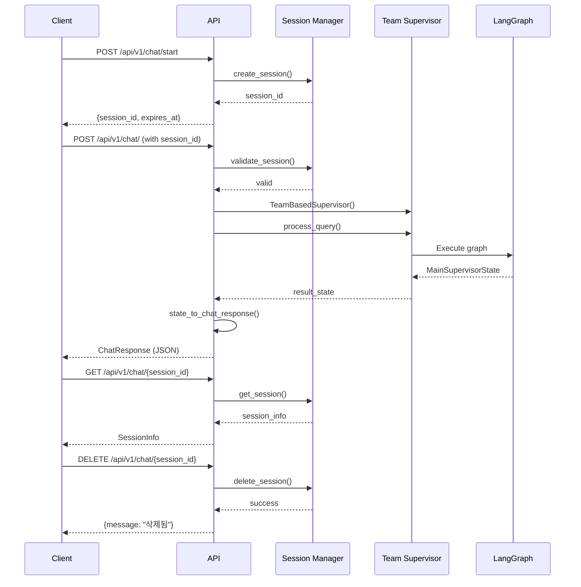

# FastAPI API 명세서

## 📌 기본 정보

- **Base URL**: `http://localhost:8000`
- **API Prefix**: `/api/v1/chat`
- **Content-Type**: `application/json`
- **인증**: 현재 없음 (추후 JWT 예정)

---

## 🔐 인증 및 세션

### 세션 생성 흐름
1. 클라이언트가 `/api/v1/chat/start`로 세션 시작 요청
2. 서버가 UUID 기반 `session_id` 생성하여 응답
3. 이후 모든 요청에 `session_id` 포함 필수
4. 세션 유효기간: 24시간 (자동 연장됨)

---

## 📡 API 엔드포인트

### 1. 세션 시작

**Endpoint**: `POST /api/v1/chat/start`

**설명**: 새로운 채팅 세션을 시작합니다. 서버가 고유한 세션 ID를 생성합니다.

#### Request Body
```json
{
  "user_id": "string (optional)",
  "metadata": {
    "device": "string (optional)",
    "app_version": "string (optional)",
    "custom_field": "any (optional)"
  }
}
```

#### Response (200 OK)
```json
{
  "session_id": "session-a1b2c3d4-e5f6-7890-abcd-ef1234567890",
  "message": "세션이 생성되었습니다",
  "expires_at": "2025-10-09T12:00:00.000000"
}
```

#### 예제 (curl)
```bash
curl -X POST "http://localhost:8000/api/v1/chat/start" \
  -H "Content-Type: application/json" \
  -d '{
    "user_id": "user_12345",
    "metadata": {
      "device": "web_browser",
      "app_version": "1.0.0"
    }
  }'
```

---

### 2. 채팅 메시지 전송

**Endpoint**: `POST /api/v1/chat/`

**설명**: 사용자 질문을 전송하고 AI 응답을 받습니다. (메인 엔드포인트)

#### Request Body
```json
{
  "query": "string (required, 1-5000 chars)",
  "session_id": "string (required)",
  "enable_checkpointing": true,
  "user_context": {
    "location": "string (optional)",
    "preferences": {}
  }
}
```

**필드 설명**:
- `query`: 사용자 질문 (1~5000자)
- `session_id`: 세션 ID (필수)
- `enable_checkpointing`: 체크포인트 저장 여부 (기본값: true)
- `user_context`: 추가 컨텍스트 정보 (선택)

#### Response (200 OK)
```json
{
  "session_id": "session-a1b2c3d4-...",
  "request_id": "req-x7y8z9a1-...",
  "status": "success",
  "response": {
    "answer": "부동산 거래 시 주의사항은 다음과 같습니다...",
    "confidence": 0.95,
    "sources": [
      {
        "law_name": "부동산 거래신고 등에 관한 법률",
        "article": "제3조",
        "relevance": 0.92
      }
    ]
  },
  "planning_info": {
    "query_analysis": {
      "intent": "법률_검색",
      "keywords": ["부동산", "거래", "주의사항"],
      "complexity": "medium"
    },
    "execution_steps": [
      {
        "step": 1,
        "agent": "search_team",
        "action": "법률 검색",
        "status": "completed"
      },
      {
        "step": 2,
        "agent": "analysis_team",
        "action": "결과 분석",
        "status": "completed"
      }
    ],
    "plan_status": "completed"
  },
  "team_results": {
    "search_team": {
      "status": "completed",
      "results_found": 5,
      "execution_time_ms": 850
    },
    "analysis_team": {
      "status": "completed",
      "analysis_type": "legal_interpretation",
      "confidence": 0.95
    }
  },
  "search_results": [
    {
      "law_name": "부동산 거래신고 등에 관한 법률",
      "article": "제3조",
      "content": "부동산 거래 당사자는...",
      "relevance_score": 0.92
    }
  ],
  "analysis_metrics": {
    "total_sources": 5,
    "average_relevance": 0.87,
    "processing_time_ms": 1200
  },
  "execution_time_ms": 2456,
  "teams_executed": ["search_team", "analysis_team"],
  "error": null
}
```

#### Response (401 Unauthorized)
```json
{
  "detail": "Invalid or expired session"
}
```

#### Response (422 Validation Error)
```json
{
  "error": "Validation Error",
  "details": [
    {
      "loc": ["body", "query"],
      "msg": "field required",
      "type": "value_error.missing"
    }
  ]
}
```

#### 예제 (curl)
```bash
curl -X POST "http://localhost:8000/api/v1/chat/" \
  -H "Content-Type: application/json" \
  -d '{
    "query": "부동산 매매 계약 시 주의사항은?",
    "session_id": "session-a1b2c3d4-e5f6-7890-abcd-ef1234567890",
    "enable_checkpointing": true,
    "user_context": {
      "location": "서울",
      "property_type": "아파트"
    }
  }'
```

---

### 3. 세션 정보 조회

**Endpoint**: `GET /api/v1/chat/{session_id}`

**설명**: 특정 세션의 정보를 조회합니다.

#### Path Parameters
- `session_id` (required): 세션 ID

#### Response (200 OK)
```json
{
  "session_id": "session-a1b2c3d4-...",
  "user_id": "user_12345",
  "created_at": "2025-10-08T10:00:00.000000",
  "last_activity": "2025-10-08T14:30:00.000000",
  "expires_at": "2025-10-09T10:00:00.000000",
  "is_active": true,
  "metadata": {
    "device": "web_browser",
    "app_version": "1.0.0"
  }
}
```

#### Response (404 Not Found)
```json
{
  "detail": "Session not found"
}
```

#### 예제 (curl)
```bash
curl -X GET "http://localhost:8000/api/v1/chat/session-a1b2c3d4-e5f6-7890-abcd-ef1234567890"
```

---

### 4. 세션 삭제

**Endpoint**: `DELETE /api/v1/chat/{session_id}`

**설명**: 특정 세션을 삭제합니다.

#### Path Parameters
- `session_id` (required): 세션 ID

#### Response (200 OK)
```json
{
  "message": "세션이 삭제되었습니다",
  "session_id": "session-a1b2c3d4-..."
}
```

#### Response (404 Not Found)
```json
{
  "detail": "Session not found"
}
```

#### 예제 (curl)
```bash
curl -X DELETE "http://localhost:8000/api/v1/chat/session-a1b2c3d4-e5f6-7890-abcd-ef1234567890"
```

---

### 5. 세션 통계 조회

**Endpoint**: `GET /api/v1/chat/stats/sessions`

**설명**: 전체 세션 통계를 조회합니다.

#### Response (200 OK)
```json
{
  "total_sessions": 150,
  "active_sessions": 42,
  "expired_sessions": 108
}
```

#### 예제 (curl)
```bash
curl -X GET "http://localhost:8000/api/v1/chat/stats/sessions"
```

---

### 6. 만료 세션 정리

**Endpoint**: `POST /api/v1/chat/cleanup/sessions`

**설명**: 만료된 세션들을 정리합니다.

#### Response (200 OK)
```json
{
  "message": "만료된 세션이 정리되었습니다",
  "cleaned_count": 108
}
```

#### 예제 (curl)
```bash
curl -X POST "http://localhost:8000/api/v1/chat/cleanup/sessions"
```

---

## 🔄 워크플로우 예시

### 전체 대화 플로우



---

## 📦 데이터 모델

### ChatRequest
| 필드 | 타입 | 필수 | 기본값 | 설명 |
|------|------|------|--------|------|
| query | string | ✅ | - | 사용자 질문 (1-5000자) |
| session_id | string | ✅ | - | 세션 ID |
| enable_checkpointing | boolean | ❌ | true | 체크포인트 저장 여부 |
| user_context | object | ❌ | {} | 추가 컨텍스트 |

### ChatResponse
| 필드 | 타입 | 설명 |
|------|------|------|
| session_id | string | 세션 ID |
| request_id | string | 요청 ID (추적용) |
| status | string | 상태 (success/error) |
| response | object | AI 최종 응답 |
| planning_info | object | 계획 정보 (상세) |
| team_results | object | 팀별 실행 결과 |
| search_results | array | 검색 결과 목록 |
| analysis_metrics | object | 분석 메트릭 |
| execution_time_ms | integer | 실행 시간 (밀리초) |
| teams_executed | array | 실행된 팀 목록 |
| error | string | 에러 메시지 (있을 경우) |

### SessionInfo
| 필드 | 타입 | 설명 |
|------|------|------|
| session_id | string | 세션 ID |
| user_id | string | 사용자 ID |
| created_at | datetime | 생성 시간 |
| last_activity | datetime | 마지막 활동 시간 |
| expires_at | datetime | 만료 시간 |
| is_active | boolean | 활성 상태 |
| metadata | object | 메타데이터 |

---

## ⚠️ 에러 코드

| HTTP 코드 | 에러 타입 | 설명 | 응답 예시 |
|-----------|----------|------|-----------|
| 400 | Bad Request | 잘못된 요청 | `{"detail": "Invalid request format"}` |
| 401 | Unauthorized | 세션 만료/없음 | `{"detail": "Invalid or expired session"}` |
| 404 | Not Found | 리소스 없음 | `{"detail": "Session not found"}` |
| 422 | Validation Error | 입력 검증 실패 | `{"error": "Validation Error", "details": [...]}` |
| 500 | Internal Error | 서버 내부 오류 | `{"error": "Internal Server Error", "message": "..."}` |

---

## 🧪 테스트 시나리오

### Scenario 1: 기본 대화 플로우

```bash
# 1. 세션 시작
SESSION_ID=$(curl -X POST "http://localhost:8000/api/v1/chat/start" \
  -H "Content-Type: application/json" \
  -d '{"user_id": "test_user"}' | jq -r '.session_id')

# 2. 질문 전송
curl -X POST "http://localhost:8000/api/v1/chat/" \
  -H "Content-Type: application/json" \
  -d "{
    \"query\": \"부동산 매매 계약서 작성 시 주의사항\",
    \"session_id\": \"$SESSION_ID\"
  }" | jq

# 3. 세션 정보 조회
curl -X GET "http://localhost:8000/api/v1/chat/$SESSION_ID" | jq

# 4. 세션 삭제
curl -X DELETE "http://localhost:8000/api/v1/chat/$SESSION_ID" | jq
```

### Scenario 2: 에러 처리

```bash
# 만료된 세션으로 요청 (401 에러 예상)
curl -X POST "http://localhost:8000/api/v1/chat/" \
  -H "Content-Type: application/json" \
  -d '{
    "query": "테스트",
    "session_id": "invalid-session-id"
  }'

# 빈 query 전송 (422 에러 예상)
curl -X POST "http://localhost:8000/api/v1/chat/" \
  -H "Content-Type: application/json" \
  -d '{
    "query": "",
    "session_id": "session-..."
  }'
```

### Scenario 3: 체크포인트 활용

```bash
# 체크포인트 활성화하여 질문
curl -X POST "http://localhost:8000/api/v1/chat/" \
  -H "Content-Type: application/json" \
  -d '{
    "query": "임대차 계약 관련 법률",
    "session_id": "session-...",
    "enable_checkpointing": true
  }' | jq

# 같은 세션으로 후속 질문 (이전 컨텍스트 유지됨)
curl -X POST "http://localhost:8000/api/v1/chat/" \
  -H "Content-Type: application/json" \
  -d '{
    "query": "그럼 보증금 반환은?",
    "session_id": "session-...",
    "enable_checkpointing": true
  }' | jq
```

---

## 🚀 FastAPI Swagger UI

자동 생성된 API 문서를 브라우저에서 확인:

- **Swagger UI**: `http://localhost:8000/docs`
- **ReDoc**: `http://localhost:8000/redoc`
- **OpenAPI JSON**: `http://localhost:8000/openapi.json`

---

## 🔧 개발자 노트

### 응답 포맷 변경 (추후)

현재는 **상세 버전 (Option B)**을 사용 중입니다. 프로덕션 배포 시 **간소화 버전 (Option A)**으로 변경 예정:

```python
# Option A (간소화 - 프로덕션용)
{
  "session_id": "session-...",
  "request_id": "req-...",
  "status": "success",
  "response": {
    "answer": "...",
    "confidence": 0.95
  },
  "execution_time_ms": 2456
}
```

### 세션 저장소 변경 (추후)

현재는 **메모리 기반** SessionManager를 사용 중입니다. 프로덕션에서는:
- **Redis**: 빠른 캐시, 분산 환경 지원
- **DynamoDB**: AWS 환경, TTL 자동 관리

### Rate Limiting (추후)

API 남용 방지를 위한 Rate Limiting 추가 예정:
```python
from slowapi import Limiter

limiter = Limiter(key_func=get_remote_address)

@app.post("/api/v1/chat/")
@limiter.limit("10/minute")
async def chat(...):
    ...
```

---

## 📊 성능 메트릭

### 평균 응답 시간 (예상)
- 세션 시작: < 50ms
- 간단한 질문: 1-3초
- 복잡한 질문: 3-10초
- 세션 조회: < 10ms

### 동시 처리 능력
- FastAPI 비동기 아키텍처로 수천 개 동시 연결 지원
- Uvicorn workers 조정으로 확장 가능

---

## 🔐 보안 체크리스트

- [x] 서버 생성 UUID 세션 ID (예측 불가능)
- [x] 세션 만료 처리 (24시간 TTL)
- [x] 입력 검증 (Pydantic)
- [x] 에러 메시지 sanitization
- [ ] CORS 설정 (프로덕션에서 제한 필요)
- [ ] API 인증 (JWT 등)
- [ ] Rate limiting
- [ ] HTTPS 강제

---

**작성일**: 2025-10-08
**버전**: 1.0.0
**API Prefix**: `/api/v1/chat`
**Base URL**: `http://localhost:8000`
