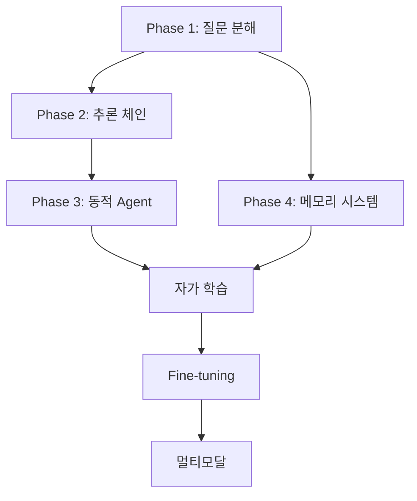

# LLM 시스템 고도화 종합 계획서

## 📋 Executive Summary

본 문서는 부동산 AI 에이전트 시스템의 현재 상태를 분석하고, LLM 기반 복합 질문 처리 능력을 고도화하기 위한 종합적인 계획을 제시합니다. 특히 복잡한 사용자 질문에 대한 계획 수립과 실행 전략을 개선하여 더 정확하고 효율적인 서비스를 제공하는 것을 목표로 합니다.

---

## 1. 현재 시스템 분석

### 1.1 아키텍처 구조

```
┌─────────────────────────────────────────────────────────┐
│                    User Interface                       │
└─────────────────────────────────────────────────────────┘
                            │
                            ▼
┌─────────────────────────────────────────────────────────┐
│                  Team Supervisor                        │
│              (team_supervisor.py)                       │
└─────────────────────────────────────────────────────────┘
                            │
        ┌───────────────────┼───────────────────┐
        ▼                   ▼                   ▼
┌──────────────┐   ┌──────────────┐   ┌──────────────┐
│  Cognitive   │   │  Execution   │   │     LLM      │
│   Agents     │   │   Agents     │   │   Manager    │
└──────────────┘   └──────────────┘   └──────────────┘
        │                   │                   │
        ▼                   ▼                   ▼
┌──────────────┐   ┌──────────────┐   ┌──────────────┐
│  Planning    │   │Search/Analyze│   │   Prompt     │
│   Agent      │   │  /Document   │   │   Service    │
└──────────────┘   └──────────────┘   └──────────────┘
                            │
                            ▼
┌─────────────────────────────────────────────────────────┐
│                    Data Layer                           │
│  - SQLite (메타데이터)                                   │
│  - ChromaDB (벡터 검색)                                  │
│  - Mock Data (시세/대출)                                 │
└─────────────────────────────────────────────────────────┘
```

### 1.2 핵심 컴포넌트 분석

#### 1.2.1 Cognitive Layer
- **PlanningAgent** (`cognitive_agents/planning_agent.py`)
  - 의도 분석: IntentType 9개 카테고리 분류
  - 실행 계획: ExecutionPlan 생성 및 최적화
  - Agent 선택: LLM 기반 + Fallback 전략

#### 1.2.2 Execution Layer
- **SearchExecutor**: 법률/시세/대출 정보 검색
- **AnalysisExecutor**: 데이터 분석 및 인사이트 생성
- **DocumentExecutor**: 계약서 생성/검토

#### 1.2.3 LLM Management
- **LLMService**: 중앙화된 LLM 호출 관리
- **PromptManager**: 템플릿 기반 프롬프트 관리
- 프롬프트 카테고리: cognitive, execution, common

### 1.3 현재 시스템의 강점

1. **모듈화된 구조**: 역할별 명확한 분리
2. **하이브리드 검색**: SQLite + ChromaDB 조합
3. **중앙화된 LLM 관리**: 일관된 호출 인터페이스
4. **팀 기반 조직**: 독립적인 실행 단위

### 1.4 식별된 문제점 및 개선 기회

#### 문제점
1. **단순 의도 분석**: 복합 질문 처리 한계
2. **정적 Agent 매핑**: 유연성 부족
3. **순차 실행 중심**: 병렬 처리 미흡
4. **컨텍스트 단절**: 대화 흐름 유지 어려움
5. **제한적 추론**: 단계적 사고 과정 부재

#### 개선 기회
1. 복합 질문 자동 분해
2. 동적 Agent 조합 최적화
3. 병렬 실행 전략 강화
4. 메모리 시스템 도입
5. Chain-of-Thought 추론

---

## 2. 고도화 로드맵

### Phase 1: 복합 질문 분해 시스템 (2주)

#### 목표
복잡한 사용자 질문을 여러 개의 실행 가능한 서브태스크로 자동 분해

#### 구현 내용

**1. QueryDecomposer 클래스 개발**
```python
# cognitive_agents/query_decomposer.py
class QueryDecomposer:
    def __init__(self, llm_service: LLMService):
        self.llm_service = llm_service

    async def decompose_query(self, query: str) -> List[SubQuery]:
        """복합 질문을 서브 질문으로 분해"""
        # LLM을 통한 질문 분해
        # 의존성 그래프 생성
        # 병렬 실행 가능 태스크 식별

    async def identify_dependencies(self, sub_queries: List[SubQuery]) -> DependencyGraph:
        """서브 질문 간 의존성 파악"""

    def create_execution_graph(self, dependency_graph: DependencyGraph) -> ExecutionGraph:
        """최적 실행 순서 결정"""
```

**2. 프롬프트 템플릿 추가**
- `prompts/cognitive/query_decomposition.txt`
- Few-shot 예제 포함
- 의존성 명시 가이드

**3. Planning Agent 통합**
- decompose_query 단계 추가
- 서브태스크별 개별 의도 분석
- 통합 실행 계획 생성

### Phase 2: 다단계 추론 체인 (3주)

#### 목표
복잡한 추론을 단계별로 나누어 처리하고 중간 결과를 검증

#### 구현 내용

**1. ReasoningChain 클래스 개발**
```python
# cognitive_agents/reasoning_chain.py
class ReasoningChain:
    def __init__(self, llm_service: LLMService):
        self.llm_service = llm_service
        self.chain_steps = []

    async def create_chain(self, query: str, context: Dict) -> List[ReasoningStep]:
        """추론 체인 생성"""

    async def execute_step(self, step: ReasoningStep, previous_results: List) -> StepResult:
        """개별 추론 단계 실행"""

    async def validate_reasoning(self, result: StepResult) -> ValidationResult:
        """중간 결과 검증 및 자가 수정"""
```

**2. Chain-of-Thought 프롬프트**
- `prompts/cognitive/chain_of_thought.txt`
- 단계별 사고 과정 템플릿
- 자가 검증 체크리스트

**3. 추론 결과 통합**
- 각 단계 결과 조합 로직
- 모순 감지 및 해결
- 신뢰도 점수 산출

### Phase 3: 동적 Agent 조합 최적화 (2주)

#### 목표
질문의 복잡도와 특성에 따라 최적의 Agent 조합을 동적으로 선택

#### 구현 내용

**1. AgentScorer 클래스 개발**
```python
# cognitive_agents/agent_scorer.py
class AgentScorer:
    def __init__(self):
        self.capability_matrix = self._build_capability_matrix()

    def score_agent_capability(self, agent: str, task_type: str) -> float:
        """Agent의 특정 태스크 수행 능력 평가"""

    def match_query_to_agents(self, query: str, available_agents: List[str]) -> List[AgentMatch]:
        """질문에 최적화된 Agent 매칭"""

    def optimize_combination(self, matches: List[AgentMatch]) -> OptimalCombination:
        """비용/시간/품질 균형 최적화"""
```

**2. Agent 능력 매트릭스**
```yaml
# config/agent_capabilities.yaml
agents:
  search_team:
    strengths:
      - legal_search: 0.95
      - market_data: 0.90
      - loan_info: 0.85
    avg_response_time: 2.5
    cost_factor: 1.0

  analysis_team:
    strengths:
      - data_analysis: 0.95
      - risk_assessment: 0.90
      - insight_generation: 0.88
    avg_response_time: 4.0
    cost_factor: 1.5
```

**3. 동적 재할당 메커니즘**
- 실행 중 성능 모니터링
- 실패 시 대체 Agent 자동 선택
- 부하 분산 전략

### Phase 4: 이중 메모리 시스템 (3주)

#### 목표
단기 대화 컨텍스트와 장기 학습 정보를 효율적으로 관리

#### 구현 내용

**1. 단기 메모리 (AsyncSqliteSaver 기반)**
```python
# foundation/short_term_memory.py
class ShortTermMemory:
    def __init__(self):
        self.checkpointer = AsyncSqliteSaver.from_conn_string(":memory:")

    async def save_conversation_state(self, thread_id: str, state: Dict):
        """현재 대화 상태 저장"""

    async def get_recent_context(self, thread_id: str, n_turns: int = 5):
        """최근 N개 대화 턴 조회"""

    async def cleanup_old_sessions(self, ttl_hours: int = 24):
        """오래된 세션 자동 정리"""
```

**2. 장기 메모리 (Hybrid Storage)**
```python
# foundation/long_term_memory.py
class LongTermMemory:
    def __init__(self):
        self.structured_db = sqlite3.connect("long_term.db")
        self.semantic_db = chromadb.Client()

    async def store_important_conversation(self, conversation: Dict, importance_score: float):
        """중요 대화 영구 저장"""

    async def store_user_preference(self, user_id: str, preference: Dict):
        """사용자 선호도 저장"""

    async def retrieve_similar_cases(self, query: str, k: int = 5):
        """유사 사례 검색"""
```

**3. 메모리 통합 관리**
```python
# foundation/memory_orchestrator.py
class MemoryOrchestrator:
    def __init__(self):
        self.short_term = ShortTermMemory()
        self.long_term = LongTermMemory()

    async def migrate_to_long_term(self, criteria: Dict):
        """단기 → 장기 메모리 전환"""

    async def retrieve_relevant_memory(self, query: str, context: Dict):
        """관련 메모리 통합 검색"""

    async def consolidate_memory(self):
        """주기적 메모리 압축 및 요약"""
```

#### 장기 메모리 저장 전략

1. **중요도 기반 저장**
   - LLM이 평가한 대화 중요도 점수
   - 임계값 초과 시 자동 저장

2. **빈도 기반 저장**
   - 반복되는 질문 패턴 감지
   - 자주 참조되는 정보 캐싱

3. **이벤트 기반 저장**
   - 계약 체결, 중요 결정 등
   - 마일스톤 자동 기록

4. **시간 기반 저장**
   - 일별/주별 대화 요약
   - 트렌드 분석용 데이터 축적

---

## 3. 복합 질문 처리 전략

### 3.1 질문 유형별 처리 방식

#### Type 1: 순차적 복합 질문
**예시**: "강남구 아파트 시세 확인하고, 대출 가능 금액 계산해서 구매 가능한 물건 추천해줘"

**처리 방식**:
1. 질문 분해: [시세 조회] → [대출 계산] → [물건 추천]
2. 순차 실행: 이전 결과를 다음 단계 입력으로 사용
3. 통합 응답 생성

#### Type 2: 병렬 복합 질문
**예시**: "이 계약서의 법적 문제점과 시장 가격 적정성을 동시에 검토해줘"

**처리 방식**:
1. 질문 분해: [법률 검토] | [시세 분석]
2. 병렬 실행: 독립적 태스크 동시 처리
3. 결과 병합 및 종합 분석

#### Type 3: 조건부 복합 질문
**예시**: "전세 대출이 가능하면 계약서 작성하고, 안 되면 월세 조건 검토해줘"

**처리 방식**:
1. 조건 평가: 대출 가능성 확인
2. 분기 처리: 조건에 따른 경로 선택
3. 선택된 경로 실행

### 3.2 추론 깊이 조절

```python
class ReasoningDepthController:
    def determine_depth(self, query_complexity: float) -> int:
        """질문 복잡도에 따른 추론 깊이 결정"""
        if query_complexity < 0.3:
            return 1  # 단순 조회
        elif query_complexity < 0.7:
            return 3  # 기본 분석
        else:
            return 5  # 심층 분석
```

### 3.3 자가 검증 메커니즘

1. **일관성 검사**: 답변 간 모순 감지
2. **완전성 검사**: 모든 서브 질문 처리 확인
3. **신뢰도 평가**: 각 단계별 확신도 측정
4. **피드백 루프**: 낮은 신뢰도 시 재추론

---

## 4. 향후 발전 방향

### 4.1 단기 목표 (3-6개월)

#### 1. 자가 학습 시스템
- 사용자 피드백 자동 수집
- 오답 사례 분석 및 개선
- 프롬프트 자동 최적화

#### 2. 도메인 특화 Fine-tuning
- 부동산 법률 특화 모델
- 시장 분석 특화 모델
- 계약서 생성 특화 모델

#### 3. 실시간 데이터 통합
- 실제 시세 API 연동
- 법령 업데이트 자동 반영
- 금융 상품 실시간 조회

### 4.2 중기 목표 (6-12개월)

#### 1. 멀티모달 처리
- 계약서 이미지 OCR 및 분석
- 부동산 도면 해석
- 음성 입력 지원

#### 2. 예측 모델 통합
- 시세 예측 모델
- 리스크 예측 모델
- 사용자 니즈 예측

#### 3. 협업 Agent 시스템
- 전문가 Agent 네트워크
- Agent 간 협상 메커니즘
- 분산 처리 아키텍처

### 4.3 장기 비전 (1년 이상)

#### 1. 완전 자율 Agent
- 목표 기반 자율 계획
- 능동적 정보 수집
- 자가 진화 능력

#### 2. 생태계 확장
- 타 서비스 연동 (은행, 공인중개사)
- API 마켓플레이스
- 서드파티 플러그인

#### 3. AGI 준비
- 범용 추론 능력
- 도메인 전이 학습
- 메타 학습 능력

---

## 5. 구현 우선순위 및 의존성

### 5.1 구현 순서



### 5.2 기술 스택

| 구성 요소 | 기술 선택 | 선택 이유 |
|---------|---------|---------|
| 워크플로우 | LangGraph | 복잡한 그래프 구조 지원 |
| 단기 메모리 | AsyncSqliteSaver | 빠른 로컬 저장 |
| 장기 메모리 | SQLite + ChromaDB | 구조화/벡터 하이브리드 |
| LLM | OpenAI GPT-4o | 성능과 비용 균형 |
| 임베딩 | KURE_v1 | 한국어 특화 |
| 비동기 처리 | asyncio | Python 표준 |

### 5.3 리스크 관리

| 리스크 | 영향도 | 대응 방안 |
|-------|-------|---------|
| LLM 비용 증가 | 높음 | 캐싱 강화, 경량 모델 병용 |
| 응답 지연 | 중간 | 비동기 처리, 스트리밍 응답 |
| 메모리 오버플로우 | 낮음 | 주기적 정리, 용량 모니터링 |
| 프롬프트 인젝션 | 중간 | 입력 검증, 샌드박싱 |

### 5.4 성과 측정 지표

#### 정량적 지표
- **응답 정확도**: 90% 이상 목표
- **평균 응답 시간**: 5초 이내
- **복합 질문 처리율**: 85% 이상
- **메모리 히트율**: 70% 이상

#### 정성적 지표
- 사용자 만족도 설문
- 전문가 평가
- 실제 계약 성사율
- 재사용률

---

## 6. 실행 계획

### 6.1 마일스톤

| 단계 | 기간 | 주요 산출물 | 성공 기준 |
|-----|-----|-----------|---------|
| Phase 1 | 2주 | QueryDecomposer | 복합 질문 80% 분해 성공 |
| Phase 2 | 3주 | ReasoningChain | 5단계 추론 안정화 |
| Phase 3 | 2주 | AgentScorer | 동적 할당 50% 개선 |
| Phase 4 | 3주 | Memory System | 컨텍스트 유지 90% |
| 통합 테스트 | 2주 | 전체 시스템 | E2E 성공률 85% |

### 6.2 리소스 할당

- **개발 인력**: 2-3명
- **LLM 비용**: 월 $500-1000
- **인프라**: 기존 서버 활용
- **데이터**: 법률 DB 라이센스 필요

### 6.3 다음 단계

1. **즉시 실행**
   - QueryDecomposer 프로토타입 개발
   - 기존 프롬프트 개선

2. **1주차**
   - 질문 분해 로직 구현
   - 테스트 케이스 작성

3. **2주차**
   - Planning Agent 통합
   - 성능 벤치마크

---

## 7. 결론

본 계획서는 현재의 단순한 의도 분석 시스템을 복잡한 질문을 이해하고 다단계로 처리할 수 있는 고도화된 AI 시스템으로 발전시키는 로드맵을 제시합니다.

단계적 구현을 통해 리스크를 최소화하면서도 빠른 성과를 달성할 수 있으며, 장기적으로는 완전 자율적인 부동산 AI 에이전트로 진화할 수 있는 기반을 마련합니다.

각 Phase는 독립적으로 가치를 제공하면서도 통합 시 시너지를 창출하도록 설계되었으며, 지속적인 학습과 개선이 가능한 구조를 갖추고 있습니다.

---

## 부록 A: 참고 자료

- LangGraph Documentation
- OpenAI Best Practices
- ChromaDB Vector Search Guide
- AsyncSqliteSaver API Reference

## 부록 B: 용어 정의

- **CoT (Chain-of-Thought)**: 단계별 추론 과정
- **Agent**: 특정 작업을 수행하는 독립 실행 단위
- **Checkpointer**: 상태 저장 및 복원 시스템
- **Embedding**: 텍스트의 벡터 표현

---

*작성일: 2024년 10월*
*작성자: AI System Architecture Team*
*버전: 1.0*