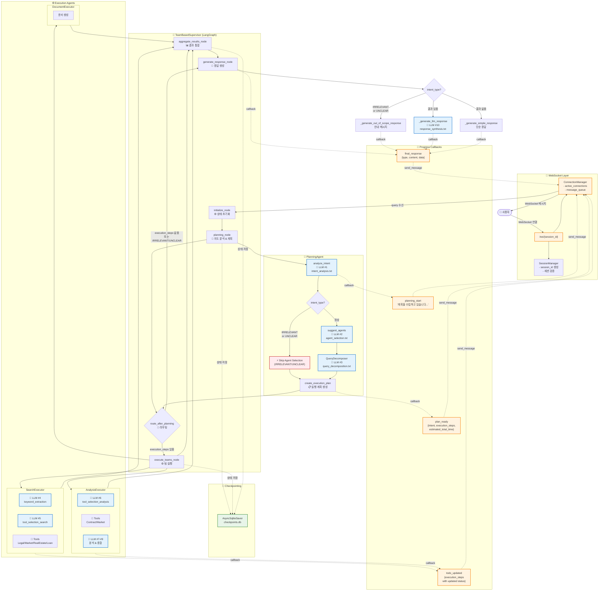

# 부동산 AI 시스템 흐름도 v2

**버전**: 2.0
**작성일**: 2025-10-10
**주요 변경사항**: WebSocket 실시간 통신, Progress Flow UI, Checkpointing 반영

---

## 🔄 v1에서 v2로의 주요 변경점

| 항목 | v1 | v2 |
|------|----|----|
| **통신 방식** | HTTP POST | WebSocket (실시간) |
| **응답 방식** | 동기식 (완료 후 응답) | 스트리밍 (progress_callback) |
| **프론트엔드** | 단순 로딩 스피너 | ExecutionPlanPage + ExecutionProgressPage |
| **State 관리** | In-memory | LangGraph Checkpointing (SQLite) |
| **Todo 관리** | 없음 | 실시간 todo 업데이트 (pending → in_progress → completed) |

---

## 전체 시스템 아키텍처 (LLM 호출 지점 표시)



## LLM 호출 지점 상세 정리

### 📊 LLM 호출 통계

| # | 호출 위치 | 프롬프트 파일 | 모델 | Temperature | 호출 방식 | 목적 |
|---|----------|-------------|------|-------------|----------|------|
| 1 | PlanningAgent | `intent_analysis.txt` | GPT-4o-mini | 0.0 | async | 사용자 의도 분석 |
| 2 | PlanningAgent | `agent_selection.txt` | GPT-4o-mini | 0.1 | async | Agent 선택 (IRRELEVANT/UNCLEAR은 생략⚡) |
| 2b | PlanningAgent (fallback) | `agent_selection_simple.txt` | GPT-4o-mini | 0.3 | async | 단순 Agent 선택 |
| 3 | QueryDecomposer | `query_decomposition.txt` | GPT-4o-mini | 0.1 | async | 복합 질문 분해 |
| 4 | SearchExecutor | `keyword_extraction.txt` | GPT-4o-mini | 0.1 | **sync** | 검색 키워드 추출 |
| 5 | SearchExecutor | `tool_selection_search.txt` | GPT-4o-mini | 0.1 | async | 검색 도구 선택 |
| 6 | AnalysisExecutor | `tool_selection_analysis.txt` | GPT-4o-mini | 0.1 | async | 분석 도구 선택 |
| 7 | ContractAnalysisTool | `_llm_analysis` (인라인) | GPT-4o-mini | 0.3 | async | 계약서 상세 분석 (LLM 기반) |
| 8 | MarketAnalysisTool | `_llm_market_insight` (인라인) | GPT-4o-mini | 0.3 | async | 시장 종합 인사이트 생성 |
| 9 | AnalysisExecutor | `insight_generation.txt` | GPT-4o-mini | 0.3 | async | 분석 인사이트 종합 |
| 10 | TeamSupervisor | `response_synthesis.txt` | GPT-4o-mini | 0.3 | async | 최종 응답 생성 |

### 📁 프롬프트 파일 위치

#### Cognitive Prompts (인지 에이전트)
```
backend/app/service_agent/llm_manager/prompts/cognitive/
├── intent_analysis.txt          ✅ 사용됨 (LLM #1)
├── agent_selection.txt          ✅ 사용됨 (LLM #2)
├── agent_selection_simple.txt   ✅ 사용됨 (LLM #2b, fallback)
├── query_decomposition.txt      ✅ 사용됨 (LLM #3)
└── plan_generation.txt          ❌ 미사용
```

#### Execution Prompts (실행 에이전트)
```
backend/app/service_agent/llm_manager/prompts/execution/
├── keyword_extraction.txt       ✅ 사용됨 (LLM #4)
├── tool_selection_search.txt    ✅ 사용됨 (LLM #5)
├── tool_selection_analysis.txt  ✅ 사용됨 (LLM #6)
├── insight_generation.txt       ✅ 사용됨 (LLM #8, #9)
└── response_synthesis.txt       ✅ 사용됨 (LLM #10)
```

#### Common Prompts
```
backend/app/service_agent/llm_manager/prompts/common/
└── error_response.txt           ❌ 미사용
```

#### ⚠️ 프롬프트 파일 현황 및 인라인 프롬프트 사용
**인라인 프롬프트 사용 중** (파일이 아닌 코드 내 직접 작성):
- `ContractAnalysisTool._llm_analysis()`: 계약서 분석용 프롬프트 (Line 240-253)
- `MarketAnalysisTool._llm_market_insight()`: 시장 인사이트 생성 프롬프트 (Line 318-338)

**미사용 프롬프트 파일** (삭제 고려):
- `plan_generation.txt`: 현재 코드에서 사용하지 않음
- `error_response.txt`: 현재 코드에서 사용하지 않음

## 📡 WebSocket 메시지 프로토콜

### Client → Server

| 메시지 타입 | 필드 | 설명 |
|------------|------|------|
| `query` | `query`, `enable_checkpointing` | 사용자 쿼리 전송 |
| `interrupt_response` | `action`, `modified_todos` | Plan 승인/수정 (TODO) |
| `todo_skip` | `todo_id` | Todo 건너뛰기 (TODO) |

### Server → Client

| 메시지 타입 | 발생 시점 | 필드 | 프론트엔드 동작 | 구현 상태 |
|------------|----------|------|---------------|------------|
| `connected` | WebSocket 연결 시 | `session_id`, `timestamp` | 연결 확인 | ✅ 구현됨 |
| `planning_start` | planning_node 시작 | `message` | 스피너 표시 | ✅ 구현됨 |
| `plan_ready` | planning_node 완료 | `intent`, `confidence`, `execution_steps`, `estimated_total_time`, `keywords` | ExecutionPlanPage 생성<br/>800ms 후 ExecutionProgressPage 생성 | ✅ 구현됨 |
| `execution_start` | execute_teams_node 시작 | `message`, `execution_steps`, `intent`, `confidence`, `execution_strategy`, `estimated_total_time`, `keywords` | (프론트엔드 처리) | ✅ 구현됨 |
| `todo_updated` | Step 상태 변경 | `execution_steps` | ExecutionProgressPage의 steps 업데이트 | ✅ 구현됨 |
| `final_response` | generate_response_node 완료 | `response` (type, content/answer/message, data) | Progress 제거<br/>답변 표시<br/>idle 전환 | ✅ 구현됨 |
| `error` | 에러 발생 | `error`, `timestamp` | 에러 메시지 표시<br/>idle 전환 | ✅ 구현됨 |
| ~~`todo_created`~~ | ~~초기 todo 생성~~ | ~~`execution_steps`~~ | ~~(미사용)~~ | ❌ 제거됨 |
| ~~`step_start`~~ | ~~Step 시작~~ | ~~`agent`, `task`~~ | ~~(미사용)~~ | ⏸️ 미구현 |
| ~~`step_progress`~~ | ~~Step 진행 중~~ | ~~`progress_percentage`~~ | ~~(미사용)~~ | ⏸️ 미구현 |
| ~~`step_complete`~~ | ~~Step 완료~~ | ~~`result`~~ | ~~(미사용)~~ | ⏸️ 미구현 |

---

## 🔄 주요 처리 흐름 (시나리오별)

### 1. IRRELEVANT 쿼리 (빠른 경로) ⚡

```
사용자: "안녕" 입력
   ↓
Frontend: WebSocket 연결 → query 전송
   ↓
Backend: initialize_node
   └─ State 초기화 (LLM 호출 없음)
   ↓
planning_node
   ├─ 🤖 LLM #1: intent_analysis → IRRELEVANT
   ├─ ⚡ Skip LLM #2 (agent_selection)
   └─ create_execution_plan → Empty Plan (execution_steps: [])
   ↓
route_after_planning (라우팅 결정, LLM 호출 없음)
   └─ if intent_type == "irrelevant" → return "respond"
   ↓
⚡ execute_teams_node 건너뛰기 (바로 generate_response_node로)
⚡ aggregate_results_node 건너뛰기
   ↓
generate_response_node
   ├─ if intent_type == "irrelevant":
   └─ _generate_out_of_scope_response() → 안내 메시지 (LLM 호출 없음)
   ↓
final_response 전송 → Frontend
   ↓
Frontend: 안내 메시지 표시
```

**거치는 노드**: initialize → planning → route → generate_response → END
**건너뛴 노드**: ❌ execute_teams, ❌ aggregate

**WebSocket 메시지**:
1. `connected` → 연결 확인
2. `planning_start` → 스피너 표시
3. `plan_ready` (execution_steps: []) → ExecutionPlanPage 생성 시도 (빈 배열)
4. `final_response` (type: "guidance") → 안내 메시지 표시

**LLM 호출**: 1회만 (LLM #1: intent_analysis)
**소요 시간**: ~0.6초

---

### 2. 단순 부동산 질문 (일반 경로)

```
사용자: "전세금 인상기준은?" 입력
   ↓
Frontend: WebSocket 연결 → query 전송
   ↓
Backend: initialize_node
   └─ State 초기화 (LLM 호출 없음)
   ↓
planning_node
   ├─ 🤖 LLM #1: intent_analysis → LEGAL_CONSULT
   ├─ 🤖 LLM #2: agent_selection → ["search_team"]
   └─ create_execution_plan → Simple Plan (1 step)
   ↓
route_after_planning (라우팅 결정, LLM 호출 없음)
   └─ if execution_steps 있음 → return "execute"
   ↓
execute_teams_node
   ├─ strategy = "sequential" (순차 실행)
   ├─ SearchTeam 시작 → todo_updated (step 0: in_progress)
   │  ├─ 🤖 LLM #4: keyword_extraction
   │  ├─ 🤖 LLM #5: tool_selection_search
   │  └─ Tools 실행 (LegalSearchTool, LLM 호출 없음)
   └─ SearchTeam 완료 → todo_updated (step 0: completed)
   ↓
aggregate_results_node
   └─ 결과 통합 (LLM 호출 없음)
   ↓
generate_response_node
   ├─ if 결과 있음:
   └─ 🤖 LLM #10: response_synthesis → 최종 답변
   ↓
final_response 전송 → Frontend
   ↓
Frontend: 답변 표시
```

**거치는 노드**: initialize → planning → route → execute_teams → aggregate → generate_response → END
**모든 노드 통과** ✅

**WebSocket 메시지**:
1. `connected` → 연결 확인
2. `planning_start` → 계획 수립 알림
3. `plan_ready` (execution_steps: [{ step_id, team: "search", status: "pending", ... }])
4. `execution_start` → 작업 실행 시작 (전체 실행 계획 포함)
5. 800ms 후 Frontend가 ExecutionProgressPage 자동 생성 (프론트엔드 로직)
6. `todo_updated` (step 0: "in_progress") → 진행 상태 업데이트
7. `todo_updated` (step 0: "completed") → 완료 상태 업데이트
8. `final_response` (type: "answer", answer: "...") → 최종 답변 표시

**LLM 호출**: 5회 (LLM #1, #2, #4, #5, #10)
**소요 시간**: ~5-7초

---

### 3. 복합 질문 + 분석 (전체 경로)

```
사용자: "강남구 아파트 전세 시세와 위험도 분석해줘" 입력
   ↓
Frontend: WebSocket 연결 → query 전송
   ↓
Backend: initialize_node
   └─ State 초기화 (LLM 호출 없음)
   ↓
planning_node
   ├─ 🤖 LLM #1: intent_analysis → COMPREHENSIVE
   ├─ 🤖 LLM #2: agent_selection → ["search_team", "analysis_team"]
   ├─ 🤖 LLM #3: query_decomposition (복합 질문 분해)
   └─ create_execution_plan → Complex Plan (2 steps)
   ↓
route_after_planning (라우팅 결정, LLM 호출 없음)
   └─ if execution_steps 있음 → return "execute"
   ↓
execute_teams_node
   ├─ strategy = "sequential" (순차 실행)
   │
   ├─ SearchTeam 시작 → todo_updated (step 0: in_progress)
   │  ├─ 🤖 LLM #4: keyword_extraction
   │  ├─ 🤖 LLM #5: tool_selection_search
   │  └─ Tools 실행 (LegalSearchTool, MarketDataTool, LLM 호출 없음)
   │  └─ SearchTeam 완료 → todo_updated (step 0: completed)
   │
   └─ AnalysisTeam 시작 → todo_updated (step 1: in_progress)
      ├─ 🤖 LLM #6: tool_selection_analysis
      ├─ ContractAnalysisTool (선택된 경우)
      │  └─ 🤖 LLM #7: contract_analysis (인라인 프롬프트)
      ├─ MarketAnalysisTool
      │  └─ 🤖 LLM #8: insight_generation
      ├─ 🤖 LLM #9: insight_generation (분석 결과 종합)
      └─ AnalysisTeam 완료 → todo_updated (step 1: completed)
   ↓
aggregate_results_node
   └─ Search + Analysis 결과 통합 (LLM 호출 없음)
   ↓
generate_response_node
   ├─ if 결과 있음:
   └─ 🤖 LLM #10: response_synthesis → 최종 답변
   ↓
final_response 전송 → Frontend
   ↓
Frontend: 답변 표시
```

**거치는 노드**: initialize → planning → route → execute_teams → aggregate → generate_response → END
**모든 노드 통과** ✅

**WebSocket 메시지**:
1. `connected` → 연결 확인
2. `planning_start` → 계획 수립 알림
3. `plan_ready` (execution_steps: [step0, step1]) → 실행 계획 완료
4. `execution_start` → 작업 실행 시작
5. 800ms 후 ExecutionProgressPage 자동 생성 (프론트엔드 로직)
6. `todo_updated` (step 0: "in_progress") → Search 팀 시작
7. `todo_updated` (step 0: "completed") → Search 팀 완료
8. `todo_updated` (step 1: "in_progress") → Analysis 팀 시작
9. `todo_updated` (step 1: "completed") → Analysis 팀 완료
10. `final_response` (type: "answer") → 최종 답변

**LLM 호출**: 최대 10회 (LLM #1, #2, #3, #4, #5, #6, #7, #8, #9, #10)
**소요 시간**: ~15-20초

## 🎯 최적화 포인트

### ✅ 이미 적용된 최적화

1. **IRRELEVANT/UNCLEAR 조기 종료** (LLM #2 생략)
   - 위치: `planning_agent.py:172-181`
   - 효과: ~5초 → ~0.6초 (약 90% 단축)

2. **WebSocket 실시간 통신**
   - HTTP POST (동기) → WebSocket (스트리밍)
   - 효과: 사용자 경험 개선, 진행 상황 실시간 확인

3. **Progress Flow UI** (v3)
   - ExecutionPlanPage + ExecutionProgressPage
   - 효과: 투명성 향상, 대기 시간 체감 감소

4. **Checkpointing (LangGraph)**
   - 대화 상태 저장
   - 효과: 재연결 시 복구 가능 (TODO)

5. **Intent Analysis 파라미터 최적화**
   - Temperature: 0.1 → 0.0
   - max_tokens: 500 추가
   - 효과: ~0.5초 단축

### 💡 추가 최적화 가능

1. **패턴 기반 빠른 감지** (LLM #1도 생략)
   - 간단한 인사말은 LLM 호출 없이 즉시 판단
   - 예상 효과: 0.6초 → 0.1초

2. **병렬 LLM 호출**
   - LLM #4, #5, #6 동시 호출 (현재는 순차)
   - 예상 효과: ~30% 시간 단축

3. **캐싱 전략**
   - 동일 쿼리 재요청 시 결과 재사용
   - Redis/Memcached 활용

4. **Frontend Skeleton UI**
   - ExecutionPlanPage 대신 Skeleton 표시
   - 더 빠른 시각적 피드백

## 🏗️ 시스템 아키텍처 상세 분석

### State 관리 구조

#### 1. **State 계층 구조**
```
MainSupervisorState (최상위)
├── query, session_id, request_id
├── planning_state: PlanningState
│   ├── analyzed_intent
│   ├── execution_steps: List[ExecutionStepState]
│   └── execution_strategy
├── search_team_state: SearchTeamState
│   ├── keywords: SearchKeywords
│   ├── search_scope
│   └── *_results
├── document_team_state: DocumentTeamState
│   ├── document_type
│   ├── template
│   └── final_document
└── analysis_team_state: AnalysisTeamState
    ├── analysis_type
    ├── raw_analysis
    └── insights
```

#### 2. **ExecutionStepState (TODO 아이템)**
Progress Flow와 WebSocket 실시간 업데이트용 표준 형식:
```python
{
    # 식별 (4개)
    "step_id": "step_0",
    "step_type": "search",
    "agent_name": "search_team",
    "team": "search",

    # 작업 (2개)
    "task": "법률 정보 검색",
    "description": "법률 관련 정보 및 판례 검색",

    # 상태 (2개)
    "status": "pending" | "in_progress" | "completed" | "failed" | "skipped",
    "progress_percentage": 0-100,

    # 타이밍 (2개)
    "started_at": "2025-10-14T...",
    "completed_at": "2025-10-14T...",

    # 결과 (2개)
    "result": {...},
    "error": None
}
```

#### 3. **State 관리 유틸리티**
- **StateManager.update_step_status()**: ExecutionStep 상태 업데이트
- **StateManager.create_shared_state()**: 공유 State 생성
- **StateManager.merge_team_results()**: 팀 결과 병합
- **StateValidator**: State 유효성 검증
- **StateTransition**: State 전환 관리

### LangGraph 노드 구조

#### 1. **TeamBasedSupervisor (메인 워크플로우)**
```
START → initialize → planning → [route] → execute_teams → aggregate → generate_response → END
                                    ↓
                                 (조건부 라우팅)
                                    ├─ execute: 정상 실행
                                    └─ respond: IRRELEVANT/UNCLEAR 조기 종료
```

**노드 상세**:
| 노드 | 메서드 | State 업데이트 | 주요 역할 |
|------|--------|---------------|---------|
| initialize | `initialize_node()` (line 152-167) | status="initialized", start_time, active_teams=[], completed_teams=[], failed_teams=[], team_results={}, error_log=[] | **워크플로우 초기화**: State 초기값 설정, 실행 준비 |
| planning | `planning_node()` (line 169-208) | planning_state, execution_plan, active_teams | **실행 계획 수립**: 의도 분석 (LLM #1), Agent 선택 (LLM #2), 질문 분해 (LLM #3), execution_steps 생성, WebSocket 알림 |
| [route] | `_route_after_planning()` (line 125-150) | - | **조건부 라우팅**: IRRELEVANT/UNCLEAR → "respond", 정상 쿼리 → "execute" |
| execute_teams | `execute_teams_node()` (line 358-409) | team_results, completed_teams, failed_teams, execution_steps.status | **팀 실행**: Search/Analysis/Document 팀 순차/병렬 실행, TODO 상태 실시간 업데이트, 팀 간 데이터 전달 |
| aggregate | `aggregate_results_node()` (line 605-634) | aggregated_results={team_name: {status, data}}, current_phase="aggregation" | **결과 통합**: 각 팀의 결과를 하나로 모아 응답 생성 준비, 실행 통계 로깅 (성공/실패 팀 수) |
| generate_response | `generate_response_node()` (line 636-679) | final_response, end_time, total_execution_time, status="completed" | **최종 응답 생성**: LLM 기반 답변 (LLM #10) 또는 간단 응답/안내 메시지, 실행 시간 계산 |

#### 2. **SearchExecutor (검색 서브그래프)**
```
START → prepare → route → [search] → aggregate → finalize → END
                     ↓
                  (조건부)
                     ├─ search: search_scope 있음
                     └─ skip: search_scope 없음
```

**노드 상세**:
- `prepare_search_node()`: 키워드 추출 (LLM #4), search_scope 결정
- `route_search_node()`: Tool 선택 (LLM #5)
- `execute_search_node()`: 실제 검색 수행 (legal/market/loan/real_estate)
- `aggregate_results_node()`: 결과 통합
- `finalize_node()`: 최종화 (status, search_time 설정)

#### 3. **AnalysisExecutor (분석 서브그래프)**
```
START → prepare → preprocess → analyze → generate_insights → create_report → finalize → END
```

**노드 상세**:
- `prepare_analysis_node()`: 분석 준비 (analysis_type 설정)
- `preprocess_data_node()`: 데이터 전처리
- `analyze_data_node()`: Tool 선택 (LLM #6), 분석 수행 (LLM #7-8)
- `generate_insights_node()`: 인사이트 생성 (LLM #9)
- `create_report_node()`: 보고서 생성
- `finalize_node()`: 최종화

#### 4. **DocumentExecutor (문서 서브그래프)**
```
START → prepare → generate → review_check → [review] → finalize → END
                                    ↓
                                 (조건부)
                                    ├─ review: review_needed = True
                                    └─ skip: review_needed = False
```

### 클래스 구조 및 주요 메서드

#### 1. **TeamBasedSupervisor**
```python
class TeamBasedSupervisor:
    def __init__(llm_context, enable_checkpointing):
        self.llm_context = llm_context
        self.planning_agent = PlanningAgent()
        self.teams = {
            "search": SearchExecutor(),
            "document": DocumentExecutor(),
            "analysis": AnalysisExecutor()
        }
        self._progress_callbacks: Dict[session_id, callback]  # State와 분리
        self.app = workflow.compile(checkpointer)

    # 노드 메서드 (6개)
    async def initialize_node(state)
    async def planning_node(state)  # LLM #1-3 호출
    async def execute_teams_node(state)
    async def aggregate_results_node(state)
    async def generate_response_node(state)  # LLM #10 호출
    def _route_after_planning(state) -> "execute" | "respond"

    # 팀 실행 메서드 (3개)
    async def _execute_teams_sequential(teams, shared_state, main_state)
    async def _execute_teams_parallel(teams, shared_state, main_state)
    async def _execute_single_team(team_name, shared_state, main_state)

    # 응답 생성 메서드 (3개)
    async def _generate_llm_response(state)  # LLM 기반
    def _generate_simple_response(state)  # 간단 응답
    def _generate_out_of_scope_response(state)  # IRRELEVANT/UNCLEAR

    # Checkpointer 관리
    async def _ensure_checkpointer()
    def _build_graph_with_checkpointer()

    # 메인 진입점
    async def process_query_streaming(query, session_id, progress_callback)
```

#### 2. **PlanningAgent**
```python
class PlanningAgent:
    def __init__(llm_context):
        self.llm_service = LLMService()
        self.query_decomposer = QueryDecomposer()
        self.intent_patterns = {...}

    # 의도 분석
    async def analyze_intent(query, context) -> IntentResult  # LLM #1
    async def _analyze_with_llm(query, context)
    def _analyze_with_patterns(query, context)  # Fallback

    # Agent 선택
    async def _suggest_agents(intent_type, query, keywords) -> List[str]  # LLM #2
    async def _select_agents_with_llm(...)  # Primary
    async def _select_agents_with_llm_simple(...)  # LLM #2b, Fallback

    # 실행 계획
    async def create_comprehensive_plan(query, context)  # LLM #3 포함
    async def create_execution_plan(intent) -> ExecutionPlan
    def _create_execution_steps(selected_agents, intent)
    def _determine_strategy(intent, steps)

    # 계획 최적화
    async def optimize_plan(plan)
    async def validate_dependencies(plan)
```

#### 3. **SearchExecutor**
```python
class SearchExecutor:
    def __init__(llm_context):
        self.llm_service = LLMService()
        self.legal_search_tool = HybridLegalSearch()
        self.market_data_tool = MarketDataTool()
        self.real_estate_search_tool = RealEstateSearchTool()
        self.loan_data_tool = LoanDataTool()
        self.app = workflow.compile()

    # 노드 메서드 (5개)
    async def prepare_search_node(state)
    async def route_search_node(state)  # LLM #5 호출
    async def execute_search_node(state)
    async def aggregate_results_node(state)
    async def finalize_node(state)

    # 키워드 추출
    def _extract_keywords(query) -> SearchKeywords
    def _extract_keywords_with_llm(query)  # LLM #4 (sync)
    def _extract_keywords_with_patterns(query)  # Fallback

    # Tool 선택 및 실행
    async def _select_tools_with_llm(query, keywords)  # LLM #5
    def _select_tools_with_fallback(keywords)
    async def _execute_tools_parallel(selected_tools, keywords, state)

    # 메인 진입점
    async def execute(shared_state) -> SearchTeamState
```

#### 4. **AnalysisExecutor**
```python
class AnalysisExecutor:
    def __init__(llm_context):
        self.llm_service = LLMService()
        self.contract_tool = ContractAnalysisTool()
        self.market_tool = MarketAnalysisTool()
        self.roi_tool = ROICalculatorTool()
        self.loan_tool = LoanSimulatorTool()
        self.policy_tool = PolicyMatcherTool()
        self.app = workflow.compile()

    # 노드 메서드 (6개)
    async def prepare_analysis_node(state)
    async def preprocess_data_node(state)
    async def analyze_data_node(state)  # LLM #6-8 호출
    async def generate_insights_node(state)  # LLM #9 호출
    async def create_report_node(state)
    async def finalize_node(state)

    # Tool 선택
    async def _select_tools_with_llm(query, collected_data_summary)  # LLM #6
    def _select_tools_with_fallback(query)
    def _get_available_analysis_tools() -> Dict

    # 인사이트 생성
    async def _generate_insights_with_llm(state)  # LLM #9
    def _comprehensive_analysis(state)  # Fallback

    # 메인 진입점
    async def execute(shared_state, analysis_type, input_data) -> AnalysisTeamState
```

### WebSocket 및 Progress Callback 메커니즘

#### 1. **연결 관리 (chat_api.py)**
```python
# Supervisor 싱글톤
_supervisor_instance: TeamBasedSupervisor = None

async def get_supervisor(enable_checkpointing) -> TeamBasedSupervisor:
    # 앱 전체에서 하나의 Supervisor 인스턴스 공유
    global _supervisor_instance
    if _supervisor_instance is None:
        _supervisor_instance = TeamBasedSupervisor(...)
    return _supervisor_instance

# WebSocket 엔드포인트
@router.websocket("/ws/{session_id}")
async def websocket_chat(websocket, session_id, session_mgr, conn_mgr):
    # 1. 세션 검증
    if not session_mgr.validate_session(session_id):
        await websocket.close(code=4004)
        return

    # 2. WebSocket 연결
    await conn_mgr.connect(session_id, websocket)
    await conn_mgr.send_message(session_id, {"type": "connected"})

    # 3. Supervisor 가져오기
    supervisor = await get_supervisor(enable_checkpointing=True)

    # 4. 메시지 수신 루프
    while True:
        data = await websocket.receive_json()
        if data["type"] == "query":
            # Progress callback 정의
            async def progress_callback(event_type, event_data):
                await conn_mgr.send_message(session_id, {
                    "type": event_type,
                    **event_data,
                    "timestamp": datetime.now().isoformat()
                })

            # 비동기 쿼리 처리
            asyncio.create_task(_process_query_async(
                supervisor, query, session_id,
                enable_checkpointing, progress_callback, conn_mgr
            ))
```

#### 2. **Progress Callback 사용 (team_supervisor.py)**
```python
class TeamBasedSupervisor:
    def __init__(...):
        # Progress Callbacks - State와 분리하여 별도 관리
        # 이유: Callable은 msgpack으로 직렬화 불가능 (Checkpointing 에러 방지)
        self._progress_callbacks: Dict[str, Callable] = {}

    async def process_query_streaming(query, session_id, progress_callback):
        # Callback 등록
        if progress_callback:
            self._progress_callbacks[session_id] = progress_callback

        # 워크플로우 실행
        final_state = await self.app.ainvoke(initial_state, config)

        # Callback 정리
        del self._progress_callbacks[session_id]

    async def planning_node(state):
        # WebSocket: Planning 시작
        callback = self._progress_callbacks.get(session_id)
        if callback:
            await callback("planning_start", {"message": "계획을 수립하고 있습니다..."})

        # ... planning logic ...

        # WebSocket: 계획 완료
        if callback:
            await callback("plan_ready", {
                "intent": intent_type,
                "execution_steps": planning_state["execution_steps"],
                "estimated_total_time": estimated_time
            })

    async def execute_teams_node(state):
        callback = self._progress_callbacks.get(session_id)

        # 팀 실행 전
        if callback:
            await callback("execution_start", {...})

        for team_name in teams:
            # 팀 시작
            if callback:
                await callback("todo_updated", {
                    "execution_steps": planning_state["execution_steps"]  # step status = "in_progress"
                })

            # 팀 실행
            result = await self._execute_single_team(...)

            # 팀 완료
            if callback:
                await callback("todo_updated", {
                    "execution_steps": planning_state["execution_steps"]  # step status = "completed"
                })
```

#### 3. **ConnectionManager (ws_manager.py)**
```python
class ConnectionManager:
    def __init__():
        self.active_connections: Dict[str, WebSocket] = {}
        self._lock = asyncio.Lock()

    async def connect(session_id, websocket):
        async with self._lock:
            self.active_connections[session_id] = websocket

    def disconnect(session_id):
        if session_id in self.active_connections:
            del self.active_connections[session_id]

    async def send_message(session_id, message):
        websocket = self.active_connections.get(session_id)
        if websocket:
            await websocket.send_json(message)
```

## 📂 주요 파일 구조

### Backend

```
backend/
├── app/
│   ├── api/
│   │   ├── chat_api.py               ✅ WebSocket 엔드포인트
│   │   ├── ws_manager.py             ✅ ConnectionManager
│   │   ├── session_manager.py        ✅ SessionManager
│   │   └── schemas.py
│   │
│   └── service_agent/
│       ├── supervisor/
│       │   └── team_supervisor.py    ✅ TeamBasedSupervisor (LangGraph)
│       │
│       ├── cognitive_agents/
│       │   ├── planning_agent.py     ✅ PlanningAgent
│       │   └── query_decomposer.py   ✅ QueryDecomposer
│       │
│       ├── execution_agents/
│       │   ├── search_executor.py    ✅ SearchExecutor
│       │   ├── analysis_executor.py  ✅ AnalysisExecutor
│       │   └── document_executor.py  ✅ DocumentExecutor
│       │
│       └── llm_manager/
│           ├── llm_service.py        ✅ LLMService
│           ├── prompt_manager.py     ✅ PromptManager
│           └── prompts/
│               ├── cognitive/
│               │   ├── intent_analysis.txt
│               │   ├── agent_selection.txt
│               │   └── query_decomposition.txt
│               └── execution/
│                   ├── keyword_extraction.txt
│                   ├── tool_selection_search.txt
│                   ├── tool_selection_analysis.txt
│                   ├── insight_generation.txt
│                   └── response_synthesis.txt
```

### Frontend

```
frontend/
├── components/
│   ├── chat-interface.tsx            ✅ 메인 채팅 인터페이스
│   ├── execution-plan-page.tsx       ✅ 실행 계획 표시
│   ├── execution-progress-page.tsx   ✅ 실행 진행 상황 표시
│   ├── step-item.tsx                 ✅ 개별 Step UI
│   └── ui/
│       └── progress-bar.tsx          ✅ 진행률 바
│
├── lib/
│   ├── ws.ts                         ✅ WebSocket 클라이언트
│   └── types.ts
│
└── types/
    ├── process.ts                    ✅ ProcessState 타입
    └── execution.ts                  ✅ ExecutionStep, ExecutionPlan 타입
```

---

## 🔮 향후 개선 계획

### Phase 1: 성능 최적화
- [ ] 패턴 기반 인사말 감지 (LLM 호출 생략)
- [ ] LLM 호출 병렬화 (LLM #4, #5, #6)
- [ ] 결과 캐싱 (Redis)

### Phase 2: 기능 확장
- [ ] Human-in-the-Loop (Plan 수정)
- [ ] Step Skip 기능
- [ ] 재연결 시 State 복원 (Checkpointing 활용)

### Phase 3: UI/UX 개선
- [ ] Skeleton UI (로딩 상태)
- [ ] 애니메이션 추가 (전환 효과)
- [ ] 에러 처리 강화

### Phase 4: 모니터링
- [ ] LLM 호출 통계 대시보드
- [ ] 응답 시간 분석
- [ ] 에러 추적 (Sentry)

---

## 📚 참고 문서

- **v2 다이어그램**: `SYSTEM_FLOW_DIAGRAM_v2.md` (WebSocket 기반)
- **Progress Flow v3**: `plan_of_progress_flow_v3.md`
- **아키텍처 문서**: `backend/app/service_agent/reports/ARCHITECTURE_COMPLETE.md`

---

**생성일**: 2025-10-10
**버전**: 2.2
**최근 업데이트**:
- 2025-10-14: 실제 코드 기준으로 문서 수정 (LLM 호출 통계 정정, WebSocket 메시지 프로토콜 업데이트)
- 2025-10-13: PostgreSQL 기반 데이터 검색 Tool 추가 (MarketDataTool, RealEstateSearchTool)
- 2025-10-10: WebSocket 실시간 통신, Progress Flow v3, Checkpointing 반영

## 🆕 최근 변경사항 (2025-10-13)

### 새로운 Tool 추가
1. **MarketDataTool** (PostgreSQL 연동)
   - 용도: 지역별 부동산 시세 집계 조회
   - 기능: 평균/최소/최대 매매가, 전세가, 월세 통계
   - 데이터: 9,738개 매물, 10,772건 거래 내역

2. **RealEstateSearchTool** (신규 생성)
   - 용도: 개별 부동산 매물 검색
   - 기능: 지역/가격/면적 필터링, 주변 시설 정보, 실거래가 내역
   - 차이점: MarketDataTool은 시세 통계, RealEstateSearchTool은 개별 매물 상세

### 업데이트된 파일
- `planning_agent.py`: search_team capabilities에 "개별 매물 검색" 추가
- `tool_selection_search.txt`: real_estate_search 도구 설명 추가 (예시 3개 포함)
- `search_executor.py`: RealEstateSearchTool 통합 완료 (LLM 자동 선택 가능)
