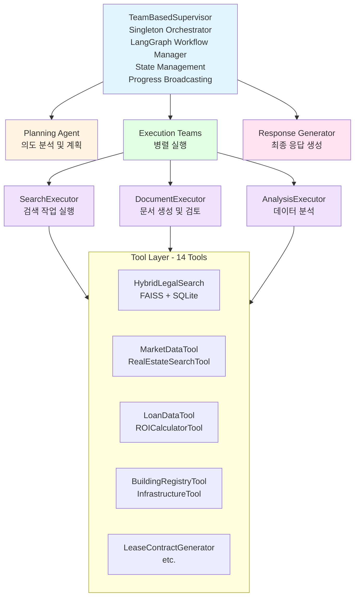
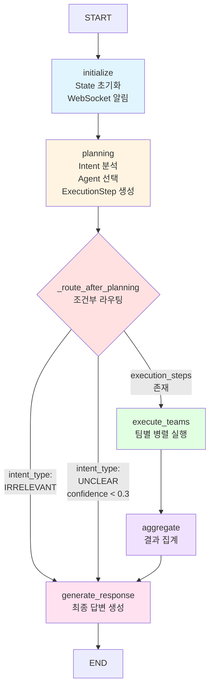
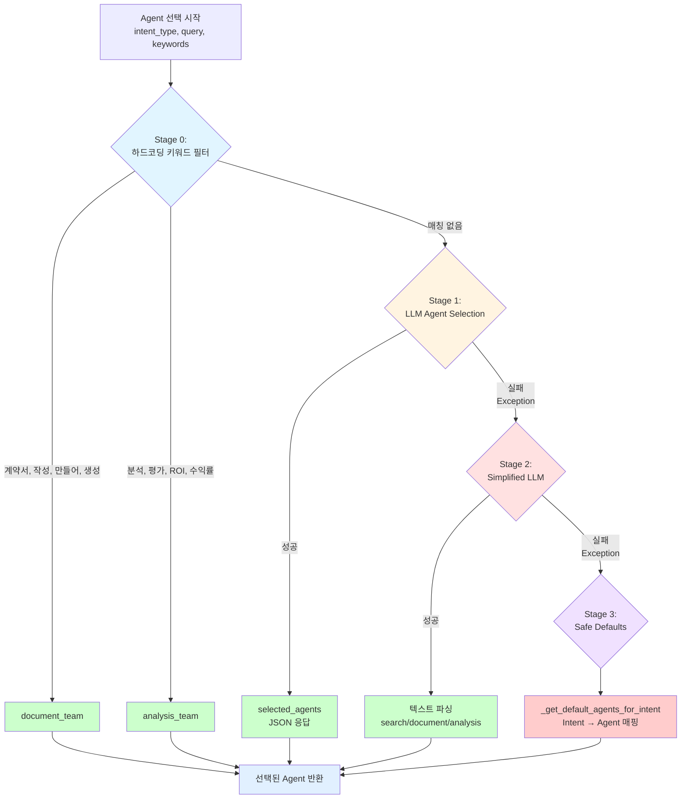
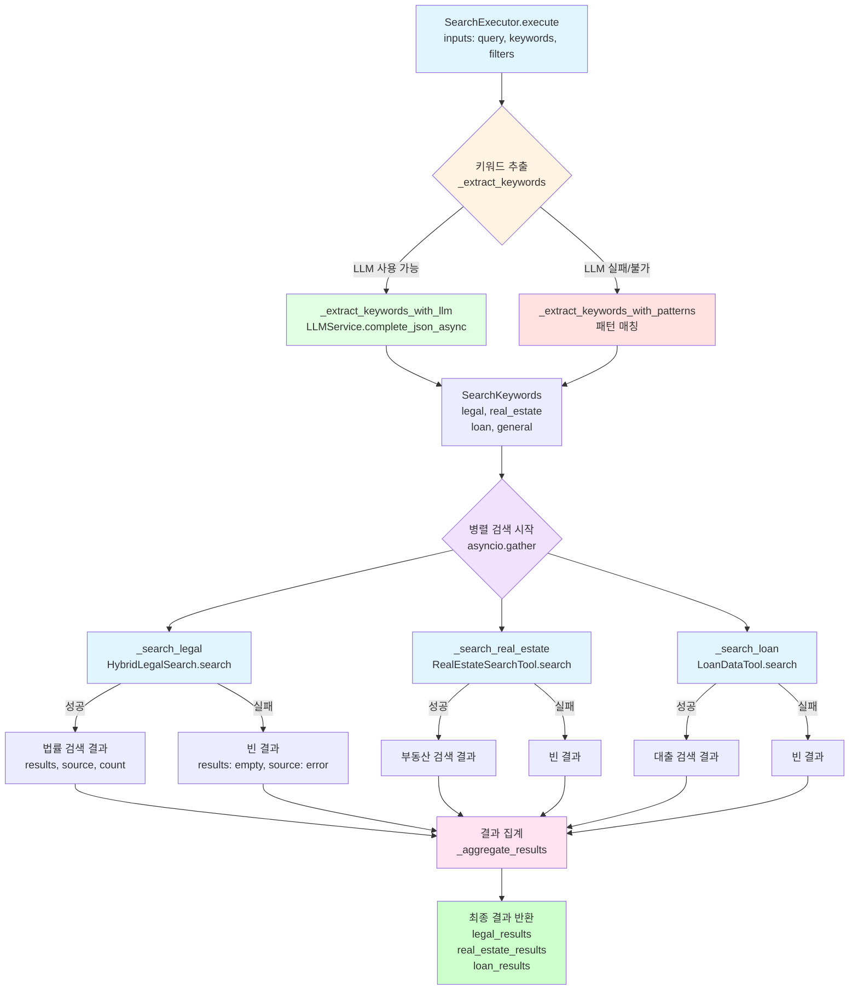
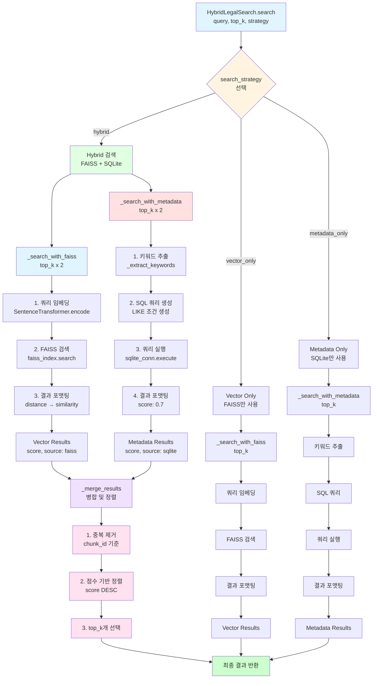

# Service Agent 내부 플로우 상세 분석

**작성일**: 2025-01-30
**문서 유형**: Service Agent Internal Flow Analysis
**목적**: Agent 시스템 내부의 상세한 동작 흐름 및 협업 메커니즘 분석
**분석 대상**: TeamBasedSupervisor, Agents, Executors, Tools의 내부 구조

---

## 📋 목차

1. [개요](#1-개요)
2. [Agent 아키텍처](#2-agent-아키텍처)
3. [Supervisor 워크플로우](#3-supervisor-워크플로우)
4. [Planning Phase 상세](#4-planning-phase-상세)
5. [Agent Selection 메커니즘](#5-agent-selection-메커니즘)
6. [Execution Phase 상세](#6-execution-phase-상세)
7. [SearchExecutor 내부 동작](#7-searchexecutor-내부-동작)
8. [HybridLegalSearch 메커니즘](#8-hybridlegalsearch-메커니즘)
9. [Tool 통합 패턴](#9-tool-통합-패턴)
10. [State 관리 전략](#10-state-관리-전략)
11. [Long-term Memory 시스템](#11-long-term-memory-시스템)
12. [성능 최적화 전략](#12-성능-최적화-전략)

---

## 1. 개요

### 1.1 Service Agent 계층 구조

```
┌─────────────────────────────────────────────────────────────────┐
│                     TeamBasedSupervisor                          │
│  - Singleton Orchestrator                                        │
│  - LangGraph Workflow Manager                                    │
│  - State Management                                              │
│  - Progress Broadcasting                                         │
└────────┬────────────────┬────────────────┬──────────────────────┘
         │                │                │
    ┌────▼────┐      ┌────▼────┐      ┌───▼─────┐
    │Planning │      │Execution│      │Response │
    │ Agent   │      │ Teams   │      │Generator│
    └────┬────┘      └────┬────┘      └────┬────┘
         │                │                 │
         │           ┌────▼────┬────────┬───▼────┐
         │           │ Search  │Document│Analysis│
         │           │Executor │Executor│Executor│
         │           └────┬────┴────┬───┴────┬───┘
         │                │         │        │
    ┌────▼────────────────▼─────────▼────────▼─────┐
    │              Tool Layer (14 Tools)             │
    │  - HybridLegalSearch (FAISS + SQLite)         │
    │  - MarketDataTool, RealEstateSearchTool       │
    │  - LoanDataTool, ROICalculatorTool            │
    │  - BuildingRegistryTool, InfrastructureTool   │
    │  - LeaseContractGenerator, etc.               │
    └────────────────────────────────────────────────┘
```

**Mermaid 다이어그램**:



### 1.2 핵심 컴포넌트

| 컴포넌트 | 파일 | 역할 | 핵심 기능 |
|---------|------|------|-----------|
| **TeamBasedSupervisor** | `team_supervisor.py` | 전체 워크플로우 조정 | LangGraph 그래프 관리, State 관리, Callback 처리 |
| **PlanningAgent** | `planning_agent.py` | 의도 분석 및 계획 수립 | Intent 분석, Agent 선택, ExecutionStep 생성 |
| **SearchExecutor** | `search_executor.py` | 검색 작업 실행 | 키워드 추출, Tool 호출, 결과 집계 |
| **DocumentExecutor** | `document_executor.py` | 문서 생성 및 검토 | HITL 지원, 템플릿 관리, 문서 생성 |
| **AnalysisExecutor** | `analysis_executor.py` | 데이터 분석 | 지표 계산, 인사이트 생성, 리포트 작성 |
| **LLMService** | `llm_service.py` | LLM 호출 통합 관리 | OpenAI 클라이언트 관리, 프롬프트 처리, 에러 핸들링 |
| **PromptManager** | `prompt_manager.py` | 프롬프트 관리 | 프롬프트 로드, 변수 치환 |
| **AgentRegistry** | `agent_registry.py` | Agent 등록 및 관리 | 중앙 집중식 Agent 관리 |
| **DecisionLogger** | `decision_logger.py` | 의사결정 로깅 | SQLite에 결정 과정 저장 |

---

## 2. Agent 아키텍처

### 2.1 Agent Registry 패턴

**파일**: `backend/app/service_agent/foundation/agent_registry.py`

**목적**: 모든 Agent를 중앙에서 관리하여 동적 등록/조회 가능

```python
class AgentRegistry:
    """
    중앙 집중식 Agent 관리
    """
    _agents: Dict[str, AgentAdapter] = {}
    _lock = Lock()

    @classmethod
    def register(cls, name: str, agent: AgentAdapter, capabilities: Dict = None):
        """Agent 등록"""
        with cls._lock:
            if name in cls._agents:
                logger.warning(f"Agent '{name}' already registered, overwriting")

            cls._agents[name] = agent

            if capabilities:
                agent.capabilities = capabilities

            logger.info(f"✅ Agent registered: {name}")

    @classmethod
    def get(cls, name: str) -> Optional[AgentAdapter]:
        """Agent 가져오기"""
        return cls._agents.get(name)

    @classmethod
    def list_agents(cls) -> List[str]:
        """등록된 Agent 목록"""
        return list(cls._agents.keys())

    @classmethod
    def get_capabilities(cls, agent_name: str) -> Optional[Dict]:
        """Agent 능력 정보"""
        agent = cls.get(agent_name)
        return agent.capabilities if agent else None
```

**등록 시점**: `initialize_agent_system()` 호출 시 (Supervisor 초기화)

```python
def initialize_agent_system(auto_register: bool = True):
    """Agent 시스템 초기화"""
    if auto_register:
        # SearchExecutor 등록
        AgentRegistry.register(
            name="search_executor",
            agent=SearchExecutor(),
            capabilities={
                "description": "법률, 시세, 대출, 매물 검색",
                "supported_tasks": [
                    "legal_search",
                    "market_data_search",
                    "property_search",
                    "loan_search"
                ]
            }
        )

        # DocumentExecutor 등록
        AgentRegistry.register(
            name="document_executor",
            agent=DocumentExecutor(),
            capabilities={
                "description": "문서 생성 및 검토",
                "supported_tasks": [
                    "contract_generation",
                    "document_review"
                ]
            }
        )

        # AnalysisExecutor 등록
        AgentRegistry.register(
            name="analysis_executor",
            agent=AnalysisExecutor(),
            capabilities={
                "description": "데이터 분석 및 인사이트",
                "supported_tasks": [
                    "market_analysis",
                    "roi_calculation",
                    "risk_analysis"
                ]
            }
        )
```

### 2.2 Agent Adapter 패턴

**파일**: `backend/app/service_agent/foundation/agent_adapter.py`

**목적**: Agent 인터페이스 표준화

```python
class AgentAdapter:
    """
    Agent 인터페이스 표준화
    모든 Agent는 동일한 execute() 인터페이스 제공
    """

    def __init__(self, agent_instance, capabilities: Dict = None):
        self.agent = agent_instance
        self.capabilities = capabilities or {}

    async def execute(self, inputs: Dict[str, Any]) -> Dict[str, Any]:
        """
        표준화된 실행 인터페이스

        Args:
            inputs: {
                "query": str,
                "keywords": Dict,
                "filters": Dict,
                ...
            }

        Returns:
            {
                "status": "success" | "failure" | "partial",
                "data": Dict,
                "error": Optional[str],
                "metadata": Dict
            }
        """
        try:
            # Agent의 execute 메서드 호출
            result = await self.agent.execute(inputs)

            return {
                "status": "success",
                "data": result,
                "error": None,
                "metadata": {
                    "agent_name": self.capabilities.get("description", "unknown"),
                    "execution_time": result.get("execution_time", 0)
                }
            }
        except Exception as e:
            logger.error(f"Agent execution failed: {e}")
            return {
                "status": "failure",
                "data": {},
                "error": str(e),
                "metadata": {}
            }

    def get_capabilities(self) -> Dict:
        """Agent 능력 정보"""
        return self.capabilities
```

---

## 3. Supervisor 워크플로우

### 3.1 LangGraph 그래프 구성

**파일**: `backend/app/service_agent/supervisor/team_supervisor.py` (라인 99-131)

```python
def _build_graph(self):
    """워크플로우 그래프 구성"""
    workflow = StateGraph(MainSupervisorState)

    # 5개 노드 추가
    workflow.add_node("initialize", self.initialize_node)
    workflow.add_node("planning", self.planning_node)
    workflow.add_node("execute_teams", self.execute_teams_node)
    workflow.add_node("aggregate", self.aggregate_results_node)
    workflow.add_node("generate_response", self.generate_response_node)

    # 엣지 구성
    workflow.add_edge(START, "initialize")
    workflow.add_edge("initialize", "planning")

    # 조건부 라우팅
    workflow.add_conditional_edges(
        "planning",
        self._route_after_planning,
        {
            "execute": "execute_teams",
            "respond": "generate_response"
        }
    )

    workflow.add_edge("execute_teams", "aggregate")
    workflow.add_edge("aggregate", "generate_response")
    workflow.add_edge("generate_response", END)

    # 컴파일
    self.app = workflow.compile()
    logger.info("Team-based workflow graph built successfully")
```

**그래프 시각화**:

```
START
  ↓
┌──────────────────┐
│  initialize      │ ← State 초기화, WebSocket 알림
└────────┬─────────┘
         ↓
┌──────────────────┐
│  planning        │ ← Intent 분석, Agent 선택, ExecutionStep 생성
└────────┬─────────┘
         ↓
    ┌────────┐
    │ router │ ← 조건부 라우팅
    └───┬────┘
        │
   ┌────┴────┬──────────────────────┐
   │         │                      │
   ↓         ↓                      ↓
IRRELEVANT  UNCLEAR              execute
   │         │                      │
   │         │                      ↓
   │         │             ┌────────────────┐
   │         │             │ execute_teams  │ ← 팀별 실행
   │         │             └────────┬───────┘
   │         │                      ↓
   │         │             ┌────────────────┐
   │         │             │   aggregate    │ ← 결과 집계
   │         │             └────────┬───────┘
   │         │                      │
   └─────────┴──────────────────────┘
                    ↓
           ┌────────────────┐
           │generate_response│ ← 최종 답변 생성
           └────────┬───────┘
                    ↓
                   END
```

**Mermaid 다이어그램**:



**노드 구성 코드**:

```python
# 5개 노드 추가
workflow.add_node("initialize", self.initialize_node)
workflow.add_node("planning", self.planning_node)
workflow.add_node("execute_teams", self.execute_teams_node)
workflow.add_node("aggregate", self.aggregate_results_node)
workflow.add_node("generate_response", self.generate_response_node)

# 엣지 구성
workflow.add_edge(START, "initialize")                    # START → initialize
workflow.add_edge("initialize", "planning")                # initialize → planning
workflow.add_conditional_edges("planning", ...)            # planning → router → execute/respond
workflow.add_edge("execute_teams", "aggregate")            # execute_teams → aggregate
workflow.add_edge("aggregate", "generate_response")        # aggregate → generate_response
workflow.add_edge("generate_response", END)                # generate_response → END
```

### 3.2 State 흐름

**MainSupervisorState 구조**:

```python
class MainSupervisorState(TypedDict, total=False):
    # Core fields
    query: str                            # "전세금 5% 인상 가능?"
    session_id: str                       # "session-9b050480..."
    chat_session_id: Optional[str]        # Chat History용
    request_id: str                       # "req-a1b2c3d4"
    user_id: Optional[int]                # 1

    # Planning
    planning_state: Optional[PlanningState]  # Intent 분석 결과
    execution_plan: Optional[List]           # ExecutionStep 목록

    # Team States
    search_team_state: Optional[SearchTeamState]
    document_team_state: Optional[DocumentTeamState]
    analysis_team_state: Optional[AnalysisTeamState]

    # Execution
    current_phase: str                    # "planning" | "executing" | "aggregating" | "generating"
    active_teams: List[str]               # ["search", "analysis"]
    completed_teams: List[str]            # ["search"]
    failed_teams: List[str]               # []

    # Results
    team_results: Dict[str, Any]          # {"search": {...}, "analysis": {...}}
    aggregated_results: Dict[str, Any]    # 집계된 결과
    final_response: Optional[Dict]        # 최종 답변

    # Memory
    loaded_memories: Optional[List[Dict]]      # Long-term Memory
    tiered_memories: Optional[Dict]            # 3-Tier Memory
    user_preferences: Optional[Dict]           # 사용자 선호도

    # Data Reuse
    reuse_intent: bool                    # LLM이 판단한 재사용 의도
    data_reused: bool                     # 실제 재사용 여부
    reused_from_index: Optional[int]      # 몇 번째 메시지에서 재사용

    # Timing
    start_time: datetime
    end_time: Optional[datetime]
    status: str                           # "initialized" | "processing" | "completed" | "error"
    error_log: List[str]
```

**State 업데이트 패턴**:

```python
# 각 노드에서 State 수정 후 반환
async def some_node(self, state: MainSupervisorState) -> MainSupervisorState:
    # State 읽기
    query = state["query"]
    session_id = state["session_id"]

    # State 수정
    state["current_phase"] = "processing"
    state["active_teams"] = ["search"]

    # 수정된 State 반환 (다음 노드로 전달)
    return state
```

---

## 4. Planning Phase 상세

### 4.1 planning_node 전체 흐름

**파일**: `backend/app/service_agent/supervisor/team_supervisor.py` (라인 240-560)

```python
async def planning_node(self, state: MainSupervisorState) -> MainSupervisorState:
    """
    계획 수립 노드
    """
    logger.info("[TeamSupervisor] Planning phase")

    state["current_phase"] = "planning"

    # 1. WebSocket 알림
    await self._send_progress("supervisor_phase_change", {
        "supervisorPhase": "analyzing",
        "supervisorProgress": 10,
        "message": "질문을 분석하고 계획을 수립하고 있습니다"
    })

    # 2. Chat History 조회
    chat_history = await self._get_chat_history(
        session_id=state.get("chat_session_id"),
        limit=3
    )

    # 3. Context 생성
    context = {"chat_history": chat_history} if chat_history else None

    # 4. Intent 분석
    intent_result = await self.planning_agent.analyze_intent(
        query=state["query"],
        context=context
    )

    # 5. 데이터 재사용 로직
    reuse_intent = intent_result.entities.get("reuse_previous_data", False)
    state["reuse_intent"] = reuse_intent

    if reuse_intent and chat_history:
        # 재사용 가능한 데이터 확인
        has_search_data = self._check_reusable_data(chat_history)

        if has_search_data:
            state["data_reused"] = True
            # search_team을 suggested_agents에서 제거
            intent_result.suggested_agents = [
                agent for agent in intent_result.suggested_agents
                if agent != "search_team"
            ]
            logger.info("✅ Data reused, search_team removed")

    # 6. Long-term Memory 로딩
    if state.get("user_id"):
        await self._load_longterm_memory(state)

    # 7. ExecutionStep 생성
    execution_steps = await self._create_execution_steps(
        intent_result=intent_result,
        query=state["query"]
    )

    # 8. PlanningState 저장
    state["planning_state"] = {
        "raw_query": state["query"],
        "analyzed_intent": intent_result.to_dict(),
        "execution_steps": execution_steps,
        "execution_strategy": "sequential",  # or "parallel"
        "estimated_total_time": self._estimate_time(execution_steps)
    }

    # 9. active_teams 설정
    state["active_teams"] = [
        step["team"] for step in execution_steps
    ]

    # 10. WebSocket 알림: plan_ready
    await self._send_progress("plan_ready", {
        "intent": intent_result.intent_type.value,
        "execution_steps": execution_steps,
        "estimated_total_time": state["planning_state"]["estimated_total_time"]
    })

    return state
```

### 4.2 Chat History 조회

**_get_chat_history() 메서드**:

```python
async def _get_chat_history(self, session_id: str, limit: int = 3):
    """
    Chat History 조회

    Args:
        session_id: Chat Session ID
        limit: 최근 N개 대화 쌍 (default: 3)

    Returns:
        List[Dict]: [
            {"role": "user", "content": "...", "timestamp": "..."},
            {"role": "assistant", "content": "...", "timestamp": "..."},
            ...
        ]
    """
    if not session_id:
        return []

    async for db in get_async_db():
        try:
            # 최근 메시지 조회 (limit * 2 = user + assistant 쌍)
            query = (
                select(ChatMessage)
                .where(ChatMessage.session_id == session_id)
                .order_by(desc(ChatMessage.created_at))
                .limit(limit * 2)
            )
            result = await db.execute(query)
            messages = result.scalars().all()

            # 시간순 정렬 (오래된 것부터)
            return [
                {
                    "role": msg.role,
                    "content": msg.content,
                    "timestamp": msg.created_at.isoformat(),
                    "structured_data": msg.structured_data
                }
                for msg in reversed(messages)
            ]
        except Exception as e:
            logger.error(f"Failed to get chat history: {e}")
            return []
        finally:
            break
```

**SQL 쿼리**:

```sql
SELECT *
FROM chat_messages
WHERE session_id = 'session-9b050480...'
ORDER BY created_at DESC
LIMIT 6  -- limit * 2 (3쌍)
```

**반환 예시**:

```python
[
    {"role": "user", "content": "전세 계약이란?", "timestamp": "2025-01-30T09:55:00Z"},
    {"role": "assistant", "content": "전세 계약은...", "timestamp": "2025-01-30T09:55:05Z"},
    {"role": "user", "content": "전세금 인상 한도는?", "timestamp": "2025-01-30T09:56:00Z"},
    {"role": "assistant", "content": "5% 이내입니다.", "timestamp": "2025-01-30T09:56:04Z"},
    {"role": "user", "content": "전세금 5% 인상 가능?", "timestamp": "2025-01-30T10:00:00Z"}
]
```

### 4.3 Intent 분석 (PlanningAgent)

**파일**: `backend/app/service_agent/cognitive_agents/planning_agent.py` (라인 186-283)

```python
async def analyze_intent(self, query: str, context: Optional[Dict] = None) -> IntentResult:
    """
    사용자 의도 분석

    Returns:
        IntentResult: {
            intent_type: IntentType,
            confidence: float,
            keywords: List[str],
            reasoning: str,
            entities: Dict[str, Any],
            suggested_agents: List[str],
            fallback: bool
        }
    """
    logger.info(f"Analyzing intent for query: {query[:100]}...")

    # LLM 기반 분석 시도
    if self.llm_service:
        try:
            return await self._analyze_with_llm(query, context)
        except Exception as e:
            logger.warning(f"LLM analysis failed, falling back to pattern matching: {e}")

    # Fallback: 패턴 매칭
    return self._analyze_with_patterns(query, context)
```

#### 4.3.1 LLM 기반 분석

```python
async def _analyze_with_llm(self, query: str, context: Optional[Dict]) -> IntentResult:
    """LLM을 사용한 의도 분석"""
    try:
        # Chat history 포맷팅
        chat_history = context.get("chat_history", []) if context else []
        chat_history_text = ""
        if chat_history:
            formatted_history = []
            for msg in chat_history:
                role = msg.get("role", "unknown")
                content = msg.get("content", "")
                if role == "user":
                    formatted_history.append(f"사용자: {content}")
                elif role == "assistant":
                    formatted_history.append(f"AI: {content}")

            chat_history_text = "\n".join(formatted_history)

        # LLMService를 통한 의도 분석
        result = await self.llm_service.complete_json_async(
            prompt_name="intent_analysis",
            variables={
                "query": query,
                "chat_history": chat_history_text
            },
            temperature=0.0,  # Deterministic
            max_tokens=500
        )

        logger.info(f"LLM Intent Analysis Result: {json.dumps(result, ensure_ascii=False)}")

        # Intent 타입 파싱
        intent_str = result.get("intent", "UNCLEAR").upper()
        try:
            intent_type = IntentType[intent_str]
        except KeyError:
            logger.warning(f"Unknown intent type: {intent_str}, using UNCLEAR")
            intent_type = IntentType.UNCLEAR

        # Agent 선택 (IRRELEVANT/UNCLEAR은 생략)
        if intent_type in [IntentType.IRRELEVANT, IntentType.UNCLEAR]:
            suggested_agents = []
        else:
            suggested_agents = await self._suggest_agents(
                intent_type=intent_type,
                query=query,
                keywords=result.get("keywords", [])
            )

        # reuse_previous_data를 entities에 추가
        entities = result.get("entities", {})
        reuse_previous_data = result.get("reuse_previous_data", False)
        if reuse_previous_data:
            entities["reuse_previous_data"] = reuse_previous_data

        return IntentResult(
            intent_type=intent_type,
            confidence=result.get("confidence", 0.5),
            keywords=result.get("keywords", []),
            reasoning=result.get("reasoning", ""),
            entities=entities,
            suggested_agents=suggested_agents,
            fallback=False
        )

    except Exception as e:
        logger.error(f"LLM intent analysis failed: {e}")
        raise
```

**Prompt 예시** (`prompts/cognitive/intent_analysis.txt`):

```
당신은 부동산 상담 전문가입니다.
사용자의 질문을 분석하여 의도를 파악하세요.

질문: {{query}}

대화 히스토리:
{{chat_history}}

다음 중 하나의 의도로 분류하세요:
- TERM_DEFINITION: 용어 설명
- LEGAL_INQUIRY: 법률 해석
- LOAN_SEARCH: 대출 상품 검색
- PROPERTY_SEARCH: 매물 검색
- CONTRACT_CREATION: 계약서 생성
- MARKET_INQUIRY: 시세 트렌드 분석
- COMPREHENSIVE: 종합 분석
- IRRELEVANT: 무관한 질문
- UNCLEAR: 불분명한 질문

JSON 형식으로 답변하세요:
{
  "intent": "LEGAL_INQUIRY",
  "confidence": 0.95,
  "keywords": ["전세금", "인상", "5%"],
  "reasoning": "사용자가 전세금 인상 한도에 대해 질문하고 있습니다. 이는 주택임대차보호법과 관련된 법률 질문입니다.",
  "entities": {
    "rate": "5%",
    "topic": "전세금 인상"
  },
  "reuse_previous_data": false
}
```

**LLM 응답 예시**:

```json
{
  "intent": "LEGAL_INQUIRY",
  "confidence": 0.95,
  "keywords": ["전세금", "인상", "5%"],
  "reasoning": "사용자가 전세금 인상 한도에 대해 질문하고 있습니다.",
  "entities": {
    "rate": "5%"
  },
  "reuse_previous_data": false
}
```

#### 4.3.2 패턴 매칭 기반 분석 (Fallback)

```python
def _analyze_with_patterns(self, query: str, context: Optional[Dict]) -> IntentResult:
    """패턴 매칭 기반 의도 분석 (Fallback)"""
    detected_intents = {}
    found_keywords = []

    # 각 의도 타입별 점수 계산
    for intent_type, patterns in self.intent_patterns.items():
        score = 0
        for pattern in patterns:
            if pattern in query.lower():
                score += 1
                found_keywords.append(pattern)
        if score > 0:
            detected_intents[intent_type] = score

    # 가장 높은 점수의 의도 선택
    if detected_intents:
        best_intent = max(detected_intents.items(), key=lambda x: x[1])
        intent_type = best_intent[0]
        confidence = min(best_intent[1] * 0.3, 1.0)  # 점수 * 0.3
    else:
        intent_type = IntentType.UNCLEAR
        confidence = 0.0

    # Agent 선택 (간단한 매핑)
    intent_to_agent = {
        IntentType.LEGAL_INQUIRY: ["search_team"],
        IntentType.MARKET_INQUIRY: ["search_team"],
        IntentType.LOAN_SEARCH: ["search_team"],
        IntentType.CONTRACT_CREATION: ["document_team"],
        IntentType.COMPREHENSIVE: ["search_team", "analysis_team"],
        # ...
    }
    suggested_agents = intent_to_agent.get(intent_type, ["search_team"])

    return IntentResult(
        intent_type=intent_type,
        confidence=confidence,
        keywords=found_keywords,
        reasoning="Pattern-based analysis",
        entities={},
        suggested_agents=suggested_agents,
        fallback=True
    )
```

**intent_patterns 딕셔너리**:

```python
self.intent_patterns = {
    IntentType.LEGAL_INQUIRY: [
        "법", "전세", "임대", "보증금", "계약", "권리", "의무", "갱신",
        "가능한가요", "살다", "거주", "세입자", "집주인", "확정일자"
    ],
    IntentType.MARKET_INQUIRY: [
        "시세", "추이", "트렌드", "거래 동향", "올랐나요", "떨어졌나요",
        "변화", "상승", "하락"
    ],
    IntentType.LOAN_SEARCH: [
        "대출", "상품", "찾다", "주택담보대출", "전세자금대출",
        "신생아 특례", "청년", "은행"
    ],
    # ...
}
```

---

## 5. Agent Selection 메커니즘

### 5.1 4단계 폴백 전략

**파일**: `backend/app/service_agent/cognitive_agents/planning_agent.py` (라인 550-750)

```python
async def _suggest_agents(
    self,
    intent_type: IntentType,
    query: str,
    keywords: List[str]
) -> List[str]:
    """
    Agent 선택 (4단계 폴백)

    1. 하드코딩 키워드 필터
    2. LLM Agent 선택
    3. Simplified LLM
    4. Safe Defaults
    """

    # === 0단계: 하드코딩 키워드 필터 ===
    if any(kw in query for kw in ["계약서", "작성", "만들어", "생성"]):
        logger.info("🎯 Hardcoded filter: document_team")
        return ["document_team"]

    if any(kw in query for kw in ["분석", "평가", "ROI", "수익률"]):
        logger.info("🎯 Hardcoded filter: analysis_team")
        return ["analysis_team"]

    # === 1단계: LLM Agent 선택 ===
    try:
        result = await self.llm_service.complete_json_async(
            prompt_name="agent_selection",
            variables={
                "query": query,
                "intent": intent_type.value,
                "keywords": ", ".join(keywords)
            },
            temperature=0.1,
            max_tokens=300
        )

        selected_agents = result.get("selected_agents", [])
        if selected_agents:
            logger.info(f"✅ LLM Agent Selection: {selected_agents}")
            return selected_agents
    except Exception as e:
        logger.warning(f"LLM Agent Selection failed: {e}")

    # === 2단계: Simplified LLM ===
    try:
        simplified_prompt = f"""
        질문: {query}
        의도: {intent_type.value}

        어떤 Agent가 필요한가요? (search_team, document_team, analysis_team 중 선택)
        응답: search_team
        """

        result_text = await self.llm_service.complete_async(
            prompt_name="simple_agent_selection",
            variables={"query": query, "intent": intent_type.value},
            temperature=0.0,
            max_tokens=50
        )

        # 텍스트 파싱
        agents = []
        if "search" in result_text.lower():
            agents.append("search_team")
        if "document" in result_text.lower():
            agents.append("document_team")
        if "analysis" in result_text.lower():
            agents.append("analysis_team")

        if agents:
            logger.info(f"✅ Simplified LLM Selection: {agents}")
            return agents
    except Exception as e:
        logger.warning(f"Simplified LLM failed: {e}")

    # === 3단계: Safe Defaults ===
    logger.warning(f"⚠️  All agent selection methods failed, using safe defaults")
    return self._get_default_agents_for_intent(intent_type)


def _get_default_agents_for_intent(self, intent_type: IntentType) -> List[str]:
    """Intent → Agent 기본 매핑"""
    mapping = {
        IntentType.TERM_DEFINITION: ["search_team"],
        IntentType.LEGAL_INQUIRY: ["search_team"],
        IntentType.LOAN_SEARCH: ["search_team"],
        IntentType.LOAN_COMPARISON: ["search_team"],
        IntentType.BUILDING_REGISTRY: ["search_team"],
        IntentType.PROPERTY_INFRA_ANALYSIS: ["search_team"],
        IntentType.PRICE_EVALUATION: ["analysis_team"],
        IntentType.PROPERTY_SEARCH: ["search_team"],
        IntentType.PROPERTY_RECOMMENDATION: ["search_team", "analysis_team"],
        IntentType.ROI_CALCULATION: ["analysis_team"],
        IntentType.POLICY_INQUIRY: ["search_team"],
        IntentType.CONTRACT_CREATION: ["document_team"],
        IntentType.MARKET_INQUIRY: ["search_team", "analysis_team"],
        IntentType.COMPREHENSIVE: ["search_team", "analysis_team"],
        IntentType.IRRELEVANT: [],
        IntentType.UNCLEAR: ["search_team"],
        IntentType.ERROR: []
    }

    return mapping.get(intent_type, ["search_team"])
```

**Mermaid 다이어그램**:



**4단계 전략 요약**:

| 단계 | 방법 | Temperature | 성공 조건 | 실패 시 |
|------|------|------------|----------|---------|
| **Stage 0** | 하드코딩 키워드 필터 | N/A | 키워드 매칭 | → Stage 1 |
| **Stage 1** | LLM Agent Selection<br/>`complete_json_async()` | 0.1 | JSON 파싱 성공<br/>`selected_agents` 존재 | → Stage 2 |
| **Stage 2** | Simplified LLM<br/>`complete_async()` | 0.0 | 텍스트 파싱 성공<br/>Agent 키워드 발견 | → Stage 3 |
| **Stage 3** | Safe Defaults<br/>`_get_default_agents_for_intent()` | N/A | 항상 성공 | - |

**폴백 전략의 장점**:
- ✅ **빠른 응답**: Stage 0에서 즉시 매칭 시 LLM 호출 불필요
- ✅ **높은 정확도**: Stage 1 LLM 선택이 가장 정확
- ✅ **강력한 fallback**: LLM 실패 시에도 안전한 기본값 제공
- ✅ **에러 복원력**: 각 단계에서 Exception 처리

### 5.2 Agent Selection Prompt

**파일**: `prompts/cognitive/agent_selection.txt`

```
당신은 Agent 선택 전문가입니다.
사용자의 질문과 의도를 분석하여 적절한 Agent를 선택하세요.

질문: {{query}}
의도: {{intent}}
키워드: {{keywords}}

사용 가능한 Agent:
1. search_team: 법률, 시세, 대출, 매물 검색
   - 법률 정보 검색
   - 부동산 시세 조회
   - 대출 상품 정보
   - 매물 검색

2. document_team: 문서 생성 및 검토
   - 임대차 계약서 생성
   - 매매 계약서 생성
   - 계약서 검토

3. analysis_team: 데이터 분석 및 인사이트
   - 시장 분석
   - 투자 수익률 계산
   - 가격 평가
   - 리스크 분석

JSON 형식으로 답변하세요:
{
  "selected_agents": ["search_team"],
  "reasoning": "사용자가 법률 정보를 요청하고 있으므로 search_team이 적합합니다."
}
```

---

## 6. Execution Phase 상세

### 6.1 execute_teams_node

**파일**: `backend/app/service_agent/supervisor/team_supervisor.py` (라인 870-1257)

```python
async def execute_teams_node(self, state: MainSupervisorState) -> MainSupervisorState:
    """
    팀별 실행 노드
    """
    logger.info("[TeamSupervisor] Executing teams")

    state["current_phase"] = "executing"
    active_teams = state.get("active_teams", [])

    if not active_teams:
        logger.warning("No active teams to execute")
        return state

    # WebSocket 알림
    await self._send_progress("supervisor_phase_change", {
        "supervisorPhase": "executing",
        "supervisorProgress": 20,
        "message": "작업을 실행하고 있습니다"
    })

    # 팀별 실행
    team_results = {}

    for team_name in active_teams:
        logger.info(f"[TeamSupervisor] Executing team: {team_name}")

        # 팀 State 생성
        team_state = self._create_team_state(team_name, state)

        # 팀 Executor 가져오기
        executor = self.teams.get(team_name)

        if not executor:
            logger.error(f"Executor not found for team: {team_name}")
            state["failed_teams"].append(team_name)
            continue

        try:
            # Progress Callback 설정
            executor.progress_callback = self._progress_callbacks.get(state["session_id"])

            # 팀 실행
            result = await executor.execute(team_state)

            # 결과 저장
            team_results[team_name] = result
            state["completed_teams"].append(team_name)

            logger.info(f"✅ Team '{team_name}' completed successfully")

        except Exception as e:
            logger.error(f"❌ Team '{team_name}' execution failed: {e}")
            state["failed_teams"].append(team_name)
            state["error_log"].append(f"Team {team_name}: {str(e)}")

    # 결과 State에 저장
    state["team_results"] = team_results

    return state
```

### 6.2 팀별 실행 예시

#### SearchExecutor 실행

```python
# SearchExecutor.execute()
async def execute(self, team_state: SearchTeamState) -> Dict[str, Any]:
    """
    검색 팀 실행

    Returns:
        {
            "legal_results": [...],
            "real_estate_results": [...],
            "loan_results": [...],
            "total_results": 15,
            "search_time": 1.2,
            "sources_used": ["FAISS", "SQLite", "PostgreSQL"]
        }
    """
    logger.info("[SearchTeam] Executing search")

    # Step 1: 키워드 추출
    keywords = self._extract_keywords(team_state["shared_context"]["query"])

    # Step 2: 검색 범위 결정
    search_scope = self._determine_search_scope(keywords)

    # Step 3: 병렬 검색 실행
    tasks = []

    if "legal" in search_scope:
        tasks.append(self._search_legal(keywords["legal"]))

    if "real_estate" in search_scope:
        tasks.append(self._search_real_estate(keywords["real_estate"]))

    if "loan" in search_scope:
        tasks.append(self._search_loan(keywords["loan"]))

    # 병렬 실행
    results = await asyncio.gather(*tasks, return_exceptions=True)

    # 결과 집계
    aggregated = self._aggregate_results(results)

    return aggregated
```

---

## 7. SearchExecutor 내부 동작

### 7.1 키워드 추출

**파일**: `backend/app/service_agent/execution_agents/search_executor.py` (라인 229-298)

```python
def _extract_keywords(self, query: str) -> SearchKeywords:
    """쿼리에서 키워드 추출"""
    if self.llm_service:
        try:
            return self._extract_keywords_with_llm(query)
        except:
            pass

    # Fallback: 패턴 매칭
    return self._extract_keywords_with_patterns(query)


def _extract_keywords_with_patterns(self, query: str) -> SearchKeywords:
    """패턴 매칭 기반 키워드 추출"""
    legal_keywords = []
    real_estate_keywords = []
    loan_keywords = []
    general_keywords = []

    # 법률 관련
    legal_terms = ["법", "전세", "임대", "계약", "보증금"]
    for term in legal_terms:
        if term in query:
            legal_keywords.append(term)

    # 부동산 관련
    estate_terms = ["아파트", "빌라", "시세", "매매", "가격"]
    for term in estate_terms:
        if term in query:
            real_estate_keywords.append(term)

    # 대출 관련
    loan_terms = ["대출", "금리", "한도", "LTV"]
    for term in loan_terms:
        if term in query:
            loan_keywords.append(term)

    # 숫자 추출
    import re
    numbers = re.findall(r'\d+[%억만원평]?', query)
    general_keywords.extend(numbers)

    return SearchKeywords(
        legal=legal_keywords,
        real_estate=real_estate_keywords,
        loan=loan_keywords,
        general=general_keywords
    )
```

### 7.2 검색 실행

```python
async def _search_legal(self, keywords: List[str]) -> Dict:
    """법률 정보 검색"""
    if not self.legal_search_tool:
        return {"results": [], "source": "none"}

    try:
        # HybridLegalSearch 호출
        results = await self.legal_search_tool.search(
            query=" ".join(keywords),
            top_k=5
        )

        return {
            "results": results,
            "source": "HybridLegalSearch",
            "count": len(results)
        }
    except Exception as e:
        logger.error(f"Legal search failed: {e}")
        return {"results": [], "source": "error"}
```

**Mermaid 다이어그램**:



**SearchExecutor 핵심 특징**:

1. **2단계 키워드 추출**:
   - LLM 우선: `complete_json_async()`로 구조화된 키워드 추출
   - Fallback: 패턴 매칭으로 법률/부동산/대출 키워드 추출

2. **병렬 검색 실행**:
   ```python
   results = await asyncio.gather(
       self._search_legal(keywords.legal),
       self._search_real_estate(keywords.real_estate),
       self._search_loan(keywords.loan)
   )
   ```

3. **에러 복원력**:
   - 각 검색 실패 시 빈 결과 반환
   - 부분 성공으로 계속 진행

---

## 8. HybridLegalSearch 메커니즘

### 8.1 Hybrid 검색 전략

**파일**: `backend/app/service_agent/tools/hybrid_legal_search.py`

```python
class HybridLegalSearch:
    """
    하이브리드 법률 검색 시스템
    SQLite (메타데이터) + FAISS (벡터 검색)
    """

    def __init__(self):
        self._init_sqlite()   # SQLite DB 연결
        self._init_faiss()    # FAISS Index 로드
        self._init_embedding_model()  # SentenceTransformer 로드

    async def search(
        self,
        query: str,
        top_k: int = 5,
        search_strategy: str = "hybrid"
    ) -> List[Dict]:
        """
        하이브리드 검색

        Args:
            query: 검색 쿼리
            top_k: 반환할 결과 개수
            search_strategy: "hybrid" | "vector_only" | "metadata_only"

        Returns:
            [
                {
                    "law_name": "주택임대차보호법",
                    "article": "제7조",
                    "content": "임대료 증액은 5% 이내...",
                    "score": 0.95,
                    "source": "hybrid"
                },
                ...
            ]
        """

        if search_strategy == "hybrid":
            # 1. FAISS 벡터 검색
            vector_results = await self._search_with_faiss(query, top_k=top_k*2)

            # 2. SQLite 키워드 검색
            metadata_results = await self._search_with_metadata(query, top_k=top_k*2)

            # 3. 결과 병합
            merged = self._merge_results(vector_results, metadata_results, top_k=top_k)

            return merged

        elif search_strategy == "vector_only":
            return await self._search_with_faiss(query, top_k=top_k)

        else:  # metadata_only
            return await self._search_with_metadata(query, top_k=top_k)
```

### 8.2 FAISS 벡터 검색

```python
async def _search_with_faiss(self, query: str, top_k: int) -> List[Dict]:
    """FAISS 벡터 검색"""

    # 1. 쿼리 임베딩
    query_embedding = self.embedding_model.encode(
        query,
        convert_to_numpy=True
    ).astype('float32').reshape(1, -1)

    # 2. FAISS 검색
    distances, indices = self.faiss_index.search(
        query_embedding,
        top_k
    )

    # 3. 결과 포맷팅
    results = []
    for i, idx in enumerate(indices[0]):
        if idx == -1:  # 결과 없음
            continue

        metadata = self.faiss_metadata[idx]
        score = 1 / (1 + distances[0][i])  # Distance → Similarity

        results.append({
            "chunk_id": metadata["chunk_id"],
            "law_name": metadata["law_name"],
            "article": metadata["article"],
            "content": metadata["content"],
            "score": float(score),
            "source": "faiss"
        })

    return results
```

### 8.3 SQLite 메타데이터 검색

```python
async def _search_with_metadata(self, query: str, top_k: int) -> List[Dict]:
    """SQLite 키워드 검색"""

    # 키워드 추출
    keywords = self._extract_keywords(query)

    # SQL 쿼리 생성
    where_clauses = []
    params = []

    for keyword in keywords:
        where_clauses.append("(laws.title LIKE ? OR articles.content LIKE ?)")
        params.extend([f"%{keyword}%", f"%{keyword}%"])

    if not where_clauses:
        return []

    sql = f"""
    SELECT
        laws.title as law_name,
        articles.article_number as article,
        articles.content,
        articles.chunk_id
    FROM articles
    JOIN laws ON articles.law_id = laws.id
    WHERE {" OR ".join(where_clauses)}
    AND articles.is_deleted = 0
    LIMIT ?
    """
    params.append(top_k)

    # 쿼리 실행
    cursor = self.sqlite_conn.cursor()
    cursor.execute(sql, params)
    rows = cursor.fetchall()

    # 결과 포맷팅
    results = []
    for row in rows:
        results.append({
            "chunk_id": row["chunk_id"],
            "law_name": row["law_name"],
            "article": row["article"],
            "content": row["content"],
            "score": 0.7,  # 기본 점수
            "source": "sqlite"
        })

    return results
```

### 8.4 결과 병합

```python
def _merge_results(
    self,
    vector_results: List[Dict],
    metadata_results: List[Dict],
    top_k: int
) -> List[Dict]:
    """결과 병합 (중복 제거, 점수 기반 정렬)"""

    # 1. chunk_id 기준 중복 제거
    seen = set()
    merged = []

    for result in vector_results + metadata_results:
        chunk_id = result["chunk_id"]
        if chunk_id in seen:
            continue

        seen.add(chunk_id)
        merged.append(result)

    # 2. 점수 기반 정렬
    merged.sort(key=lambda x: x["score"], reverse=True)

    # 3. top_k개만 반환
    return merged[:top_k]
```

**Mermaid 다이어그램**:



**HybridLegalSearch 핵심 메커니즘**:

1. **3가지 검색 전략**:
   - `hybrid`: FAISS 벡터 검색 + SQLite 키워드 검색 → 병합
   - `vector_only`: FAISS 의미 기반 검색만 사용
   - `metadata_only`: SQLite 키워드 검색만 사용

2. **FAISS 벡터 검색**:
   ```python
   query_embedding = embedding_model.encode(query)  # 768차원 벡터
   distances, indices = faiss_index.search(query_embedding, top_k)
   similarity = 1 / (1 + distance)  # Distance → Similarity 변환
   ```

3. **SQLite 키워드 검색**:
   ```sql
   SELECT laws.title, articles.content
   FROM articles JOIN laws
   WHERE laws.title LIKE '%전세%' OR articles.content LIKE '%전세%'
   LIMIT top_k
   ```

4. **결과 병합 알고리즘**:
   - Step 1: `chunk_id` 기준 중복 제거
   - Step 2: `score` 기준 내림차순 정렬
   - Step 3: `top_k`개만 선택

5. **장점**:
   - ✅ **의미 기반 검색**: FAISS가 유사 의미의 법률 조항 검색
   - ✅ **키워드 매칭**: SQLite가 정확한 용어 포함 조항 검색
   - ✅ **상호 보완**: 두 방법의 장점을 결합하여 정확도 향상

---

## 9. Tool 통합 패턴

### 9.1 Tool 인터페이스 표준화

모든 Tool은 다음 인터페이스를 구현:

```python
class BaseTool:
    """Tool 기본 클래스"""

    async def execute(self, inputs: Dict[str, Any]) -> Dict[str, Any]:
        """
        Tool 실행

        Args:
            inputs: Tool별 입력 파라미터

        Returns:
            {
                "status": "success" | "failure",
                "data": Any,
                "error": Optional[str],
                "execution_time": float
            }
        """
        raise NotImplementedError
```

### 9.2 Tool 등록 및 초기화

**SearchExecutor에서 Tool 초기화**:

```python
class SearchExecutor:
    def __init__(self, llm_context=None, progress_callback=None):
        # Tool 초기화
        try:
            from app.service_agent.tools.legal_search_tool import LegalSearch
            self.legal_search_tool = LegalSearch()
        except:
            try:
                from app.service_agent.tools.hybrid_legal_search import HybridLegalSearch
                self.legal_search_tool = HybridLegalSearch()
            except:
                self.legal_search_tool = None

        try:
            from app.service_agent.tools.market_data_tool import MarketDataTool
            self.market_data_tool = MarketDataTool()
        except:
            self.market_data_tool = None

        # ... 기타 Tool 초기화
```

---

## 10. State 관리 전략

### 10.1 State 영속화 (Checkpointing)

**PostgreSQL 기반 Checkpointer**:

```python
async def _ensure_checkpointer(self):
    """PostgreSQL Checkpointer 초기화"""
    if not self._checkpointer_initialized:
        self.checkpointer = await create_checkpointer(
            settings.POSTGRES_POOL_STRING
        )
        self._checkpointer_initialized = True
        logger.info("PostgreSQL Checkpointer initialized")
```

**Checkpoint 저장 시점**:
- 각 LangGraph 노드 실행 후 자동 저장
- `thread_id` (chat_session_id)로 대화별 State 관리

**Checkpoint 활용**:
- 에러 발생 시 마지막 Checkpoint에서 재개
- HITL (Human-in-the-Loop) 중단/재개
- 대화 히스토리 관리

### 10.2 State 분리 전략

```
MainSupervisorState (전체 State)
├─ Shared Fields (query, session_id, user_id, ...)
├─ PlanningState (Intent 분석 결과)
├─ SearchTeamState (검색 팀 전용 State)
├─ DocumentTeamState (문서 팀 전용 State)
└─ AnalysisTeamState (분석 팀 전용 State)
```

**장점**:
- State pollution 방지
- 팀별 독립적인 State 관리
- 명확한 데이터 흐름

---

## 11. Long-term Memory 시스템

### 11.1 3-Tier Memory 구조

**파일**: `backend/app/service_agent/supervisor/team_supervisor.py` (라인 411-439)

```python
# 3-Tier Hybrid Memory 로드
tiered_memories = await memory_service.load_tiered_memories(
    user_id=user_id,
    current_session_id=chat_session_id
)

# 구조:
# {
#   "shortterm": [최근 1-5번째 세션 메시지],    # 1-5 sessions
#   "midterm": [6-10번째 세션 메시지],          # 6-10 sessions
#   "longterm": [11-20번째 세션 요약]          # 11-20 sessions (summarized)
# }

state["tiered_memories"] = tiered_memories
```

### 11.2 Memory 활용

**LLM 프롬프트에 Memory 추가**:

```python
# Intent 분석 시
variables = {
    "query": query,
    "chat_history": chat_history_text,
    "user_memories": tiered_memories.get("shortterm", [])
}

# 답변 생성 시
variables = {
    "query": query,
    "search_results": aggregated_results,
    "chat_history": chat_history,
    "user_preferences": state.get("user_preferences", {}),
    "relevant_memories": tiered_memories.get("midterm", [])
}
```

---

## 12. 성능 최적화 전략

### 12.1 병렬 실행

```python
# 독립적인 검색 작업 병렬 실행
tasks = []
if "legal" in search_scope:
    tasks.append(self._search_legal(keywords["legal"]))
if "real_estate" in search_scope:
    tasks.append(self._search_real_estate(keywords["real_estate"]))
if "loan" in search_scope:
    tasks.append(self._search_loan(keywords["loan"]))

# 병렬 실행 (asyncio.gather)
results = await asyncio.gather(*tasks, return_exceptions=True)
```

### 12.2 조기 종료 (Early Exit)

```python
# IRRELEVANT/UNCLEAR 질문은 Agent 선택 생략
if intent_type in [IntentType.IRRELEVANT, IntentType.UNCLEAR]:
    suggested_agents = []
    logger.info("⚡ Skipping agent selection (performance optimization)")
```

### 12.3 캐싱 전략 (예정)

```python
# LLM 응답 캐싱
cache_key = f"intent:{hash(query)}"
cached_result = await redis.get(cache_key)

if cached_result:
    return json.loads(cached_result)

# LLM 호출
result = await llm_service.complete_json_async(...)

# 캐시 저장 (5분 TTL)
await redis.set(cache_key, json.dumps(result), ex=300)
```

---

## 13. 결론

### 13.1 Service Agent 강점

✅ **명확한 책임 분리**
- Supervisor: 워크플로우 조정
- PlanningAgent: 의도 분석 및 계획
- Executors: 실행
- Tools: 데이터 접근

✅ **유연한 Agent 선택**
- 4단계 폴백 메커니즘
- 하드코딩 → LLM → Simplified → Defaults

✅ **강력한 검색 시스템**
- Hybrid Search (Vector + Keyword)
- 높은 검색 품질

✅ **확장 가능한 구조**
- Agent Registry
- Tool 인터페이스 표준화
- 새로운 Tool 추가 용이

✅ **실시간 진행 상황**
- Progress Callback 메커니즘
- WebSocket 실시간 전송

### 13.2 개선 기회

⚠️ **LLM 호출 최적화**
- 캐싱 도입
- 병렬 호출
- 스트리밍

⚠️ **에러 복원력 강화**
- Tool 실패 시 대체 전략
- 부분 결과 활용

⚠️ **성능 모니터링**
- Agent별 실행 시간 추적
- 병목 지점 자동 탐지

### 13.3 최종 평가

**Service Agent 시스템은 견고한 아키텍처와 명확한 역할 분리를 통해 복잡한 AI 워크플로우를 효과적으로 관리합니다. Multi-Agent 협업, Hybrid Search, Long-term Memory 등 고급 기능이 잘 구현되어 있으며, 확장 가능한 구조로 새로운 기능 추가가 용이합니다.**

---

**문서 작성**: Agent System Analyst
**문서 버전**: 1.0
**최종 수정일**: 2025-01-30
