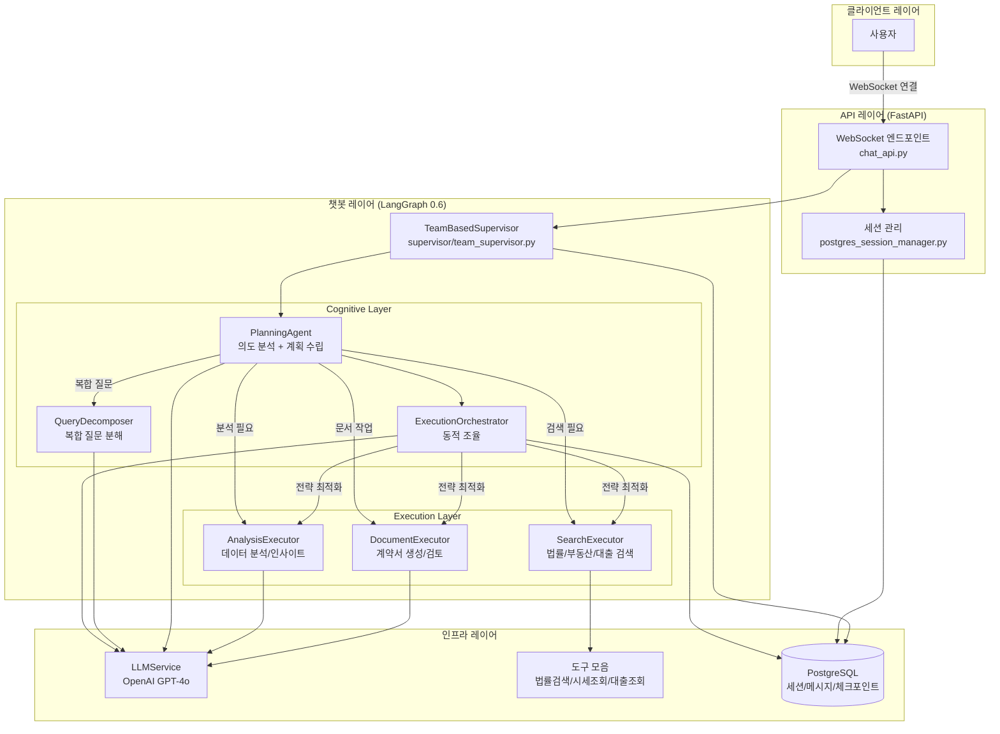
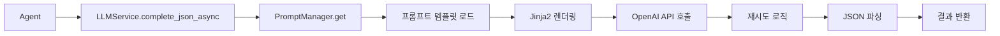

# LangGraph 0.6 기반 챗봇 아키텍처 보고서
**작성일**: 2025-10-20
**프로젝트**: 홈즈냥즈 부동산 AI 챗봇
**LangGraph 버전**: 0.6

---

## 1. 전체 개요

### 1.1 프로젝트 구조
```
C:\kdy\Projects\holmesnyangz\beta_v001
├── backend/              # FastAPI 백엔드 애플리케이션
│   ├── app/
│   │   ├── main.py                    # FastAPI 진입점
│   │   ├── api/                       # REST/WebSocket API
│   │   │   ├── chat_api.py           # 채팅 API 엔드포인트
│   │   │   ├── postgres_session_manager.py  # 세션 관리
│   │   │   └── ws_manager.py         # WebSocket 연결 관리
│   │   ├── service_agent/            # 챗봇 핵심 (LangGraph 0.6)
│   │   │   ├── supervisor/           # 메인 오케스트레이터
│   │   │   ├── cognitive_agents/     # 계획/분석 에이전트
│   │   │   ├── execution_agents/     # 실행 에이전트
│   │   │   ├── foundation/           # 공통 인프라
│   │   │   ├── llm_manager/          # LLM 통합
│   │   │   └── tools/                # 기능별 도구
│   │   ├── db/                       # 데이터베이스 연결
│   │   ├── models/                   # SQLAlchemy 모델
│   │   └── core/                     # 시스템 설정
└── frontend/             # (프론트엔드 - 별도 문서)
```

---

## 2. 핵심 아키텍처

### 2.1 요청 흐름도



---

## 3. 주요 컴포넌트

### 3.1 API 레이어

#### 📄 [app/main.py](../backend/app/main.py)
**역할**: FastAPI 애플리케이션 진입점
- Supervisor 사전 초기화 (2.2초 성능 개선)
- 로깅 설정
- CORS 미들웨어
- 라이프사이클 관리

#### 📄 [app/api/chat_api.py](../backend/app/api/chat_api.py)
**역할**: 실시간 채팅 API
- **WebSocket 엔드포인트** (`/api/v1/chat/ws/{session_id}`)
  - 사용자 쿼리 수신
  - Supervisor에 전달
  - 실시간 진행 상황 스트리밍
- **세션 관리 엔드포인트**
  - POST `/start`: 세션 생성
  - GET `/{session_id}`: 세션 조회
  - DELETE `/{session_id}`: 세션 삭제
- **채팅 히스토리 엔드포인트**
  - GET `/sessions`: 세션 목록
  - POST `/sessions`: 새 세션 생성
  - GET `/sessions/{session_id}/messages`: 메시지 조회

---

### 3.2 챗봇 레이어 (service_agent)

#### 🎯 [supervisor/team_supervisor.py](../backend/app/service_agent/supervisor/team_supervisor.py)
**역할**: 메인 오케스트레이터 (LangGraph StateGraph)

**그래프 구조**:
```
START → initialize → planning → [execute_teams | generate_response] → aggregate → generate_response → END
```

**핵심 노드**:
1. **initialize_node**: 상태 초기화
2. **planning_node**:
   - PlanningAgent로 의도 분석
   - Long-term Memory 로딩 (RELEVANT 쿼리만)
   - 실행 계획 수립
3. **execute_teams_node**: 팀 순차/병렬 실행
4. **aggregate_results_node**: 결과 집계
5. **generate_response_node**:
   - LLM 응답 생성
   - Long-term Memory 저장

**주요 기능**:
- Checkpointing (PostgreSQL AsyncPostgresSaver)
- WebSocket 실시간 진행 상황 전송
- IRRELEVANT/UNCLEAR 조기 종료 (성능 최적화)

---

#### 🧠 [cognitive_agents/planning_agent.py](../backend/app/service_agent/cognitive_agents/planning_agent.py)
**역할**: 의도 분석 및 실행 계획 수립

**핵심 기능**:
- **의도 분석** (`analyze_intent`)
  - LLM 기반 Intent Classification
  - 9가지 Intent 타입 지원 (법률상담, 시세조회, 대출상담, 계약서작성 등)
  - Fallback: 패턴 매칭
- **Agent 추천** (`_suggest_agents`)
  - 다층 Fallback 전략 (Primary LLM → Simplified LLM → Safe Default)
- **실행 계획 생성** (`create_execution_plan`)
  - IRRELEVANT/UNCLEAR 조기 필터링
  - Agent 선택 및 우선순위 결정
  - 병렬/순차 전략 결정

#### 🔄 [cognitive_agents/query_decomposer.py](../backend/app/service_agent/cognitive_agents/query_decomposer.py)
**역할**: 복합 질문 분해 전담 (LLM 자율 판단)

**주요 기능**:
- **복합 질문 판단** (`_is_compound_query`)
  - COMPREHENSIVE Intent 감지
  - 연결 키워드 체크 (그리고, 또한, 하고 등)
  - 다중 동작 동사 감지
- **LLM 기반 분해** (`_decompose_with_llm`)
  - Few-shot learning 예시 활용
  - Chain-of-Thought 프롬프팅
  - SubTask 생성 (task_id, description, task_type, agent_team, dependencies)
- **실행 모드 결정** (`_determine_execution_mode`)
  - SEQUENTIAL (순차), PARALLEL (병렬), CONDITIONAL (조건부)
  - 의존성 분석으로 자동 결정
- **결과 통합** (`merge_results`)

**데이터 구조**:
- `SubTask`: 개별 작업 단위 (6가지 TaskType: SEARCH, ANALYSIS, GENERATION, REVIEW, CALCULATION, COMPARISON)
- `DecomposedQuery`: 분해된 질문 전체 구조 (parallel_groups, estimated_time 포함)

#### 🎛️ [cognitive_agents/execution_orchestrator.py](../backend/app/service_agent/cognitive_agents/execution_orchestrator.py)
**역할**: 실행 중 동적 조율 (기존 인프라 활용)

**주요 기능**:
- **실행 전략 결정** (`_decide_execution_strategy`)
  - LLM으로 순차/병렬 전략 결정
  - 학습된 패턴 활용
- **도구 선택 최적화** (`_optimize_tool_selection`)
  - 전역 관점에서 중복 제거
  - 사용자 패턴 및 도구 성공률 기반
- **팀 결과 분석** (`analyze_team_result`)
  - 품질 평가 (quality_score)
  - 다음 팀 전략 조정
- **학습 및 저장**:
  - Long-term Memory에서 실행 패턴 로드 (`_load_user_patterns`)
  - 실행 결과를 Memory에 저장 (`_save_execution_result`)

**WebSocket 알림**:
- `orchestration_started`, `orchestration_complete`, `team_analysis_complete`

**State 연동**:
- 기존 StateManager 활용
- `state["orchestration_metadata"]`에 결정사항 저장

---

#### 🔍 [execution_agents/search_executor.py](../backend/app/service_agent/execution_agents/search_executor.py)
**역할**: 검색 실행 (법률, 부동산, 대출)

**서브그래프 구조**:
```
START → prepare → route → search → aggregate → finalize → END
```

**주요 기능**:
- **LLM 기반 도구 선택** (`_select_tools_with_llm`)
  - 쿼리 분석 후 필요한 도구만 실행 (legal_search, market_data, loan_data, real_estate_search)
  - Decision Logger로 선택 근거 기록
- **검색 실행**:
  - HybridLegalSearch (FAISS + SQLite)
  - MarketDataTool (부동산 시세)
  - LoanDataTool (대출 상품)
  - RealEstateSearchTool (개별 매물, PostgreSQL)
- **결과 집계**: 검색 결과 통합 및 메타데이터 생성

---

#### 📝 [execution_agents/document_executor.py](../backend/app/service_agent/execution_agents/document_executor.py)
**역할**: 문서 생성 및 검토 실행

**서브그래프 구조**:
```
START → prepare → generate → review_check → [review | skip] → finalize → END
```

**주요 기능**:
- **문서 생성**: LeaseContractGeneratorTool 사용
- **문서 검토**: 위험 요소 탐지, 법적 요건 확인
- **템플릿 지원**: 임대차계약서, 매매계약서, 대출신청서

#### 📊 [execution_agents/analysis_executor.py](../backend/app/service_agent/execution_agents/analysis_executor.py)
**역할**: 데이터 분석 및 인사이트 생성

**서브그래프 구조**:
```
START → prepare → preprocess → analyze → generate_insights → create_report → finalize → END
```

**주요 기능**:
- **LLM 기반 도구 선택**: tool_selection_analysis 프롬프트 사용
- **분석 도구**:
  - ContractAnalysisTool (계약서 분석)
  - MarketAnalysisTool (시장 분석)
  - ROICalculatorTool (투자 수익률)
  - LoanSimulatorTool (대출 시뮬레이션)
  - PolicyMatcherTool (정책 매칭)
- **맞춤 분석**: 전세금 인상률 등 특수 케이스 처리

---

### 3.3 Foundation Layer

#### ⚙️ [foundation/config.py](../backend/app/service_agent/foundation/config.py)
**역할**: 시스템 전역 설정
- 데이터베이스 경로
- LLM 모델 설정 (gpt-4o-mini, gpt-4o)
- 타임아웃 및 제한값
- Feature Flags

#### 🔧 [foundation/separated_states.py](../backend/app/service_agent/foundation/separated_states.py)
**역할**: LangGraph State 정의 (TypedDict 기반)

**주요 State 타입**:
- `MainSupervisorState`: 메인 오케스트레이터 상태 (30+ 필드)
- `PlanningState`: 계획 단계 상태 (의도 분석, 실행 단계)
- `ExecutionStepState`: WebSocket TODO 업데이트용
- `SearchTeamState`, `DocumentTeamState`, `AnalysisTeamState`: 팀별 상태
- `SharedState`: 공통 필드

**유틸리티**:
- `StateManager`: 상태 업데이트 헬퍼 (update_step_status, progress 계산)
- `StateValidator`: 상태 검증

#### 🤖 [foundation/agent_registry.py](../backend/app/service_agent/foundation/agent_registry.py)
**역할**: 중앙 Agent 레지스트리 (싱글톤)

**주요 기능**:
- Agent 동적 등록/해제 (`register`, `unregister`)
- 팀별 Agent 분류 (`_teams`)
- Capability 기반 검색 (`find_agents_by_capability`)
- 우선순위 기반 실행 순서 결정
- `@register_agent` 데코레이터 지원

#### 📋 [foundation/decision_logger.py](../backend/app/service_agent/foundation/decision_logger.py)
**역할**: LLM 의사결정 로깅 시스템 (SQLite)

**저장 데이터**:
- **agent_decisions**: 에이전트 선택 결정 (query, selected_agents, reasoning, confidence)
- **tool_decisions**: 도구 선택 결정 (agent_type, available_tools, selected_tools)

**주요 메서드**:
- `log_agent_decision()`: 에이전트 선택 기록
- `log_tool_decision()`: 도구 선택 기록
- `update_agent_execution_result()`: 실행 결과 업데이트
- `get_tool_usage_stats()`: 도구 사용 통계 조회

**로깅 경로**: `data/system/agent_logging/decisions.db`

#### 🗄️ [foundation/simple_memory_service.py](../backend/app/service_agent/foundation/simple_memory_service.py)
**역할**: 간소화된 메모리 서비스 (chat_messages 기반)

**주요 기능**:
- `load_recent_messages()`: 최근 메시지 로드 (session_id 기반)
- `get_conversation_history()`: 대화 히스토리 텍스트 변환

**호환성 메서드** (기존 LongTermMemoryService):
- `save_conversation_memory()`, `get_recent_memories()`: 호환성용 (no-op)
- `update_user_preference()`, `get_user_preferences()`: 사용자 선호도 (빈 값 반환)

**별칭**: `LongTermMemoryService = SimpleMemoryService`

---

### 3.4 LLM Manager

#### 🧬 [llm_manager/llm_service.py](../backend/app/service_agent/llm_manager/llm_service.py)
**역할**: 중앙 집중식 LLM 통합 서비스

**주요 메서드**:
- `complete_json_async()`: 비동기 JSON 응답 (프롬프트 이름 기반 모델 자동 선택)
- `generate_final_response()`: 최종 답변 생성 (구조화된 UI 섹션 변환)
- `complete_async()`: 비동기 텍스트 응답
- `complete()`, `complete_json()`: 동기 버전

**핵심 기능**:
- **싱글톤 클라이언트 캐싱**: `_clients`, `_async_clients` 딕셔너리
- **자동 모델 선택**: `Config.LLM_DEFAULTS["models"]`에서 prompt_name으로 매핑
- **재시도 로직**: Exponential Backoff (1초, 2초, 4초)
- **JSON 파싱**: `response_format={"type": "json_object"}`
- **로깅**: 토큰 사용량, 실행 시간 기록

**Fallback 전략**:
- Primary LLM 실패 → Simplified LLM → Safe Default

#### 📚 [llm_manager/prompt_manager.py](../backend/app/service_agent/llm_manager/prompt_manager.py)
**역할**: 프롬프트 템플릿 관리 시스템

**주요 기능**:
- **템플릿 로드**: `cognitive/`, `execution/`, `common/` 디렉토리 자동 검색
- **Jinja2-free 구현**: Safe 변수 치환 (Jinja2 없이 `{variable}` 형식)
- **코드 블록 보호**: \`\`\`json 블록 내부 변수 치환 방지
- **템플릿 캐싱**: 한 번 로드된 템플릿 메모리 캐싱

**템플릿 예시**:
```
cognitive/intent_analysis.txt
cognitive/agent_selection.txt
execution/tool_selection_search.txt
execution/keyword_extraction.txt
common/error_response.txt
```

---

### 3.5 Tools Layer

**주요 도구**:
- `hybrid_legal_search.py`: 법률 정보 검색 (FAISS + SQLite)
- `market_data_tool.py`: 부동산 시세 조회
- `loan_data_tool.py`: 대출 상품 검색
- `real_estate_search_tool.py`: 개별 매물 검색 (PostgreSQL)
- `analysis_tools.py`: 데이터 분석
- `contract_analysis_tool.py`: 계약서 분석
- `lease_contract_generator_tool.py`: 임대차계약서 생성

---

### 3.6 Database Layer (PostgreSQL)

#### 📄 [models/chat.py](../backend/app/models/chat.py)
**역할**: 채팅 세션 및 메시지 모델 (SQLAlchemy)

**주요 모델**:

##### ChatSession
```python
session_id: String(100) PK         # "session-{uuid}" 형식
user_id: Integer FK(users.id)      # 사용자 ID
title: String(200)                 # 세션 제목 (기본: "새 대화")
last_message: Text                 # 마지막 메시지 미리보기
message_count: Integer             # 메시지 개수
created_at: TIMESTAMP
updated_at: TIMESTAMP              # 트리거로 자동 갱신
is_active: Boolean
session_metadata: JSONB            # 추가 메타데이터
```

**Relationships**:
- `user`: User 모델
- `messages`: ChatMessage[] (CASCADE DELETE)

##### ChatMessage
```python
id: Integer PK (autoincrement)
session_id: String(100) FK(chat_sessions.session_id)  # CASCADE DELETE
role: String(20)                   # user | assistant | system
content: Text                      # 메시지 내용
structured_data: JSONB             # UI 섹션 데이터
created_at: TIMESTAMP
```

**Indexes**:
- `idx_chat_sessions_user_id`
- `idx_chat_sessions_updated_at`
- `idx_chat_sessions_user_updated` (user_id, updated_at)
- `idx_chat_messages_session_id`

#### 📄 [api/postgres_session_manager.py](../backend/app/api/postgres_session_manager.py)
**역할**: 세션 관리 서비스 (ChatSession CRUD)

**주요 메서드**:
- `create_session()`: 새 세션 생성 (session-{uuid})
- `validate_session()`: 세션 존재 확인 + updated_at 갱신
- `get_session()`: 세션 정보 조회
- `delete_session()`: 세션 삭제 (CASCADE: messages, checkpoints)
- `cleanup_expired_sessions()`: 24시간 미활동 세션 정리
- `extend_session()`: updated_at 갱신으로 만료 시간 연장

**Checkpoint 정리**:
- `_delete_checkpoints()`: checkpoints, checkpoint_blobs, checkpoint_writes 삭제
- FK 없는 테이블이므로 수동 DELETE 필요

#### 📄 [models/real_estate.py](../backend/app/models/real_estate.py)
**역할**: 부동산 관련 모델 (17개 테이블 스키마)

**주요 모델**:
- `User`: 사용자 (local_auths, social_auths, user_profiles)
- `Region`: 지역 (법정동코드 기반)
- `RealEstate`: 부동산 매물 (아파트, 오피스텔 등)
- `Transaction`: 거래 정보 (매매, 전세, 월세)
- `RealEstateAgent`: 중개사
- `NearbyFacility`: 주변 시설
- `TrustScore`: 신뢰도 점수

**ENUM 타입**:
- `usertype`: individual, agent, admin
- `propertytype`: apartment, officetel, villa, single_house, commercial
- `transactiontype`: sale, jeonse, monthly_rent, short_term_rent

---

## 4. 데이터 흐름

### 4.1 사용자 질문 처리 흐름

```
1. 사용자 → WebSocket 연결 (/api/v1/chat/ws/{session_id})
   └─ chat_api.py: 세션 검증

2. WebSocket → Supervisor.process_query_streaming()
   └─ team_supervisor.py: LangGraph 워크플로우 시작

3. initialize_node → planning_node
   ├─ PlanningAgent.analyze_intent() → LLM으로 의도 분석
   ├─ Long-term Memory 로딩 (RELEVANT 쿼리만)
   └─ PlanningAgent.create_execution_plan() → 팀 선택

4. execute_teams_node
   ├─ SearchExecutor.execute()
   │   ├─ LLM으로 도구 선택 (legal_search, market_data 등)
   │   └─ 각 도구 실행 (병렬/순차)
   ├─ DocumentExecutor.execute() (필요시)
   └─ AnalysisExecutor.execute() (필요시)

5. aggregate_results_node
   └─ 팀 결과 집계

6. generate_response_node
   ├─ LLMService.generate_final_response() → 최종 답변 생성
   └─ Long-term Memory 저장

7. WebSocket → 사용자
   └─ {"type": "final_response", "response": {...}}
```

---

### 4.2 실시간 진행 상황 스트리밍

Supervisor는 WebSocket을 통해 실시간으로 진행 상황 전송:
- `planning_start`: 계획 수립 시작
- `plan_ready`: 계획 완료 (실행 단계 목록 포함)
- `execution_start`: 실행 시작
- `todo_updated`: TODO 상태 변경 (in_progress, completed, failed)
- `final_response`: 최종 응답

---

## 5. 핵심 기술 스택

| 계층 | 기술 |
|-----|-----|
| **웹 프레임워크** | FastAPI |
| **워크플로우 엔진** | LangGraph 0.6 (StateGraph) |
| **LLM** | OpenAI GPT-4o, GPT-4o-mini |
| **데이터베이스** | PostgreSQL (세션/메시지/체크포인트) |
| **벡터 DB** | FAISS (법률 검색) |
| **실시간 통신** | WebSocket |
| **비동기 처리** | asyncio |

---

## 6. 성능 최적화

### 6.1 적용된 최적화
1. **Supervisor 사전 초기화**: 첫 응답 시간 2.2초 단축
2. **IRRELEVANT/UNCLEAR 조기 종료**: 불필요한 LLM 호출 제거 (3초 → 0.6초)
3. **LLM 기반 도구 선택**: 필요한 도구만 실행 (불필요한 검색 제거)
4. **병렬 검색 실행**: 여러 도구 동시 실행
5. **Long-term Memory 필터링**: RELEVANT 대화만 로드/저장

### 6.2 Checkpointing
- PostgreSQL AsyncPostgresSaver 사용
- 세션별 대화 상태 보존 (4개 테이블)
  - `checkpoints`: State 스냅샷 (JSONB)
  - `checkpoint_blobs`: 바이너리 데이터 (BYTEA)
  - `checkpoint_writes`: 증분 업데이트
  - `checkpoint_migrations`: 스키마 버전
- session_id 통일: `chat_sessions.session_id` = `checkpoints.session_id`
- CASCADE DELETE: 세션 삭제 시 모든 checkpoint 자동 삭제
- 중단된 대화 재개 가능

---

## 7. 주요 의존성 플로우

```
main.py (FastAPI)
  └─ chat_api.py (WebSocket)
      └─ TeamBasedSupervisor (메인 오케스트레이터)
          │
          ├─ Cognitive Layer
          │   ├─ PlanningAgent (의도 분석 + 계획 수립)
          │   │   ├─ LLMService (LLM 호출)
          │   │   ├─ DecisionLogger (의사결정 기록)
          │   │   └─ QueryDecomposer (복합 질문 분해)
          │   │
          │   └─ ExecutionOrchestrator (실행 중 동적 조율)
          │       ├─ LLMService (전략/도구 선택)
          │       ├─ StateManager (상태 업데이트)
          │       └─ LongTermMemoryService (패턴 학습)
          │
          ├─ Execution Layer
          │   ├─ SearchExecutor (검색 실행)
          │   │   ├─ HybridLegalSearch (법률 검색)
          │   │   ├─ MarketDataTool (시세 조회)
          │   │   ├─ LoanDataTool (대출 조회)
          │   │   └─ RealEstateSearchTool (매물 검색)
          │   │
          │   ├─ DocumentExecutor (계약서 작성/검토)
          │   │   └─ LeaseContractGeneratorTool
          │   │
          │   └─ AnalysisExecutor (데이터 분석)
          │       ├─ ContractAnalysisTool
          │       ├─ MarketAnalysisTool
          │       ├─ ROICalculatorTool
          │       ├─ LoanSimulatorTool
          │       └─ PolicyMatcherTool
          │
          └─ Foundation Layer
              ├─ Config (시스템 설정)
              ├─ separated_states (State 정의)
              ├─ StateManager (상태 관리)
              ├─ DecisionLogger (의사결정 로깅)
              ├─ AgentRegistry (Agent 등록)
              └─ SimpleMemoryService (메모리)
```

---

## 8. 파일별 핵심 기능 요약

| 파일 | 역할 | 핵심 기능 |
|-----|-----|---------|
| **main.py** | 앱 진입점 | Supervisor 사전 초기화, 로깅 설정 |
| **chat_api.py** | API 엔드포인트 | WebSocket 채팅, 세션 관리, 히스토리 조회 |
| **team_supervisor.py** | 메인 오케스트레이터 | LangGraph 워크플로우, 팀 실행, 응답 생성 |
| **planning_agent.py** | 의도 분석 + 계획 | Intent Classification, Agent 선택, 계획 수립 |
| **query_decomposer.py** | 복합 질문 분해 | LLM 자율 판단, SubTask 생성, 의존성 분석 |
| **execution_orchestrator.py** | 동적 조율 | 실행 전략 결정, 도구 최적화, 팀 결과 분석 |
| **search_executor.py** | 검색 실행 | LLM 도구 선택, 법률/부동산/대출 검색 |
| **document_executor.py** | 문서 작업 | 계약서 생성/검토, 위험 요소 탐지 |
| **analysis_executor.py** | 데이터 분석 | 다중 분석 도구, LLM 도구 선택 |
| **llm_service.py** | LLM 통합 | OpenAI API 호출, 프롬프트 렌더링, JSON 파싱 |
| **prompt_manager.py** | 프롬프트 관리 | 템플릿 로드, 변수 치환, 캐싱 |
| **config.py** | 시스템 설정 | 경로, 모델, 타임아웃, Feature Flags |
| **separated_states.py** | State 정의 | TypedDict 기반 State, StateManager 유틸리티 |
| **decision_logger.py** | 의사결정 로깅 | Agent/Tool 선택 기록, 통계 조회 |
| **agent_registry.py** | Agent 관리 | 동적 등록, Capability 검색, 우선순위 관리 |
| **simple_memory_service.py** | 메모리 관리 | chat_messages 기반, 대화 히스토리 조회 |
| **chat.py** (models) | DB 모델 | ChatSession, ChatMessage (SQLAlchemy) |
| **postgres_session_manager.py** | 세션 관리 | 세션 CRUD, checkpoint 정리, 만료 관리 |
| **real_estate.py** (models) | 부동산 모델 | 17개 테이블, ENUM 타입 정의 |

---

## 9. LangGraph 0.6 특징 활용

### 9.1 StateGraph
- **Supervisor**: MainSupervisorState 기반 메인 그래프
- **Executor**: 각 팀별 독립 서브그래프 (SearchTeamState 등)

### 9.2 Checkpointing
- AsyncPostgresSaver로 PostgreSQL 연동
- thread_id 기반 대화 상태 보존

### 9.3 조건부 엣지
- planning 후 라우팅 (`_route_after_planning`)
- IRRELEVANT/UNCLEAR → 바로 응답
- 정상 쿼리 → execute_teams

### 9.4 비동기 실행
- `ainvoke()`: 비동기 그래프 실행
- `complete_json_async()`: 비동기 LLM 호출

---

## 10. 확장 포인트

### 10.1 Agent 추가
1. `execution_agents/` 에 새 Executor 추가
2. `AgentRegistry`에 등록
3. `PlanningAgent._suggest_agents()`에 로직 추가

### 10.2 Tool 추가
1. `tools/` 에 새 Tool 클래스 추가
2. Executor의 `_initialize()` 에서 초기화
3. `_get_available_tools()`에 메타데이터 추가

### 10.3 LLM 프롬프트 추가
1. `llm_manager/prompts/` 에 템플릿 추가 (Jinja2)
2. `LLMService.complete_json_async(prompt_name="...")`로 호출

---

## 11. 트러블슈팅 가이드

### 11.1 LLM 응답 느림
- `config.py` → `LLM_DEFAULTS.models` 확인 (gpt-4o-mini 권장)
- `planning_agent.py` → `temperature`, `max_tokens` 조정

### 11.2 Checkpointing 오류
- PostgreSQL 연결 확인
- `AsyncPostgresSaver.setup()` 실행됐는지 확인

### 11.3 WebSocket 연결 끊김
- `ws_manager.py` → 타임아웃 설정 확인
- 네트워크 방화벽/프록시 확인

---

---

## 12. LLM 호출 메커니즘

### 12.1 LLMService 구조

#### 📄 [llm_manager/llm_service.py](../backend/app/service_agent/llm_manager/llm_service.py)

**역할**: 모든 LLM 호출의 중앙 집중화

```python
# 싱글톤 패턴으로 클라이언트 재사용
class LLMService:
    _clients: Dict[str, OpenAI] = {}          # 동기 클라이언트 캐시
    _async_clients: Dict[str, AsyncOpenAI] = {}  # 비동기 클라이언트 캐시
```

**핵심 메서드**:

| 메서드 | 용도 | 응답 형식 |
|--------|------|----------|
| `complete()` | 동기 텍스트 호출 | string |
| `complete_async()` | 비동기 텍스트 호출 | string |
| `complete_json()` | 동기 JSON 호출 | dict |
| `complete_json_async()` | 비동기 JSON 호출 | dict |
| `generate_final_response()` | 최종 답변 생성 | dict (구조화) |

---

### 12.2 LLM 호출 흐름



**단계별 설명**:

1. **Agent가 LLMService 호출**
   ```python
   result = await self.llm_service.complete_json_async(
       prompt_name="intent_analysis",
       variables={"query": "전세금 5% 인상 가능해?"}
   )
   ```

2. **PromptManager가 템플릿 로드**
   - 경로: `llm_manager/prompts/{category}/{prompt_name}.txt`
   - 예: `prompts/cognitive/intent_analysis.txt`

3. **Jinja2로 변수 렌더링**
   ```jinja2
   분석할 질문: {{ query }}
   ```

4. **OpenAI API 호출** (with 재시도)
   - 최대 3회 재시도 (Exponential Backoff)
   - 타임아웃: 20초 (Config.TIMEOUTS["llm"])

5. **JSON 파싱 및 반환**
   ```json
   {
       "intent": "LEGAL_CONSULT",
       "confidence": 0.9,
       "keywords": ["전세금", "인상"]
   }
   ```

---

### 12.3 모델 선택 전략

LLMService는 **프롬프트 이름**을 기반으로 자동으로 모델을 선택합니다.

#### Config.LLM_DEFAULTS["models"]
```python
{
    # Cognitive (계획/분석)
    "intent_analysis": "gpt-4o-mini",      # 빠른 의도 분석
    "plan_generation": "gpt-4o-mini",      # 실행 계획
    "agent_selection": "gpt-4o-mini",      # Agent 선택

    # Execution (검색/분석)
    "keyword_extraction": "gpt-4o-mini",   # 키워드 추출
    "tool_selection_search": "gpt-4o-mini", # 도구 선택
    "insight_generation": "gpt-4o",        # 인사이트 생성 (고품질)

    # Response (최종 답변)
    "response_synthesis": "gpt-4o-mini",   # 답변 종합
}
```

**모델 선택 규칙**:
- **gpt-4o-mini**: 빠른 응답, 구조화된 출력 (Intent, 키워드 추출 등)
- **gpt-4o**: 고품질 응답, 복잡한 추론 (인사이트 생성)

---

### 12.4 프롬프트 템플릿 구조

#### 디렉토리 구조
```
llm_manager/prompts/
├── cognitive/                    # 계획 및 분석
│   ├── intent_analysis.txt      # 의도 분석
│   ├── agent_selection.txt      # Agent 선택
│   ├── agent_selection_simple.txt  # 간소화 버전
│   └── query_decomposition.txt  # 복합 질문 분해
├── execution/                    # 실행 관련
│   ├── keyword_extraction.txt   # 검색 키워드 추출
│   ├── tool_selection_search.txt  # 검색 도구 선택
│   ├── tool_selection_analysis.txt  # 분석 도구 선택
│   ├── insight_generation.txt   # 인사이트 생성
│   └── response_synthesis.txt   # 최종 답변 종합
└── common/                       # 공통
    └── error_response.txt        # 에러 응답
```

---

### 12.5 주요 프롬프트 예시

#### 1) Intent Analysis (의도 분석)

**파일**: `cognitive/intent_analysis.txt`

**목적**: 사용자 질문을 9가지 Intent로 분류

**Chain-of-Thought 분석**:
1. 질문 유형 파악 (정보 확인형, 평가형, 해결책 요청형)
2. 복잡도 평가 (저/중/고)
3. 의도 결정 (검색만 vs 검색+분석 vs 종합처리)

**9가지 Intent**:
- LEGAL_CONSULT (법률상담)
- MARKET_INQUIRY (시세조회)
- LOAN_CONSULT (대출상담)
- CONTRACT_CREATION (계약서작성)
- CONTRACT_REVIEW (계약서검토)
- COMPREHENSIVE (종합분석)
- RISK_ANALYSIS (리스크분석)
- UNCLEAR (불분명)
- IRRELEVANT (무관)

**출력 예시**:
```json
{
    "intent": "LEGAL_CONSULT",
    "confidence": 0.9,
    "keywords": ["전세금", "인상", "제한"],
    "entities": {
        "location": "강남구",
        "price": "5억",
        "contract_type": "전세"
    },
    "reasoning": "1단계(유형): 정보 확인형. 2단계(복잡도): 저 - 단일 개념. 3단계(의도): 검색만으로 충분 → LEGAL_CONSULT"
}
```

---

#### 2) Tool Selection (도구 선택)

**파일**: `execution/tool_selection_search.txt`

**목적**: SearchExecutor가 실행할 도구 선택

**선택 가능한 도구**:
- `legal_search`: 법률 정보 (FAISS + SQLite)
- `market_data`: 부동산 시세 통계 (평균/최소/최대)
- `real_estate_search`: 개별 매물 검색 (PostgreSQL)
- `loan_data`: 대출 상품 정보

**선택 원칙**:
- **법률 정보 필요** → legal_search
- **시세 통계 필요** → market_data
- **개별 매물 필요** → real_estate_search
- **대출 정보 필요** → loan_data

**출력 예시**:
```json
{
    "selected_tools": ["legal_search", "market_data"],
    "reasoning": "1) legal_search로 인상률 한도 확인 (5%) 2) market_data로 시세 적정성 비교",
    "confidence": 0.9
}
```

---

#### 3) Response Synthesis (최종 답변 생성)

**파일**: `execution/response_synthesis.txt`

**목적**: 팀 결과를 종합하여 사용자 답변 생성

**입력**:
- 사용자 질문 (`query`)
- Intent 정보 (`intent_type`, `intent_confidence`, `keywords`)
- 팀 결과 (`aggregated_results`: search/analysis/document)

**구조화된 답변 형식**:
```json
{
    "answer": "핵심 답변 (2-3문장)",
    "details": {
        "legal_basis": "법적 근거",
        "data_analysis": "데이터 분석 결과",
        "considerations": ["고려사항1", "고려사항2"]
    },
    "recommendations": [
        "추천사항1: 구체적인 행동 지침",
        "추천사항2: 주의할 점"
    ],
    "sources": ["주택임대차보호법 제7조"],
    "confidence": 0.95,
    "additional_info": "추가 정보"
}
```

**UI 섹션 변환**:
- LLMService가 JSON을 UI 섹션으로 변환
- `structured_data.sections[]`에 icon, priority, expandable 추가

---

### 12.6 실제 LLM 호출 사례

#### 사례 1: PlanningAgent의 의도 분석

```python
# planning_agent.py
async def analyze_intent(self, query: str) -> IntentResult:
    try:
        # LLM 호출 (intent_analysis 프롬프트)
        result = await self.llm_service.complete_json_async(
            prompt_name="intent_analysis",
            variables={"query": query},
            temperature=0.3,
            max_tokens=500
        )

        # JSON 응답 파싱
        intent_type = IntentType(result.get("intent", "UNCLEAR"))
        confidence = result.get("confidence", 0.5)
        keywords = result.get("keywords", [])

        return IntentResult(
            intent_type=intent_type,
            confidence=confidence,
            keywords=keywords,
            reasoning=result.get("reasoning", "")
        )
    except Exception as e:
        # Fallback: 패턴 매칭
        return self._fallback_intent_analysis(query)
```

**LLM 호출 로그**:
```
LLM Call: intent_analysis | Model: gpt-4o-mini | Tokens: 234 (prompt: 180, completion: 54)
```

---

#### 사례 2: SearchExecutor의 도구 선택

```python
# search_executor.py
async def _select_tools_with_llm(self, query: str) -> List[str]:
    # 사용 가능한 도구 메타데이터 생성
    available_tools = self._get_available_tools()

    # LLM 호출 (tool_selection_search 프롬프트)
    result = await self.llm_service.complete_json_async(
        prompt_name="tool_selection_search",
        variables={
            "query": query,
            "available_tools": json.dumps(available_tools, ensure_ascii=False)
        }
    )

    selected_tools = result.get("selected_tools", [])
    reasoning = result.get("reasoning", "")

    # Decision Logger에 기록
    self.decision_logger.log_decision(
        agent_name="SearchExecutor",
        decision_type="tool_selection",
        reasoning=reasoning
    )

    return selected_tools
```

---

#### 사례 3: Supervisor의 최종 응답 생성

```python
# team_supervisor.py → generate_response_node
async def generate_response_node(self, state: MainSupervisorState):
    aggregated_results = state.get("aggregated_results", {})
    intent_info = state.get("planning_state", {}).get("analyzed_intent", {})

    # LLMService의 고급 메서드 사용
    response = await self.planning_agent.llm_service.generate_final_response(
        query=state.get("query"),
        aggregated_results=aggregated_results,
        intent_info=intent_info
    )

    # 응답 구조:
    # {
    #     "type": "answer",
    #     "answer": "생성된 답변",
    #     "structured_data": {
    #         "sections": [...],  # UI 섹션
    #         "metadata": {...}
    #     },
    #     "teams_used": ["search", "analysis"],
    #     "data": {...}
    # }

    state["final_response"] = response
    return state
```

---

### 12.7 재시도 및 에러 핸들링

#### 재시도 로직
```python
# llm_service.py
async def _call_async_with_retry(self, params: Dict[str, Any]):
    max_attempts = 3
    backoff_seconds = 1.0

    for attempt in range(max_attempts):
        try:
            return await self.async_client.chat.completions.create(**params)
        except Exception as e:
            if attempt < max_attempts - 1:
                # Exponential Backoff: 1초, 2초, 4초
                await asyncio.sleep(backoff_seconds * (2 ** attempt))

    raise last_error
```

#### Fallback 전략
```python
# planning_agent.py
async def _suggest_agents_with_fallback(self, intent_result: IntentResult):
    try:
        # 1차: Primary LLM (agent_selection)
        return await self._suggest_agents_llm(intent_result)
    except Exception as e:
        try:
            # 2차: Simplified LLM (agent_selection_simple)
            return await self._suggest_agents_simplified(intent_result)
        except Exception as e2:
            # 3차: Safe Default (규칙 기반)
            return self._suggest_agents_safe_default(intent_result)
```

---

### 12.8 프롬프트 관리

#### PromptManager
```python
# prompt_manager.py
class PromptManager:
    def get(self, prompt_name: str, variables: Dict[str, Any]) -> str:
        # 1. 템플릿 파일 로드 (캐싱)
        template = self._load_template(prompt_name)

        # 2. Jinja2 렌더링
        rendered = template.render(**variables)

        return rendered

    def _load_template(self, prompt_name: str):
        # prompts/ 디렉토리에서 검색
        # cognitive/{prompt_name}.txt
        # execution/{prompt_name}.txt
        # common/{prompt_name}.txt
```

**캐싱**: 템플릿은 한 번만 로드되고 메모리에 캐싱됨

---

### 12.9 LLM 호출 모니터링

#### 로깅
```python
# llm_service.py
def _log_call(self, prompt_name: str, response: ChatCompletion):
    usage = response.usage
    logger.info(
        f"LLM Call: {prompt_name} | "
        f"Model: {response.model} | "
        f"Tokens: {usage.total_tokens} "
        f"(prompt: {usage.prompt_tokens}, completion: {usage.completion_tokens})"
    )
```

#### Decision Logger
- Agent의 LLM 기반 결정을 JSON 파일로 기록
- 경로: `data/system/agent_logging/{agent_name}/{session_id}.json`
- 용도: 디버깅, 감사, 성능 분석

---

### 12.10 프롬프트 최적화 팁

#### 1. Few-shot Learning
모든 프롬프트에 예시 포함:
```
예시 1: "전세금 5% 인상 가능해?"
→ {"intent": "LEGAL_CONSULT", "confidence": 0.9}

예시 2: "강남구 아파트 시세 알려줘"
→ {"intent": "MARKET_INQUIRY", "confidence": 0.95}
```

#### 2. Chain-of-Thought
복잡한 분석에 단계별 추론 요구:
```
1단계: 질문 유형 파악
2단계: 복잡도 평가
3단계: 의도 결정
```

#### 3. JSON 모드 강제
```python
response_format={"type": "json_object"}
```
- 프롬프트에 "JSON" 키워드 필수 포함
- OpenAI가 JSON 형식 보장

#### 4. 모델 선택
- **gpt-4o-mini**: 구조화된 출력, 빠른 응답
- **gpt-4o**: 복잡한 추론, 고품질 답변

---

## 13. 결론

이 아키텍처는 **LangGraph 0.6**의 StateGraph를 활용하여 복잡한 멀티 에이전트 시스템을 구조화하고 있습니다.

**핵심 강점**:
- **모듈화**: Supervisor, Cognitive, Execution 계층 분리
- **확장성**: Agent/Tool 추가 용이
- **성능**: LLM 기반 도구 선택, 조기 종료, 병렬 실행
- **안정성**: 다층 Fallback, Checkpointing, 상태 관리
- **중앙화된 LLM 관리**: 프롬프트 템플릿, 재시도, 로깅

**LLM 호출 특징**:
- **프롬프트 기반 호출**: 이름으로 자동 모델 선택
- **Jinja2 템플릿**: 변수 렌더링
- **재시도 로직**: Exponential Backoff
- **Fallback 전략**: Primary → Simplified → Safe Default
- **Decision Logger**: LLM 결정 기록

**LLM 제공 시 유의사항**:
- 이 문서는 핵심 파일과 흐름만 포함 (토큰 절약)
- 실제 구현 시 각 파일 내용 참조 필요
- 프롬프트 템플릿은 `llm_manager/prompts/` 참조
- 프롬프트 수정 시 Few-shot 예시와 Chain-of-Thought 유지 필수

---

**문서 끝**
