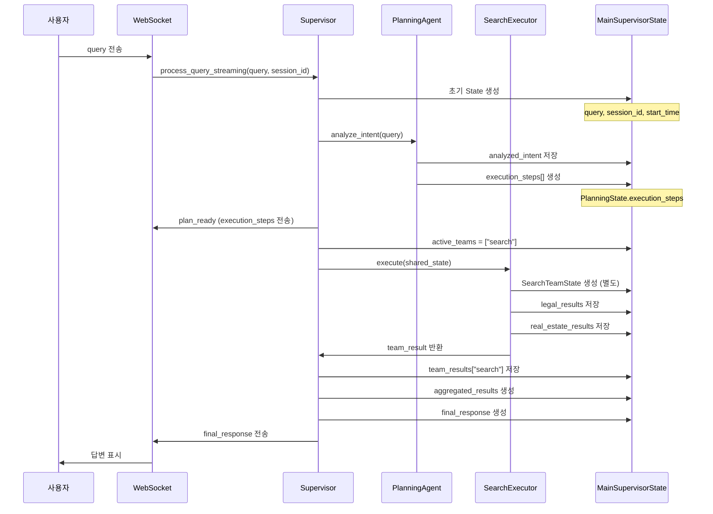

# LangGraph State 관리 아키텍처
**작성일**: 2025-10-20
**프로젝트**: 홈즈냥즈 부동산 AI 챗봇
**LangGraph 버전**: 0.6

---

## 1. 개요

LangGraph 0.6의 StateGraph는 **TypedDict 기반 State 관리**를 통해 워크플로우 전체에서 데이터를 추적하고 전달합니다.

### 1.1 State 계층 구조

```
MainSupervisorState (메인 오케스트레이터)
├── PlanningState (계획 수립)
│   └── ExecutionStepState[] (실행 단계 목록)
├── SharedState (팀 간 공유)
├── SearchTeamState (검색 팀)
├── DocumentTeamState (문서 팀)
└── AnalysisTeamState (분석 팀)
```

---

## 2. State 타입 정의

### 2.1 MainSupervisorState (최상위 State)

**파일**: [foundation/separated_states.py](../backend/app/service_agent/foundation/separated_states.py:286)

**역할**: 전체 워크플로우의 중앙 State

```python
class MainSupervisorState(TypedDict, total=False):
    # 1. 필수 필드
    query: str                          # 사용자 질문
    session_id: str                     # WebSocket 세션 ID
    chat_session_id: Optional[str]      # 채팅 세션 ID (DB 저장용)
    request_id: str                     # 요청 고유 ID
    user_id: Optional[int]              # 사용자 ID (Long-term Memory)

    # 2. 계획 관련
    planning_state: Optional[PlanningState]      # 계획 수립 결과
    execution_plan: Optional[Dict[str, Any]]     # 실행 계획

    # 3. 팀별 State
    search_team_state: Optional[Dict[str, Any]]
    document_team_state: Optional[Dict[str, Any]]
    analysis_team_state: Optional[Dict[str, Any]]

    # 4. 실행 추적
    current_phase: str                  # 현재 단계 (planning, executing, aggregation 등)
    active_teams: List[str]             # 실행 중인 팀
    completed_teams: List[str]          # 완료된 팀
    failed_teams: List[str]             # 실패한 팀

    # 5. 결과
    team_results: Dict[str, Any]        # 팀별 결과 (병합 전)
    aggregated_results: Dict[str, Any]  # 집계된 결과
    final_response: Optional[Dict[str, Any]]  # 최종 응답

    # 6. 타이밍
    start_time: Optional[datetime]
    end_time: Optional[datetime]
    total_execution_time: Optional[float]

    # 7. 에러 처리
    error_log: List[str]
    status: str                         # initialized, processing, completed, error

    # 8. Long-term Memory
    loaded_memories: Optional[List[Dict[str, Any]]]  # 로드된 대화 기록
    user_preferences: Optional[Dict[str, Any]]       # 사용자 선호도
    memory_load_time: Optional[str]
```

**total=False**: 모든 필드가 선택적 (Optional)

---

### 2.2 PlanningState (계획 수립)

**역할**: 의도 분석 및 실행 계획

```python
class PlanningState(TypedDict):
    raw_query: str                      # 원본 질문
    analyzed_intent: Dict[str, Any]     # 의도 분석 결과
    intent_confidence: float            # 의도 신뢰도 (0.0~1.0)

    available_agents: List[str]         # 사용 가능한 Agent 목록
    available_teams: List[str]          # 사용 가능한 팀 목록

    execution_steps: List[ExecutionStepState]  # 실행 단계 (TODO 리스트)
    execution_strategy: str             # "sequential" | "parallel"
    parallel_groups: Optional[List[List[str]]]

    plan_validated: bool                # 계획 검증 여부
    validation_errors: List[str]
    estimated_total_time: float         # 예상 실행 시간 (초)
```

---

### 2.3 ExecutionStepState (실행 단계)

**역할**: WebSocket으로 전송되는 TODO 아이템

```python
class ExecutionStepState(TypedDict):
    # 식별 정보
    step_id: str                        # "step_0", "step_1" ...
    step_type: str                      # planning|search|document|analysis
    agent_name: str                     # "search_team"
    team: str                           # "search"

    # 작업 정보
    task: str                           # "법률 정보 검색"
    description: str                    # "전세금 인상률 한도 조회"

    # 상태 추적
    status: Literal["pending", "in_progress", "completed", "failed", "skipped"]
    progress_percentage: int            # 0-100

    # 타이밍
    started_at: Optional[str]           # ISO datetime
    completed_at: Optional[str]         # ISO datetime

    # 결과/에러
    result: Optional[Dict[str, Any]]
    error: Optional[str]
```

---

### 2.4 SharedState (팀 간 공유)

**역할**: 모든 팀이 공유하는 최소 정보

```python
class SharedState(TypedDict):
    user_query: str                     # 사용자 질문
    session_id: str                     # 세션 ID
    user_id: Optional[int]              # 사용자 ID
    timestamp: str                      # ISO datetime
    language: str                       # "ko" | "en"
    status: Literal["pending", "processing", "completed", "error"]
    error_message: Optional[str]
```

---

### 2.5 팀별 State

#### SearchTeamState (검색 팀)

```python
class SearchTeamState(TypedDict):
    # 팀 정보
    team_name: str                      # "search"
    status: str
    shared_context: Dict[str, Any]      # SharedState

    # 검색 설정
    keywords: Optional[SearchKeywords]  # 키워드 (legal, real_estate, loan, general)
    search_scope: List[str]             # ["legal", "real_estate", "loan"]
    filters: Dict[str, Any]

    # 검색 결과
    legal_results: List[Dict[str, Any]]
    real_estate_results: List[Dict[str, Any]]
    loan_results: List[Dict[str, Any]]
    property_search_results: List[Dict[str, Any]]  # 개별 매물
    aggregated_results: Dict[str, Any]

    # 메타데이터
    total_results: int
    search_time: float
    sources_used: List[str]
    search_progress: Dict[str, str]

    # 실행 추적
    start_time: Optional[datetime]
    end_time: Optional[datetime]
    error: Optional[str]
    current_search: Optional[str]
    execution_strategy: Optional[str]
```

#### DocumentTeamState (문서 팀)

```python
class DocumentTeamState(TypedDict):
    team_name: str
    status: str
    shared_context: Dict[str, Any]

    # 문서 정보
    document_type: str                  # "lease_contract", "sales_contract"
    template: Optional[DocumentTemplate]
    document_content: Optional[DocumentContent]
    generation_progress: Dict[str, str]

    # 검토
    review_needed: bool
    review_result: Optional[ReviewResult]
    final_document: Optional[str]

    # 타이밍
    start_time: Optional[datetime]
    end_time: Optional[datetime]
    generation_time: Optional[float]
    review_time: Optional[float]
    error: Optional[str]
```

#### AnalysisTeamState (분석 팀)

```python
class AnalysisTeamState(TypedDict):
    team_name: str
    status: str
    shared_context: Dict[str, Any]

    # 분석 정보
    analysis_type: str                  # "market", "risk", "comprehensive"
    input_data: Dict[str, Any]

    # 분석 결과
    raw_analysis: Dict[str, Any]
    metrics: Dict[str, float]
    insights: List[str]
    report: Dict[str, Any]
    visualization_data: Optional[Dict[str, Any]]
    recommendations: List[str]
    confidence_score: float

    # 진행 상황
    analysis_progress: Dict[str, str]

    # 타이밍
    start_time: Optional[datetime]
    end_time: Optional[datetime]
    analysis_time: Optional[float]
    error: Optional[str]
```

---

## 3. State 흐름도

### 3.1 전체 State 흐름

```mermaid
graph TB
    subgraph "1. 초기화 (initialize_node)"
        A[MainSupervisorState 생성]
        A --> B[query, session_id, user_id 설정]
        B --> C[start_time, status='initialized']
    end

    subgraph "2. 계획 (planning_node)"
        D[PlanningAgent.analyze_intent]
        D --> E[analyzed_intent 생성]
        E --> F[PlanningAgent.create_execution_plan]
        F --> G[execution_steps[] 생성]
        G --> H[PlanningState 생성]
        H --> I[MainSupervisorState.planning_state 저장]
    end

    subgraph "3. 실행 (execute_teams_node)"
        J[active_teams 추출]
        J --> K{execution_strategy?}
        K -->|sequential| L[순차 실행]
        K -->|parallel| M[병렬 실행]
        L --> N[팀별 execute 호출]
        M --> N
        N --> O[팀 State 생성]
        O --> P[SearchExecutor.execute]
        P --> Q[검색 결과 반환]
    end

    subgraph "4. 집계 (aggregate_results_node)"
        R[team_results 수집]
        R --> S[aggregated_results 생성]
    end

    subgraph "5. 응답 생성 (generate_response_node)"
        T[LLMService.generate_final_response]
        T --> U[final_response 생성]
        U --> V[status='completed']
    end

    C --> D
    I --> J
    Q --> R
    S --> T
```

---

### 3.2 State 업데이트 흐름



---

### 3.3 ExecutionStepState 업데이트 흐름

```mermaid
graph LR
    A[Planning Node] -->|생성| B[execution_steps[]]
    B --> C[step_0: pending]
    B --> D[step_1: pending]

    C --> E[Execute Teams Node]
    E -->|StateManager.update_step_status| F[step_0: in_progress]
    F -->|작업 시작| G[started_at 기록]

    G -->|작업 완료| H[step_0: completed]
    H --> I[completed_at 기록]
    I --> J[result 저장]

    J -->|WebSocket| K[todo_updated 이벤트]
    K --> L[Frontend 업데이트]
```

**StateManager.update_step_status()**:
- status 변경
- started_at/completed_at 기록
- progress_percentage 업데이트
- result/error 저장

---

## 4. State 관리 유틸리티

### 4.1 StateManager

**파일**: [foundation/separated_states.py:353](../backend/app/service_agent/foundation/separated_states.py:353)

#### 주요 메서드

```python
class StateManager:
    @staticmethod
    def update_step_status(
        planning_state: PlanningState,
        step_id: str,
        new_status: Literal["pending", "in_progress", "completed", "failed", "skipped"],
        progress: Optional[int] = None,
        error: Optional[str] = None
    ) -> PlanningState:
        """
        execution_steps의 개별 step 상태 업데이트

        - status 변경: pending → in_progress → completed
        - started_at 기록 (in_progress 전환 시)
        - completed_at 기록 (완료 시)
        - progress_percentage 업데이트
        - error 기록 (실패 시)
        """
        for step in planning_state["execution_steps"]:
            if step["step_id"] == step_id:
                step["status"] = new_status
                if progress is not None:
                    step["progress_percentage"] = progress
                if new_status == "in_progress":
                    step["started_at"] = datetime.now().isoformat()
                if new_status in ["completed", "failed"]:
                    step["completed_at"] = datetime.now().isoformat()
                if error:
                    step["error"] = error
        return planning_state
```

---

#### 사용 예시

```python
# team_supervisor.py → _execute_teams_sequential()

# 1. 팀 실행 전: status = "in_progress"
planning_state = StateManager.update_step_status(
    planning_state,
    step_id,
    "in_progress",
    progress=0
)
main_state["planning_state"] = planning_state

# WebSocket 전송
await progress_callback("todo_updated", {
    "execution_steps": planning_state["execution_steps"]
})

# 2. 팀 실행
result = await self._execute_single_team(team_name, shared_state, main_state)

# 3. 팀 실행 후: status = "completed"
planning_state = StateManager.update_step_status(
    planning_state,
    step_id,
    "completed",
    progress=100
)
planning_state["execution_steps"][i]["result"] = result
main_state["planning_state"] = planning_state

# WebSocket 전송
await progress_callback("todo_updated", {
    "execution_steps": planning_state["execution_steps"]
})
```

---

### 4.2 StateManager 기타 메서드

```python
@staticmethod
def create_shared_state(
    query: str,
    session_id: str,
    user_id: Optional[int] = None
) -> SharedState:
    """공유 State 생성"""
    return SharedState(
        user_query=query,
        session_id=session_id,
        user_id=user_id,
        timestamp=datetime.now().isoformat(),
        language="ko",
        status="pending",
        error_message=None
    )

@staticmethod
def merge_team_results(
    main_state: MainSupervisorState,
    team_name: str,
    team_result: Dict[str, Any]
) -> MainSupervisorState:
    """팀 결과를 메인 State에 병합"""
    main_state["team_results"][team_name] = team_result

    # completed_teams 업데이트
    if team_result.get("status") in ["completed", "success"]:
        main_state["completed_teams"].append(team_name)
    else:
        main_state["failed_teams"].append(team_name)

    # active_teams에서 제거
    main_state["active_teams"].remove(team_name)

    return main_state

@staticmethod
def create_initial_team_state(
    team_type: str,
    shared_state: SharedState,
    additional_data: Optional[Dict[str, Any]] = None
) -> Dict[str, Any]:
    """팀별 초기 State 생성"""
    if team_type == "search":
        return SearchTeamState(
            team_name="search",
            status="initialized",
            shared_context=dict(shared_state),
            keywords=None,
            search_scope=["legal", "real_estate", "loan"],
            legal_results=[],
            real_estate_results=[],
            loan_results=[],
            # ... (기타 필드)
        )
```

---

### 4.3 StateValidator

**역할**: State 유효성 검증

```python
class StateValidator:
    @staticmethod
    def validate_shared_state(state: Dict[str, Any]) -> tuple[bool, List[str]]:
        """공유 State 검증"""
        errors = []

        # 필수 필드 확인
        required_fields = ["user_query", "session_id"]
        for field in required_fields:
            if not state.get(field):
                errors.append(f"{field} is required")

        # status 값 검증
        valid_statuses = ["pending", "processing", "completed", "error"]
        if state.get("status") not in valid_statuses:
            errors.append(f"Invalid status: {state['status']}")

        return len(errors) == 0, errors

    @staticmethod
    def validate_search_state(state: Dict[str, Any]) -> tuple[bool, List[str]]:
        """검색 팀 State 검증"""
        errors = []

        # SharedState 먼저 검증
        is_valid, shared_errors = StateValidator.validate_shared_state(
            state.get("shared_context", {})
        )
        errors.extend(shared_errors)

        # search_scope 검증
        valid_scopes = ["legal", "real_estate", "loan"]
        for scope in state.get("search_scope", []):
            if scope not in valid_scopes:
                errors.append(f"Invalid search scope: {scope}")

        return len(errors) == 0, errors
```

---

### 4.4 StateTransition

**역할**: State 전환 헬퍼

```python
class StateTransition:
    @staticmethod
    def update_status(state: Dict[str, Any], new_status: str) -> Dict[str, Any]:
        """상태 업데이트 (로깅 포함)"""
        old_status = state.get("status", "unknown")
        state["status"] = new_status
        logger.info(f"Status transition: {old_status} -> {new_status}")
        return state

    @staticmethod
    def record_error(state: Dict[str, Any], error: str) -> Dict[str, Any]:
        """에러 기록"""
        state["error"] = error
        state["status"] = "error"
        if "error_log" not in state:
            state["error_log"] = []
        state["error_log"].append({
            "timestamp": datetime.now().isoformat(),
            "error": error
        })
        return state

    @staticmethod
    def mark_completed(state: Dict[str, Any], result: Any = None) -> Dict[str, Any]:
        """완료 마크"""
        state["status"] = "completed"
        state["end_time"] = datetime.now()
        if result is not None:
            state["result"] = result

        # 실행 시간 계산
        if state.get("start_time"):
            delta = state["end_time"] - state["start_time"]
            state["execution_time"] = delta.total_seconds()

        return state
```

---

## 5. State와 Checkpointing

### 5.1 Checkpointing 개요

LangGraph 0.6의 **AsyncPostgresSaver**는 State를 PostgreSQL에 저장하여 대화 상태를 보존합니다.

**Checkpoint 테이블**:
- `checkpoints`: State 스냅샷
- `checkpoint_blobs`: 큰 데이터 (BLOB)
- `checkpoint_writes`: Write 로그

---

### 5.2 Checkpoint 테이블 스키마

**PostgreSQL 테이블** (LangGraph가 자동 생성):

#### checkpoints 테이블
```sql
session_id TEXT (FK → chat_sessions.session_id, CASCADE DELETE)
checkpoint_ns TEXT (기본: '')
checkpoint_id TEXT (LangGraph 생성)
parent_checkpoint_id TEXT (버전 히스토리용)
type TEXT
checkpoint JSONB (State 스냅샷)
metadata JSONB (기본: {})

PRIMARY KEY: (session_id, checkpoint_ns, checkpoint_id)
```

#### checkpoint_blobs 테이블
```sql
session_id TEXT (FK → chat_sessions.session_id, CASCADE DELETE)
checkpoint_ns TEXT
channel TEXT (예: messages, documents)
version TEXT
type TEXT
blob BYTEA (바이너리 데이터)

PRIMARY KEY: (session_id, checkpoint_ns, channel, version)
```

#### checkpoint_writes 테이블
```sql
session_id TEXT (FK → chat_sessions.session_id, CASCADE DELETE)
checkpoint_ns TEXT
checkpoint_id TEXT
task_id TEXT (병렬 실행용)
idx INTEGER (순서 번호)
channel TEXT
type TEXT
blob BYTEA (업데이트 데이터)

PRIMARY KEY: (session_id, checkpoint_ns, checkpoint_id, task_id, idx)
```

**중요**: 모든 checkpoint 테이블은 `chat_sessions.session_id`를 참조하며, CASCADE DELETE로 세션 삭제 시 자동 삭제됩니다.

---

### 5.3 Checkpointing 활성화

```python
# team_supervisor.py
async def _ensure_checkpointer(self):
    """Checkpointer 초기화 (최초 1회)"""
    if not self._checkpointer_initialized:
        from langgraph.checkpoint.postgres.aio import AsyncPostgresSaver

        # PostgreSQL 연결
        DB_URI = settings.postgres_url
        self._checkpoint_cm = AsyncPostgresSaver.from_conn_string(DB_URI)
        self.checkpointer = await self._checkpoint_cm.__aenter__()

        # 테이블 생성 (checkpoints, checkpoint_blobs, checkpoint_writes)
        await self.checkpointer.setup()

        # Graph 재컴파일 (checkpointer 포함)
        self._build_graph_with_checkpointer()
```

---

### 5.4 Checkpoint 저장 시점

**LangGraph는 각 노드 실행 후 자동으로 State를 저장합니다.**

```python
# Supervisor에서 워크플로우 실행
config = {
    "configurable": {
        "thread_id": session_id  # ✅ chat_sessions.session_id 사용
    }
}
final_state = await self.app.ainvoke(initial_state, config=config)
```

**session_id 통일**:
- `chat_sessions.session_id` = `checkpoints.session_id` = `chat_messages.session_id`
- 동일한 session_id로 대화 히스토리와 State를 함께 관리
- 세션 삭제 시 모든 관련 데이터 자동 CASCADE DELETE

---

### 5.5 State 직렬화 제약

**Callable은 직렬화 불가**:
- WebSocket callback은 State에 포함하지 않음
- `_progress_callbacks`를 Supervisor 인스턴스에서 별도 관리

```python
# team_supervisor.py
class TeamBasedSupervisor:
    def __init__(self):
        # ❌ State에 포함하면 안 됨 (직렬화 불가)
        self._progress_callbacks: Dict[str, Callable] = {}

    async def process_query_streaming(self, ..., progress_callback):
        # Callback을 인스턴스 변수에 저장 (State 외부)
        self._progress_callbacks[session_id] = progress_callback

        # 노드에서 callback 사용
        callback = self._progress_callbacks.get(session_id)
        if callback:
            await callback("planning_start", {...})
```

---

## 6. State 사용 패턴

### 6.1 패턴 1: State 생성 및 초기화

```python
# team_supervisor.py → process_query_streaming
initial_state = MainSupervisorState(
    query=query,
    session_id=session_id,
    chat_session_id=chat_session_id,
    request_id=f"req_{datetime.now().timestamp()}",
    user_id=user_id,
    planning_state=None,
    execution_plan=None,
    search_team_state=None,
    document_team_state=None,
    analysis_team_state=None,
    current_phase="",
    active_teams=[],
    completed_teams=[],
    failed_teams=[],
    team_results={},
    aggregated_results={},
    final_response=None,
    start_time=datetime.now(),
    end_time=None,
    total_execution_time=None,
    error_log=[],
    status="initialized",
    loaded_memories=None,
    user_preferences=None,
    memory_load_time=None
)
```

---

### 6.2 패턴 2: State 읽기 및 업데이트

```python
# team_supervisor.py → planning_node
async def planning_node(self, state: MainSupervisorState) -> MainSupervisorState:
    # 1. State 읽기
    query = state.get("query", "")
    session_id = state.get("session_id")

    # 2. 의도 분석
    intent_result = await self.planning_agent.analyze_intent(query)

    # 3. PlanningState 생성
    planning_state = PlanningState(
        raw_query=query,
        analyzed_intent={
            "intent_type": intent_result.intent_type.value,
            "confidence": intent_result.confidence,
            "keywords": intent_result.keywords
        },
        execution_steps=[...]
    )

    # 4. State 업데이트
    state["planning_state"] = planning_state
    state["current_phase"] = "planning"

    return state
```

---

### 6.3 패턴 3: 팀 State 병합

```python
# team_supervisor.py → execute_teams_node
async def execute_teams_node(self, state: MainSupervisorState) -> MainSupervisorState:
    # 1. 공유 State 생성
    shared_state = StateManager.create_shared_state(
        query=state["query"],
        session_id=state["session_id"]
    )

    # 2. 팀 실행
    for team_name in active_teams:
        result = await self._execute_single_team(team_name, shared_state, state)

        # 3. 결과 병합
        state = StateManager.merge_team_results(state, team_name, result)

    return state
```

---

### 6.4 패턴 4: ExecutionStepState 관리

```python
# team_supervisor.py → _execute_teams_sequential

# 실행 전: in_progress
planning_state = StateManager.update_step_status(
    planning_state,
    step_id,
    "in_progress",
    progress=0
)
main_state["planning_state"] = planning_state

# WebSocket 전송
await progress_callback("todo_updated", {
    "execution_steps": planning_state["execution_steps"]
})

# 실행
result = await self._execute_single_team(team_name, shared_state, main_state)

# 실행 후: completed
planning_state = StateManager.update_step_status(
    planning_state,
    step_id,
    "completed",
    progress=100
)
for step in planning_state["execution_steps"]:
    if step["step_id"] == step_id:
        step["result"] = result
main_state["planning_state"] = planning_state

# WebSocket 전송
await progress_callback("todo_updated", {
    "execution_steps": planning_state["execution_steps"]
})
```

---

## 7. State 흐름 예시

### 7.1 질문: "전세금 5% 인상 가능해?"

#### 1) 초기화 (initialize_node)
```python
{
    "query": "전세금 5% 인상 가능해?",
    "session_id": "ws_abc123",
    "status": "initialized",
    "start_time": "2025-10-20T14:30:00",
    "current_phase": "initialization",
    "active_teams": [],
    "completed_teams": [],
    "failed_teams": [],
    "team_results": {},
    "error_log": []
}
```

---

#### 2) 계획 (planning_node)
```python
{
    "current_phase": "planning",
    "planning_state": {
        "raw_query": "전세금 5% 인상 가능해?",
        "analyzed_intent": {
            "intent_type": "LEGAL_CONSULT",
            "confidence": 0.9,
            "keywords": ["전세금", "인상", "5%"]
        },
        "intent_confidence": 0.9,
        "available_agents": ["search_team", "analysis_team"],
        "available_teams": ["search", "analysis"],
        "execution_steps": [
            {
                "step_id": "step_0",
                "step_type": "search",
                "agent_name": "search_team",
                "team": "search",
                "task": "법률 정보 검색",
                "description": "전세금 인상 한도 법률 조회",
                "status": "pending",
                "progress_percentage": 0,
                "started_at": null,
                "completed_at": null,
                "result": null,
                "error": null
            }
        ],
        "execution_strategy": "sequential",
        "parallel_groups": null,
        "plan_validated": true,
        "validation_errors": [],
        "estimated_total_time": 3.5
    },
    "active_teams": ["search"]
}
```

---

#### 3) 실행 시작 (execute_teams_node)

**3-1) SearchExecutor 실행 전**
```python
{
    "current_phase": "executing",
    "planning_state": {
        "execution_steps": [
            {
                "step_id": "step_0",
                "status": "in_progress",  # ✅ 변경
                "progress_percentage": 0,
                "started_at": "2025-10-20T14:30:05",  # ✅ 기록
                ...
            }
        ]
    }
}
```

**3-2) SearchExecutor 실행 (별도 State)**
```python
# SearchTeamState (별도 관리)
{
    "team_name": "search",
    "status": "running",
    "shared_context": {
        "user_query": "전세금 5% 인상 가능해?",
        "session_id": "ws_abc123"
    },
    "keywords": {
        "legal": ["전세금", "인상", "한도"],
        "real_estate": [],
        "loan": [],
        "general": []
    },
    "search_scope": ["legal"],
    "legal_results": [
        {
            "source": "주택임대차보호법 제7조",
            "content": "차임 증액 청구는 5%를 초과하지 못함",
            "relevance_score": 0.95
        }
    ],
    "total_results": 1,
    "search_time": 1.2,
    "sources_used": ["legal_search"],
    "error": null
}
```

**3-3) SearchExecutor 실행 후**
```python
{
    "planning_state": {
        "execution_steps": [
            {
                "step_id": "step_0",
                "status": "completed",  # ✅ 변경
                "progress_percentage": 100,  # ✅ 변경
                "started_at": "2025-10-20T14:30:05",
                "completed_at": "2025-10-20T14:30:07",  # ✅ 기록
                "result": {  # ✅ 저장
                    "legal_results": [...],
                    "total_results": 1
                },
                "error": null
            }
        ]
    },
    "team_results": {
        "search": {
            "legal_results": [...],
            "total_results": 1
        }
    },
    "completed_teams": ["search"],
    "active_teams": []
}
```

---

#### 4) 집계 (aggregate_results_node)
```python
{
    "current_phase": "aggregation",
    "aggregated_results": {
        "search": {
            "status": "success",
            "data": {
                "legal_results": [...]
            }
        }
    }
}
```

---

#### 5) 응답 생성 (generate_response_node)
```python
{
    "current_phase": "response_generation",
    "final_response": {
        "type": "answer",
        "answer": "네, 전세금 5% 인상은 법적으로 가능합니다. 주택임대차보호법 제7조에 따르면...",
        "structured_data": {
            "sections": [...],
            "metadata": {
                "confidence": 0.95,
                "sources": ["주택임대차보호법 제7조"]
            }
        },
        "teams_used": ["search"],
        "data": {...}
    },
    "status": "completed",
    "end_time": "2025-10-20T14:30:08",
    "total_execution_time": 8.2
}
```

---

## 8. 주요 특징 및 베스트 프랙티스

### 8.1 State 설계 원칙

1. **TypedDict 사용**: 타입 안전성 보장
2. **계층 분리**: Main → Planning/Team으로 분리
3. **total=False**: 선택적 필드 (유연성)
4. **직렬화 가능**: Callable 제외

---

### 8.2 State 업데이트 원칙

1. **불변성 지향**: State를 직접 수정하지 말고 새 객체 반환
   ```python
   # ❌ 나쁜 예
   state["query"] = new_query

   # ✅ 좋은 예
   return {**state, "query": new_query}
   ```

2. **원자성**: 관련 필드는 함께 업데이트
   ```python
   state["status"] = "completed"
   state["end_time"] = datetime.now()
   state["execution_time"] = ...
   ```

3. **로깅**: State 변경 시 로깅
   ```python
   logger.info(f"Status: {old_status} -> {new_status}")
   ```

---

### 8.3 팀 State 관리

1. **SharedState 공유**: 모든 팀에 전달
2. **독립 State**: 팀별 State는 독립적으로 관리
3. **병합**: 완료 후 메인 State에 병합

---

### 8.4 ExecutionStepState 관리

1. **PlanningAgent가 생성**: 계획 수립 시 전체 목록 생성
2. **StateManager가 업데이트**: 실행 중 상태 변경
3. **WebSocket으로 전송**: 실시간 진행 상황

---

## 9. 디버깅 팁

### 9.1 State 로깅

```python
import json

# State 전체 출력
logger.debug(f"Current state: {json.dumps(state, default=str, indent=2)}")

# 특정 필드만 출력
logger.info(f"Planning state: {state.get('planning_state')}")
```

---

### 9.2 Checkpoint 조회

```sql
-- PostgreSQL에서 checkpoint 확인 (최신 10개)
SELECT session_id, checkpoint_id, type,
       jsonb_pretty(metadata) as meta
FROM checkpoints
ORDER BY checkpoint_id DESC
LIMIT 10;

-- 특정 세션의 모든 checkpoint 조회
SELECT session_id, checkpoint_ns, checkpoint_id,
       parent_checkpoint_id, type
FROM checkpoints
WHERE session_id = 'session-abc123'
ORDER BY checkpoint_id;

-- 세션 + 메시지 + checkpoint 통합 조회
SELECT
    cs.session_id,
    cs.title,
    cs.message_count,
    cs.updated_at,
    COUNT(DISTINCT cp.checkpoint_id) as checkpoint_count,
    COUNT(DISTINCT cm.id) as actual_message_count
FROM chat_sessions cs
LEFT JOIN checkpoints cp ON cs.session_id = cp.session_id
LEFT JOIN chat_messages cm ON cs.session_id = cm.session_id
WHERE cs.session_id = 'session-abc123'
GROUP BY cs.session_id, cs.title, cs.message_count, cs.updated_at;

-- checkpoint_writes 조회 (증분 업데이트)
SELECT session_id, checkpoint_id, task_id, channel, type
FROM checkpoint_writes
WHERE session_id = 'session-abc123'
ORDER BY checkpoint_id, idx;
```

---

### 9.3 State Validation

```python
# State 검증
is_valid, errors = StateValidator.validate_shared_state(state)
if not is_valid:
    logger.error(f"State validation errors: {errors}")
```

---

## 10. 결론

LangGraph 0.6의 State 관리는 **TypedDict 기반의 구조화된 데이터 흐름**을 제공합니다.

**핵심 요약**:
- **MainSupervisorState**: 전체 워크플로우 중앙 State
- **PlanningState**: 계획 수립 및 execution_steps 관리
- **ExecutionStepState**: WebSocket TODO 아이템
- **팀별 State**: 독립적인 SearchTeam/DocumentTeam/AnalysisTeam State
- **SharedState**: 팀 간 최소 공유 정보
- **StateManager**: State 생성/업데이트/병합 유틸리티
- **Checkpointing**: PostgreSQL에 State 저장 (대화 복원)

**베스트 프랙티스**:
- TypedDict로 타입 안전성 확보
- 직렬화 불가능한 객체는 State 외부에서 관리
- StateManager로 일관된 State 업데이트
- 로깅으로 State 변화 추적
- Checkpointing으로 대화 상태 보존

---

**문서 끝**
