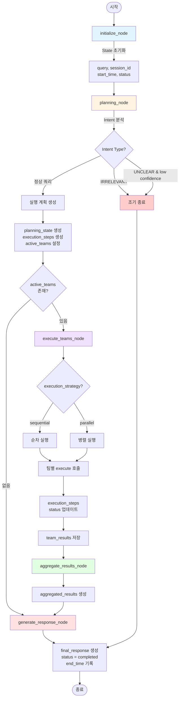
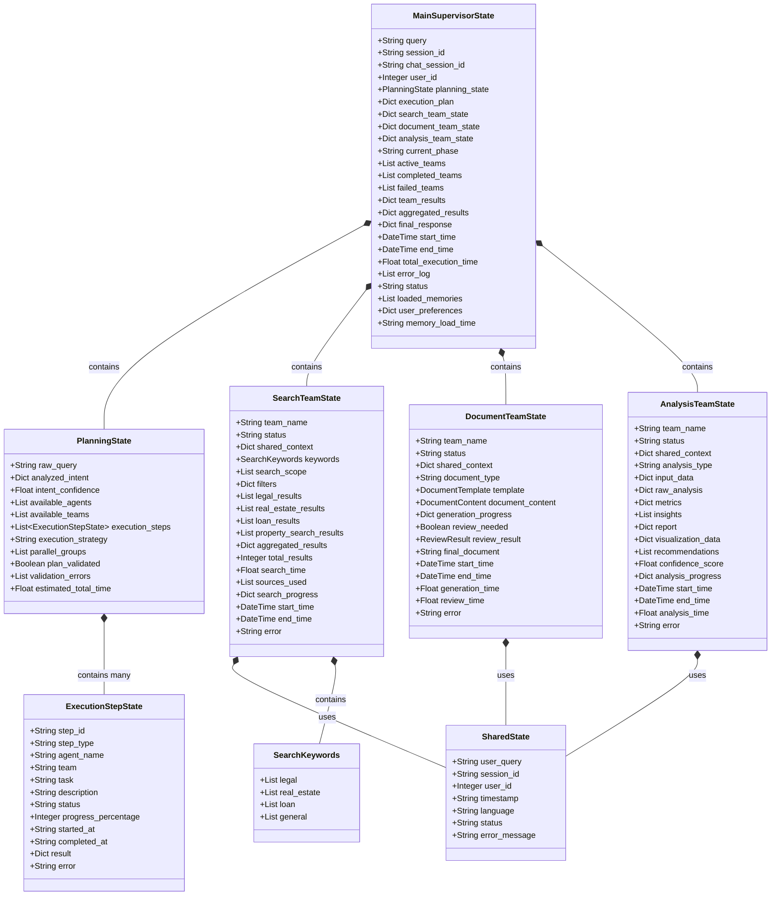
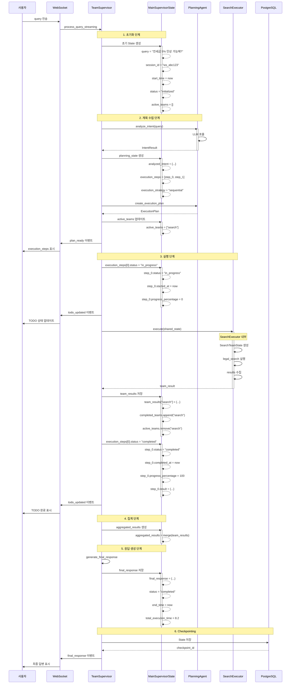
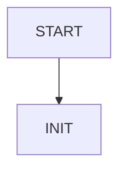

# LangGraph State 관리 시각화
**작성일**: 2025-10-20
**프로젝트**: 홈즈냥즈 부동산 AI 챗봇
**LangGraph 버전**: 0.6

---

## 목차
1. [State Flow Diagram](#1-state-flow-diagram) - 노드별 State 변화 흐름
2. [State Class Diagram](#2-state-class-diagram) - TypedDict 계층 구조
3. [State Sequence Diagram](#3-state-sequence-diagram) - 시간순 State 업데이트
4. [State Type Schema](#4-state-type-schema) - TypeScript 스타일 타입 정의

---

## 1. State Flow Diagram
### 전체 워크플로우 State 변화



### State 변화 요약

| 노드 | State 업데이트 필드 | 설명 |
|------|---------------------|------|
| **initialize_node** | query, session_id, user_id, start_time, status, active_teams, completed_teams, failed_teams | 초기 State 생성 |
| **planning_node** | planning_state, execution_plan, active_teams, loaded_memories, user_preferences | 의도 분석 및 계획 수립 |
| **execute_teams_node** | execution_steps[].status, team_results, completed_teams | 팀별 실행 및 결과 저장 |
| **aggregate_results_node** | aggregated_results | 팀 결과 집계 |
| **generate_response_node** | final_response, status, end_time | 최종 응답 생성 |

---

## 2. State Class Diagram
### TypedDict 계층 구조



### State 계층 구조 설명

```
MainSupervisorState (최상위)
├── PlanningState (계획 수립)
│   └── ExecutionStepState[] (실행 단계 목록)
├── SearchTeamState (검색 팀)
│   ├── SharedState (공유 컨텍스트)
│   └── SearchKeywords (검색 키워드)
├── DocumentTeamState (문서 팀)
│   └── SharedState (공유 컨텍스트)
└── AnalysisTeamState (분석 팀)
    └── SharedState (공유 컨텍스트)
```

**특징**:
- MainSupervisorState가 모든 팀 State를 포함
- PlanningState는 ExecutionStepState 배열 관리
- 모든 팀은 SharedState를 통해 기본 정보 공유
- 각 팀은 독립적인 State 구조 유지

---

## 3. State Sequence Diagram
### 시간순 State 업데이트 흐름



### 주요 State 업데이트 시점

| 시점 | State 필드 | 값 |
|------|-----------|-----|
| **T1: 초기화** | query, session_id, start_time, status | 사용자 입력 설정 |
| **T2: 계획 완료** | planning_state, execution_plan, active_teams | 실행 계획 생성 |
| **T3: 실행 시작** | execution_steps[0].status, started_at | "in_progress" |
| **T4: 실행 완료** | execution_steps[0].status, completed_at, result | "completed" |
| **T5: 팀 결과** | team_results, completed_teams, active_teams | 팀별 결과 저장 |
| **T6: 집계** | aggregated_results | 결과 병합 |
| **T7: 응답 생성** | final_response, status, end_time | "completed" |
| **T8: 저장** | PostgreSQL checkpoints 테이블 | State 영구 저장 |

---

## 4. State Type Schema
### TypeScript 스타일 타입 정의

```typescript
// ============================================================================
// Main Supervisor State (최상위 State)
// ============================================================================

interface MainSupervisorState {
  // 1. 필수 필드
  query: string;                          // 사용자 질문
  session_id: string;                     // WebSocket 세션 ID
  chat_session_id?: string;               // 채팅 세션 ID (DB 저장용)
  request_id: string;                     // 요청 고유 ID
  user_id?: number;                       // 사용자 ID (Long-term Memory)

  // 2. 계획 관련
  planning_state?: PlanningState;         // 계획 수립 결과
  execution_plan?: {                      // 실행 계획
    intent: string;
    strategy: "sequential" | "parallel";
    steps: any[];
  };

  // 3. 팀별 State
  search_team_state?: Record<string, any>;
  document_team_state?: Record<string, any>;
  analysis_team_state?: Record<string, any>;

  // 4. 실행 추적
  current_phase: string;                  // 현재 단계
  active_teams: string[];                 // 실행 중인 팀
  completed_teams: string[];              // 완료된 팀
  failed_teams: string[];                 // 실패한 팀

  // 5. 결과
  team_results: Record<string, any>;      // 팀별 결과
  aggregated_results: Record<string, any>; // 집계된 결과
  final_response?: {                      // 최종 응답
    type: string;
    answer: string;
    structured_data: any;
  };

  // 6. 타이밍
  start_time?: string;                    // ISO datetime
  end_time?: string;                      // ISO datetime
  total_execution_time?: number;          // 총 실행 시간 (초)

  // 7. 에러 처리
  error_log: string[];
  status: "initialized" | "processing" | "completed" | "error";

  // 8. Long-term Memory
  loaded_memories?: Array<{               // 로드된 대화 기록
    conversation_id: string;
    query: string;
    response: string;
    timestamp: string;
  }>;
  user_preferences?: Record<string, any>; // 사용자 선호도
  memory_load_time?: string;              // Memory 로딩 시각
}

// ============================================================================
// Planning State (계획 수립)
// ============================================================================

interface PlanningState {
  raw_query: string;                      // 원본 질문
  analyzed_intent: {                      // 의도 분석 결과
    intent_type: string;
    confidence: number;
    keywords: string[];
    entities: Record<string, any>;
  };
  intent_confidence: number;              // 의도 신뢰도 (0.0~1.0)

  available_agents: string[];             // 사용 가능한 Agent 목록
  available_teams: string[];              // 사용 가능한 팀 목록

  execution_steps: ExecutionStepState[];  // 실행 단계 (TODO 리스트)
  execution_strategy: "sequential" | "parallel";
  parallel_groups?: string[][];           // 병렬 실행 그룹

  plan_validated: boolean;                // 계획 검증 여부
  validation_errors: string[];
  estimated_total_time: number;           // 예상 실행 시간 (초)
}

// ============================================================================
// Execution Step State (실행 단계 - WebSocket TODO)
// ============================================================================

interface ExecutionStepState {
  // 식별 정보
  step_id: string;                        // "step_0", "step_1" ...
  step_type: string;                      // planning|search|document|analysis
  agent_name: string;                     // "search_team"
  team: string;                           // "search"

  // 작업 정보
  task: string;                           // "법률 정보 검색"
  description: string;                    // "전세금 인상률 한도 조회"

  // 상태 추적
  status: "pending" | "in_progress" | "completed" | "failed" | "skipped";
  progress_percentage: number;            // 0-100

  // 타이밍
  started_at?: string;                    // ISO datetime
  completed_at?: string;                  // ISO datetime

  // 결과/에러
  result?: Record<string, any>;
  error?: string;
}

// ============================================================================
// Shared State (팀 간 공유)
// ============================================================================

interface SharedState {
  user_query: string;                     // 사용자 질문
  session_id: string;                     // 세션 ID
  user_id?: number;                       // 사용자 ID
  timestamp: string;                      // ISO datetime
  language: string;                       // "ko" | "en"
  status: "pending" | "processing" | "completed" | "error";
  error_message?: string;
}

// ============================================================================
// Team States (팀별 State)
// ============================================================================

interface SearchTeamState {
  team_name: string;                      // "search"
  status: string;
  shared_context: Record<string, any>;    // SharedState

  // 검색 설정
  keywords?: {
    legal: string[];
    real_estate: string[];
    loan: string[];
    general: string[];
  };
  search_scope: string[];                 // ["legal", "real_estate", "loan"]
  filters: Record<string, any>;

  // 검색 결과
  legal_results: Array<Record<string, any>>;
  real_estate_results: Array<Record<string, any>>;
  loan_results: Array<Record<string, any>>;
  property_search_results: Array<Record<string, any>>;
  aggregated_results: Record<string, any>;

  // 메타데이터
  total_results: number;
  search_time: number;
  sources_used: string[];
  search_progress: Record<string, string>;

  // 실행 추적
  start_time?: string;
  end_time?: string;
  error?: string;
  current_search?: string;
  execution_strategy?: string;
}

interface DocumentTeamState {
  team_name: string;
  status: string;
  shared_context: Record<string, any>;

  // 문서 정보
  document_type: string;                  // "lease_contract", "sales_contract"
  template?: {
    template_id: string;
    template_name: string;
    template_content: string;
    placeholders: string[];
  };
  document_content?: {
    title: string;
    content: string;
    metadata: Record<string, any>;
    created_at: string;
  };
  generation_progress: Record<string, string>;

  // 검토
  review_needed: boolean;
  review_result?: {
    reviewed: boolean;
    risk_level: string;
    risks: Array<Record<string, any>>;
    recommendations: string[];
    compliance_check: Record<string, boolean>;
  };
  final_document?: string;

  // 타이밍
  start_time?: string;
  end_time?: string;
  generation_time?: number;
  review_time?: number;
  error?: string;
}

interface AnalysisTeamState {
  team_name: string;
  status: string;
  shared_context: Record<string, any>;

  // 분석 정보
  analysis_type: string;                  // "market", "risk", "comprehensive"
  input_data: Record<string, any>;

  // 분석 결과
  raw_analysis: Record<string, any>;
  metrics: Record<string, number>;
  insights: string[];
  report: Record<string, any>;
  visualization_data?: Record<string, any>;
  recommendations: string[];
  confidence_score: number;

  // 진행 상황
  analysis_progress: Record<string, string>;

  // 타이밍
  start_time?: string;
  end_time?: string;
  analysis_time?: number;
  error?: string;
}

// ============================================================================
// Type Utilities
// ============================================================================

// State 업데이트 헬퍼 타입
type StateUpdate<T> = Partial<T>;

// State 검증 결과
interface StateValidationResult {
  is_valid: boolean;
  errors: string[];
}

// State 전환 로그
interface StateTransitionLog {
  timestamp: string;
  from_status: string;
  to_status: string;
  field_changed: string;
  old_value: any;
  new_value: any;
}
```

### 타입 스키마 사용 예시

```typescript
// 1. State 초기화
const initialState: MainSupervisorState = {
  query: "전세금 5% 인상 가능해?",
  session_id: "ws_abc123",
  request_id: "req_1729411200",
  user_id: 1,
  current_phase: "initialization",
  active_teams: [],
  completed_teams: [],
  failed_teams: [],
  team_results: {},
  aggregated_results: {},
  error_log: [],
  status: "initialized"
};

// 2. Planning State 생성
const planningState: PlanningState = {
  raw_query: "전세금 5% 인상 가능해?",
  analyzed_intent: {
    intent_type: "LEGAL_CONSULT",
    confidence: 0.9,
    keywords: ["전세금", "인상", "5%"],
    entities: {}
  },
  intent_confidence: 0.9,
  available_agents: ["search_team"],
  available_teams: ["search"],
  execution_steps: [
    {
      step_id: "step_0",
      step_type: "search",
      agent_name: "search_team",
      team: "search",
      task: "법률 정보 검색",
      description: "전세금 인상 한도 법률 조회",
      status: "pending",
      progress_percentage: 0
    }
  ],
  execution_strategy: "sequential",
  plan_validated: true,
  validation_errors: [],
  estimated_total_time: 3.5
};

// 3. State 업데이트
const updatedState: StateUpdate<MainSupervisorState> = {
  planning_state: planningState,
  active_teams: ["search"],
  current_phase: "planning"
};
```

---

## 5. State 변화 실제 예시

### 예시: "전세금 5% 인상 가능해?" 쿼리 처리

#### Step 1: 초기화 (initialize_node)
```json
{
  "query": "전세금 5% 인상 가능해?",
  "session_id": "ws_abc123",
  "user_id": 1,
  "request_id": "req_1729411200",
  "status": "initialized",
  "start_time": "2025-10-20T14:30:00",
  "current_phase": "initialization",
  "active_teams": [],
  "completed_teams": [],
  "failed_teams": [],
  "team_results": {},
  "aggregated_results": {},
  "error_log": [],
  "loaded_memories": null,
  "user_preferences": null
}
```

#### Step 2: 계획 수립 (planning_node)
```json
{
  "current_phase": "planning",
  "planning_state": {
    "raw_query": "전세금 5% 인상 가능해?",
    "analyzed_intent": {
      "intent_type": "LEGAL_CONSULT",
      "confidence": 0.9,
      "keywords": ["전세금", "인상", "5%"]
    },
    "execution_steps": [
      {
        "step_id": "step_0",
        "step_type": "search",
        "status": "pending",
        "progress_percentage": 0
      }
    ],
    "execution_strategy": "sequential"
  },
  "active_teams": ["search"]
}
```

#### Step 3: 실행 중 (execute_teams_node)
```json
{
  "current_phase": "executing",
  "planning_state": {
    "execution_steps": [
      {
        "step_id": "step_0",
        "status": "in_progress",
        "progress_percentage": 0,
        "started_at": "2025-10-20T14:30:05"
      }
    ]
  }
}
```

#### Step 4: 실행 완료
```json
{
  "planning_state": {
    "execution_steps": [
      {
        "step_id": "step_0",
        "status": "completed",
        "progress_percentage": 100,
        "started_at": "2025-10-20T14:30:05",
        "completed_at": "2025-10-20T14:30:07",
        "result": {
          "legal_results": [...],
          "total_results": 1
        }
      }
    ]
  },
  "team_results": {
    "search": {
      "legal_results": [...],
      "total_results": 1
    }
  },
  "completed_teams": ["search"],
  "active_teams": []
}
```

#### Step 5: 최종 응답
```json
{
  "current_phase": "response_generation",
  "final_response": {
    "type": "answer",
    "answer": "네, 전세금 5% 인상은 법적으로 가능합니다...",
    "structured_data": {
      "sections": [...],
      "metadata": {
        "confidence": 0.95,
        "sources": ["주택임대차보호법 제7조"]
      }
    }
  },
  "status": "completed",
  "end_time": "2025-10-20T14:30:08",
  "total_execution_time": 8.2
}
```

---

## 6. 사용 가이드

### 6.1 Mermaid 다이어그램 렌더링 방법

#### GitHub/GitLab
```markdown

\```
```

#### VSCode
- Extension: "Markdown Preview Mermaid Support"
- 또는 "Mermaid Editor" 사용

#### 온라인 에디터
- https://mermaid.live/
- 코드 복사 → 붙여넣기 → 실시간 미리보기

### 6.2 TypeScript 스키마 활용

#### Python TypedDict 변환
```python
# TypeScript → Python TypedDict
class MainSupervisorState(TypedDict, total=False):
    query: str
    session_id: str
    planning_state: Optional[PlanningState]
    # ...
```

#### JSON Schema 생성
```bash
npm install -g typescript
tsc --declaration state_schema.ts
# .d.ts 파일 → JSON Schema 변환 도구 사용
```

---

## 7. 참고 자료

### 관련 문서
- [report_of_state_management_251020.md](./report_of_state_management_251020.md) - State 관리 상세 보고서
- [report_of_architecture_251020.md](./report_of_architecture_251020.md) - 전체 아키텍처 보고서

### State 관리 핵심 파일
- [separated_states.py](../../backend/app/service_agent/foundation/separated_states.py) - State TypedDict 정의
- [team_supervisor.py](../../backend/app/service_agent/supervisor/team_supervisor.py) - State 업데이트 로직

### Mermaid 문법
- [Mermaid 공식 문서](https://mermaid.js.org/)
- [Flowchart 문법](https://mermaid.js.org/syntax/flowchart.html)
- [Class Diagram 문법](https://mermaid.js.org/syntax/classDiagram.html)
- [Sequence Diagram 문법](https://mermaid.js.org/syntax/sequenceDiagram.html)

---

**문서 끝**
