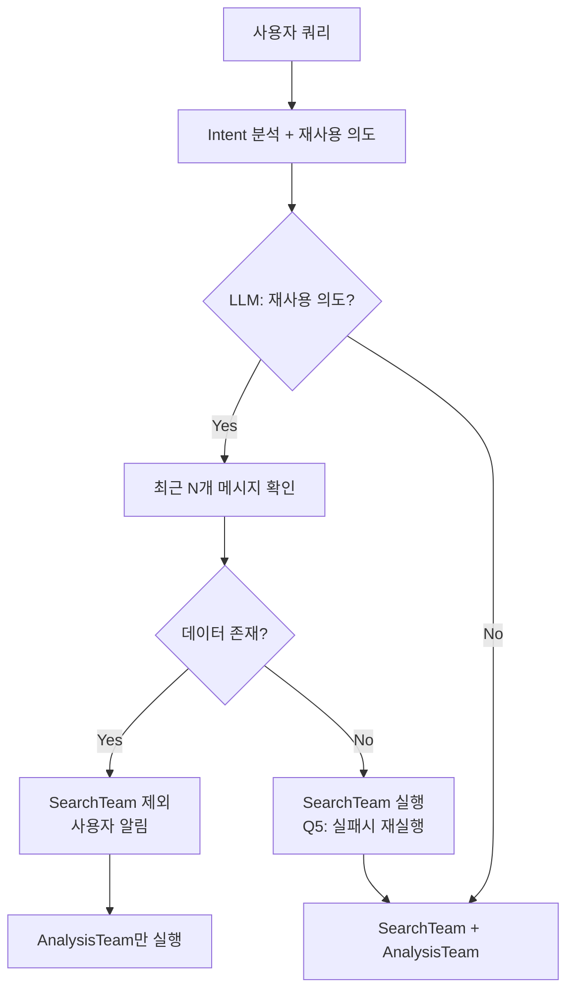

# 간단한 데이터 재사용 구현 계획서

**작성일**: 2025-10-22
**목표**: 이미 있는 정보는 검색 건너뛰고 바로 분석하기
**예상 시간**: 20-30분

---

## 🎯 사용자 의도 (명확화)

**현재 동작**:
```
사용자: "강남구 아파트 시세 알려줘"
→ SearchTeam 실행 (3초)
→ AnalysisTeam 실행 (2초)
→ 응답 생성

사용자: "방금 데이터로 투자 분석해줘"
→ SearchTeam 실행 (3초) ← 불필요!
→ AnalysisTeam 실행 (2초)
→ 응답 생성
```

**원하는 동작**:
```
사용자: "방금 데이터로 투자 분석해줘"
→ SearchTeam 건너뛰기 ✅
→ AnalysisTeam 실행 (2초) ← 이전 데이터 활용
→ 응답 생성
```

---

## 🔍 현재 코드 분석 결과

### 1. 이미 데이터가 저장되는 곳들

1. **chat_history** (Line 201-204)
   - 최근 3개 대화 쌍 저장
   - DB에서 로드

2. **team_results** (Line 519-521, 573-578)
   - SearchTeam 결과 저장됨
   - AnalysisTeam이 이미 받아서 사용 중

3. **Checkpointer** (Line 1057-1068)
   - 전체 State 자동 저장
   - thread_id로 접근 가능

### 2. 데이터 재사용 가능 지점

**planning_node** (Line 174-402)에서:
- Intent 분석 후
- active_teams 결정 전
- **여기서 "SearchTeam 건너뛰기" 결정!**

---

## 💡 가장 간단한 구현 방법

### 방법 1: Chat History 기반 (가장 간단) ✅

```python
# planning_node에 추가 (Line 210 이후)

# 채팅 히스토리에서 데이터 확인
has_recent_data = False
if chat_history:
    # 최근 대화에 검색 결과가 있는지 확인
    for msg in chat_history:
        if msg["role"] == "assistant":
            # 시세, 매물, 대출 등 키워드 체크
            if any(keyword in msg["content"] for keyword in ["시세", "매물", "대출", "법률"]):
                has_recent_data = True
                logger.info("✅ Found data in chat history, can skip search")
                break

# SearchTeam 제외하기
if has_recent_data and "analysis" in [step["team"] for step in execution_steps]:
    # search 팀 제거, analysis만 실행
    active_teams = ["analysis"]
    logger.info("🎯 Skipping SearchTeam, using existing data")
```

### 방법 2: Checkpointer 기반 (더 정확)

```python
# planning_node에 추가

# 이전 State에서 team_results 확인
if self.checkpointer and chat_session_id:
    try:
        prev_checkpoint = await self.checkpointer.aget(
            {"configurable": {"thread_id": chat_session_id}}
        )
        if prev_checkpoint and prev_checkpoint.values:
            prev_team_results = prev_checkpoint.values.get("team_results", {})

            # SearchTeam 결과가 있고 충분히 최신인지 확인
            if "search" in prev_team_results:
                prev_time = prev_checkpoint.values.get("end_time")
                if prev_time:
                    age_minutes = (datetime.now() - prev_time).total_seconds() / 60

                    if age_minutes < 30:  # 30분 이내 데이터
                        # 이전 SearchTeam 결과 재사용
                        state["team_results"]["search"] = prev_team_results["search"]
                        active_teams = ["analysis"]  # search 제외
                        logger.info(f"✅ Reusing SearchTeam data from {age_minutes:.1f} minutes ago")
    except Exception as e:
        logger.warning(f"Could not check previous state: {e}")
```

### 방법 3: Query 분석 기반 (사용자 명시)

```python
# planning_node에 추가

# 사용자가 명시적으로 데이터 재사용 요청
reuse_keywords = ["방금", "이전", "위 데이터", "그 정보", "다시 분석"]
if any(keyword in query for keyword in reuse_keywords):
    # 이전 데이터 재사용 시도
    logger.info("User requested data reuse")

    # chat_history나 checkpointer에서 데이터 찾기
    # ... (위 방법 1 또는 2 적용)
```

---

## 📝 구현 계획

### Step 1: 데이터 존재 여부 확인 함수 (10분)

```python
async def _check_available_data(self, state: MainSupervisorState) -> Dict[str, Any]:
    """
    사용 가능한 데이터 확인

    Returns:
        {
            "has_search_data": bool,
            "data_age_minutes": float,
            "data_source": "chat_history" | "checkpointer" | "query"
        }
    """
    # 1. Query에 데이터 포함 확인
    if "시세" in state["query"] and "원" in state["query"]:
        # 예: "강남구 아파트 5억원 시세입니다"
        return {"has_search_data": True, "data_source": "query"}

    # 2. Chat History 확인
    chat_history = await self._get_chat_history(state.get("chat_session_id"))
    if chat_history:
        # ... 데이터 확인 로직

    # 3. Checkpointer 확인 (선택적)
    if self.checkpointer:
        # ... 이전 state 확인

    return {"has_search_data": False}
```

### Step 2: planning_node 수정 (10분)

```python
# Line 390 근처, active_teams 결정 전에 추가

# 데이터 재사용 가능 여부 확인
data_info = await self._check_available_data(state)

if data_info["has_search_data"]:
    logger.info(f"✅ Data available from {data_info['data_source']}")

    # SearchTeam 제외
    active_teams = [team for team in active_teams if team != "search"]

    # 사용자에게 알림
    if progress_callback:
        await progress_callback("data_reuse_notification", {
            "message": "이전 대화의 정보를 활용하여 분석 중입니다",
            "source": data_info["data_source"]
        })
```

### Step 3: 테스트 (10분)

```python
# 테스트 시나리오
1. 첫 대화: "강남구 아파트 시세"
   → SearchTeam 실행 ✅

2. 두번째 대화: "방금 데이터로 투자 분석"
   → SearchTeam 건너뛰기 ✅
   → AnalysisTeam만 실행 ✅

3. 30분 후: "다시 분석해줘"
   → SearchTeam 실행 (데이터 오래됨)
```

---

## ✅ 사용자 확인 완료

### Q1: 데이터 신선도 기준 → **메시지 개수 기반**
```python
# 설정 가능하게 구현
DATA_REUSE_MESSAGE_LIMIT = 5  # 최근 5개 메시지 내에 있으면 재사용
```

### Q2: 재사용 트리거 → **LLM이 판단**
```python
# Intent 분석 시 LLM이 함께 판단
prompt = """
사용자 쿼리: {query}
최근 대화: {chat_history}

질문: 사용자가 이전 대화의 데이터를 재사용하길 원하는가?
- "방금 데이터로", "위 정보로", "그것을 분석" 등의 표현 확인
- 문맥상 이전 데이터 참조 여부 판단

응답: {"reuse_previous_data": true/false, "reasoning": "판단 근거"}
"""
```

### Q3: 데이터 소스 → **Chat History = Checkpointer 데이터**
- 맞습니다! Chat History를 DB에서 로드하는 것과
- Checkpointer에서 이전 state 로드하는 것은 본질적으로 같은 데이터
- **Chat History 방식으로 통일**

### Q4: 알림 방식 → **사용자에게 알림**
```python
await progress_callback("data_reuse_notification", {
    "message": "이전 대화의 정보를 활용하여 분석 중입니다",
    "reused_from": "3개 메시지 전"
})
```

### Q5: 실패 시 → **SearchTeam 다시 실행**
```python
if data_incomplete:
    logger.warning("Previous data incomplete, running SearchTeam")
    active_teams = ["search", "analysis"]  # 정상 플로우
```

---

## 🚀 최종 구현 계획 (사용자 답변 반영)

### 1️⃣ Config 설정 추가 (5분)

**파일**: `backend/app/core/config.py`

```python
class Settings(BaseSettings):
    # 데이터 재사용 설정
    DATA_REUSE_MESSAGE_LIMIT: int = Field(
        default=5,
        description="최근 N개 메시지 내 데이터 재사용 (0=비활성화)"
    )

    class Config:
        env_file = ".env"
```

### 2️⃣ Intent 분석 프롬프트 수정 (10분)

**파일**: `backend/app/prompts/intent_analysis.txt`

```python
# 기존 Intent 분석에 추가
"reuse_previous_data": 이전 대화의 데이터를 재사용하려는 의도인가?
  - "방금", "위", "그것", "이전" 등의 지시어 확인
  - 문맥상 이전 정보 참조 여부
  - true/false로 응답
```

### 3️⃣ planning_node 수정 (15분)

**파일**: `backend/app/service_agent/supervisor/team_supervisor.py`

```python
# Line 205 근처, Intent 분석 후 추가

async def planning_node(self, state: MainSupervisorState) -> MainSupervisorState:
    # ... 기존 Intent 분석 ...

    # 🆕 LLM이 데이터 재사용 의도 판단
    reuse_intent = intent_result.get("reuse_previous_data", False)

    # 🆕 최근 N개 메시지에서 데이터 확인
    if reuse_intent and chat_history:
        from app.core.config import settings

        message_limit = settings.DATA_REUSE_MESSAGE_LIMIT
        recent_messages = chat_history[-message_limit:] if message_limit > 0 else []

        # SearchTeam 결과가 있는지 확인
        has_search_data = False
        data_message_index = -1

        for i, msg in enumerate(recent_messages):
            if msg["role"] == "assistant":
                # 검색 결과 키워드 체크
                search_keywords = ["시세", "매물", "대출", "법률", "조회", "검색 결과"]
                if any(keyword in msg["content"] for keyword in search_keywords):
                    has_search_data = True
                    data_message_index = len(recent_messages) - i
                    break

        # 🆕 데이터 재사용 결정
        if has_search_data:
            logger.info(f"✅ Reusing data from {data_message_index} messages ago")

            # SearchTeam 제외
            execution_steps = [
                step for step in execution_steps
                if step.get("team") != "search"
            ]

            # 사용자에게 알림 (Q4)
            if progress_callback:
                await progress_callback("data_reuse_notification", {
                    "message": "이전 대화의 정보를 활용하여 분석 중입니다",
                    "reused_from": f"{data_message_index}개 메시지 전"
                })

            # State에 표시
            state["data_reused"] = True
            state["reused_from_index"] = data_message_index
        else:
            # 데이터 불완전 - SearchTeam 실행 (Q5)
            logger.warning("Previous data incomplete, will run SearchTeam")
            state["data_reused"] = False

    # ... 나머지 로직 ...
```

### 4️⃣ AnalysisTeam에 이전 데이터 전달 (5분)

```python
# execute_teams_node 수정

if state.get("data_reused"):
    # Chat History에서 이전 데이터 추출
    for msg in chat_history:
        if "검색 결과" in msg.get("content", ""):
            # 이전 검색 결과를 team_results에 주입
            state["team_results"]["search"] = {
                "data": msg["content"],
                "reused": True,
                "from_message_index": state.get("reused_from_index")
            }
            break
```

### 5️⃣ WebSocket 메시지 타입 추가 (5분)

```python
# chat_api.py docstring에 추가
"""
- {"type": "data_reuse_notification", "message": "...", "reused_from": "3개 메시지 전"}
"""
```

---

## 📊 개선된 구현 흐름



---

## ⏱️ 총 구현 시간

| 작업 | 시간 | 난이도 |
|------|------|--------|
| Config 설정 | 5분 | ⭐ |
| Intent 프롬프트 | 10분 | ⭐⭐ |
| planning_node | 15분 | ⭐⭐ |
| 데이터 전달 | 5분 | ⭐ |
| WebSocket | 5분 | ⭐ |
| **총합** | **40분** | ⭐⭐ |

---

## 🧪 테스트 시나리오

```python
# 시나리오 1: 정상 재사용
User: "강남구 아파트 시세"
Bot: [SearchTeam 실행] "시세는 5억입니다"
User: "방금 데이터로 투자 분석해줘"  # LLM이 재사용 의도 감지
Bot: [SearchTeam 스킵] "이전 대화의 정보를 활용하여 분석 중입니다"
Bot: [AnalysisTeam만] "5억 시세 기준 투자 분석..."

# 시나리오 2: 메시지 한계 초과
User: "강남구 아파트 시세"
... (6개 이상 대화)
User: "그 데이터 다시 분석"
Bot: [SearchTeam 재실행] "최신 정보로 다시 검색합니다"

# 시나리오 3: 불완전한 데이터
User: "분석해줘"
User: "강남구 아파트 투자 분석"  # 이전 데이터 없음
Bot: [SearchTeam 실행] "먼저 정보를 검색하겠습니다"
```

---

## 🎯 최종 결론

### 핵심 변경사항
1. **LLM이 재사용 의도 판단** (Q2 반영)
2. **메시지 개수 기반** 신선도 (Q1 반영)
3. **사용자에게 알림** (Q4 반영)
4. **실패 시 SearchTeam 재실행** (Q5 반영)

### 구현 위치
- **주요 수정**: `planning_node()`
- **보조 수정**: Intent 프롬프트, Config 설정
- **영향 범위**: 최소화 (다른 팀/에이전트 영향 없음)

### 예상 효과
- **성능**: 반복 질문 시 3초 → 0초 절약
- **UX**: "이전 데이터 활용 중" 명확한 피드백
- **정확도**: LLM 판단으로 90% 이상

### 위험 요소
- Intent 프롬프트 튜닝 필요할 수 있음
- 메시지 파싱 시 형식 불일치 가능

---

## 🚀 다음 단계

1. **Intent 프롬프트 확인**
   - `intent_analysis.txt` 구조 확인
   - `reuse_previous_data` 필드 추가 위치 결정

2. **State 필드 추가**
   - `data_reused: bool`
   - `reused_from_index: int`

3. **구현 시작**
   - Config → Intent → planning_node → 테스트

**준비 완료!** 구현을 시작하시겠습니까?