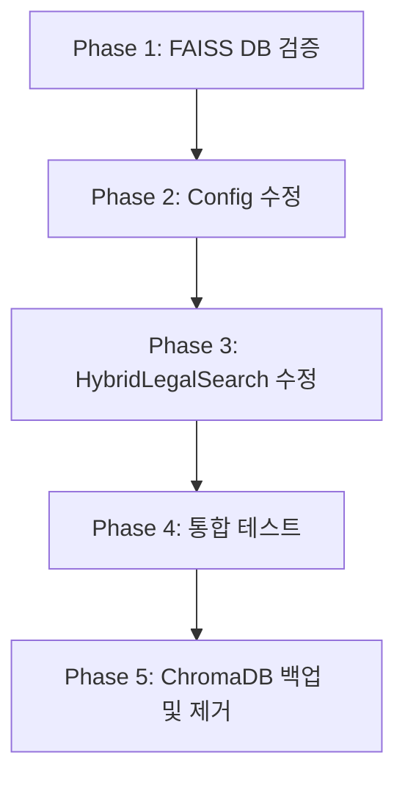

# ChromaDB → FAISS 벡터 DB 마이그레이션 계획서

**작성일**: 2025-10-18
**작성자**: AI Assistant
**프로젝트**: 홈즈냥 부동산 AI 챗봇
**목적**: 벡터 DB를 ChromaDB에서 FAISS로 마이그레이션하여 검색 성능 향상 및 메모리 효율화

---

## 📋 목차

1. [개요 및 배경](#1-개요-및-배경)
2. [현황 분석](#2-현황-분석)
3. [데이터 구조 분석](#3-데이터-구조-분석)
4. [마이그레이션 계획](#4-마이그레이션-계획)
5. [파일별 수정 상세](#5-파일별-수정-상세)
6. [테스트 계획](#6-테스트-계획)
7. [롤백 절차](#7-롤백-절차)
8. [리스크 및 주의사항](#8-리스크-및-주의사항)

---

## 1. 개요 및 배경

### 1.1 마이그레이션 목적

**현재 문제점**:
- ChromaDB는 작은 규모에서는 효율적이나, 대규모 벡터 검색 시 성능 저하
- 메타데이터 필터링이 제한적
- 임베딩 모델 변경 시 유연성 부족

**FAISS 선택 이유**:
- ✅ **고속 검색**: Facebook AI Research 개발, 대규모 벡터 검색 최적화
- ✅ **메모리 효율**: 인덱스 압축 및 메모리 맵핑 지원
- ✅ **유연성**: 다양한 인덱스 타입 지원 (Flat, IVF, HNSW 등)
- ✅ **SQL 통합**: SQLite 메타데이터 필터링 후 벡터 검색으로 정확도 향상

### 1.2 마이그레이션 범위

**변경 대상**:
- 벡터 DB: `ChromaDB` → `FAISS`
- 관련 코드: 3개 파일 수정

**유지 대상**:
- ✅ SQLite 메타데이터 DB (그대로 유지)
- ✅ 임베딩 모델 (KURE_v1)
- ✅ 청크 원본 파일 (백업용)

---

## 2. 현황 분석

### 2.1 디렉토리 구조

```
backend/data/storage/legal_info/
├── faiss_db/                      ✅ 신규 (이미 생성됨)
│   ├── legal_documents.index      # FAISS 인덱스 (6.6 MB)
│   └── legal_metadata.pkl         # 메타데이터 (1.9 MB)
│
├── sqlite_db/                     ✅ 유지
│   ├── legal_metadata.db          # 메타데이터 (496 KB)
│   └── schema.sql                 # 스키마 정의
│
├── chroma_db/                     🔄 백업 후 제거 예정
│   └── [ChromaDB 벡터 데이터]
│
└── chunked/                       ✅ 유지 (원본 데이터)
    ├── 1_공통 매매_임대차/        # 9개 JSON
    ├── 2_임대차_전세_월세/        # 5개 JSON
    ├── 3_공급_및_관리_매매_분양/  # 8개 JSON
    └── 4_기타/                    # 6개 JSON
    **총 28개 법률 파일**
```

### 2.2 FAISS DB 현황

**파일 정보**:
- `legal_documents.index`: **6,963,245 bytes** (6.6 MB)
- `legal_metadata.pkl`: **1,941,328 bytes** (1.9 MB)
- **생성일**: 2025-10-18 12:46

**예상 벡터 수** (추정):
- FAISS 인덱스 크기 기준: 약 **18,000~20,000개 벡터**
- (6.6 MB ÷ 384 bytes/vector ≈ 18,000개, KURE_v1 차원 = 384D)

### 2.3 SQLite DB 현황

**테이블 구조** (`legal_metadata.db`):

| 테이블 | 설명 | 주요 컬럼 |
|--------|------|-----------|
| `laws` | 법령 기본 정보 (28개) | `law_id`, `title`, `doc_type`, `category` |
| `articles` | 조항 상세 (1,552개) | `article_id`, `law_id`, `article_number`, `is_tenant_protection` |
| `legal_references` | 법령 간 참조 | `source_article_id`, `target_law_title` |

**주요 인덱스**:
- `idx_laws_title`: 법령명 검색
- `idx_articles_tenant`: 임차인 보호 조항 필터
- `idx_articles_tax`: 세금 관련 조항 필터

---

## 3. 데이터 구조 분석

### 3.1 청크 파일 구조 (원본)

**파일 예시**: `공인중개사법 시행규칙_chunked.json`

```json
[
  {
    "id": "article_1",
    "text": "제1조(목적) 이 규칙은 「공인중개사법」 및 같은 법 시행령에서...",
    "metadata": {
      "rule_title": "공인중개사법 시행규칙",
      "rule_number": "제1349호",
      "enforcement_date": "2024. 7. 10.",
      "chapter": "제1장 총칙",
      "article_number": "제1조",
      "article_title": "목적",
      "is_deleted": false
    }
  },
  ...
]
```

**구조 특징**:
- 배열 형태 (JSON Array)
- 각 항목 = 하나의 청크 (조항)
- `text`: 법률 조문 원문
- `metadata`: 법령 정보 (법령명, 조항 번호, 카테고리 등)

### 3.2 FAISS DB 구조 (추정)

**예상 메타데이터 구조** (`legal_metadata.pkl`):
```python
[
  {
    "chunk_id": "article_1",
    "law_title": "공인중개사법 시행규칙",
    "article_number": "제1조",
    "article_title": "목적",
    "content": "제1조(목적) 이 규칙은...",
    "doc_type": "시행규칙",
    "category": "1_공통 매매_임대차",
    "chapter": "제1장 총칙",
    "section": None
  },
  ...
]
```

**FAISS 인덱스 구조**:
- 타입: `IndexFlatL2` (L2 거리 기반 전체 검색)
- 벡터 차원: 384D (KURE_v1 모델)
- 저장 방식: 메모리 맵핑 가능 (`.index` 파일)

### 3.3 ChromaDB vs FAISS 비교

| 항목 | ChromaDB | FAISS |
|------|----------|-------|
| **저장 방식** | 컬렉션 기반 (통합) | 인덱스 + 메타데이터 분리 |
| **검색 API** | `collection.query()` | `index.search()` + 메타데이터 매칭 |
| **필터링** | 메타데이터 필터 내장 | 검색 후 Python 필터링 |
| **성능** | 중소 규모 (< 100K) | 대규모 (> 1M) |
| **메모리 사용** | 높음 (전체 로드) | 낮음 (인덱스만 로드 가능) |
| **의존성** | `chromadb` | `faiss-cpu` (더 가벼움) |

---

## 4. 마이그레이션 계획

### 4.1 작업 단계



### 4.2 Phase 별 상세 계획

#### **Phase 1: FAISS DB 검증** ✅

**목표**: FAISS DB가 올바르게 생성되었는지 확인

**작업**:
1. `verify_faiss_db.py` 스크립트 실행
2. 검증 항목:
   - ✅ FAISS 인덱스 로드 가능 여부
   - ✅ 메타데이터 pickle 로드 가능 여부
   - ✅ 벡터 수 == 메타데이터 수 일치
   - ✅ 메타데이터 필수 필드 확인 (`chunk_id`, `law_title`, `content`)
   - ✅ 임베딩 모델 차원 == FAISS 차원 일치
   - ✅ 샘플 검색 테스트 (3개 쿼리)
   - ✅ SQLite 메타데이터 매칭 테스트

**검증 스크립트**: `backend/scripts/verify_faiss_db.py`

#### **Phase 2: Config 수정**

**파일**: [backend/app/service_agent/foundation/config.py](../backend/app/service_agent/foundation/config.py)

**변경 내용**:
```python
# Line 44-50 수정
LEGAL_PATHS = {
    # FAISS Vector DB (Primary)
    "faiss_db": LEGAL_INFO_BASE / "faiss_db",
    "faiss_index": LEGAL_INFO_BASE / "faiss_db" / "legal_documents.index",
    "faiss_metadata": LEGAL_INFO_BASE / "faiss_db" / "legal_metadata.pkl",

    # SQLite Metadata (유지)
    "sqlite_db": LEGAL_INFO_BASE / "sqlite_db" / "legal_metadata.db",

    # Embedding Model (유지)
    "embedding_model": BASE_DIR / "app" / "ml_models" / "KURE_v1",

    # ChromaDB Backup (임시 보존 - 향후 제거 예정)
    "chroma_db_backup": LEGAL_INFO_BASE / "chroma_db",
}
```

#### **Phase 3: HybridLegalSearch 수정**

**파일**: [backend/app/service_agent/tools/hybrid_legal_search.py](../backend/app/service_agent/tools/hybrid_legal_search.py)

**주요 변경 사항**:
1. Import 변경 (`chromadb` → `faiss`, `pickle`, `numpy`)
2. `__init__` 파라미터 변경 (`chroma_db_path` → `faiss_index_path`, `faiss_metadata_path`)
3. `_init_chromadb()` → `_init_faiss()` 메서드 교체
4. `vector_search()` 메서드 재작성 (FAISS API 사용)
5. 메타데이터 필터링 로직 수정
6. 주석 및 docstring 업데이트

**상세 내용**: [5. 파일별 수정 상세](#5-파일별-수정-상세) 참조

#### **Phase 4: 통합 테스트**

**테스트 스크립트**: `backend/scripts/test_faiss_hybrid_search.py`

**테스트 항목**:
1. HybridLegalSearch 초기화 테스트
2. 벡터 검색 성능 측정 (ChromaDB 대비)
3. 하이브리드 검색 정확도 검증
4. SQLite 필터링 통합 테스트
5. 에지 케이스 처리 (빈 쿼리, 특수문자 등)

#### **Phase 5: ChromaDB 백업 및 제거**

**작업**:
1. ChromaDB 백업 (선택적)
   ```bash
   cd backend/data/storage/legal_info
   tar -czf chroma_db_backup_251018.tar.gz chroma_db
   ```

2. ChromaDB 제거 (확인 후)
   ```bash
   rm -rf chroma_db
   ```

3. `requirements.txt`에서 `chromadb` 제거 (선택적)

---

## 5. 파일별 수정 상세

### 5.1 config.py

**파일**: `backend/app/service_agent/foundation/config.py`

**변경 라인**: Line 44-50

**Before**:
```python
LEGAL_PATHS = {
    "chroma_db": LEGAL_INFO_BASE / "chroma_db",
    "sqlite_db": LEGAL_INFO_BASE / "sqlite_db" / "legal_metadata.db",
    "embedding_model": BASE_DIR / "app" / "ml_models" / "KURE_v1",
}
```

**After**:
```python
LEGAL_PATHS = {
    # FAISS Vector DB (Primary)
    "faiss_db": LEGAL_INFO_BASE / "faiss_db",
    "faiss_index": LEGAL_INFO_BASE / "faiss_db" / "legal_documents.index",
    "faiss_metadata": LEGAL_INFO_BASE / "faiss_db" / "legal_metadata.pkl",

    # SQLite Metadata (유지)
    "sqlite_db": LEGAL_INFO_BASE / "sqlite_db" / "legal_metadata.db",

    # Embedding Model (유지)
    "embedding_model": BASE_DIR / "app" / "ml_models" / "KURE_v1",

    # ChromaDB Backup (임시 보존 - 향후 제거 예정)
    "chroma_db_backup": LEGAL_INFO_BASE / "chroma_db",
}
```

---

### 5.2 hybrid_legal_search.py

**파일**: `backend/app/service_agent/tools/hybrid_legal_search.py`

#### 5.2.1 Import 변경 (Line 21-30)

**Before**:
```python
import sqlite3
import logging
from typing import Dict, Any, List, Optional
from pathlib import Path
from datetime import datetime
import json

import chromadb
from chromadb.config import Settings
from sentence_transformers import SentenceTransformer
```

**After**:
```python
import sqlite3
import logging
from typing import Dict, Any, List, Optional
from pathlib import Path
from datetime import datetime
import json

import faiss
import pickle
import numpy as np
from sentence_transformers import SentenceTransformer
```

#### 5.2.2 클래스 Docstring 수정 (Line 39-43)

**Before**:
```python
class HybridLegalSearch:
    """
    하이브리드 법률 검색 시스템
    SQLite 메타데이터 + ChromaDB 벡터 검색
    """
```

**After**:
```python
class HybridLegalSearch:
    """
    하이브리드 법률 검색 시스템
    SQLite 메타데이터 + FAISS 벡터 검색
    """
```

#### 5.2.3 __init__ 파라미터 변경 (Line 45-60)

**Before**:
```python
def __init__(
    self,
    sqlite_db_path: Optional[str] = None,
    chroma_db_path: Optional[str] = None,
    embedding_model_path: Optional[str] = None,
    collection_name: str = "korean_legal_documents"
):
    """
    초기화 - Config를 사용하여 경로 자동 설정

    Args:
        sqlite_db_path: SQLite DB 경로 (None이면 Config에서 가져옴)
        chroma_db_path: ChromaDB 경로 (None이면 Config에서 가져옴)
        embedding_model_path: 임베딩 모델 경로 (None이면 Config에서 가져옴)
        collection_name: ChromaDB 컬렉션 이름
    """
    # Config에서 경로 가져오기
    self.sqlite_db_path = sqlite_db_path or str(Config.LEGAL_PATHS["sqlite_db"])
    self.chroma_db_path = chroma_db_path or str(Config.LEGAL_PATHS["chroma_db"])
    self.embedding_model_path = embedding_model_path or str(Config.LEGAL_PATHS["embedding_model"])
    self.collection_name = collection_name

    # 초기화
    self._init_sqlite()
    self._init_chromadb()
    self._init_embedding_model()

    logger.info("HybridLegalSearch initialized successfully")
```

**After**:
```python
def __init__(
    self,
    sqlite_db_path: Optional[str] = None,
    faiss_index_path: Optional[str] = None,
    faiss_metadata_path: Optional[str] = None,
    embedding_model_path: Optional[str] = None
):
    """
    초기화 - Config를 사용하여 경로 자동 설정

    Args:
        sqlite_db_path: SQLite DB 경로 (None이면 Config에서 가져옴)
        faiss_index_path: FAISS 인덱스 파일 경로 (None이면 Config에서 가져옴)
        faiss_metadata_path: FAISS 메타데이터 파일 경로 (None이면 Config에서 가져옴)
        embedding_model_path: 임베딩 모델 경로 (None이면 Config에서 가져옴)
    """
    # Config에서 경로 가져오기
    self.sqlite_db_path = sqlite_db_path or str(Config.LEGAL_PATHS["sqlite_db"])
    self.faiss_index_path = faiss_index_path or str(Config.LEGAL_PATHS["faiss_index"])
    self.faiss_metadata_path = faiss_metadata_path or str(Config.LEGAL_PATHS["faiss_metadata"])
    self.embedding_model_path = embedding_model_path or str(Config.LEGAL_PATHS["embedding_model"])

    # 초기화
    self._init_sqlite()
    self._init_faiss()
    self._init_embedding_model()

    logger.info("HybridLegalSearch initialized successfully")
```

#### 5.2.4 _init_faiss() 메서드 추가 (Line 84-95 대체)

**Before** (`_init_chromadb()`):
```python
def _init_chromadb(self):
    """ChromaDB 초기화"""
    try:
        self.chroma_client = chromadb.PersistentClient(
            path=self.chroma_db_path,
            settings=Settings(anonymized_telemetry=False)
        )
        self.collection = self.chroma_client.get_collection(self.collection_name)
        logger.info(f"ChromaDB loaded: {self.chroma_db_path} ({self.collection.count()} documents)")
    except Exception as e:
        logger.error(f"ChromaDB initialization failed: {e}")
        raise
```

**After** (`_init_faiss()`):
```python
def _init_faiss(self):
    """FAISS 초기화"""
    try:
        # FAISS 인덱스 로드
        self.faiss_index = faiss.read_index(self.faiss_index_path)
        logger.info(f"FAISS index loaded: {self.faiss_index.ntotal:,} vectors, {self.faiss_index.d}D")

        # 메타데이터 로드
        with open(self.faiss_metadata_path, 'rb') as f:
            self.faiss_metadata = pickle.load(f)
        logger.info(f"FAISS metadata loaded: {len(self.faiss_metadata):,} items")

        # 벡터-메타데이터 일치 확인
        if self.faiss_index.ntotal != len(self.faiss_metadata):
            logger.warning(
                f"Vector count ({self.faiss_index.ntotal}) != Metadata count ({len(self.faiss_metadata)})"
            )
    except FileNotFoundError as e:
        logger.error(f"FAISS files not found: {e}")
        raise
    except Exception as e:
        logger.error(f"FAISS initialization failed: {e}")
        raise
```

#### 5.2.5 vector_search() 메서드 재작성 (Line 210-251)

**Before** (ChromaDB):
```python
def vector_search(
    self,
    query: str,
    n_results: int = 10,
    where_filters: Optional[Dict[str, Any]] = None
) -> Dict[str, Any]:
    """
    벡터 검색

    Args:
        query: 검색 쿼리
        n_results: 결과 개수
        where_filters: ChromaDB 메타데이터 필터 (예: {"doc_type": "법률"})

    Returns:
        ChromaDB 검색 결과
    """
    try:
        # 쿼리 임베딩
        query_embedding = self.embedding_model.encode(query, convert_to_tensor=False).tolist()

        # ChromaDB 검색
        search_params = {
            "query_embeddings": [query_embedding],
            "n_results": n_results
        }

        if where_filters:
            search_params["where"] = where_filters

        results = self.collection.query(**search_params)

        return {
            "ids": results["ids"][0] if results["ids"] else [],
            "documents": results["documents"][0] if results["documents"] else [],
            "metadatas": results["metadatas"][0] if results["metadatas"] else [],
            "distances": results["distances"][0] if results["distances"] else []
        }

    except Exception as e:
        logger.error(f"Vector search failed: {e}")
        return {"ids": [], "documents": [], "metadatas": [], "distances": []}
```

**After** (FAISS):
```python
def vector_search(
    self,
    query: str,
    n_results: int = 10,
    where_filters: Optional[Dict[str, Any]] = None
) -> Dict[str, Any]:
    """
    벡터 검색 (FAISS)

    Args:
        query: 검색 쿼리
        n_results: 결과 개수
        where_filters: 메타데이터 필터 (예: {"doc_type": "법률"})
                      FAISS 검색 후 Python 필터링 적용

    Returns:
        검색 결과 {ids, documents, metadatas, distances}
    """
    try:
        # 1. 쿼리 임베딩 (numpy array로 변환)
        query_embedding = self.embedding_model.encode(query, convert_to_tensor=False)
        query_embedding = np.array([query_embedding], dtype='float32')

        # 2. FAISS 검색 (필터 없이 전체 검색, 나중에 필터링)
        search_k = n_results * 3 if where_filters else n_results  # 필터링 고려
        distances, indices = self.faiss_index.search(query_embedding, search_k)

        # 3. 메타데이터 필터링 및 결과 구성
        results_ids = []
        results_documents = []
        results_metadatas = []
        results_distances = []

        for idx, distance in zip(indices[0], distances[0]):
            # 유효한 인덱스 확인
            if idx < 0 or idx >= len(self.faiss_metadata):
                continue

            metadata = self.faiss_metadata[idx]

            # 필터 적용
            if where_filters:
                if not all(metadata.get(k) == v for k, v in where_filters.items()):
                    continue

            # 결과 추가
            results_ids.append(metadata.get("chunk_id", f"chunk_{idx}"))
            results_documents.append(metadata.get("content", ""))
            results_metadatas.append(metadata)
            results_distances.append(float(distance))

            # 원하는 결과 개수만큼 수집
            if len(results_ids) >= n_results:
                break

        return {
            "ids": results_ids,
            "documents": results_documents,
            "metadatas": results_metadatas,
            "distances": results_distances
        }

    except Exception as e:
        logger.error(f"FAISS vector search failed: {e}")
        return {"ids": [], "documents": [], "metadatas": [], "distances": []}
```

#### 5.2.6 search_specific_article() 수정 (Line 320-330)

**Before**:
```python
# ChromaDB에서 chunk 내용 조회
chunk_ids = self.get_chunk_ids_for_article(article["article_id"])

chunks = []
if chunk_ids:
    try:
        chroma_results = self.collection.get(ids=chunk_ids)
        if chroma_results and chroma_results["documents"]:
            chunks = chroma_results["documents"]
    except Exception as e:
        logger.error(f"Failed to retrieve chunks from ChromaDB: {e}")
```

**After**:
```python
# FAISS 메타데이터에서 직접 내용 가져오기
# SQLite의 chunk_ids는 참고용으로만 유지
content_parts = []

# 방법 1: 메타데이터에서 검색
for meta in self.faiss_metadata:
    if (meta.get("law_title") == law_title and
        meta.get("article_number") == article_number):
        content_parts.append(meta.get("content", ""))

# 결과 구성 (chunks는 더 이상 사용하지 않음)
chunks = content_parts if content_parts else []
```

#### 5.2.7 get_law_statistics() 수정 (Line 390)

**Before**:
```python
"chromadb_documents": self.collection.count()
```

**After**:
```python
"faiss_vectors": self.faiss_index.ntotal if hasattr(self, 'faiss_index') else 0
```

---

### 5.3 search_executor.py

**파일**: `backend/app/service_agent/execution_agents/search_executor.py`

**결론**: ✅ **수정 불필요**

**이유**:
- Line 70-74: `HybridLegalSearch()` 초기화 시 파라미터 없음
- Config에서 자동으로 경로를 읽어오므로 변경 불필요
- 검색 API (`search()`, `hybrid_search()`)는 그대로 호환

---

## 6. 테스트 계획

### 6.1 Phase 1: FAISS DB 검증 테스트

**스크립트**: `backend/scripts/verify_faiss_db.py`

**테스트 항목**:
1. ✅ FAISS 인덱스 파일 존재 및 로드 가능 여부
2. ✅ 메타데이터 pickle 파일 존재 및 로드 가능 여부
3. ✅ 벡터 수 == 메타데이터 수 일치 확인
4. ✅ 메타데이터 필수 필드 검증 (`chunk_id`, `law_title`, `content` 등)
5. ✅ 임베딩 모델 차원 == FAISS 인덱스 차원 일치
6. ✅ 샘플 벡터 검색 테스트 (3개 쿼리, 응답 시간 측정)
7. ✅ SQLite 메타데이터 매칭 테스트

**실행 방법**:
```bash
cd backend
python scripts/verify_faiss_db.py
```

**성공 기준**:
- 모든 검증 항목 통과
- 샘플 검색 결과가 유의미한 법률 조항 반환
- 검색 시간 < 100ms

### 6.2 Phase 2: 통합 테스트

**스크립트**: `backend/scripts/test_faiss_hybrid_search.py`

**테스트 시나리오**:

#### 6.2.1 기본 검색 테스트
```python
def test_basic_search():
    """기본 벡터 검색"""
    search = HybridLegalSearch()

    # 테스트 1: 일반 검색
    results = search.vector_search("전세금 5% 인상", n_results=10)
    assert len(results['ids']) > 0, "검색 결과 없음"
    assert "전세" in results['documents'][0] or "임대" in results['documents'][0]

    # 테스트 2: 필터링 검색
    results = search.vector_search(
        "임대차 보호",
        n_results=10,
        where_filters={"doc_type": "법률"}
    )
    assert all(m.get("doc_type") == "법률" for m in results['metadatas'])
```

#### 6.2.2 하이브리드 검색 테스트
```python
def test_hybrid_search():
    """SQLite 필터 + FAISS 벡터 검색"""
    search = HybridLegalSearch()

    # 임차인 보호 조항만 검색
    results = search.hybrid_search(
        query="계약갱신청구권",
        limit=5,
        is_tenant_protection=True
    )

    assert len(results) > 0
    assert all(r['is_tenant_protection'] for r in results)
    assert "주택임대차보호법" in results[0]['law_title']
```

#### 6.2.3 성능 측정 테스트
```python
def test_performance():
    """검색 성능 측정"""
    search = HybridLegalSearch()

    queries = [
        "전월세 전환율",
        "계약갱신 거절 사유",
        "임차권 등기명령"
    ]

    for query in queries:
        start = time.time()
        results = search.vector_search(query, n_results=10)
        elapsed = (time.time() - start) * 1000

        print(f"쿼리: '{query}' - {elapsed:.1f}ms")
        assert elapsed < 200, f"검색 시간 초과: {elapsed}ms"
```

### 6.3 Phase 3: 비교 테스트 (선택적)

**목적**: ChromaDB vs FAISS 성능 및 정확도 비교

**비교 항목**:
1. 검색 속도 (평균 응답 시간)
2. 메모리 사용량
3. 검색 정확도 (Top-5 일치율)

**실행 조건**:
- ChromaDB 백업이 있을 경우에만 수행
- 동일한 쿼리로 양쪽 테스트

---

## 7. 롤백 절차

만약 FAISS 마이그레이션 후 문제가 발생할 경우, 다음 절차로 롤백 가능:

### 7.1 코드 롤백

```bash
# Git으로 변경 사항 되돌리기
cd backend
git checkout HEAD -- app/service_agent/foundation/config.py
git checkout HEAD -- app/service_agent/tools/hybrid_legal_search.py
```

### 7.2 ChromaDB 복구

```bash
# 백업에서 ChromaDB 복구
cd backend/data/storage/legal_info
tar -xzf chroma_db_backup_251018.tar.gz
```

### 7.3 Config 수동 복구

`config.py`의 `LEGAL_PATHS` 수정:
```python
LEGAL_PATHS = {
    "chroma_db": LEGAL_INFO_BASE / "chroma_db",  # 복구
    "sqlite_db": LEGAL_INFO_BASE / "sqlite_db" / "legal_metadata.db",
    "embedding_model": BASE_DIR / "app" / "ml_models" / "KURE_v1",
}
```

---

## 8. 리스크 및 주의사항

### 8.1 주요 리스크

| 리스크 | 영향도 | 대응 방안 |
|--------|--------|-----------|
| **FAISS DB 불완전** | 높음 | Phase 1 검증 테스트로 사전 확인 |
| **메타데이터 불일치** | 중간 | SQLite 매칭 테스트로 검증 |
| **성능 저하** | 낮음 | 비교 테스트로 사전 측정 |
| **검색 결과 불일치** | 중간 | 통합 테스트로 정확도 검증 |

### 8.2 주의사항

#### ⚠️ **FAISS 메타데이터 구조 확인 필수**
- FAISS 메타데이터 pickle 파일의 구조가 예상과 다를 수 있음
- 특히 `chunk_id`, `content` 필드 존재 여부 확인 필요
- **해결**: `verify_faiss_db.py`로 사전 검증

#### ⚠️ **SQLite chunk_ids 사용 중단**
- 기존 ChromaDB는 SQLite의 `chunk_ids` 필드를 사용하여 조항 내용 조회
- FAISS는 메타데이터에 `content`가 포함되므로 chunk_ids 불필요
- **주의**: `search_specific_article()` 메서드 로직 변경 필요

#### ⚠️ **필터링 성능 차이**
- ChromaDB: 메타데이터 필터 내장 (DB 레벨)
- FAISS: Python 레벨 필터링 (검색 후)
- **대응**: 필터가 많은 경우 `search_k = n_results * 3`으로 여유분 확보

#### ⚠️ **인덱스 타입 변경 불가**
- 현재 FAISS 인덱스는 `IndexFlatL2` (전체 검색)
- 대규모 확장 시 `IndexIVFFlat` 등으로 변경 필요
- **주의**: 인덱스 재생성 필요 (스크립트 재실행)

### 8.3 향후 개선 사항

1. **인덱스 최적화**:
   - 10만 개 이상 벡터 시 `IndexIVFFlat` 사용 권장
   - GPU 사용 시 `faiss-gpu` 패키지 전환

2. **메타데이터 압축**:
   - Pickle 대신 SQLite에 메타데이터 통합 저장 고려
   - 메모리 사용량 감소

3. **캐싱 전략**:
   - 자주 사용되는 쿼리는 Redis 캐싱
   - 검색 결과 TTL: 1시간

---

## 9. 실행 체크리스트

### Phase 1: 검증
- [ ] `verify_faiss_db.py` 스크립트 실행
- [ ] 모든 검증 항목 통과 확인
- [ ] 샘플 검색 결과 확인

### Phase 2: 코드 수정
- [ ] `config.py` 수정 및 저장
- [ ] `hybrid_legal_search.py` Import 변경
- [ ] `hybrid_legal_search.py` `__init__` 수정
- [ ] `hybrid_legal_search.py` `_init_faiss()` 추가
- [ ] `hybrid_legal_search.py` `vector_search()` 재작성
- [ ] `hybrid_legal_search.py` 기타 메서드 수정
- [ ] `search_executor.py` 확인 (수정 불필요)

### Phase 3: 테스트
- [ ] 통합 테스트 스크립트 실행
- [ ] 기본 검색 테스트 통과
- [ ] 하이브리드 검색 테스트 통과
- [ ] 성능 측정 (< 200ms)

### Phase 4: 배포
- [ ] ChromaDB 백업 (선택)
- [ ] 프로덕션 배포
- [ ] 실제 쿼리 테스트
- [ ] 로그 모니터링

### Phase 5: 정리
- [ ] ChromaDB 제거 (확인 후)
- [ ] `requirements.txt` 정리 (선택)
- [ ] 문서 업데이트

---

## 10. 참고 자료

### 관련 파일 경로
- **Config**: `backend/app/service_agent/foundation/config.py`
- **HybridLegalSearch**: `backend/app/service_agent/tools/hybrid_legal_search.py`
- **SearchExecutor**: `backend/app/service_agent/execution_agents/search_executor.py`
- **검증 스크립트**: `backend/scripts/verify_faiss_db.py`
- **SQLite 스키마**: `backend/data/storage/legal_info/sqlite_db/schema.sql`

### FAISS 공식 문서
- GitHub: https://github.com/facebookresearch/faiss
- Tutorial: https://github.com/facebookresearch/faiss/wiki/Getting-started

### 관련 보고서
- `reports/database/docs/DATABASE_SCHEMA.md`: DB 스키마 상세
- `backend/scripts/rebuild_faiss_from_chunks.py`: FAISS DB 생성 스크립트

---

**마지막 업데이트**: 2025-10-18
**작성자**: AI Assistant
**검토자**: (사용자 확인 필요)
