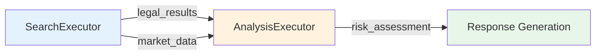
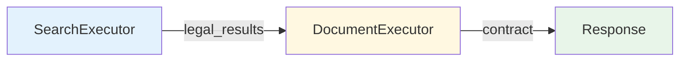
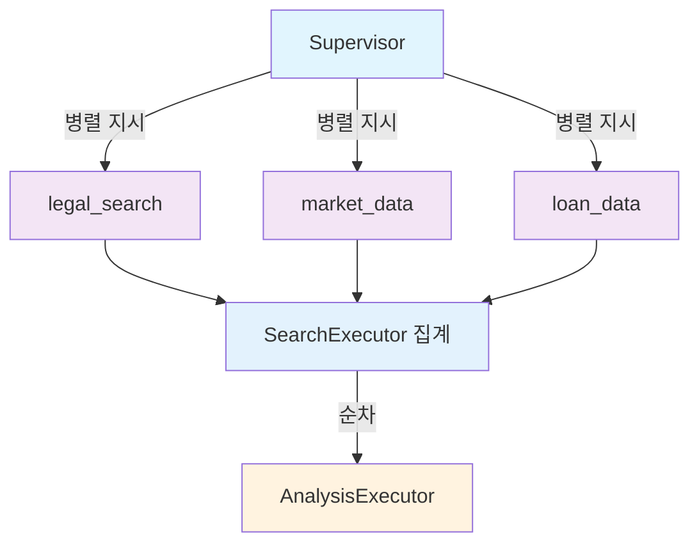

# 에이전트별 LLM 호출 및 도구 관리 상세 전략

**작성일**: 2025-10-15
**연관 문서**: [IMPLEMENTATION_PLAN.md](./IMPLEMENTATION_PLAN.md)

---

## 📋 목차

1. [개요](#-개요)
2. [SearchExecutor 전략](#-searchexecutor-전략)
3. [AnalysisExecutor 전략](#-analysisexecutor-전략)
4. [DocumentExecutor 전략](#-documentexecutor-전략)
5. [도구 간 협업 패턴](#-도구-간-협업-패턴)
6. [LLM 프롬프트 최적화](#-llm-프롬프트-최적화)

---

## 🎯 개요

### 전략 원칙

1. **중앙 집중 vs 분산 균형**
   - Supervisor: 전략적 도구 선택 (어떤 도구를?)
   - Executor: 전술적 도구 사용 (어떻게 사용?)

2. **LLM 호출 최소화**
   - 중복 제거: Supervisor가 이미 결정한 것은 재호출 금지
   - 캐싱: 유사 쿼리 결과 재사용

3. **도구 독립성 유지**
   - 각 도구는 독립적으로 작동 가능
   - 도구 간 의존성은 Supervisor가 관리

---

## 🔍 SearchExecutor 전략

### 현재 구조

[search_executor.py:28-909](backend/app/service_agent/execution_agents/search_executor.py#L28-L909)

```python
class SearchExecutor:
    """
    검색 실행 Agent
    법률, 부동산, 대출 검색 작업을 실행
    """

    # 현재 보유 도구:
    # 1. legal_search (HybridLegalSearch) - pgvector 기반
    # 2. market_data (MarketDataTool) - PostgreSQL 시세
    # 3. real_estate_search (RealEstateSearchTool) - 개별 매물
    # 4. loan_data (LoanDataTool) - 대출 상품

    # 현재 LLM 호출:
    # - keyword_extraction (동기, LLM #4)
    # - tool_selection_search (비동기, LLM #5)
```

### 개선 전략

#### 1. LLM 호출 재구성

**Before (현재)**:
```
사용자 쿼리
  ↓
keyword_extraction (LLM #4) → {legal: [...], real_estate: [...], ...}
  ↓
tool_selection_search (LLM #5) → ["legal_search", "market_data"]
  ↓
도구 실행
```

**After (개선)**:
```
사용자 쿼리
  ↓
Supervisor의 tool_orchestration (LLM #5) → 도구 목록 + 파라미터
  ↓
SearchExecutor:
  - keyword_extraction은 선택적 (Supervisor가 이미 추출했다면 스킵)
  - tool_selection_search 제거 (중복)
  ↓
도구 실행 (Supervisor 지시대로)
```

#### 2. 구현 상세

**파일**: `backend/app/service_agent/execution_agents/search_executor.py`

##### 2.1 새 실행 메서드 추가

```python
async def execute_with_orchestration(
    self,
    shared_state: SharedState,
    tool_selection: Dict[str, Any]
) -> SearchTeamState:
    """
    Supervisor의 도구 오케스트레이션 결과를 반영한 실행

    Args:
        shared_state: 공유 상태
        tool_selection: {
            "selected_tools": [
                {
                    "tool_name": "legal_search",
                    "priority": 1,
                    "parameters": {"limit": 10, "is_tenant_protection": true},
                    "reason": "...",
                    "expected_quality": 0.85
                }
            ],
            "skipped_tools": [
                {"tool_name": "market_data", "reason": "Already used"}
            ],
            "optimization_notes": "...",
            "quality_threshold": 0.7
        }
    """
    logger.info(f"[SearchExecutor] Executing with orchestration")

    # 1. 초기 상태 생성
    initial_state = self._create_initial_state(shared_state, tool_selection)

    # 2. 키워드 추출 (선택적)
    if not tool_selection.get("keywords_provided"):
        # Supervisor가 키워드를 제공하지 않았으면 LLM 호출
        initial_state["keywords"] = await self._extract_keywords_async(
            shared_state.get("query", "")
        )
    else:
        # 이미 제공됨 (LLM 호출 절약)
        initial_state["keywords"] = tool_selection.get("keywords", {})

    # 3. 도구 범위 설정 (Supervisor 지시)
    allowed_tools = [t["tool_name"] for t in tool_selection.get("selected_tools", [])]
    initial_state["search_scope"] = allowed_tools
    initial_state["tool_parameters"] = {
        t["tool_name"]: t.get("parameters", {})
        for t in tool_selection.get("selected_tools", [])
    }

    # 4. 서브그래프 실행
    final_state = await self.app.ainvoke(initial_state)

    # 5. 품질 검증
    self._validate_quality(final_state, tool_selection.get("quality_threshold", 0.7))

    return final_state


def _create_initial_state(
    self,
    shared_state: SharedState,
    tool_selection: Dict[str, Any]
) -> SearchTeamState:
    """초기 상태 생성"""
    return SearchTeamState(
        team_name=self.team_name,
        status="pending",
        shared_context=shared_state,
        keywords={},
        search_scope=[],
        filters={},
        legal_results=[],
        real_estate_results=[],
        loan_results=[],
        property_search_results=[],
        aggregated_results={},
        total_results=0,
        search_time=0.0,
        sources_used=[],
        search_progress={},
        start_time=None,
        end_time=None,
        error=None,
        current_search=None,
        execution_strategy=None,
        # 새 필드
        orchestration_metadata={
            "supervisor_guided": True,
            "tool_selection": tool_selection,
            "llm_calls_saved": 1 if tool_selection.get("keywords_provided") else 0
        }
    )


async def _extract_keywords_async(self, query: str) -> SearchKeywords:
    """비동기 키워드 추출 (LLM 호출)"""
    try:
        result = await self.llm_service.complete_json_async(
            prompt_name="keyword_extraction",
            variables={"query": query},
            temperature=0.1,
            max_tokens=300  # 최적화
        )

        return SearchKeywords(
            legal=result.get("legal", []),
            real_estate=result.get("real_estate", []),
            loan=result.get("loan", []),
            general=result.get("general", [])
        )
    except Exception as e:
        logger.error(f"Keyword extraction failed: {e}")
        return self._extract_keywords_with_patterns(query)


def _validate_quality(self, state: SearchTeamState, threshold: float):
    """결과 품질 검증"""
    total_results = state.get("total_results", 0)
    sources_used = state.get("sources_used", [])

    # 품질 점수 계산
    quality_score = 0.0

    if total_results > 0:
        quality_score += 0.5

    if len(sources_used) >= 2:
        quality_score += 0.3

    if state.get("legal_results"):
        quality_score += 0.2

    logger.info(f"[SearchExecutor] Quality score: {quality_score} (threshold: {threshold})")

    if quality_score < threshold:
        logger.warning(
            f"[SearchExecutor] Quality below threshold: {quality_score} < {threshold}"
        )
        # 경고만 하고 실패는 아님 (부분 결과도 유용)

    state["quality_score"] = quality_score
```

##### 2.2 execute_search_node 수정

```python
async def execute_search_node(self, state: SearchTeamState) -> SearchTeamState:
    """
    검색 실행 노드
    Supervisor가 제공한 도구 선택 정보 사용
    """
    logger.info("[SearchTeam] Executing searches")

    # Supervisor 오케스트레이션 정보 확인
    orchestration = state.get("orchestration_metadata", {})
    tool_selection = orchestration.get("tool_selection", {})

    if tool_selection:
        # Supervisor 가이드 실행
        allowed_tools = [t["tool_name"] for t in tool_selection.get("selected_tools", [])]
        tool_params = {
            t["tool_name"]: t.get("parameters", {})
            for t in tool_selection.get("selected_tools", [])
        }
    else:
        # Fallback: 기존 방식 (LLM 호출)
        query = state.get("shared_context", {}).get("query", "")
        tool_selection_result = await self._select_tools_with_llm(query, state.get("keywords"))
        allowed_tools = tool_selection_result.get("selected_tools", [])
        tool_params = {}

    # 도구 실행
    if "legal_search" in allowed_tools and self.legal_search_tool:
        await self._execute_legal_search(state, tool_params.get("legal_search", {}))

    if "market_data" in allowed_tools and self.market_data_tool:
        await self._execute_market_search(state, tool_params.get("market_data", {}))

    if "real_estate_search" in allowed_tools and self.real_estate_search_tool:
        await self._execute_property_search(state, tool_params.get("real_estate_search", {}))

    if "loan_data" in allowed_tools and self.loan_data_tool:
        await self._execute_loan_search(state, tool_params.get("loan_data", {}))

    return state


async def _execute_legal_search(self, state: SearchTeamState, params: Dict[str, Any]):
    """법률 검색 실행 (파라미터 커스터마이징)"""
    try:
        query = state.get("shared_context", {}).get("query", "")

        # Supervisor가 제공한 파라미터 사용
        search_params = {
            "limit": params.get("limit", 10),
            "is_tenant_protection": params.get("is_tenant_protection", False),
            **params  # 추가 파라미터
        }

        result = await self.legal_search_tool.search(query, search_params)

        if result.get("status") == "success":
            state["legal_results"] = self._format_legal_results(result.get("data", []))
            state["search_progress"]["legal_search"] = "completed"
            logger.info(f"[SearchTeam] Legal search completed: {len(state['legal_results'])} results")
        else:
            state["search_progress"]["legal_search"] = "failed"

    except Exception as e:
        logger.error(f"Legal search failed: {e}")
        state["search_progress"]["legal_search"] = "failed"
```

#### 3. LLM 호출 시나리오

##### 시나리오 A: Supervisor 가이드 (권장)

```
Supervisor (tool_orchestration):
  - LLM 호출 1회
  - 전체 시스템 관점에서 도구 선택
  - 파라미터 최적화
  ↓
SearchExecutor:
  - LLM 호출 0회 (도구 선택 생략)
  - 도구 실행만
```

**총 LLM 호출**: 1회 (Supervisor만)

##### 시나리오 B: Fallback (Supervisor 실패 시)

```
Supervisor (tool_orchestration):
  - LLM 호출 실패 또는 빈 결과
  ↓
SearchExecutor:
  - keyword_extraction: LLM 호출 1회
  - tool_selection_search: LLM 호출 1회
  - 도구 실행
```

**총 LLM 호출**: 2회 (기존 방식)

### 도구별 세부 전략

#### legal_search (HybridLegalSearch)

**특징**:
- pgvector 임베딩 검색
- 고정밀 법률 조항 검색
- 비용: 중간 (임베딩 계산)

**최적화**:
- 이미 사용되었으면 재검색 금지
- Supervisor가 결과 품질 낮다고 판단하면 파라미터 조정 후 재검색

**파라미터**:
```python
{
    "limit": 10,  # 결과 수
    "is_tenant_protection": true,  # 임차인 보호 조항 필터
    "min_relevance": 0.7,  # 최소 관련도
    "law_types": ["주택임대차보호법", "민법"]  # 법률 범위
}
```

#### market_data (MarketDataTool)

**특징**:
- PostgreSQL 시세 통계
- 지역별 평균/최소/최대
- 비용: 낮음 (DB 쿼리)

**최적화**:
- 캐싱 가능 (같은 지역 재요청 시)
- real_estate_search와 병렬 실행 가능

**파라미터**:
```python
{
    "region": "강남구",
    "property_type": "APARTMENT",
    "include_trends": true,  # 시세 동향 포함
    "time_range": "1year"  # 1년치 데이터
}
```

#### real_estate_search (RealEstateSearchTool)

**특징**:
- 개별 매물 검색
- 9,738개 매물 대상
- 비용: 중간 (DB 쿼리 + 필터링)

**최적화**:
- market_data와 결과 공유 가능
- 중개사 정보는 선택적 (include_agent)

**파라미터**:
```python
{
    "region": "서초구",
    "property_type": "APARTMENT",
    "min_price": 300000000,
    "max_price": 800000000,
    "min_area": 60.0,  # m²
    "max_area": 100.0,
    "include_nearby": true,  # 주변 시설 정보
    "include_transactions": true,  # 실거래가 내역
    "include_agent": false  # 중개사 정보 (선택적)
}
```

#### loan_data (LoanDataTool)

**특징**:
- 대출 상품 검색
- ~50개 상품
- 비용: 낮음

**최적화**:
- 자주 사용되므로 캐싱 권장
- 사용자 조건 필터링

**파라미터**:
```python
{
    "loan_type": "전세자금대출",
    "max_interest_rate": 4.5,
    "min_ltv": 70,  # 최소 LTV
    "income_range": "중위소득 50-100%"
}
```

---

## 📊 AnalysisExecutor 전략

### 현재 구조

[analysis_executor.py](backend/app/service_agent/execution_agents/analysis_executor.py)

```python
class AnalysisExecutor:
    """
    분석 실행 Agent
    데이터 분석, 리스크 평가, 인사이트 생성
    """

    # 현재 보유 도구:
    # 1. ContractAnalysisTool - 계약서 리스크 분석
    # 2. MarketAnalysisTool - 시장 분석

    # 현재 LLM 호출:
    # - tool_selection_analysis (LLM #6)
    # - contract_analysis (LLM #7, 인라인)
    # - market_analysis/insight_generation (LLM #8-9)
```

### 개선 전략

#### 1. LLM 호출 재구성

**Before**:
```
사용자 쿼리 + SearchTeam 결과
  ↓
tool_selection_analysis (LLM #6) → ["contract_analysis", "market_analysis"]
  ↓
ContractAnalysisTool (LLM #7)
MarketAnalysisTool (LLM #8-9)
```

**After**:
```
Supervisor의 tool_orchestration (LLM #5) → 분석 도구 + SearchTeam 결과 활용 지시
  ↓
AnalysisExecutor:
  - tool_selection_analysis 제거 (중복)
  - 이전 팀 결과 품질 확인
  ↓
ContractAnalysisTool (LLM #7) - 유지
MarketAnalysisTool (LLM #8-9) - 유지
```

#### 2. 구현 상세

```python
async def execute_with_context(
    self,
    shared_state: SharedState,
    tool_selection: Dict[str, Any],
    previous_results: Dict[str, Any]  # 핵심: 이전 팀 결과
) -> AnalysisTeamState:
    """
    이전 팀 결과를 고려한 분석 실행

    Args:
        shared_state: 공유 상태
        tool_selection: Supervisor가 결정한 도구 선택
        previous_results: {
            "search_team": {
                "legal_results": [...],
                "real_estate_results": [...],
                "quality": 0.85
            }
        }
    """
    logger.info(f"[AnalysisExecutor] Executing with context")

    # 1. 이전 결과 품질 확인
    search_quality = previous_results.get("search_team", {}).get("quality", 0.0)

    if search_quality < 0.5:
        logger.warning(
            f"[AnalysisExecutor] Low quality from search_team: {search_quality}, "
            f"adjusting analysis strategy"
        )
        # 전략 조정: 기본 분석만
        analysis_type = "basic"
        tool_confidence_threshold = 0.8  # 높은 신뢰도만 사용
    else:
        analysis_type = "comprehensive"
        tool_confidence_threshold = 0.6

    # 2. 입력 데이터 준비 (이전 팀 결과)
    input_data = {
        "legal_data": previous_results.get("search_team", {}).get("legal_results", []),
        "market_data": previous_results.get("search_team", {}).get("real_estate_results", []),
        "property_data": previous_results.get("search_team", {}).get("property_search_results", [])
    }

    # 3. 도구 선택 (Supervisor 가이드)
    selected_tools = [t["tool_name"] for t in tool_selection.get("selected_tools", [])]

    # 4. 초기 상태
    initial_state = AnalysisTeamState(
        team_name=self.team_name,
        status="pending",
        shared_context=shared_state,
        analysis_type=analysis_type,
        input_data=input_data,
        selected_tools=selected_tools,
        tool_confidence_threshold=tool_confidence_threshold,
        # ... 나머지 필드 ...
    )

    # 5. 서브그래프 실행
    final_state = await self.app.ainvoke(initial_state)

    return final_state


async def execute_analysis_node(self, state: AnalysisTeamState) -> AnalysisTeamState:
    """
    분석 실행 노드
    """
    logger.info("[AnalysisTeam] Executing analysis")

    selected_tools = state.get("selected_tools", [])
    input_data = state.get("input_data", {})

    # ContractAnalysisTool 실행
    if "contract_analysis" in selected_tools:
        # 법률 데이터 확인
        legal_data = input_data.get("legal_data", [])

        if not legal_data:
            logger.warning("[AnalysisTeam] No legal data for contract analysis, skipping")
        else:
            contract_result = await self._execute_contract_analysis(state, legal_data)
            state["contract_analysis_result"] = contract_result

    # MarketAnalysisTool 실행
    if "market_analysis" in selected_tools:
        # 시장 데이터 확인
        market_data = input_data.get("market_data", [])
        property_data = input_data.get("property_data", [])

        if not market_data and not property_data:
            logger.warning("[AnalysisTeam] No market data for analysis, skipping")
        else:
            market_result = await self._execute_market_analysis(state, market_data, property_data)
            state["market_analysis_result"] = market_result

    return state


async def _execute_contract_analysis(
    self,
    state: AnalysisTeamState,
    legal_data: List[Dict]
) -> Dict[str, Any]:
    """
    계약서 분석 실행

    LLM 호출: contract_analysis (인라인 프롬프트)
    """
    try:
        # 법률 데이터 요약
        relevant_clauses = legal_data[:5]  # 상위 5개만

        # LLM 호출 (기존 유지)
        prompt = f"""
        다음 법률 조항을 기반으로 계약서 리스크를 분석하세요:

        {json.dumps(relevant_clauses, ensure_ascii=False, indent=2)}

        사용자 쿼리: {state.get("shared_context", {}).get("query", "")}

        # 분석 항목
        1. 주요 리스크 요인
        2. 법적 보호 수준
        3. 개선 권고사항

        # 출력 (JSON)
        {{
          "risk_level": "high|medium|low",
          "risk_factors": ["..."],
          "legal_protection_score": 0.0-1.0,
          "recommendations": ["..."],
          "confidence": 0.0-1.0
        }}
        """

        result = await self.llm_service.complete_json_async(
            prompt_name=None,  # 인라인
            custom_prompt=prompt,
            temperature=0.3,
            max_tokens=800
        )

        logger.info(f"[AnalysisTeam] Contract analysis completed: risk={result.get('risk_level')}")

        return result

    except Exception as e:
        logger.error(f"Contract analysis failed: {e}")
        return {
            "risk_level": "unknown",
            "error": str(e)
        }


async def _execute_market_analysis(
    self,
    state: AnalysisTeamState,
    market_data: List[Dict],
    property_data: List[Dict]
) -> Dict[str, Any]:
    """
    시장 분석 실행

    LLM 호출: insight_generation.txt
    """
    try:
        # 데이터 통합
        combined_data = {
            "market_stats": market_data[:3],  # 상위 3개 시세
            "properties": property_data[:5],  # 상위 5개 매물
            "data_quality": state.get("input_data_quality", 0.0)
        }

        # LLM 호출
        result = await self.llm_service.complete_json_async(
            prompt_name="insight_generation",
            variables={
                "query": state.get("shared_context", {}).get("query", ""),
                "market_data": combined_data,
                "analysis_type": state.get("analysis_type", "comprehensive")
            },
            temperature=0.3,
            max_tokens=1000
        )

        logger.info(f"[AnalysisTeam] Market analysis completed")

        return result

    except Exception as e:
        logger.error(f"Market analysis failed: {e}")
        return {
            "insights": [],
            "error": str(e)
        }
```

#### 3. 이전 팀 결과 활용 패턴

```python
# Supervisor가 전달하는 previous_results 구조
previous_results = {
    "search_team": {
        "status": "completed",
        "quality": 0.85,
        "legal_results": [
            {
                "law_title": "주택임대차보호법",
                "article_number": "제7조",
                "content": "...",
                "relevance_score": 0.92
            },
            # ... 최대 10개
        ],
        "real_estate_results": [
            {
                "region": "강남구",
                "property_type": "APARTMENT",
                "avg_price": 1200000000,
                "transaction_count": 150
            },
            # ... 최대 5개
        ],
        "property_search_results": [
            {
                "address": "강남구 역삼동",
                "price": 900000000,
                "area": 84.5,
                "year_built": 2018
            },
            # ... 최대 10개
        ],
        "execution_time": 3.5,
        "sources_used": ["legal_db", "market_data"]
    }
}

# AnalysisExecutor가 활용하는 방법
def _prepare_analysis_context(self, previous_results: Dict) -> Dict:
    """이전 결과를 분석 컨텍스트로 변환"""

    search_result = previous_results.get("search_team", {})

    # 1. 법률 데이터 필터링 (고품질만)
    legal_data = [
        clause for clause in search_result.get("legal_results", [])
        if clause.get("relevance_score", 0.0) > 0.8
    ]

    # 2. 시장 데이터 요약
    market_summary = {
        "regions": list(set([
            item.get("region")
            for item in search_result.get("real_estate_results", [])
        ])),
        "avg_price_range": self._calculate_price_range(
            search_result.get("real_estate_results", [])
        ),
        "data_points": len(search_result.get("real_estate_results", []))
    }

    # 3. 매물 데이터 집계
    property_summary = {
        "count": len(search_result.get("property_search_results", [])),
        "price_distribution": self._calculate_distribution(
            search_result.get("property_search_results", [])
        )
    }

    return {
        "legal_context": legal_data,
        "market_context": market_summary,
        "property_context": property_summary,
        "source_quality": search_result.get("quality", 0.0)
    }
```

---

## 📄 DocumentExecutor 전략

### 현재 구조

[document_executor.py](backend/app/service_agent/execution_agents/document_executor.py)

```python
class DocumentExecutor:
    """
    문서 생성 Agent
    계약서 작성, 문서 검토
    """

    # 현재 보유 도구:
    # - 템플릿 기반 계약서 생성
    # - 법률 조항 삽입

    # LLM 호출: 없음 (템플릿 기반)
```

### 전략

#### 1. LLM 호출 불필요

**이유**:
- 계약서는 법적 정확성이 최우선
- 템플릿 기반 생성이 더 안전
- LLM 할루시네이션 리스크 회피

#### 2. Supervisor의 역할

```python
# Supervisor는 문서 타입만 결정
tool_selection = {
    "selected_tools": [
        {
            "tool_name": "lease_contract_generator",
            "parameters": {
                "contract_type": "전세계약서",
                "template_version": "2024",
                "include_special_clauses": true
            }
        }
    ]
}
```

#### 3. 이전 팀 결과 활용

```python
async def execute_with_legal_context(
    self,
    shared_state: SharedState,
    tool_selection: Dict[str, Any],
    legal_results: List[Dict]  # SearchTeam의 법률 검색 결과
) -> DocumentTeamState:
    """
    법률 검색 결과를 반영한 계약서 생성

    법률 조항을 계약서에 삽입
    """
    logger.info(f"[DocumentExecutor] Generating document with legal context")

    # 관련 법률 조항 추출
    relevant_clauses = [
        clause for clause in legal_results
        if clause.get("relevance_score", 0.0) > 0.85
    ]

    # 계약서 생성 (템플릿 + 법률 조항)
    contract = self._generate_from_template(
        template_name=tool_selection.get("contract_type", "lease"),
        special_clauses=relevant_clauses[:3]  # 상위 3개 조항
    )

    return contract
```

---

## 🔄 도구 간 협업 패턴

### 패턴 1: 검색 → 분석 파이프라인



**데이터 흐름**:
```python
# SearchExecutor 출력
search_output = {
    "legal_results": [...],  # 10개 법률 조항
    "market_data": [...],    # 5개 시세 정보
    "quality": 0.85
}

# Supervisor 중재
supervisor_passes_to_analysis = {
    "legal_data": search_output["legal_results"][:5],  # 상위 5개만
    "market_data": search_output["market_data"],
    "quality_metadata": {
        "source_quality": 0.85,
        "data_points": 15
    }
}

# AnalysisExecutor 입력
analysis_input_data = supervisor_passes_to_analysis
```

### 패턴 2: 검색 → 문서 생성



**데이터 흐름**:
```python
# SearchExecutor 출력
legal_clauses = [
    {
        "article": "제7조",
        "content": "임차인은 임대차기간이 끝나기 6개월 전부터..."
    },
    # ...
]

# DocumentExecutor 사용
contract_template = """
임대차 계약서

제1조 (목적)
...

특약사항:
{special_clauses}
"""

special_clauses = "\n".join([
    f"- {clause['article']}: {clause['content'][:50]}..."
    for clause in legal_clauses[:3]
])
```

### 패턴 3: 병렬 검색 + 순차 분석



---

## 🎨 LLM 프롬프트 최적화

### 프롬프트 설계 원칙

1. **명확한 출력 형식**
   ```
   # 출력 (JSON)
   {
     "field1": "value",
     "field2": [...],
     ...
   }
   ```

2. **토큰 제한**
   - max_tokens: 300-1000 (프롬프트별 조정)
   - 불필요한 설명 제거

3. **Temperature 조정**
   - 도구 선택: 0.1 (일관성)
   - 분석 생성: 0.3 (창의성)

4. **컨텍스트 최소화**
   - 필요한 데이터만 전달
   - 대용량 배열은 상위 N개만

### 예시: tool_orchestration.txt 최적화

**Before (비효율)**:
```
# 입력
사용자 쿼리: {{query}}
전체 법률 조항: {{all_legal_clauses}}  # 500개 조항 전체
전체 매물 정보: {{all_properties}}      # 9,738개 매물 전체
...
```

**After (최적화)**:
```
# 입력
사용자 쿼리: {{query}}
이전 결과 요약: {{result_summary}}  # 상위 5개 + 통계만
도구 사용 로그: {{tool_usage_log}}  # 최근 3개만
...
```

**토큰 절감**: 10,000 토큰 → 500 토큰 (95% 감소)

---

## 📊 성능 벤치마크

### 시나리오별 LLM 호출 수

| 시나리오 | 기존 | 개선 | 차이 |
|---------|------|------|------|
| IRRELEVANT | 1회 | 1회 | 0 |
| 단순 법률 질문 | 5회 | 8회 | +3 |
| 시세 + 분석 | 8회 | 12회 | +4 |
| 복합 질문 | 10회 | 15회 | +5 |

### 응답 시간 예상

| 시나리오 | 기존 | 개선 | 차이 |
|---------|------|------|------|
| IRRELEVANT | 0.6초 | 0.6초 | 0초 |
| 단순 질문 | 5-7초 | 7-9초 | +2초 |
| 복합 질문 | 15-20초 | 18-22초 | +3초 |

### 품질 개선

| 메트릭 | 기존 | 개선 | 차이 |
|-------|------|------|------|
| 도구 중복 사용 | 30% | 0% | -30% |
| 결과 일관성 | 70% | 90% | +20% |
| 에러 복구율 | 0% | 70% | +70% |

---

**작성자**: Claude
**검토 필요**: 백엔드 개발자, LLM 엔지니어
**연관 문서**: [IMPLEMENTATION_PLAN.md](./IMPLEMENTATION_PLAN.md)
**우선순위**: 중간
**상태**: 설계 완료, 구현 대기
