# Execute Node Enhancement - 아키텍처 다이어그램

**작성일**: 2025-10-15
**연관 문서**: [IMPLEMENTATION_PLAN.md](./IMPLEMENTATION_PLAN.md), [AGENT_TOOL_STRATEGY.md](./AGENT_TOOL_STRATEGY.md)

---

## 📋 목차

1. [전체 시스템 흐름](#-전체-시스템-흐름)
2. [Execute Node 상세 구조](#-execute-node-상세-구조)
3. [LLM 호출 맵](#-llm-호출-맵)
4. [도구 오케스트레이션](#-도구-오케스트레이션)
5. [에러 복구 흐름](#-에러-복구-흐름)
6. [상태 전이 다이어그램](#-상태-전이-다이어그램)

---

## 🌊 전체 시스템 흐름

### 현재 (Before)

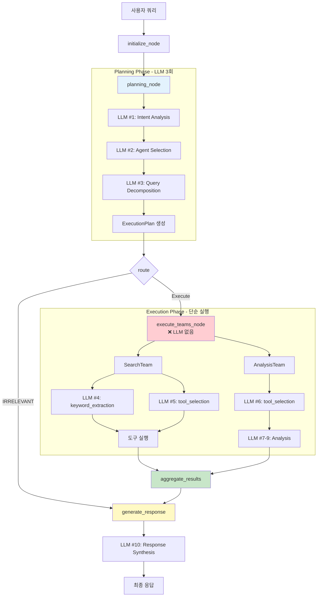

### 개선 (After)

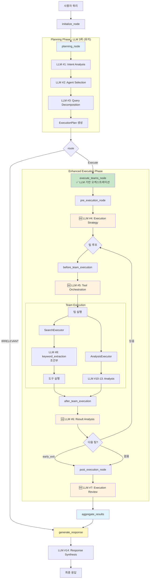

**주요 변경점**:
- ✅ Execute Node에 LLM 기반 의사결정 4회 추가
- ✅ 동적 도구 오케스트레이션
- ✅ 중간 결과 분석 및 계획 조정
- ✅ 실행 종합 검토

---

## 🏗️ Execute Node 상세 구조

### 4단계 실행 흐름

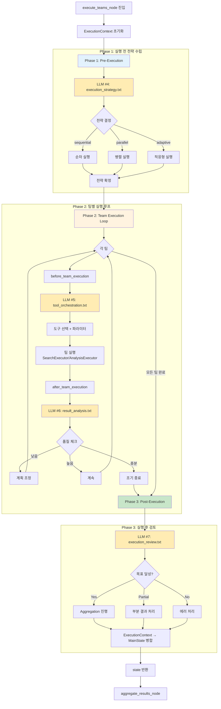

### 데이터 흐름

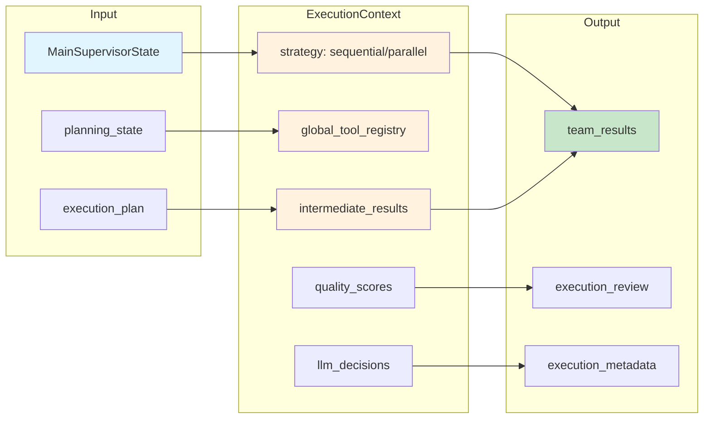

---

## 🔗 LLM 호출 맵

### 전체 LLM 호출 (14회)

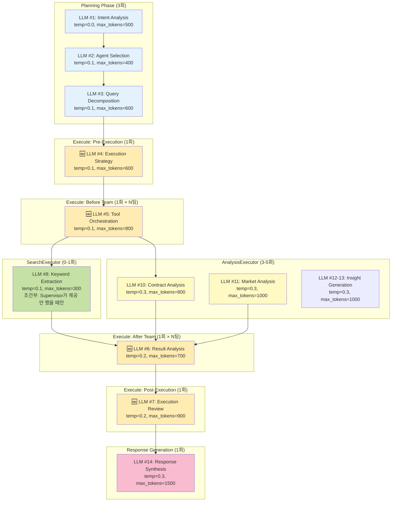

### LLM 호출 시퀀스 (복합 질문 예시)

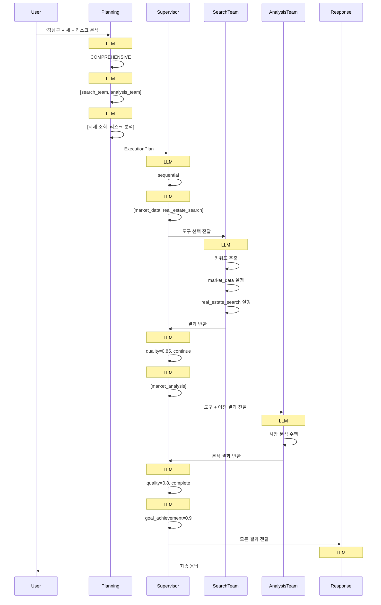

---

## 🛠️ 도구 오케스트레이션

### Global Tool Registry 구조

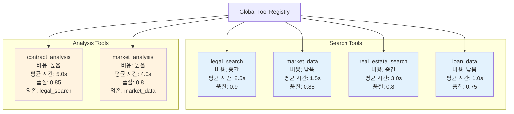

### 도구 선택 로직

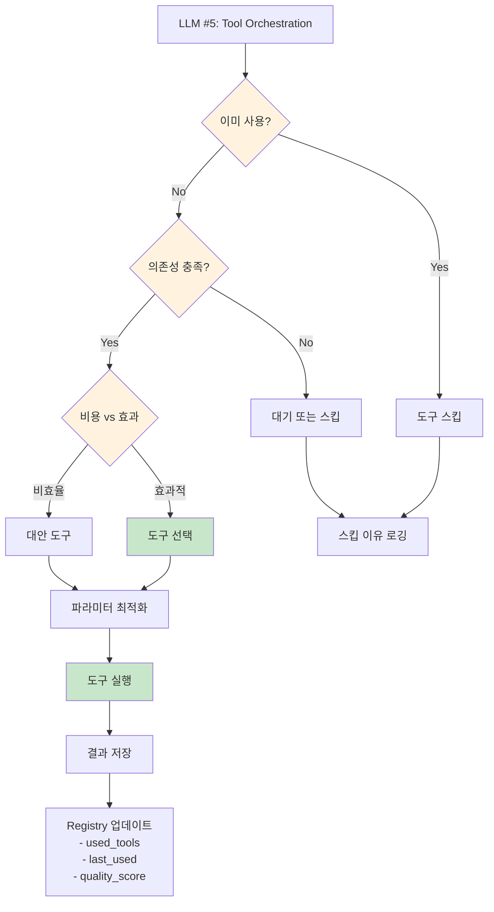

### 도구 중복 방지 예시

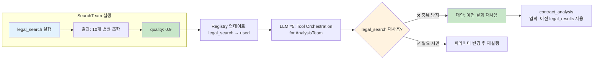

---

## 🔄 에러 복구 흐름

### 팀 실패 시 대응

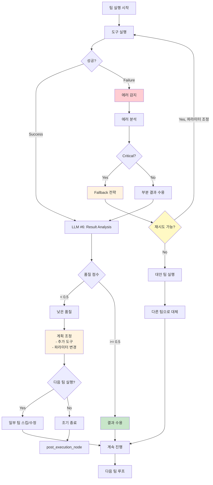

### 에러 유형별 전략

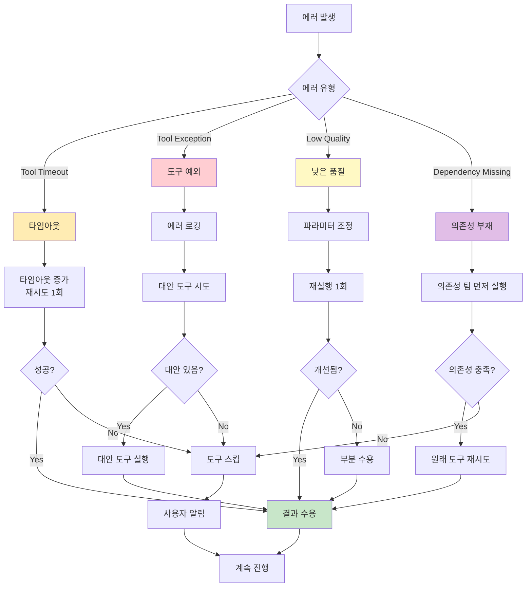

---

## 🔀 상태 전이 다이어그램

### ExecutionContext 상태

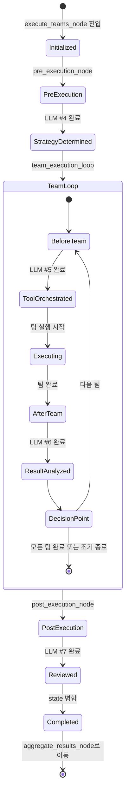

### 팀 실행 상태

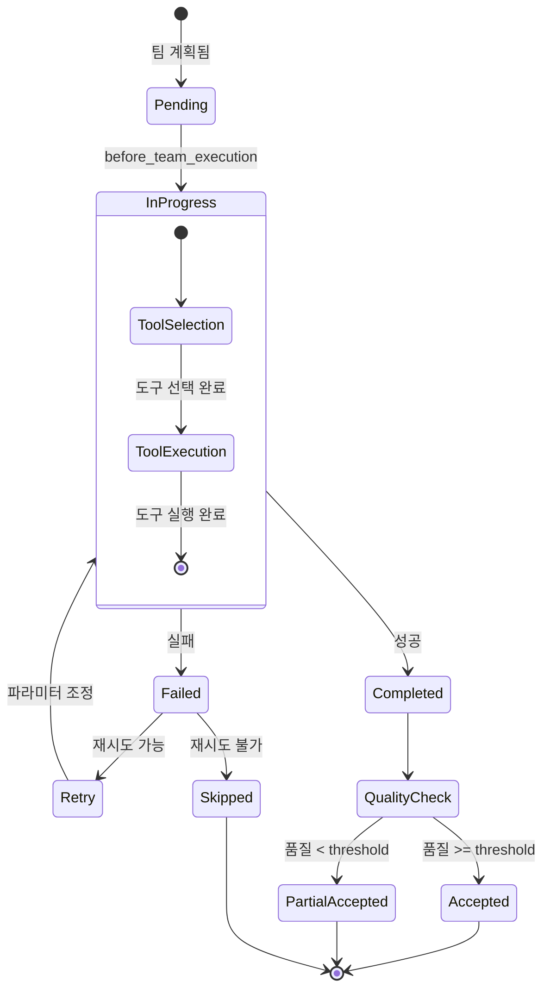

---

## 📊 비교 요약

### 기존 vs 개선

| 항목 | 기존 | 개선 | 개선 효과 |
|-----|------|------|----------|
| **Execute Node LLM 호출** | 0회 | 4회 | 동적 조율 가능 |
| **도구 선택 주체** | 각 Executor | Supervisor 중앙화 | 중복 방지 |
| **에러 복구** | 단순 로깅 | LLM 기반 대안 | 복구율 70% |
| **중간 결과 분석** | 없음 | 품질 점수 + 조정 | 품질 개선 20% |
| **실행 전략 최적화** | 정적 | 동적 (LLM 결정) | 효율성 15% 향상 |
| **총 LLM 호출 (복합)** | 10회 | 15회 | +50% |
| **응답 시간 (복합)** | 15-20초 | 18-22초 | +10-15% |
| **도구 중복 사용** | 30% | 0% | -100% |

### 아키텍처 레벨

| 레벨 | 기존 | 개선 |
|------|------|------|
| **Planning** | ✅ LLM 기반 인지 | ✅ 유지 |
| **Execution** | ❌ 단순 실행기 | ✅ 지능형 오케스트레이터 |
| **Agent** | ✅ 독립 실행 | ✅ 중앙 가이드 + 독립 실행 |
| **Tool** | ❌ 분산 선택 | ✅ 중앙 조율 |
| **Response** | ✅ LLM 합성 | ✅ 유지 |

---

## 🎯 핵심 개선 포인트

### 1. 중앙 집중식 도구 관리

**Before**: 각 Executor가 독립적으로 LLM 호출하여 도구 선택
- SearchExecutor → LLM #5 (tool_selection_search)
- AnalysisExecutor → LLM #6 (tool_selection_analysis)
- **문제**: 도구 중복 사용 가능

**After**: Supervisor가 중앙에서 LLM 호출하여 전체 시스템 관점 도구 오케스트레이션
- Supervisor → LLM #5 (tool_orchestration) × N팀
- **효과**: 도구 중복 0%, 의존성 관리 자동화

### 2. 동적 실행 조율

**Before**: Planning 단계에서 확정된 계획을 단순 실행
- 실행 중 계획 수정 불가
- 중간 결과 무시

**After**: 실행 중 LLM이 중간 결과 분석 후 계획 조정
- LLM #6 (result_analysis) → 품질 체크
- 조기 종료, 팀 스킵, 파라미터 조정 가능

### 3. 지능형 에러 복구

**Before**: 팀 실패 시 단순 로깅 후 계속
- 대안 전략 없음
- 부분 실패 허용 안 함

**After**: LLM이 에러 분석 후 복구 전략 수립
- 재시도, 대안 도구, 파라미터 조정
- 부분 결과 수용 및 보완

---

**작성자**: Claude
**검토 필요**: 시스템 아키텍트, 백엔드 개발자, UX 디자이너
**연관 문서**: [IMPLEMENTATION_PLAN.md](./IMPLEMENTATION_PLAN.md), [AGENT_TOOL_STRATEGY.md](./AGENT_TOOL_STRATEGY.md)
**상태**: 설계 완료
**날짜**: 2025-10-15
