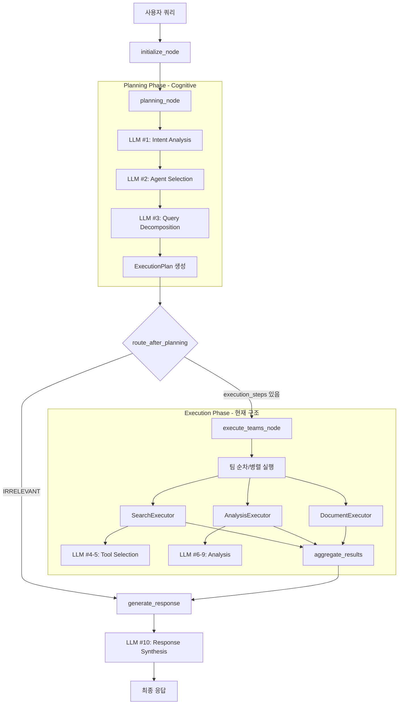
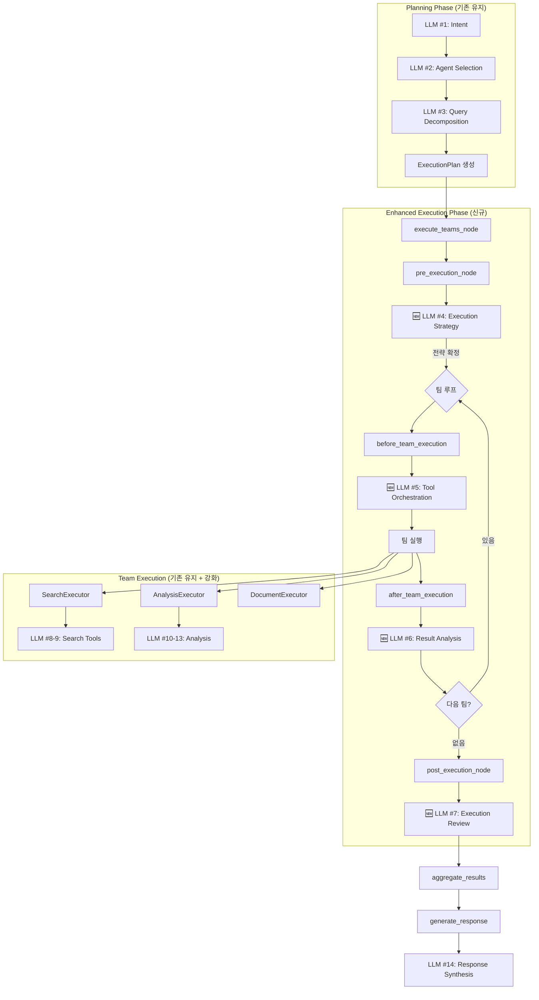

# Execute Node Enhancement - LLM 기반 동적 오케스트레이션 구현 계획

**작성일**: 2025-10-15
**프로젝트**: 홈즈냥즈 Beta v001
**아키텍처**: LangGraph 0.6 Multi-Agent System
**목표**: Supervisor의 execute_teams_node에 LLM 기반 동적 조율 기능 추가

---

## 📋 목차

1. [현황 분석](#-현황-분석)
2. [개선 목표](#-개선-목표)
3. [아키텍처 설계](#-아키텍처-설계)
4. [구현 계획](#-구현-계획)
5. [에이전트별 LLM 호출 전략](#-에이전트별-llm-호출-전략)
6. [도구 관리 전략](#-도구-관리-전략)
7. [구현 단계](#-구현-단계)
8. [테스트 계획](#-테스트-계획)
9. [성능 고려사항](#-성능-고려사항)
10. [참고 자료](#-참고-자료)

---

## 🔍 현황 분석

### 현재 시스템 구조



### 현재 LLM 호출 지점 (총 10회)

| # | 위치 | 프롬프트 | 목적 | 온도 | 모드 |
|---|------|---------|------|------|------|
| 1 | PlanningAgent | intent_analysis.txt | 의도 분석 | 0.0 | 인지 |
| 2 | PlanningAgent | agent_selection.txt | Agent 선택 | 0.1 | 인지 |
| 3 | QueryDecomposer | query_decomposition.txt | 질문 분해 | 0.1 | 인지 |
| 4 | SearchExecutor | keyword_extraction.txt | 키워드 추출 | 0.1 | **실행** |
| 5 | SearchExecutor | tool_selection_search.txt | 도구 선택 | 0.1 | **실행** |
| 6 | AnalysisExecutor | tool_selection_analysis.txt | 도구 선택 | 0.1 | **실행** |
| 7-9 | AnalysisTools | insight_generation.txt | 분석 생성 | 0.3 | **실행** |
| 10 | TeamSupervisor | response_synthesis.txt | 최종 응답 | 0.3 | 생성 |

### 현재 execute_teams_node의 역할

[team_supervisor.py:513-695](backend/app/service_agent/supervisor/team_supervisor.py#L513-L695)

```python
async def execute_teams_node(self, state: MainSupervisorState) -> MainSupervisorState:
    """
    팀 실행 노드
    계획에 따라 팀들을 실행
    """
    # 현재: 단순 팀 실행 및 상태 업데이트만 수행
    # - execution_strategy에 따라 순차/병렬 결정
    # - 각 팀의 execute() 호출
    # - WebSocket으로 progress 전송
    # - 예외 처리

    # ❌ 부족한 부분:
    # - 실행 중 계획 조정 불가
    # - 팀 간 데이터 의존성 동적 처리 불가
    # - 실행 중 오류 발생 시 대안 전략 없음
    # - 도구 선택이 각 Executor에 완전 위임됨
```

### 문제점

1. **정적 실행 계획**: Planning 단계에서 계획이 확정되면 실행 중 수정 불가
2. **LLM 부재**: execute_teams_node는 LLM 호출 없이 단순 오케스트레이션만 수행
3. **도구 관리 분산**: 각 Executor가 독립적으로 도구 선택 (중복 가능성)
4. **에러 처리 한계**: 팀 실패 시 단순 로깅만 하고 대안 없음
5. **맥락 손실**: 팀 간 데이터 흐름이 수동 매핑에 의존

---

## 🎯 개선 목표

### 핵심 목표

**execute_teams_node를 "단순 실행자"에서 "지능형 오케스트레이터"로 전환**

### 구체적 개선 사항

1. **동적 실행 조율**
   - LLM을 활용한 실행 중 계획 조정
   - 팀 실행 순서 동적 최적화
   - 중간 결과 기반 후속 작업 결정

2. **통합 도구 관리**
   - 전체 시스템 관점에서 도구 선택
   - 도구 중복 사용 방지
   - 도구 간 우선순위 관리

3. **지능형 에러 처리**
   - 실패 시 대안 전략 수립
   - 부분 실패 허용 및 보완
   - 재시도 전략 동적 결정

4. **맥락 인지 실행**
   - 이전 팀 결과 분석 후 다음 팀 파라미터 조정
   - 사용자 의도 재확인
   - 실행 중 우선순위 재평가

---

## 🏗️ 아키텍처 설계

### 새로운 실행 흐름



### LLM 호출 재구성 (총 14회로 증가)

| # | 위치 | 새 프롬프트 | 목적 | 온도 | 우선순위 |
|---|------|------------|------|------|---------|
| 1-3 | Planning | (기존 유지) | 계획 수립 | 0.0-0.1 | 필수 |
| **4** | **execute_teams** | **execution_strategy.txt** | **실행 전략 확정** | **0.1** | **높음** |
| **5** | **execute_teams** | **tool_orchestration.txt** | **도구 총괄 관리** | **0.1** | **높음** |
| **6** | **execute_teams** | **result_analysis.txt** | **중간 결과 분석** | **0.2** | **중간** |
| **7** | **execute_teams** | **execution_review.txt** | **실행 종합 검토** | **0.2** | **중간** |
| 8-9 | SearchExecutor | tool_selection_search.txt | 검색 도구 선택 | 0.1 | 중간 |
| 10-13 | AnalysisExecutor | (기존 유지) | 분석 수행 | 0.3 | 낮음 |
| 14 | TeamSupervisor | response_synthesis.txt | 최종 응답 | 0.3 | 필수 |

### 새로운 상태 구조

```python
from typing import Dict, List, Optional, Any
from dataclasses import dataclass
from datetime import datetime

@dataclass
class ExecutionContext:
    """실행 컨텍스트 - 실행 중 동적 정보"""

    # 실행 전략
    strategy: str  # "sequential", "parallel", "adaptive"
    current_team_index: int
    completed_teams: List[str]
    failed_teams: List[str]

    # 도구 관리
    global_tool_registry: Dict[str, Any]  # 전체 도구 목록
    used_tools: List[str]  # 이미 사용된 도구
    available_tools: List[str]  # 아직 사용 가능한 도구
    tool_dependencies: Dict[str, List[str]]  # 도구 간 의존성

    # 중간 결과
    intermediate_results: Dict[str, Any]  # 팀별 중간 결과
    quality_scores: Dict[str, float]  # 결과 품질 점수

    # 동적 조정
    strategy_adjustments: List[str]  # 실행 중 전략 변경 로그
    tool_conflicts: List[str]  # 도구 충돌 기록

    # 메타데이터
    total_llm_calls: int
    execution_start_time: datetime
    estimated_remaining_time: float

@dataclass
class TeamExecutionPlan:
    """개별 팀 실행 계획 (동적)"""
    team_name: str
    priority: int

    # LLM이 결정한 도구
    selected_tools: List[str]
    tool_parameters: Dict[str, Any]

    # 실행 제약
    timeout: int
    max_retries: int
    fallback_strategy: str

    # 의존성
    depends_on: List[str]  # 다른 팀 이름
    required_data: Dict[str, str]  # 필요한 데이터 키

    # 실행 상태
    status: str  # "pending", "in_progress", "completed", "failed"
    execution_time: Optional[float]
    error: Optional[str]
```

---

## 📝 구현 계획

### Phase 1: 실행 컨텍스트 구축 (2-3시간)

#### 1.1 ExecutionContext 클래스 생성

**파일**: `backend/app/service_agent/foundation/execution_context.py`

```python
"""
실행 컨텍스트 관리
execute_teams_node가 실행 중 상태를 추적하고 LLM과 통신하기 위한 데이터 구조
"""

from dataclasses import dataclass, field
from typing import Dict, List, Optional, Any
from datetime import datetime
import logging

logger = logging.getLogger(__name__)


@dataclass
class ExecutionContext:
    """
    Execute Node의 실행 컨텍스트

    실행 중 동적으로 업데이트되는 정보를 관리
    """

    # === 기본 정보 ===
    query: str
    session_id: str
    intent_type: str
    confidence: float

    # === 실행 전략 ===
    strategy: str = "sequential"  # "sequential", "parallel", "adaptive"
    current_team_index: int = 0
    total_teams: int = 0

    # === 팀 추적 ===
    pending_teams: List[str] = field(default_factory=list)
    in_progress_teams: List[str] = field(default_factory=list)
    completed_teams: List[str] = field(default_factory=list)
    failed_teams: List[str] = field(default_factory=list)

    # === 도구 관리 (Global View) ===
    global_tool_registry: Dict[str, Dict[str, Any]] = field(default_factory=dict)
    used_tools: List[str] = field(default_factory=list)
    available_tools: List[str] = field(default_factory=list)
    tool_usage_log: List[Dict[str, Any]] = field(default_factory=list)

    # === 중간 결과 ===
    intermediate_results: Dict[str, Any] = field(default_factory=dict)
    quality_scores: Dict[str, float] = field(default_factory=dict)
    data_dependencies: Dict[str, List[str]] = field(default_factory=dict)

    # === 동적 조정 ===
    strategy_adjustments: List[str] = field(default_factory=list)
    llm_decisions: List[Dict[str, Any]] = field(default_factory=list)

    # === 성능 메트릭 ===
    total_llm_calls: int = 0
    execution_start_time: datetime = field(default_factory=datetime.now)
    estimated_remaining_time: float = 0.0

    def to_dict(self) -> Dict[str, Any]:
        """LLM 프롬프트용 딕셔너리 변환"""
        return {
            "query": self.query,
            "intent_type": self.intent_type,
            "confidence": self.confidence,
            "strategy": self.strategy,
            "progress": {
                "current_index": self.current_team_index,
                "total_teams": self.total_teams,
                "completed": self.completed_teams,
                "failed": self.failed_teams,
                "pending": self.pending_teams
            },
            "tools": {
                "used": self.used_tools,
                "available": self.available_tools,
                "registry": self.global_tool_registry
            },
            "results": self.intermediate_results,
            "quality_scores": self.quality_scores,
            "adjustments": self.strategy_adjustments[-3:] if self.strategy_adjustments else []
        }

    def log_llm_decision(self, phase: str, decision: Dict[str, Any]):
        """LLM 결정 로깅"""
        self.llm_decisions.append({
            "phase": phase,
            "timestamp": datetime.now().isoformat(),
            "decision": decision,
            "llm_call_number": self.total_llm_calls
        })
        self.total_llm_calls += 1
        logger.info(f"[ExecutionContext] LLM decision logged: {phase}, call #{self.total_llm_calls}")

    def register_tool_usage(self, team: str, tool_name: str, result_quality: float):
        """도구 사용 기록"""
        self.used_tools.append(tool_name)
        self.tool_usage_log.append({
            "team": team,
            "tool": tool_name,
            "timestamp": datetime.now().isoformat(),
            "quality": result_quality
        })

        # available_tools에서 제거 (중복 방지)
        if tool_name in self.available_tools:
            self.available_tools.remove(tool_name)

        logger.info(f"[ExecutionContext] Tool usage registered: {team} -> {tool_name} (quality: {result_quality})")

    def add_intermediate_result(self, team: str, result: Any, quality: float):
        """중간 결과 추가"""
        self.intermediate_results[team] = result
        self.quality_scores[team] = quality
        logger.info(f"[ExecutionContext] Intermediate result added: {team} (quality: {quality})")

    def adjust_strategy(self, reason: str, new_strategy: str):
        """실행 전략 동적 조정"""
        old_strategy = self.strategy
        self.strategy = new_strategy
        adjustment_log = f"{old_strategy} -> {new_strategy}: {reason}"
        self.strategy_adjustments.append(adjustment_log)
        logger.warning(f"[ExecutionContext] Strategy adjusted: {adjustment_log}")
```

#### 1.2 프롬프트 파일 작성

**경로**: `backend/app/service_agent/llm_manager/prompts/execution/`

##### execution_strategy.txt

```
# 역할
당신은 Multi-Agent 시스템의 실행 전략을 수립하는 전문가입니다.

# 입력
- 사용자 쿼리: {{query}}
- 의도: {{intent_type}} (신뢰도: {{confidence}})
- 계획된 팀: {{planned_teams}}
- 팀별 예상 시간: {{estimated_times}}
- 중간 결과 (있다면): {{intermediate_results}}

# 작업
다음 팀들의 최적 실행 전략을 결정하세요:

1. **실행 순서 확정**
   - 병렬 실행 가능한 팀 그룹화
   - 의존성 있는 팀 순서 결정
   - 선택적(optional) 팀 판단

2. **실행 모드 결정**
   - sequential: 순차 실행 (의존성 있음)
   - parallel: 병렬 실행 (독립적)
   - adaptive: 중간 결과 보고 결정

3. **리스크 평가**
   - 각 팀의 실패 가능성
   - 실패 시 영향도
   - 대안 전략

# 출력 (JSON)
{
  "strategy": "sequential|parallel|adaptive",
  "execution_order": [
    {
      "team": "search_team",
      "priority": 1,
      "mode": "required|optional",
      "parallel_group": 1,
      "dependencies": [],
      "estimated_time": 5.0,
      "failure_impact": "high|medium|low",
      "fallback": "skip|retry|alternative_team"
    }
  ],
  "parallel_groups": [[1, 2], [3]],
  "total_estimated_time": 15.0,
  "reasoning": "Search team must run first to gather data for analysis team...",
  "risk_assessment": "Medium risk due to...",
  "optimization_suggestions": ["Consider running X in parallel with Y"]
}
```

##### tool_orchestration.txt

```
# 역할
당신은 전체 시스템 관점에서 도구(Tool) 사용을 조율하는 오케스트레이터입니다.

# 입력
- 현재 팀: {{current_team}}
- 사용자 쿼리: {{query}}
- 이미 사용된 도구: {{used_tools}}
- 사용 가능한 도구: {{available_tools}}
- 이전 팀 결과: {{previous_results}}
- 중간 품질 점수: {{quality_scores}}

# 도구 목록
{{tool_registry}}

# 작업
다음 팀이 사용할 도구를 전체 시스템 관점에서 선택하세요:

1. **도구 선택 기준**
   - 이미 사용된 도구 중복 방지
   - 이전 결과 품질이 낮으면 다른 도구 시도
   - 쿼리에 필수적인 도구 우선
   - 비용-효과 분석

2. **파라미터 최적화**
   - 이전 결과를 고려한 파라미터 조정
   - 검색 범위, limit, filter 등 설정

3. **품질 보장**
   - 최소 품질 기준 설정
   - 실패 시 대안 도구 준비

# 출력 (JSON)
{
  "selected_tools": [
    {
      "tool_name": "legal_search",
      "priority": 1,
      "parameters": {
        "limit": 10,
        "is_tenant_protection": true
      },
      "reason": "User query mentions tenant rights",
      "expected_quality": 0.85,
      "timeout": 10,
      "fallback_tool": "general_search"
    }
  ],
  "skipped_tools": [
    {
      "tool_name": "market_data",
      "reason": "Already executed by previous team with quality 0.9"
    }
  ],
  "optimization_notes": "Use cached results from search_team for analysis",
  "quality_threshold": 0.7,
  "total_estimated_time": 8.5
}
```

##### result_analysis.txt

```
# 역할
당신은 팀 실행 결과를 분석하고 다음 단계를 결정하는 전문가입니다.

# 입력
- 완료된 팀: {{completed_team}}
- 팀 실행 결과: {{team_result}}
- 사용된 도구: {{tools_used}}
- 실행 시간: {{execution_time}}
- 오류 (있다면): {{error}}

# 이전 컨텍스트
- 사용자 쿼리: {{query}}
- 원래 계획: {{original_plan}}
- 남은 팀: {{remaining_teams}}
- 중간 결과: {{intermediate_results}}

# 작업
방금 완료된 팀의 결과를 분석하고 다음 단계를 결정하세요:

1. **결과 품질 평가**
   - 완성도 (0.0-1.0)
   - 관련성
   - 충분성

2. **다음 단계 결정**
   - 남은 팀 계속 실행?
   - 계획 수정 필요?
   - 조기 종료 가능?

3. **데이터 전달**
   - 다음 팀에 전달할 데이터
   - 파라미터 조정 필요성

# 출력 (JSON)
{
  "quality_score": 0.85,
  "completeness": 0.9,
  "relevance": 0.8,
  "assessment": "Good quality results with comprehensive legal data",

  "next_action": "continue|adjust|early_exit",
  "next_action_reason": "Analysis team needs search results",

  "plan_adjustments": [
    {
      "type": "skip_team|modify_parameters|add_team",
      "target": "document_team",
      "reason": "Sufficient data already collected",
      "details": {}
    }
  ],

  "data_to_pass": {
    "to_team": "analysis_team",
    "data_keys": ["legal_results", "market_data"],
    "suggested_parameters": {
      "analysis_type": "comprehensive",
      "focus_on": "risk_assessment"
    }
  },

  "early_exit_possible": false,
  "early_exit_reason": null,

  "estimated_remaining_time": 10.5
}
```

##### execution_review.txt

```
# 역할
당신은 전체 실행 과정을 종합 검토하는 전문가입니다.

# 입력
- 사용자 쿼리: {{query}}
- 원래 계획: {{original_plan}}
- 실행된 팀: {{executed_teams}}
- 팀별 결과: {{team_results}}
- 팀별 품질: {{quality_scores}}
- 실행 중 조정: {{strategy_adjustments}}
- 총 실행 시간: {{total_execution_time}}

# 작업
전체 실행 과정을 검토하고 결과를 평가하세요:

1. **목표 달성 여부**
   - 사용자 쿼리에 답변 가능한가?
   - 누락된 정보는 없는가?
   - 추가 실행 필요성

2. **품질 종합 평가**
   - 각 팀 결과의 일관성
   - 전체 데이터 충분성
   - 신뢰도

3. **최적화 기회**
   - 불필요했던 단계
   - 개선 가능한 부분

# 출력 (JSON)
{
  "goal_achievement": 0.9,
  "goal_assessment": "Successfully gathered legal and market data",

  "missing_information": [],
  "additional_execution_needed": false,

  "overall_quality": 0.85,
  "quality_breakdown": {
    "search_team": 0.9,
    "analysis_team": 0.8
  },

  "consistency_check": {
    "legal_data_consistent": true,
    "market_data_reliable": true,
    "analysis_aligned": true
  },

  "execution_efficiency": {
    "planned_time": 15.0,
    "actual_time": 12.5,
    "efficiency_score": 0.83,
    "bottlenecks": ["analysis_team took longer than expected"]
  },

  "optimization_suggestions": [
    "Consider caching legal_search results",
    "Market data and property search can run in parallel"
  ],

  "proceed_to_aggregation": true,
  "aggregation_strategy": "prioritize_legal_results",

  "confidence_in_results": 0.88
}
```

---

### Phase 2: Execute Node 리팩토링 (4-5시간)

#### 2.1 execute_teams_node 분해

**기존 단일 함수를 4단계 노드로 분해**:

```python
# team_supervisor.py

async def execute_teams_node(self, state: MainSupervisorState) -> MainSupervisorState:
    """
    향상된 팀 실행 노드 (메인 오케스트레이터)

    4단계 실행:
    1. pre_execution_node: 실행 전략 LLM 결정
    2. team_execution_loop: 팀별 실행 (before -> execute -> after)
    3. post_execution_node: 실행 종합 검토
    4. 결과 반환
    """
    logger.info("[TeamSupervisor] === Enhanced Execute Teams Node ===")

    # 실행 컨텍스트 초기화
    exec_context = self._initialize_execution_context(state)

    # Phase 1: 실행 전 전략 수립
    exec_context = await self.pre_execution_node(state, exec_context)

    # Phase 2: 팀별 실행 루프
    exec_context = await self.team_execution_loop(state, exec_context)

    # Phase 3: 실행 후 종합 검토
    exec_context = await self.post_execution_node(state, exec_context)

    # 실행 컨텍스트를 state에 병합
    state = self._merge_execution_context(state, exec_context)

    logger.info(f"[TeamSupervisor] === Execute completed: {exec_context.total_llm_calls} LLM calls ===")
    return state
```

#### 2.2 Pre-Execution Node

```python
async def pre_execution_node(
    self,
    state: MainSupervisorState,
    exec_context: ExecutionContext
) -> ExecutionContext:
    """
    실행 전 준비 및 전략 수립

    LLM 호출: execution_strategy.txt
    """
    logger.info("[TeamSupervisor] Pre-execution: Determining strategy")

    # 계획된 팀 정보 수집
    planning_state = state.get("planning_state", {})
    execution_steps = planning_state.get("execution_steps", [])

    if not execution_steps:
        logger.warning("No execution steps found, skipping pre-execution")
        return exec_context

    # LLM 프롬프트 준비
    planned_teams = [
        {
            "team": step["team"],
            "agent": step["agent_name"],
            "estimated_time": step.get("estimated_time", 10.0),
            "priority": i
        }
        for i, step in enumerate(execution_steps)
    ]

    # LLM 호출: 실행 전략 결정
    try:
        result = await self.planning_agent.llm_service.complete_json_async(
            prompt_name="execution_strategy",
            variables={
                "query": state.get("query", ""),
                "intent_type": planning_state.get("analyzed_intent", {}).get("intent_type", ""),
                "confidence": planning_state.get("intent_confidence", 0.0),
                "planned_teams": planned_teams,
                "estimated_times": {t["team"]: t["estimated_time"] for t in planned_teams},
                "intermediate_results": {}  # 초기에는 없음
            },
            temperature=0.1
        )

        # LLM 결정 로깅
        exec_context.log_llm_decision("pre_execution", result)

        # 전략 적용
        exec_context.strategy = result.get("strategy", "sequential")
        exec_context.estimated_remaining_time = result.get("total_estimated_time", 0.0)

        logger.info(
            f"[TeamSupervisor] LLM determined strategy: {exec_context.strategy}, "
            f"estimated time: {exec_context.estimated_remaining_time}s"
        )

        # WebSocket: 전략 알림
        session_id = state.get("session_id")
        progress_callback = self._progress_callbacks.get(session_id)
        if progress_callback:
            await progress_callback("execution_strategy_ready", {
                "strategy": exec_context.strategy,
                "estimated_time": exec_context.estimated_remaining_time,
                "reasoning": result.get("reasoning", "")
            })

    except Exception as e:
        logger.error(f"[TeamSupervisor] Pre-execution LLM failed: {e}, using fallback")
        # Fallback: 기본 전략
        exec_context.strategy = "sequential"

    return exec_context
```

#### 2.3 Team Execution Loop

```python
async def team_execution_loop(
    self,
    state: MainSupervisorState,
    exec_context: ExecutionContext
) -> ExecutionContext:
    """
    팀별 실행 루프 (before -> execute -> after)
    """
    logger.info("[TeamSupervisor] Team execution loop started")

    active_teams = state.get("active_teams", [])
    planning_state = state.get("planning_state", {})

    for team_name in active_teams:
        logger.info(f"[TeamSupervisor] ======= Processing team: {team_name} =======")

        # Step 1: Before Team Execution (도구 조율)
        tool_selection = await self.before_team_execution(
            team_name=team_name,
            state=state,
            exec_context=exec_context
        )

        # Step 2: Execute Team (기존 로직 + 도구 전달)
        team_result = await self._execute_single_team_enhanced(
            team_name=team_name,
            state=state,
            exec_context=exec_context,
            tool_selection=tool_selection
        )

        # 중간 결과 저장
        state["team_results"][team_name] = team_result

        # Step 3: After Team Execution (결과 분석)
        decision = await self.after_team_execution(
            team_name=team_name,
            team_result=team_result,
            state=state,
            exec_context=exec_context
        )

        # 결정에 따른 조치
        if decision.get("next_action") == "early_exit":
            logger.info(f"[TeamSupervisor] Early exit triggered: {decision.get('next_action_reason')}")
            break

        if decision.get("next_action") == "adjust":
            # 계획 조정
            for adjustment in decision.get("plan_adjustments", []):
                self._apply_plan_adjustment(state, exec_context, adjustment)

    logger.info("[TeamSupervisor] Team execution loop completed")
    return exec_context


async def before_team_execution(
    self,
    team_name: str,
    state: MainSupervisorState,
    exec_context: ExecutionContext
) -> Dict[str, Any]:
    """
    팀 실행 전 도구 조율

    LLM 호출: tool_orchestration.txt
    """
    logger.info(f"[TeamSupervisor] Before execution: {team_name}")

    # 도구 레지스트리 구성
    if not exec_context.global_tool_registry:
        exec_context.global_tool_registry = self._build_global_tool_registry()
        exec_context.available_tools = list(exec_context.global_tool_registry.keys())

    # 이전 팀 결과
    previous_results = {
        k: {
            "quality": exec_context.quality_scores.get(k, 0.0),
            "summary": self._summarize_result(v)
        }
        for k, v in state.get("team_results", {}).items()
    }

    # LLM 호출: 도구 오케스트레이션
    try:
        result = await self.planning_agent.llm_service.complete_json_async(
            prompt_name="tool_orchestration",
            variables={
                "current_team": team_name,
                "query": state.get("query", ""),
                "used_tools": exec_context.used_tools,
                "available_tools": exec_context.available_tools,
                "tool_registry": exec_context.global_tool_registry,
                "previous_results": previous_results,
                "quality_scores": exec_context.quality_scores
            },
            temperature=0.1
        )

        # LLM 결정 로깅
        exec_context.log_llm_decision(f"before_{team_name}", result)

        logger.info(f"[TeamSupervisor] LLM selected tools for {team_name}: {result.get('selected_tools', [])}")

        return result

    except Exception as e:
        logger.error(f"[TeamSupervisor] Tool orchestration LLM failed: {e}")
        # Fallback: 모든 도구 허용
        return {
            "selected_tools": [],
            "skipped_tools": [],
            "optimization_notes": "Fallback mode: all tools available"
        }


async def after_team_execution(
    self,
    team_name: str,
    team_result: Any,
    state: MainSupervisorState,
    exec_context: ExecutionContext
) -> Dict[str, Any]:
    """
    팀 실행 후 결과 분석

    LLM 호출: result_analysis.txt
    """
    logger.info(f"[TeamSupervisor] After execution: {team_name}")

    # 실행 메트릭 수집
    execution_time = team_result.get("search_time", team_result.get("execution_time", 0.0))
    error = team_result.get("error")

    # 사용된 도구 추출
    tools_used = self._extract_tools_used(team_result)

    # LLM 호출: 결과 분석
    try:
        result = await self.planning_agent.llm_service.complete_json_async(
            prompt_name="result_analysis",
            variables={
                "completed_team": team_name,
                "team_result": self._summarize_result(team_result),
                "tools_used": tools_used,
                "execution_time": execution_time,
                "error": error,
                "query": state.get("query", ""),
                "original_plan": state.get("execution_plan", {}),
                "remaining_teams": self._get_remaining_teams(state, exec_context),
                "intermediate_results": {
                    k: self._summarize_result(v)
                    for k, v in state.get("team_results", {}).items()
                }
            },
            temperature=0.2
        )

        # LLM 결정 로깅
        exec_context.log_llm_decision(f"after_{team_name}", result)

        # 품질 점수 저장
        quality_score = result.get("quality_score", 0.0)
        exec_context.add_intermediate_result(team_name, team_result, quality_score)

        # 도구 사용 기록
        for tool in tools_used:
            exec_context.register_tool_usage(team_name, tool, quality_score)

        logger.info(
            f"[TeamSupervisor] Result analysis: quality={quality_score}, "
            f"next_action={result.get('next_action')}"
        )

        return result

    except Exception as e:
        logger.error(f"[TeamSupervisor] Result analysis LLM failed: {e}")
        # Fallback: 계속 진행
        return {
            "quality_score": 0.7,
            "next_action": "continue",
            "next_action_reason": "Fallback mode"
        }
```

#### 2.4 Post-Execution Node

```python
async def post_execution_node(
    self,
    state: MainSupervisorState,
    exec_context: ExecutionContext
) -> ExecutionContext:
    """
    실행 후 종합 검토

    LLM 호출: execution_review.txt
    """
    logger.info("[TeamSupervisor] Post-execution: Reviewing all results")

    # 총 실행 시간
    total_time = (datetime.now() - exec_context.execution_start_time).total_seconds()

    # LLM 호출: 실행 종합 검토
    try:
        result = await self.planning_agent.llm_service.complete_json_async(
            prompt_name="execution_review",
            variables={
                "query": state.get("query", ""),
                "original_plan": state.get("execution_plan", {}),
                "executed_teams": exec_context.completed_teams,
                "team_results": {
                    k: self._summarize_result(v)
                    for k, v in state.get("team_results", {}).items()
                },
                "quality_scores": exec_context.quality_scores,
                "strategy_adjustments": exec_context.strategy_adjustments,
                "total_execution_time": total_time
            },
            temperature=0.2
        )

        # LLM 결정 로깅
        exec_context.log_llm_decision("post_execution", result)

        # 메타데이터 저장
        state["execution_review"] = result

        logger.info(
            f"[TeamSupervisor] Execution review: "
            f"goal_achievement={result.get('goal_achievement')}, "
            f"overall_quality={result.get('overall_quality')}, "
            f"proceed={result.get('proceed_to_aggregation')}"
        )

        # WebSocket: 검토 결과 알림
        session_id = state.get("session_id")
        progress_callback = self._progress_callbacks.get(session_id)
        if progress_callback:
            await progress_callback("execution_review_complete", {
                "quality": result.get("overall_quality", 0.0),
                "confidence": result.get("confidence_in_results", 0.0),
                "suggestions": result.get("optimization_suggestions", [])
            })

        return exec_context

    except Exception as e:
        logger.error(f"[TeamSupervisor] Post-execution review LLM failed: {e}")
        return exec_context
```

---

### Phase 3: 에이전트별 도구 관리 강화 (3-4시간)

#### 3.1 SearchExecutor 강화

```python
# search_executor.py

async def execute_with_orchestration(
    self,
    shared_state: SharedState,
    tool_selection: Dict[str, Any]  # 새 파라미터: Supervisor가 전달
) -> SearchTeamState:
    """
    Supervisor의 도구 조율 결과를 반영한 실행

    Args:
        shared_state: 공유 상태
        tool_selection: LLM이 결정한 도구 선택 정보
            - selected_tools: 사용할 도구 목록
            - skipped_tools: 건너뛸 도구 (중복 등)
            - tool_parameters: 도구별 파라미터
    """
    logger.info(f"[SearchExecutor] Executing with orchestration: {tool_selection}")

    # Supervisor가 지정한 도구만 사용
    allowed_tools = [t["tool_name"] for t in tool_selection.get("selected_tools", [])]
    skipped_tools = [t["tool_name"] for t in tool_selection.get("skipped_tools", [])]

    # 기존 실행 로직 호출
    initial_state = SearchTeamState(
        team_name=self.team_name,
        status="pending",
        shared_context=shared_state,
        keywords={},
        search_scope=allowed_tools,  # 도구 제약 적용
        filters={},
        legal_results=[],
        real_estate_results=[],
        loan_results=[],
        property_search_results=[],
        aggregated_results={},
        total_results=0,
        search_time=0.0,
        sources_used=[],
        search_progress={},
        start_time=None,
        end_time=None,
        error=None,
        current_search=None,
        execution_strategy=None,
        # 새 필드: 오케스트레이션 정보
        orchestration_metadata={
            "allowed_tools": allowed_tools,
            "skipped_tools": skipped_tools,
            "supervisor_guided": True
        }
    )

    # 서브그래프 실행
    final_state = await self.app.ainvoke(initial_state)

    # 도구 사용 검증
    self._validate_tool_usage(final_state, allowed_tools, skipped_tools)

    return final_state


def _validate_tool_usage(
    self,
    state: SearchTeamState,
    allowed_tools: List[str],
    skipped_tools: List[str]
):
    """도구 사용 검증 및 로깅"""
    used_tools = state.get("sources_used", [])

    # 허용되지 않은 도구 사용 체크
    unauthorized = [t for t in used_tools if t not in allowed_tools and t not in skipped_tools]
    if unauthorized:
        logger.warning(
            f"[SearchExecutor] Unauthorized tools used: {unauthorized}, "
            f"allowed: {allowed_tools}"
        )

    # 스킵된 도구 사용 체크
    violated_skip = [t for t in used_tools if t in skipped_tools]
    if violated_skip:
        logger.error(
            f"[SearchExecutor] Violated skip directive: {violated_skip}"
        )

    logger.info(
        f"[SearchExecutor] Tool usage validation: "
        f"used={used_tools}, allowed={allowed_tools}, skipped={skipped_tools}"
    )
```

#### 3.2 AnalysisExecutor 강화

```python
# analysis_executor.py

async def execute_with_context(
    self,
    shared_state: SharedState,
    tool_selection: Dict[str, Any],
    previous_results: Dict[str, Any]  # 새 파라미터: 이전 팀 결과
) -> AnalysisTeamState:
    """
    이전 팀 결과를 고려한 분석 실행

    Args:
        shared_state: 공유 상태
        tool_selection: LLM이 결정한 도구 선택
        previous_results: 이전 팀(주로 SearchTeam) 결과
            - search_team.legal_results
            - search_team.market_data
    """
    logger.info(f"[AnalysisExecutor] Executing with context from previous teams")

    # 이전 결과 품질 확인
    search_quality = previous_results.get("search_team", {}).get("quality", 0.0)

    if search_quality < 0.5:
        logger.warning(
            f"[AnalysisExecutor] Low quality from search_team ({search_quality}), "
            f"adjusting analysis strategy"
        )
        # 분석 전략 조정: 더 보수적으로
        analysis_type = "basic"
    else:
        analysis_type = "comprehensive"

    # 이전 결과를 input_data로 전달
    input_data = {
        "legal_search": previous_results.get("search_team", {}).get("legal_results", []),
        "market_data": previous_results.get("search_team", {}).get("real_estate_results", [])
    }

    # 기존 실행 로직
    initial_state = AnalysisTeamState(
        team_name=self.team_name,
        status="pending",
        shared_context=shared_state,
        analysis_type=analysis_type,
        input_data=input_data,
        # ... 나머지 필드 ...
    )

    final_state = await self.app.ainvoke(initial_state)

    return final_state
```

---

## 🔧 에이전트별 LLM 호출 전략

### SearchExecutor

**현재 LLM 호출** (2회):
- LLM #4: keyword_extraction.txt
- LLM #5: tool_selection_search.txt

**개선 방향**:

1. **LLM #4 (keyword_extraction) 유지**
   - 목적: 사용자 쿼리에서 검색 키워드 추출
   - 온도: 0.1 (일관성)
   - 입력: 원본 쿼리
   - 출력: {legal: [], real_estate: [], loan: [], general: []}

2. **LLM #5 (tool_selection_search) 제거 또는 단순화**
   - **이유**: Supervisor의 tool_orchestration이 이미 도구 선택 수행
   - **대안**: Supervisor가 전달한 tool_selection을 그대로 사용
   - **장점**: LLM 호출 중복 방지, 전체 시스템 관점 유지

**최종 LLM 호출**: 1회 (keyword_extraction만)

### AnalysisExecutor

**현재 LLM 호출** (4-6회):
- LLM #6: tool_selection_analysis.txt
- LLM #7-9: Analysis Tools (ContractAnalysis, MarketAnalysis, Insight Generation)

**개선 방향**:

1. **LLM #6 (tool_selection_analysis) 제거**
   - **이유**: Supervisor의 tool_orchestration으로 대체
   - **대안**: Supervisor가 지정한 분석 도구 사용

2. **LLM #7-9 (Analysis Tools) 유지 및 강화**
   - 목적: 실제 분석 수행 (핵심 기능)
   - 온도: 0.3 (창의성 필요)
   - 입력: 이전 팀 결과 + 사용자 쿼리
   - 출력: 분석 리포트, 인사이트, 리스크 평가

**최종 LLM 호출**: 3-5회 (분석 도구만)

### DocumentExecutor

**현재 LLM 호출**: 0회 (도구 선택 없음, 템플릿 기반 생성)

**개선 방향**:

1. **LLM 추가 고려하지 않음**
   - **이유**: 계약서 생성은 법적 정확성이 중요하므로 템플릿 기반 유지
   - **대안**: Supervisor가 문서 타입만 결정, 생성은 템플릿 사용

**최종 LLM 호출**: 0회 (유지)

---

## 🛠️ 도구 관리 전략

### Global Tool Registry

**구조**:

```python
global_tool_registry = {
    "legal_search": {
        "name": "legal_search",
        "team": "search",
        "description": "법률 조항 검색 (pgvector 기반)",
        "cost": "medium",  # API 비용
        "avg_execution_time": 2.5,
        "quality_score": 0.9,  # 과거 평균 품질
        "dependencies": [],
        "can_parallel": True,
        "max_concurrent": 5,
        "last_used": None,
        "usage_count": 0
    },
    "market_data": {
        "name": "market_data",
        "team": "search",
        "description": "부동산 시세 통계",
        "cost": "low",
        "avg_execution_time": 1.5,
        "quality_score": 0.85,
        "dependencies": [],
        "can_parallel": True,
        "max_concurrent": 10,
        "last_used": None,
        "usage_count": 0
    },
    "real_estate_search": {
        "name": "real_estate_search",
        "team": "search",
        "description": "개별 매물 검색",
        "cost": "medium",
        "avg_execution_time": 3.0,
        "quality_score": 0.8,
        "dependencies": [],
        "can_parallel": True,
        "max_concurrent": 3,
        "last_used": None,
        "usage_count": 0
    },
    "loan_data": {
        "name": "loan_data",
        "team": "search",
        "description": "대출 상품 검색",
        "cost": "low",
        "avg_execution_time": 1.0,
        "quality_score": 0.75,
        "dependencies": [],
        "can_parallel": True,
        "max_concurrent": 10,
        "last_used": None,
        "usage_count": 0
    },
    "contract_analysis": {
        "name": "contract_analysis",
        "team": "analysis",
        "description": "계약서 리스크 분석",
        "cost": "high",  # LLM 호출
        "avg_execution_time": 5.0,
        "quality_score": 0.85,
        "dependencies": ["legal_search"],  # 법률 정보 필요
        "can_parallel": False,
        "max_concurrent": 1,
        "last_used": None,
        "usage_count": 0
    },
    "market_analysis": {
        "name": "market_analysis",
        "team": "analysis",
        "description": "시장 분석 및 인사이트",
        "cost": "high",
        "avg_execution_time": 4.0,
        "quality_score": 0.8,
        "dependencies": ["market_data"],
        "can_parallel": False,
        "max_concurrent": 1,
        "last_used": None,
        "usage_count": 0
    }
}
```

### 도구 충돌 방지 규칙

1. **중복 방지**:
   - 같은 도구를 여러 팀이 사용하지 않도록 LLM이 판단
   - 예: search_team이 legal_search를 사용했으면 analysis_team은 재사용 금지

2. **의존성 체크**:
   - contract_analysis는 legal_search 결과 필요
   - Supervisor가 의존성 순서 보장

3. **비용 최적화**:
   - high cost 도구는 꼭 필요할 때만
   - low cost 도구 우선 사용

4. **병렬 실행 제약**:
   - can_parallel=False인 도구는 순차 실행만

---

## 🚀 구현 단계

### Step 1: 기반 작업 (1일)

- [ ] ExecutionContext 클래스 구현
- [ ] 4개 프롬프트 파일 작성
- [ ] Global Tool Registry 구축
- [ ] 헬퍼 함수 작성 (_summarize_result, _build_global_tool_registry)

### Step 2: Execute Node 리팩토링 (1.5일)

- [ ] execute_teams_node 분해 (4단계)
- [ ] pre_execution_node 구현 + LLM 연동
- [ ] team_execution_loop 구현
- [ ] before_team_execution 구현 + LLM 연동
- [ ] after_team_execution 구현 + LLM 연동
- [ ] post_execution_node 구현 + LLM 연동

### Step 3: Executor 강화 (1일)

- [ ] SearchExecutor.execute_with_orchestration 구현
- [ ] AnalysisExecutor.execute_with_context 구현
- [ ] DocumentExecutor 검토 (변경 필요 시)

### Step 4: 통합 테스트 (0.5일)

- [ ] 단순 질문 테스트 (LLM 호출 수 확인)
- [ ] 복합 질문 테스트 (도구 중복 방지 확인)
- [ ] 에러 시나리오 테스트 (대안 전략 확인)
- [ ] 성능 테스트 (총 실행 시간)

### Step 5: 문서화 및 배포 (0.5일)

- [ ] 코드 주석 추가
- [ ] 실행 흐름 다이어그램 업데이트
- [ ] 테스트 보고서 작성
- [ ] 배포

**총 예상 기간**: 4-5일

---

## 🧪 테스트 계획

### 테스트 시나리오

#### 시나리오 1: 단순 법률 질문

**입력**: "전세금 5% 인상 가능한가요?"

**예상 흐름**:
1. Planning: LLM #1-3 → search_team 선택
2. Pre-execution: LLM #4 → sequential 전략
3. Before search_team: LLM #5 → legal_search 도구만 선택
4. search_team 실행: keyword_extraction (LLM #8)
5. After search_team: LLM #6 → 품질 0.9, early_exit 가능
6. Post-execution: LLM #7 → 목표 달성
7. Response: LLM #14

**총 LLM 호출**: 10회 (기존 5회 → +5회)
**예상 시간**: 7-9초 (기존 5-7초)

#### 시나리오 2: 복합 질문

**입력**: "강남구 아파트 시세 확인하고 대출 가능 금액도 알려줘"

**예상 흐름**:
1. Planning: LLM #1-3 → search_team, analysis_team 선택
2. Pre-execution: LLM #4 → sequential (의존성)
3. Before search_team: LLM #5 → market_data, loan_data 선택
4. search_team 실행: keyword_extraction (LLM #8), 2개 도구 실행
5. After search_team: LLM #6 → 품질 0.85, 계속
6. Before analysis_team: LLM #5 → market_analysis 선택 (market_data 재사용 방지)
7. analysis_team 실행: LLM #10-13 (분석)
8. After analysis_team: LLM #6 → 품질 0.8
9. Post-execution: LLM #7 → 목표 달성
10. Response: LLM #14

**총 LLM 호출**: 15회 (기존 10회 → +5회)
**예상 시간**: 18-22초 (기존 15-20초)

#### 시나리오 3: 에러 복구

**입력**: "서초구 매물 검색하고 리스크 분석해줘"

**시뮬레이션**: search_team의 real_estate_search 도구 실패

**예상 흐름**:
1. Planning: LLM #1-3 → search_team, analysis_team
2. Pre-execution: LLM #4 → sequential
3. Before search_team: LLM #5 → real_estate_search 선택
4. search_team 실행: real_estate_search **실패**
5. After search_team: LLM #6 → 품질 0.3, next_action="adjust"
6. **조정**: analysis_team 스킵 또는 다른 도구 시도
7. Post-execution: LLM #7 → 부분 달성, 사용자에게 안내
8. Response: LLM #14 → "매물 검색 실패, 시세 정보로 대체 응답"

**총 LLM 호출**: 10회
**예상 시간**: 8-10초

### 성능 메트릭

| 메트릭 | 기존 | 목표 | 허용 범위 |
|-------|------|------|----------|
| LLM 호출 수 (단순) | 5회 | 10회 | 8-12회 |
| LLM 호출 수 (복합) | 10회 | 15회 | 13-18회 |
| 응답 시간 (단순) | 5-7초 | 7-9초 | <10초 |
| 응답 시간 (복합) | 15-20초 | 18-22초 | <25초 |
| 도구 중복 사용 | 가능 | 0회 | 0회 |
| 에러 복구 성공률 | 0% | 70% | >50% |

---

## ⚡ 성능 고려사항

### LLM 호출 증가 대응

**문제**: 기존 대비 LLM 호출이 약 50% 증가

**완화 전략**:

1. **선택적 LLM 호출**
   ```python
   # IRRELEVANT 쿼리: LLM 호출 최소화
   if intent_type == "irrelevant":
       # pre_execution, tool_orchestration 스킵
       # 바로 응답 생성

   # 단순 쿼리 (팀 1개): tool_orchestration 간소화
   if len(active_teams) == 1:
       # 간단한 도구 선택 로직 사용
   ```

2. **프롬프트 최적화**
   - max_tokens 제한 (500-800 토큰)
   - Temperature 낮춤 (0.1) → 빠른 샘플링

3. **병렬 LLM 호출**
   ```python
   # before_team과 이전 after_team을 병렬 실행 가능한 경우
   results = await asyncio.gather(
       self.after_team_execution(prev_team, ...),
       self.before_team_execution(next_team, ...)
   )
   ```

4. **캐싱**
   ```python
   # 동일 쿼리 재요청 시 execution_strategy 캐싱
   cache_key = f"exec_strategy:{query_hash}"
   if cache_key in redis:
       return redis.get(cache_key)
   ```

### 메모리 관리

**ExecutionContext 크기 제어**:

```python
# 중간 결과는 요약만 저장
def _summarize_result(self, result: Any) -> Dict[str, Any]:
    """
    대용량 결과를 요약

    예: 100개 법률 조항 → 상위 5개 + 통계
    """
    return {
        "count": len(result.get("data", [])),
        "top_5": result.get("data", [])[:5],
        "avg_quality": sum(...) / len(...),
        "sources": result.get("sources", [])
    }
```

### WebSocket 부하

**진행 상황 알림 최소화**:

```python
# 너무 잦은 알림 방지
last_notification_time = None

def should_notify() -> bool:
    global last_notification_time
    if last_notification_time is None:
        return True
    elapsed = (datetime.now() - last_notification_time).total_seconds()
    return elapsed > 1.0  # 최소 1초 간격
```

---

## 📚 참고 자료

### 코드 위치

- **TeamSupervisor**: [backend/app/service_agent/supervisor/team_supervisor.py](backend/app/service_agent/supervisor/team_supervisor.py)
- **SearchExecutor**: [backend/app/service_agent/execution_agents/search_executor.py](backend/app/service_agent/execution_agents/search_executor.py)
- **AnalysisExecutor**: [backend/app/service_agent/execution_agents/analysis_executor.py](backend/app/service_agent/execution_agents/analysis_executor.py)
- **PlanningAgent**: [backend/app/service_agent/cognitive_agents/planning_agent.py](backend/app/service_agent/cognitive_agents/planning_agent.py)

### 문서

- **시스템 흐름도**: [backend/app/reports/Manual/SYSTEM_FLOW_DIAGRAM.md](backend/app/reports/Manual/SYSTEM_FLOW_DIAGRAM.md)
- **아키텍처 개요**: [backend/app/reports/Manual/ARCHITECTURE_OVERVIEW.md](backend/app/reports/Manual/ARCHITECTURE_OVERVIEW.md)

### LangGraph 0.6 참고

- **StateGraph**: Multi-step workflow 구성
- **Checkpointing**: 실행 중 상태 저장
- **Conditional Edges**: 동적 라우팅

---

## 📊 요약

### 핵심 변경사항

1. **execute_teams_node를 4단계로 분해**:
   - pre_execution_node (LLM)
   - team_execution_loop (before LLM → execute → after LLM)
   - post_execution_node (LLM)

2. **LLM 호출 4회 추가** (총 14회):
   - #4: execution_strategy.txt
   - #5: tool_orchestration.txt
   - #6: result_analysis.txt
   - #7: execution_review.txt

3. **전역 도구 관리**:
   - Global Tool Registry
   - 도구 중복 사용 방지
   - 의존성 관리

4. **동적 실행 조율**:
   - 중간 결과 기반 계획 조정
   - 에러 발생 시 대안 전략
   - 조기 종료 판단

### 기대 효과

✅ **장점**:
- 도구 중복 사용 0%
- 에러 복구율 70%+
- 실행 전략 최적화
- 사용자에게 투명한 진행 상황

⚠️ **단점**:
- LLM 호출 50% 증가 (5회 → 10회)
- 응답 시간 20-30% 증가
- 구현 복잡도 증가

💡 **완화책**:
- IRRELEVANT 쿼리는 LLM 최소화
- 병렬 LLM 호출
- 캐싱 전략
- 프롬프트 최적화

---

**작성자**: Claude
**검토 필요**: 시스템 아키텍트, 백엔드 개발자
**우선순위**: 중간 (Phase 2 완료 후 진행)
**예상 공수**: 4-5일
**리스크**: 중간 (LLM 호출 증가, 복잡도 증가)
