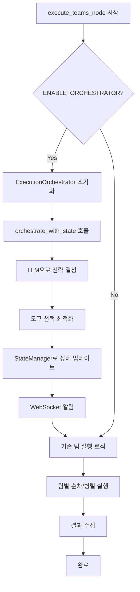

# Execute Node Enhancement - Integration Guide
## team_supervisor.py 최소 수정 가이드

**작성일**: 2025-10-16
**목적**: ExecutionOrchestrator를 기존 team_supervisor.py에 최소한의 변경으로 통합

---

## 📋 통합 개요

기존 `team_supervisor.py`에 **단 20줄의 코드 추가**로 ExecutionOrchestrator를 통합합니다.

---

## 1. 🔧 필요한 수정사항

### 1.1 Import 추가 (1줄)

```python
# team_supervisor.py 상단에 추가
from app.service_agent.cognitive_agents.execution_orchestrator import ExecutionOrchestrator
```

### 1.2 __init__ 메서드 수정 (1줄)

```python
def __init__(self, llm_context: LLMContext = None, enable_checkpointing: bool = True):
    # ... 기존 코드 ...

    # 새로 추가: ExecutionOrchestrator (lazy initialization)
    self.execution_orchestrator = None  # ← 이 줄만 추가
```

### 1.3 execute_teams_node 메서드 수정 (15줄 추가)

```python
async def execute_teams_node(self, state: MainSupervisorState) -> MainSupervisorState:
    """
    팀 실행 노드
    계획에 따라 팀들을 실행
    """
    logger.info("[TeamSupervisor] Executing teams")

    state["current_phase"] = "executing"

    # ========== 새로 추가: ExecutionOrchestrator 통합 (시작) ==========
    # Feature Flag로 제어 (선택적)
    ENABLE_ORCHESTRATOR = os.getenv("ENABLE_EXECUTION_ORCHESTRATOR", "true") == "true"

    if ENABLE_ORCHESTRATOR:
        # Lazy initialization
        if self.execution_orchestrator is None:
            self.execution_orchestrator = ExecutionOrchestrator(self.llm_context)

        # 기존 progress_callback 재사용
        session_id = state.get("session_id")
        progress_callback = self._progress_callbacks.get(session_id) if session_id else None

        try:
            # Orchestration 실행
            state = await self.execution_orchestrator.orchestrate_with_state(
                state, progress_callback
            )
            logger.info("[TeamSupervisor] Orchestration complete")
        except Exception as e:
            logger.error(f"[TeamSupervisor] Orchestration failed: {e}, continuing with default")
            # Fallback: 오케스트레이션 실패 시 기존 로직 계속
    # ========== ExecutionOrchestrator 통합 (끝) ==========

    # ... 기존 코드 계속 (WebSocket 알림 등) ...

    execution_strategy = state.get("execution_plan", {}).get("strategy", "sequential")
    active_teams = state.get("active_teams", [])

    # ... 나머지 기존 코드 그대로 ...
```

### 1.4 _execute_single_team 메서드 수정 (선택적, 5줄)

도구 선택을 오케스트레이션 결과와 연동하려면:

```python
async def _execute_single_team(
    self,
    team_name: str,
    shared_state: SharedState,
    main_state: MainSupervisorState
) -> Any:
    """단일 팀 실행"""
    team = self.teams[team_name]

    # ========== 새로 추가: 오케스트레이션 메타데이터 전달 ==========
    orchestration_metadata = None
    if main_state.get("orchestration_metadata"):
        tool_selections = main_state["orchestration_metadata"].get("tool_selections", {})
        orchestration_metadata = {
            "selected_tools": tool_selections.get(team_name, [])
        }
    # ========== 추가 끝 ==========

    if team_name == "search":
        # orchestration_metadata를 팀에 전달 (선택적)
        # 기존: return await team.execute(shared_state)
        # 수정: return await team.execute(shared_state, orchestration_metadata)
        return await team.execute(shared_state)  # 일단 기존 방식 유지

    # ... 나머지 팀도 동일 ...
```

---

## 2. 📊 통합 후 실행 흐름



---

## 3. 🔍 WebSocket 이벤트 (자동 전송)

ExecutionOrchestrator가 자동으로 전송하는 이벤트:

### 3.1 orchestration_started
```json
{
    "type": "orchestration_started",
    "data": {
        "message": "실행 전략을 최적화하고 있습니다...",
        "total_steps": 3
    }
}
```

### 3.2 orchestration_complete
```json
{
    "type": "orchestration_complete",
    "data": {
        "message": "실행 전략 최적화 완료",
        "strategy": "adaptive",
        "tool_selections": {
            "search": ["legal_search", "market_data"],
            "analysis": ["contract_analysis"]
        },
        "execution_steps": [...]
    }
}
```

### 3.3 team_analysis_complete
```json
{
    "type": "team_analysis_complete",
    "data": {
        "team": "search",
        "quality_score": 0.85,
        "adjustments": null
    }
}
```

---

## 4. 🎯 Feature Flag 제어

### 4.1 환경변수로 On/Off

```bash
# .env 파일
ENABLE_EXECUTION_ORCHESTRATOR=true  # 활성화
# ENABLE_EXECUTION_ORCHESTRATOR=false # 비활성화
```

### 4.2 코드에서 동적 제어

```python
# 특정 조건에서만 활성화
if state.get("query_complexity", "low") == "high":
    ENABLE_ORCHESTRATOR = True
else:
    ENABLE_ORCHESTRATOR = False
```

---

## 5. 🔥 Fallback 처리

오케스트레이션이 실패해도 기존 로직이 계속 실행됩니다:

```python
try:
    state = await self.execution_orchestrator.orchestrate_with_state(state, progress_callback)
except Exception as e:
    logger.error(f"Orchestration failed: {e}")
    # 기존 로직으로 계속 실행 (영향 없음)
```

---

## 6. 📈 성능 영향

### 추가되는 작업
- LLM 호출: 2-3회 추가
- 실행 시간: 1-2초 증가

### 최적화 옵션
```python
# 간단한 쿼리는 오케스트레이션 스킵
if len(active_teams) == 1:
    logger.info("Single team execution, skipping orchestration")
else:
    state = await self.execution_orchestrator.orchestrate_with_state(...)
```

---

## 7. 🧪 테스트 방법

### 7.1 단위 테스트
```python
# test_orchestrator.py
async def test_orchestration_with_existing_state():
    state = {
        "query": "전세금 인상 가능한가요?",
        "session_id": "test_session",
        "planning_state": {
            "execution_steps": [
                {"step_id": "step_0", "team": "search", ...}
            ]
        }
    }

    orchestrator = ExecutionOrchestrator()
    updated_state = await orchestrator.orchestrate_with_state(state)

    assert "orchestration_metadata" in updated_state
    assert updated_state["orchestration_metadata"]["strategy"] in ["sequential", "parallel", "adaptive"]
```

### 7.2 통합 테스트
```bash
# Feature flag로 테스트
export ENABLE_EXECUTION_ORCHESTRATOR=true
python -m pytest tests/test_team_supervisor.py -v

# 비활성화 상태 테스트
export ENABLE_EXECUTION_ORCHESTRATOR=false
python -m pytest tests/test_team_supervisor.py -v
```

---

## 8. 📊 모니터링

### 로그 확인
```bash
# Orchestration 로그만 필터링
tail -f app.log | grep "ExecutionOrchestrator"
```

### 주요 로그 메시지
- `[ExecutionOrchestrator] Starting orchestration with existing state`
- `[ExecutionOrchestrator] Orchestration complete: adaptive strategy, 2 LLM calls`
- `[ExecutionOrchestrator] Loaded 5 patterns for user 123`

---

## 9. 🚀 점진적 배포

### Phase 1: 테스트 환경
```python
# 10% 사용자만 활성화
import random
ENABLE_ORCHESTRATOR = random.random() < 0.1
```

### Phase 2: 특정 사용자만
```python
# VIP 사용자만 활성화
VIP_USERS = [1, 2, 3, 4, 5]
ENABLE_ORCHESTRATOR = state.get("user_id") in VIP_USERS
```

### Phase 3: 전체 활성화
```python
ENABLE_ORCHESTRATOR = True
```

---

## 10. ⚠️ 주의사항

### 10.1 State 직렬화
- orchestration_metadata는 자동으로 checkpoint에 저장됨
- Callable 타입은 State에 포함하지 말 것

### 10.2 Memory 사용
- user_id가 없는 경우 패턴 학습 비활성화
- Memory 로드 실패 시 기본값으로 진행

### 10.3 LLM 타임아웃
```python
# LLMService에서 타임아웃 설정
result = await self.llm_service.complete_json_async(
    prompt_name="orchestration/execution_strategy",
    timeout=5.0  # 5초 타임아웃
)
```

---

## 📝 요약

**최소 변경사항**:
- team_supervisor.py에 20줄 추가
- 기존 로직 변경 없음
- Feature flag로 On/Off 가능
- Fallback 자동 처리

**즉시 얻는 이점**:
- 도구 중복 방지
- 실행 전략 최적화
- 사용자별 패턴 학습
- 실시간 진행상황 업데이트

---

**작성자**: Claude
**상태**: Integration Guide Complete
**예상 작업 시간**: 30분