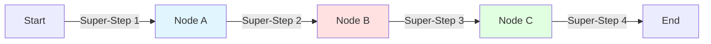

# Checkpointer 완전 가이드 - 모든 기능과 개념

**작성일:** 2025-10-21
**목적:** Checkpointer의 모든 기능을 이해하고 활용하기

---

## 🎯 개요

Checkpointer는 **LangGraph의 모든 고급 기능을 가능하게 하는 기초 인프라**입니다.

### 건물 비유로 이해하기

```
┌─────────────────────────────────────────────────────┐
│  🏢 LangGraph 건물 (전체 시스템)                    │
└─────────────────────────────────────────────────────┘
                        ↓
┌─────────────────────────────────────────────────────┐
│  🏗️ Checkpointer (기초 공사) ← 모든 것의 기반      │
│                                                     │
│  기능:                                              │
│  1. State 저장 (매 Step마다 스냅샷)                 │
│  2. State 복원 (이전 시점으로 되돌리기)              │
│  3. State 조회 (실행 이력 확인)                      │
│  4. State 수정 (과거 지점에서 값 변경)               │
└─────────────────────────────────────────────────────┘
                        ↓
┌─────────────────────────────────────────────────────┐
│  🎪 고급 기능들 (Checkpointer 기반)                 │
│                                                     │
│  1. 🤝 Human-in-the-Loop (사용자 승인)               │
│  2. 🧠 Memory (대화 기억)                            │
│  3. ⏰ Time Travel (과거로 되돌아가기)                │
│  4. 🔁 Replay (재실행)                               │
│  5. 🐛 Debugging (단계별 디버깅)                     │
│  6. 🛡️ Fault Tolerance (오류 복구)                  │
│  7. 📊 Streaming (실시간 상태 확인)                  │
└─────────────────────────────────────────────────────┘
```

**핵심:** Checkpointer 없이는 위의 고급 기능들을 **하나도 사용할 수 없습니다!**

---

## 📋 목차

1. [Checkpointer 핵심 개념](#checkpointer-핵심-개념)
2. [7가지 주요 기능](#7가지-주요-기능)
3. [State Time Travel 상세](#state-time-travel-상세)
4. [Memory 상세](#memory-상세)
5. [Fault Tolerance 상세](#fault-tolerance-상세)
6. [Replay & Debugging](#replay--debugging)
7. [Streaming 상세](#streaming-상세)
8. [실전 활용 예제](#실전-활용-예제)

---

## 🔧 Checkpointer 핵심 개념

### Super-Step이란?

**Super-Step:** 하나의 실행 단계 (1개 이상의 노드 실행)



**Checkpointer 동작:**
- 각 Super-Step **이후** State를 자동 저장
- `thread_id` + `checkpoint_id`로 식별
- 실패 시 마지막 성공 Super-Step으로 복원 가능

### Thread란?

**Thread:** 하나의 대화 세션 또는 워크플로우 실행 단위

```
Thread ID: "session-abc123"
  ├─ Checkpoint 1 (Super-Step 1 완료)
  ├─ Checkpoint 2 (Super-Step 2 완료)
  ├─ Checkpoint 3 (Super-Step 3 완료)
  └─ Checkpoint 4 (Super-Step 4 완료)
```

**홈즈냥즈의 Thread:**
```python
config = {
    "configurable": {
        "thread_id": session_id  # "session-abc123"
    }
}

# 같은 thread_id로 재호출하면
# 이전 대화 내용을 모두 기억함
result = graph.invoke({"query": "..."}, config=config)
```

### Checkpoint란?

**Checkpoint:** 특정 시점의 State 스냅샷

```json
{
  "checkpoint_id": "1ef4f797-fffe-6ad8-8002-bf7d68b7e1f4",
  "thread_id": "session-abc123",
  "parent_checkpoint_id": "1ef4f797-fffe-6ad8-8001-...",
  "values": {
    "messages": [...],
    "current_agent": "PlanningAgent",
    "query": "강남구 아파트 추천해줘"
  },
  "metadata": {
    "step": 3,
    "source": "update",
    "writes": {...}
  }
}
```

---

## 🎪 7가지 주요 기능

### 1. 🤝 Human-in-the-Loop (HITL)

**개념:** 사용자 승인이 필요한 시점에 워크플로우 중단

**Checkpointer 역할:**
- interrupt() 호출 시 현재 State 저장
- 사용자 입력 대기 (몇 시간이든 가능)
- Command(resume=...)로 재개 시 저장된 State 복원

**코드:**
```python
def approval_node(state):
    # Checkpointer가 State 저장
    user_decision = interrupt({"action": "계약서 작성"})

    # 여기서 중단 (Checkpointer 덕분)
    # 몇 시간 뒤에도 재개 가능
    # Checkpointer가 State 복원

    return {"approval": user_decision}
```

**Checkpointer 없으면?**
```python
# ❌ 불가능!
def approval_node(state):
    user_decision = interrupt(...)  # Error!
    # Checkpointer가 없어서 State 저장 불가
    # 중단 후 재개 불가능
```

---

### 2. 🧠 Memory (대화 기억)

**개념:** 여러 대화 세션 간 내용 기억

**Checkpointer 역할:**
- 각 대화를 `thread_id`로 구분하여 저장
- 같은 `thread_id`로 재호출 시 이전 State 로드
- 대화 이력 자동 누적

**예시:**
```python
# 대화 1
config = {"configurable": {"thread_id": "user-1-session"}}
graph.invoke({"query": "강남구 아파트 추천해줘"}, config)
# Checkpointer: State 저장 (checkpoint_id: A)

# 대화 2 (같은 thread_id)
graph.invoke({"query": "아까 추천한 아파트 가격은?"}, config)
# Checkpointer: checkpoint_id A의 State 로드
# AI: "네, 아까 추천드린 강남구 아파트는..." ✅
```

**Checkpointer 없으면?**
```python
# ❌ 매번 새로운 대화
graph.invoke({"query": "아까 추천한 아파트 가격은?"}, config)
# AI: "무엇을 추천했는지 모르겠습니다." ❌
```

**홈즈냥즈 활용:**
```python
# 3-Tier Hybrid Memory
# Short-term: 최근 5개 세션의 전체 메시지
# Mid-term: 6-10번째 세션의 요약
# Long-term: 11-20번째 세션의 요약

# 모두 Checkpointer에 저장된 State에서 로드!
memories = await memory_service.load_tiered_memories(user_id)
```

---

### 3. ⏰ Time Travel (시간 여행)

**개념:** 과거 시점으로 되돌아가서 다른 선택을 하기

**실생활 비유:**
```
현실:
  9시: 집 출발
  10시: 회사 도착
  11시: 회의 참석

  "10시로 되돌아가서 카페에 들렀으면 좋았을텐데..."
  → 불가능 😢

LangGraph with Checkpointer:
  Step 1: Planning (checkpoint A 저장)
  Step 2: Search (checkpoint B 저장)
  Step 3: Analysis (checkpoint C 저장)

  "Step 2로 되돌아가서 다른 검색어를 사용해보자!"
  → 가능! ✅
```

**Checkpointer 역할:**
- 각 Step마다 Checkpoint 자동 생성
- `get_state_history()`로 과거 Checkpoint 조회
- `update_state()`로 과거 State 수정
- `invoke(None, config)`로 그 시점부터 재실행

**코드 예시:**
```python
# 1. 그래프 실행
config = {"configurable": {"thread_id": "debug-session"}}
result = graph.invoke({"topic": "cats"}, config)
# Output: {'topic': 'cats', 'joke': 'Why do cats...'}

# 2. 실행 이력 조회
states = []
for state in graph.get_state_history(config):
    states.append(state)
    print(f"Step {state.metadata['step']}: {state.values}")

# Output:
# Step 4: {'topic': 'cats', 'joke': 'Why do cats...'}
# Step 3: {'topic': 'cats', 'joke': ''}
# Step 2: {'topic': 'cats'}
# Step 1: {'topic': ''}

# 3. Step 2로 되돌아가기
step2_state = states[2]  # Step 2의 checkpoint

# 4. State 수정 (topic 변경)
new_config = graph.update_state(
    step2_state.config,
    values={"topic": "dogs"}  # cats → dogs 변경
)

# 5. Step 2부터 재실행 (다른 결과)
new_result = graph.invoke(None, new_config)
# Output: {'topic': 'dogs', 'joke': 'Why do dogs...'}
```

**활용 사례:**

1. **A/B 테스트**
   ```python
   # 같은 시점에서 다른 선택 테스트
   # Option A: 검색어 "강남구 아파트"
   # Option B: 검색어 "강남역 아파트"
   # 어느 것이 더 좋은 결과를 주는지 비교
   ```

2. **디버깅**
   ```python
   # Step 5에서 에러 발생
   # → Step 3으로 되돌아가서 다른 경로 시도
   # → 어느 지점에서 잘못되었는지 파악
   ```

3. **최적화**
   ```python
   # 여러 번 실행하면서 최적의 파라미터 찾기
   # 매번 처음부터 재실행할 필요 없음
   ```

**Checkpointer 없으면?**
```python
# ❌ Time Travel 불가능
graph.get_state_history(config)  # Error!
graph.update_state(...)  # Error!

# 처음부터 다시 실행해야 함 (비효율)
```

---

### 4. 🔁 Replay (재실행)

**개념:** 이전 실행을 "재생"하여 결과 확인

**Checkpointer 역할:**
- Checkpoint 이력을 보고 "이미 실행된 적 있는지" 확인
- 있으면 재실행하지 않고 저장된 결과 반환
- **성능 최적화!** (중복 실행 방지)

**코드 예시:**
```python
# 첫 번째 실행
config = {"configurable": {"thread_id": "replay-test"}}
result1 = graph.invoke({"query": "강남구 아파트"}, config)
# 실제로 LLM 호출, DB 검색 등 실행 (5초 소요)

# 두 번째 실행 (같은 input, 같은 thread_id)
result2 = graph.invoke({"query": "강남구 아파트"}, config)
# Checkpointer: "이미 실행했네? 저장된 결과 반환!"
# 실제 실행 안 함! (0.1초 소요) ⚡
```

**활용:**
- 개발 중 반복 테스트 시 시간 절약
- 동일한 질문 재요청 시 즉시 응답
- 비용 절감 (LLM API 호출 안 함)

---

### 5. 🐛 Debugging (디버깅)

**개념:** Step-by-step으로 실행 과정 확인 및 문제 진단

**Checkpointer 역할:**
- 각 Step의 State를 모두 저장
- 어느 Step에서 문제가 발생했는지 파악 가능
- 문제 Step 이전으로 되돌아가서 수정 후 재실행

**디버깅 워크플로우:**
```python
# 1. 그래프 실행 (에러 발생)
try:
    result = graph.invoke({"query": "..."}, config)
except Exception as e:
    print(f"Error: {e}")

# 2. 어느 Step에서 에러가 났는지 확인
for state in graph.get_state_history(config):
    step = state.metadata.get('step')
    print(f"Step {step}: {state.values.get('current_agent')}")

    # Step 3에서 멈춤?
    if step == 3:
        print(f"Last successful state: {state.values}")
        break

# 3. Step 2로 되돌아가서 디버깅
step2_config = graph.update_state(
    state.config,
    values={"debug_mode": True}  # 디버그 모드 활성화
)

# 4. Step 2부터 재실행 (로그 확인)
result = graph.invoke(None, step2_config)
```

**Breakpoint 설정:**
```python
# 특정 노드에서 자동 중단 (디버깅용)
graph = builder.compile(
    checkpointer=checkpointer,
    interrupt_before=["legal_node"]  # legal_node 전에 중단
)

# 실행
result = graph.invoke({"query": "..."}, config)
# → legal_node 직전에 자동 중단
# → State 확인 후 수동으로 재개
```

---

### 6. 🛡️ Fault Tolerance (장애 허용)

**개념:** 노드 실행 실패 시 자동 복구

**Checkpointer 역할:**
- 각 Super-Step에서 성공한 노드의 결과만 저장
- 실패한 노드는 저장 안 함
- 재시작 시 마지막 성공 지점부터 재실행

**시나리오:**
```python
# Super-Step 3에서 3개 노드 병렬 실행
Parallel:
  ├─ Node A ✅ (성공)
  ├─ Node B ❌ (실패 - API timeout)
  └─ Node C ✅ (성공)

# Checkpointer 동작:
# 1. Node A, C의 결과만 저장 (pending writes)
# 2. Node B는 저장 안 함
# 3. 그래프 전체는 실패 처리

# 재실행:
result = graph.invoke(None, config)

# Checkpointer:
# - Node A, C는 재실행 안 함 (이미 성공한 결과 재사용) ✅
# - Node B만 재실행 ⚡
```

**효과:**
- 불필요한 재실행 방지
- 시간 절약
- 비용 절감 (LLM API 호출 최소화)

**코드 예시:**
```python
def unreliable_node(state):
    """50% 확률로 실패하는 노드"""
    import random
    if random.random() < 0.5:
        raise Exception("Random failure!")
    return {"result": "success"}

# 실행
try:
    result = graph.invoke({"query": "..."}, config)
except:
    print("Failed! Retrying...")

    # 재시도 (Checkpointer 덕분에 성공한 노드는 재실행 안 됨)
    result = graph.invoke(None, config)
    print("Success!")
```

---

### 7. 📊 Streaming (실시간 상태 확인)

**개념:** 그래프 실행 중 실시간으로 State 변화 확인

**Checkpointer 역할:**
- 각 Super-Step마다 Checkpoint 생성
- Stream으로 전달하여 실시간 모니터링 가능

**코드 예시:**
```python
# Streaming 실행
for event in graph.stream({"query": "강남구 아파트"}, config):
    print(f"Event: {event}")

# Output:
# Event: {'planning_node': {'current_agent': 'PlanningAgent'}}
# Event: {'real_estate_search_node': {'properties': [...]}}
# Event: {'analysis_node': {'analysis': '...'}}
# Event: {'generate_response_node': {'messages': [...]}}
```

**WebSocket과 결합:**
```python
# Backend
async def stream_to_websocket(session_id):
    async for event in graph.astream({"query": "..."}, config):
        # 각 event는 Checkpoint 기반
        await websocket.send_json(event)

# Frontend
websocket.onmessage = (event) => {
  console.log("Progress:", event.data);
  // 실시간으로 진행 상황 표시
  updateProgressBar(event.data);
};
```

**홈즈냥즈 활용:**
```typescript
// frontend/src/components/chat/ChatInterface.tsx
useEffect(() => {
  wsClient.onMessage((message) => {
    if (message.type === "progress") {
      // Checkpointer가 저장한 각 Step 표시
      setProgress(message.data);
    }
  });
}, []);
```

---

## 🎓 State Time Travel 상세

### Time Travel이란?

> **"과거로 돌아가서 다른 선택을 하는 것"**

**영화 비유:**
```
Back to the Future (백 투 더 퓨처)
  1985년 → DeLorean 타고 → 1955년
  1955년에서 다른 선택 → 다른 1985년

LangGraph Time Travel
  Step 5 → get_state_history() → Step 2
  Step 2에서 State 수정 → 다른 Step 5
```

### Time Travel의 4단계

#### 1단계: Execute (실행)

```python
config = {"configurable": {"thread_id": "time-travel-demo"}}

# 그래프 실행
result = graph.invoke({"topic": "cats"}, config)

# Checkpointer가 각 Step마다 저장:
# Step 1: {'topic': ''}
# Step 2: {'topic': 'cats'}
# Step 3: {'topic': 'cats', 'outline': '...'}
# Step 4: {'topic': 'cats', 'outline': '...', 'joke': 'Why do cats...'}
```

#### 2단계: Retrieve History (이력 조회)

```python
# 모든 Checkpoint 조회
states = list(graph.get_state_history(config))

# states[0]: 가장 최근 (Step 4)
# states[1]: Step 3
# states[2]: Step 2
# states[3]: Step 1 (가장 오래된)

for i, state in enumerate(states):
    print(f"Checkpoint {i}:")
    print(f"  checkpoint_id: {state.config['configurable']['checkpoint_id']}")
    print(f"  step: {state.metadata['step']}")
    print(f"  values: {state.values}")
```

#### 3단계: Modify State (State 수정)

```python
# Step 2로 돌아가기
target_state = states[2]  # Step 2

# State 수정 (topic 변경)
new_config = graph.update_state(
    target_state.config,
    values={"topic": "dogs"}  # cats → dogs
)

# Checkpointer:
# - Step 2의 checkpoint를 복사
# - topic만 "dogs"로 변경
# - 새로운 checkpoint_id 생성
```

#### 4단계: Resume (재개)

```python
# Step 2부터 재실행 (새로운 topic으로)
new_result = graph.invoke(None, new_config)

# Checkpointer:
# - Step 1-2는 skip (이미 실행됨)
# - Step 3부터 새로 실행 (topic="dogs"로)
# - 결과: 강아지 농담 생성!

print(new_result)
# {'topic': 'dogs', 'joke': 'Why do dogs love trees? Because...'}
```

### Time Travel 활용 사례

#### 사례 1: 디버깅

```python
# 문제 상황
result = graph.invoke({"query": "강남구 아파트"}, config)
# → 이상한 결과가 나옴

# Time Travel로 디버깅
states = list(graph.get_state_history(config))

# 각 Step의 State 확인
for state in states:
    step = state.metadata['step']
    agent = state.values.get('current_agent')
    print(f"Step {step} - {agent}: {state.values}")

# Step 3에서 잘못된 검색어 사용 발견
# → Step 2로 돌아가서 검색어 수정
# → Step 2부터 재실행
```

#### 사례 2: A/B 테스트

```python
# 원본 실행 (검색어: "강남구 아파트")
result_a = graph.invoke({"search_query": "강남구 아파트"}, config)

# 실행 이력에서 검색 전 Step 찾기
states = list(graph.get_state_history(config))
before_search = states[2]

# 다른 검색어로 테스트
config_b = graph.update_state(
    before_search.config,
    values={"search_query": "강남역 아파트"}
)
result_b = graph.invoke(None, config_b)

# 결과 비교
print(f"Option A: {len(result_a['properties'])} properties")
print(f"Option B: {len(result_b['properties'])} properties")
# → 더 나은 결과를 주는 검색어 선택
```

#### 사례 3: 반복 개선

```python
# 첫 시도
result1 = graph.invoke({"topic": "부동산 투자"}, config)
# → 결과가 마음에 안 듦

# 이전 Step으로 돌아가서 파라미터 조정
states = list(graph.get_state_history(config))
target = states[1]

# 온도(temperature) 낮춰서 더 정확하게
config2 = graph.update_state(
    target.config,
    values={"temperature": 0.3}  # 0.7 → 0.3
)
result2 = graph.invoke(None, config2)

# 더 나은 결과가 나올 때까지 반복
```

---

## 💾 Checkpointer 내부 동작

### Database Schema (PostgreSQL)

```sql
-- AsyncPostgresSaver가 자동 생성하는 테이블

-- 1. checkpoints: 메인 Checkpoint 저장
CREATE TABLE checkpoints (
    thread_id TEXT NOT NULL,
    checkpoint_ns TEXT NOT NULL DEFAULT '',
    checkpoint_id TEXT NOT NULL,
    parent_checkpoint_id TEXT,
    type TEXT,
    checkpoint JSONB NOT NULL,
    metadata JSONB NOT NULL DEFAULT '{}',
    PRIMARY KEY (thread_id, checkpoint_ns, checkpoint_id)
);

-- 2. checkpoint_writes: Pending writes (실패 복구용)
CREATE TABLE checkpoint_writes (
    thread_id TEXT NOT NULL,
    checkpoint_ns TEXT NOT NULL DEFAULT '',
    checkpoint_id TEXT NOT NULL,
    task_id TEXT NOT NULL,
    idx INTEGER NOT NULL,
    channel TEXT NOT NULL,
    type TEXT,
    value JSONB,
    PRIMARY KEY (thread_id, checkpoint_ns, checkpoint_id, task_id, idx)
);

-- 3. checkpoint_blobs: 큰 데이터 저장
CREATE TABLE checkpoint_blobs (
    thread_id TEXT NOT NULL,
    checkpoint_ns TEXT NOT NULL DEFAULT '',
    channel TEXT NOT NULL,
    version TEXT NOT NULL,
    type TEXT NOT NULL,
    blob BYTEA,
    PRIMARY KEY (thread_id, checkpoint_ns, channel, version)
);

-- 4. checkpoint_migrations: 스키마 버전 관리
CREATE TABLE checkpoint_migrations (
    v INTEGER PRIMARY KEY
);
```

### Checkpoint 저장 과정

```python
# 1. 노드 실행
state = node(state)

# 2. Checkpointer가 자동으로 저장
checkpoint_id = await checkpointer.aput(
    config=config,
    checkpoint={
        "v": 1,
        "id": generate_uuid(),
        "ts": datetime.now(),
        "channel_values": state,
        "channel_versions": {...},
        "versions_seen": {...},
        "pending_sends": []
    },
    metadata={
        "step": current_step,
        "source": "update",
        "writes": node_output
    }
)

# 3. Database에 저장
INSERT INTO checkpoints (
    thread_id,
    checkpoint_id,
    parent_checkpoint_id,
    checkpoint,
    metadata
) VALUES ($1, $2, $3, $4, $5);
```

### Checkpoint 로드 과정

```python
# 1. Config로 Checkpoint 조회
checkpoint = await checkpointer.aget(config)

# 2. SQL 쿼리
SELECT checkpoint, metadata
FROM checkpoints
WHERE thread_id = $1
  AND checkpoint_id = $2;

# 3. State 복원
state = checkpoint["channel_values"]

# 4. 그래프 재개
result = graph.invoke(None, config)
```

---

## 🎯 Checkpointer 기능 비교표

| 기능 | Checkpointer 필요 | 설명 | 홈즈냥즈 |
|------|-------------------|------|----------|
| **Basic Execution** | ❌ | 단순 그래프 실행 | ✅ |
| **Human-in-the-Loop** | ✅ | interrupt() 사용 | ❌ (예정) |
| **Memory** | ✅ | 대화 기억 | ✅ |
| **Time Travel** | ✅ | 과거로 되돌아가기 | ❌ |
| **Replay** | ✅ | 재실행 최적화 | ✅ (자동) |
| **Debugging** | ✅ | Step-by-step 디버깅 | ⚠️ (수동) |
| **Fault Tolerance** | ✅ | 장애 복구 | ✅ (자동) |
| **Streaming** | ✅ | 실시간 상태 확인 | ✅ |
| **State Inspection** | ✅ | State 조회 | ⚠️ (제한적) |
| **State Modification** | ✅ | State 수정 | ❌ |

---

## 🔬 실전 활용 예제

### 예제 1: HITL with Time Travel

```python
# 시나리오: 사용자가 승인을 거부했을 때 이전 단계로 돌아가기

# 1. 그래프 실행
config = {"configurable": {"thread_id": "user-123"}}
result = graph.invoke({"query": "10억 아파트 계약서 작성"}, config)

# 2. 승인 요청 (interrupt)
# → 사용자가 거부!

# 3. 거부 원인 파악을 위해 Time Travel
states = list(graph.get_state_history(config))

# 4. 검색 단계로 돌아가기
search_step = states[3]

# 5. 검색 조건 수정 (가격 범위 조정)
new_config = graph.update_state(
    search_step.config,
    values={"price_max": 800_000_000}  # 10억 → 8억
)

# 6. 재실행
new_result = graph.invoke(None, new_config)

# 7. 다시 승인 요청
# → 이번엔 승인! ✅
```

### 예제 2: Debugging with Checkpoints

```python
# 시나리오: 이상한 결과가 나왔을 때 원인 파악

# 1. 문제 발생
result = graph.invoke({"query": "서울 아파트 추천"}, config)
# → 부산 아파트가 나옴 (이상함!)

# 2. 모든 Step의 State 조회
for state in graph.get_state_history(config):
    step = state.metadata['step']
    print(f"\nStep {step}:")
    print(f"  Agent: {state.values.get('current_agent')}")
    print(f"  Search query: {state.values.get('search_query')}")
    print(f"  Location: {state.values.get('location')}")

# Output:
# Step 1: Agent: PlanningAgent
#   Search query: None
#   Location: 서울
#
# Step 2: Agent: RealEstateSearchAgent
#   Search query: "아파트 추천"  ← 위치 정보 누락!
#   Location: None  ← 문제 발견!

# 3. Step 1로 돌아가서 수정
states = list(graph.get_state_history(config))
step1 = states[-2]

new_config = graph.update_state(
    step1.config,
    values={"search_query": "서울 아파트 추천"}  # 위치 포함
)

# 4. 재실행
correct_result = graph.invoke(None, new_config)
# → 서울 아파트 정상 출력! ✅
```

### 예제 3: Fault Recovery

```python
# 시나리오: API 타임아웃 발생 시 자동 복구

def search_node(state):
    """부동산 검색 (가끔 타임아웃)"""
    try:
        properties = search_api(state["search_query"], timeout=5)
        return {"properties": properties}
    except TimeoutError:
        # Checkpointer 덕분에 이전 Step은 재실행 안 됨
        raise  # 에러 전파

# 실행
for attempt in range(3):
    try:
        result = graph.invoke({"query": "..."}, config)
        break  # 성공!
    except:
        print(f"Attempt {attempt + 1} failed, retrying...")
        # Checkpointer가 성공한 Step은 skip하고
        # 실패한 Step만 재실행
        time.sleep(2)

# Checkpointer 로그:
# Attempt 1:
#   Step 1 (Planning) ✅ - 저장됨
#   Step 2 (Search) ❌ - 타임아웃
# Attempt 2:
#   Step 1 (Planning) ⏭️ - Skip (이미 성공)
#   Step 2 (Search) ✅ - 재실행 성공!
```

---

## 🎓 요약 및 결론

### Checkpointer는 7가지 기능의 기반

```
1. 🤝 HITL           → interrupt/Command로 중단/재개
2. 🧠 Memory         → thread_id로 대화 이력 유지
3. ⏰ Time Travel    → 과거로 돌아가서 다른 선택
4. 🔁 Replay         → 재실행 최적화
5. 🐛 Debugging      → Step-by-step 분석
6. 🛡️ Fault Tolerance → 실패 시 자동 복구
7. 📊 Streaming      → 실시간 상태 모니터링
```

### Checkpointer 없이 가능한 것

```
✅ 단순 그래프 실행
✅ 1회성 질의응답
✅ Stateless 작업
```

### Checkpointer로만 가능한 것

```
✅ 대화 기억
✅ 사용자 승인 대기
✅ 과거로 되돌리기
✅ 실패 복구
✅ 디버깅
✅ 실시간 모니터링
```

### 홈즈냥즈의 Checkpointer 활용

**현재 사용 중:**
- ✅ Memory (3-Tier Hybrid Memory)
- ✅ Fault Tolerance (자동)
- ✅ Replay (자동)
- ✅ Streaming (WebSocket)

**계획 중:**
- ⏳ HITL (Human-in-the-Loop)
- ⏳ Time Travel (디버깅용)
- ⏳ Advanced Debugging

---

**Last Updated:** 2025-10-21
**Author:** HolmesNyangz Team
**LangGraph Version:** v1.0.0
**Status:** ✅ Complete Guide
