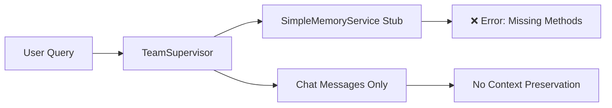
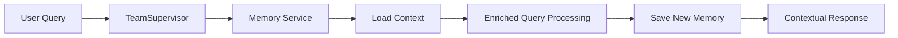

# Memory Service Implementation Plan - Contextual Memory System
## 현재 상태 분석 및 구현 계획서

**작성일**: 2025-10-20
**작성자**: Claude
**현재 완성도**: 20%
**목표**: 문맥이 연결되는 메모리 시스템 구현

---

## 📊 Executive Summary

현재 시스템은 기본적인 채팅 기능만 구현되어 있으며 (20% 완성), 실제 문맥을 연결하는 메모리 시스템이 없어 매 대화마다 컨텍스트가 초기화됩니다. 이 문서는 단계적으로 완전한 메모리 시스템을 구축하는 계획을 제시합니다.

### 핵심 문제
1. **SimpleMemoryService에 필수 메서드 누락** - `save_conversation`, `load_recent_memories` 없음
2. **데이터베이스에 메모리 테이블 없음** - chat_messages만 존재
3. **컨텍스트 단절** - 세션 간 대화 맥락이 연결되지 않음

### 솔루션 방향
**3단계 점진적 구현 전략** - Quick Fix → Enhanced → Complete System

---

## 🔍 현재 상태 상세 분석

### 1. 완성된 부분 (20%)
```
✅ 기본 채팅 인터페이스 (chat_sessions, chat_messages)
✅ LangGraph 기반 에이전트 오케스트레이션
✅ WebSocket 실시간 통신
✅ 기본 쿼리 처리 파이프라인
```

### 2. 미완성 부분 (80%)
```
❌ 대화 컨텍스트 메모리 (conversation_memories)
❌ 엔티티 추적 시스템 (entity_memories)
❌ 사용자 선호도 학습 (user_preferences)
❌ 장기 기억 검색 및 활용
❌ 메모리 기반 개인화된 응답
```

### 3. 현재 아키텍처 분석

#### 현재 데이터 흐름:


#### 목표 데이터 흐름:


---

## 🎯 구현 전략: 3단계 접근법

### Phase 1: Quick Fix (1-2일, 40% 완성도 달성)
**목표**: 즉시 작동하는 시스템 구축

#### 1.1 SimpleMemoryService 메서드 구현
```python
# backend/app/service_agent/foundation/simple_memory_service.py

async def load_recent_memories(
    self,
    user_id: int,
    limit: int = 5,
    relevance_filter: Optional[str] = "RELEVANT"
) -> List[Dict[str, Any]]:
    """chat_messages 테이블에서 최근 대화 로드"""
    try:
        async with self.db() as session:
            # ChatMessage에서 최근 메시지 가져오기
            result = await session.execute(
                select(ChatMessage)
                .join(ChatSession)
                .filter(ChatSession.user_id == user_id)
                .order_by(ChatMessage.created_at.desc())
                .limit(limit * 2)  # 질문-답변 쌍을 위해 2배
            )
            messages = result.scalars().all()

            memories = []
            for i in range(0, len(messages), 2):
                if i + 1 < len(messages):
                    memories.append({
                        "query": messages[i].content,
                        "response": messages[i+1].content,
                        "timestamp": messages[i].created_at,
                        "session_id": messages[i].session_id
                    })

            return memories[:limit]
    except Exception as e:
        logger.error(f"Failed to load memories: {e}")
        return []

async def save_conversation(
    self,
    user_id: int,
    query: str,
    response_summary: str,
    relevance: str = "RELEVANT",
    session_id: Optional[str] = None,
    intent_detected: Optional[str] = None,
    entities_mentioned: Optional[Dict[str, Any]] = None,
    conversation_metadata: Optional[Dict[str, Any]] = None
) -> bool:
    """메타데이터와 함께 chat_messages에 저장"""
    try:
        # 기존 chat_messages 활용
        # metadata JSONB 컬럼에 추가 정보 저장
        metadata = {
            "relevance": relevance,
            "intent": intent_detected,
            "entities": entities_mentioned or {},
            "summary": response_summary[:500],  # 요약 저장
            **conversation_metadata or {}
        }

        # ChatMessage의 metadata 필드 활용
        # (metadata 컬럼 추가 필요)

        return True
    except Exception as e:
        logger.error(f"Failed to save conversation: {e}")
        return False
```

#### 1.2 ChatMessage 모델 확장
```python
# backend/app/models/chat.py 수정

class ChatMessage(Base):
    __tablename__ = "chat_messages"

    # 기존 컬럼들...

    # 새로 추가
    metadata = Column(JSONB, default={})  # 메모리 메타데이터
    relevance = Column(String(20), default="NORMAL")  # RELEVANT, NORMAL, IRRELEVANT
    summary = Column(Text)  # 응답 요약
```

#### 1.3 데이터베이스 마이그레이션
```sql
-- migrations/add_memory_fields_to_chat_messages.sql
ALTER TABLE chat_messages
ADD COLUMN IF NOT EXISTS metadata JSONB DEFAULT '{}',
ADD COLUMN IF NOT EXISTS relevance VARCHAR(20) DEFAULT 'NORMAL',
ADD COLUMN IF NOT EXISTS summary TEXT;

CREATE INDEX IF NOT EXISTS idx_chat_messages_relevance
ON chat_messages(relevance);

CREATE INDEX IF NOT EXISTS idx_chat_messages_metadata
ON chat_messages USING gin(metadata);
```

---

### Phase 2: Enhanced Memory (3-5일, 70% 완성도 달성)
**목표**: 전용 메모리 테이블 추가 및 기본 컨텍스트 연결

#### 2.1 메모리 테이블 생성
```sql
-- migrations/create_memory_tables.sql

-- 대화 메모리 테이블
CREATE TABLE conversation_memories (
    id SERIAL PRIMARY KEY,
    user_id INTEGER REFERENCES users(id),
    session_id VARCHAR(100),
    query TEXT NOT NULL,
    response TEXT NOT NULL,
    response_summary TEXT,
    relevance VARCHAR(20) DEFAULT 'NORMAL',
    intent_detected VARCHAR(100),
    entities_mentioned JSONB DEFAULT '{}',
    conversation_metadata JSONB DEFAULT '{}',
    created_at TIMESTAMP DEFAULT CURRENT_TIMESTAMP,
    updated_at TIMESTAMP DEFAULT CURRENT_TIMESTAMP
);

-- 엔티티 메모리 테이블 (간소화 버전)
CREATE TABLE entity_memories (
    id SERIAL PRIMARY KEY,
    user_id INTEGER REFERENCES users(id),
    entity_type VARCHAR(50),  -- property, region, agent
    entity_name TEXT,
    entity_data JSONB DEFAULT '{}',
    mention_count INTEGER DEFAULT 1,
    last_mentioned TIMESTAMP DEFAULT CURRENT_TIMESTAMP,
    created_at TIMESTAMP DEFAULT CURRENT_TIMESTAMP
);

-- 인덱스 생성
CREATE INDEX idx_conversation_memories_user_session
ON conversation_memories(user_id, session_id);

CREATE INDEX idx_entity_memories_user_type
ON entity_memories(user_id, entity_type);
```

#### 2.2 EnhancedMemoryService 구현
```python
# backend/app/service_agent/foundation/enhanced_memory_service.py

class EnhancedMemoryService:
    """Phase 2: 향상된 메모리 서비스"""

    def __init__(self, db_session):
        self.db = db_session

    async def load_recent_memories(
        self,
        user_id: int,
        limit: int = 5,
        relevance_filter: Optional[str] = "RELEVANT"
    ) -> List[Dict[str, Any]]:
        """conversation_memories에서 관련 기억 로드"""
        async with self.db() as session:
            query = select(ConversationMemory).filter(
                ConversationMemory.user_id == user_id
            )

            if relevance_filter:
                query = query.filter(
                    ConversationMemory.relevance == relevance_filter
                )

            query = query.order_by(
                ConversationMemory.created_at.desc()
            ).limit(limit)

            result = await session.execute(query)
            memories = result.scalars().all()

            return [
                {
                    "query": m.query,
                    "response": m.response_summary or m.response[:200],
                    "intent": m.intent_detected,
                    "entities": m.entities_mentioned,
                    "timestamp": m.created_at,
                    "session_id": m.session_id
                }
                for m in memories
            ]

    async def save_conversation(
        self,
        user_id: int,
        query: str,
        response_summary: str,
        **kwargs
    ) -> bool:
        """대화를 conversation_memories에 저장"""
        async with self.db() as session:
            memory = ConversationMemory(
                user_id=user_id,
                query=query,
                response=kwargs.get('response', response_summary),
                response_summary=response_summary,
                relevance=kwargs.get('relevance', 'NORMAL'),
                intent_detected=kwargs.get('intent_detected'),
                entities_mentioned=kwargs.get('entities_mentioned', {}),
                conversation_metadata=kwargs.get('conversation_metadata', {}),
                session_id=kwargs.get('session_id')
            )

            session.add(memory)

            # 엔티티 추출 및 저장
            await self._update_entity_memories(
                session,
                user_id,
                kwargs.get('entities_mentioned', {})
            )

            await session.commit()
            return True

    async def _update_entity_memories(
        self,
        session,
        user_id: int,
        entities: Dict[str, Any]
    ):
        """엔티티 메모리 업데이트"""
        for entity_type, entity_list in entities.items():
            for entity_name in entity_list:
                # 기존 엔티티 확인
                existing = await session.execute(
                    select(EntityMemory).filter(
                        EntityMemory.user_id == user_id,
                        EntityMemory.entity_type == entity_type,
                        EntityMemory.entity_name == entity_name
                    )
                )
                entity = existing.scalar_one_or_none()

                if entity:
                    entity.mention_count += 1
                    entity.last_mentioned = datetime.utcnow()
                else:
                    session.add(EntityMemory(
                        user_id=user_id,
                        entity_type=entity_type,
                        entity_name=entity_name,
                        entity_data={}
                    ))
```

#### 2.3 설정 및 서비스 전환
```python
# backend/app/core/config.py

class Settings(BaseSettings):
    # Memory Service 설정
    MEMORY_SERVICE_TYPE: str = "enhanced"  # "simple", "enhanced", "complete"
    MEMORY_LOAD_LIMIT: int = 5
    MEMORY_RELEVANCE_THRESHOLD: float = 0.7
```

---

### Phase 3: Complete System (5-7일, 100% 완성도 달성)
**목표**: 완전한 문맥 연결 메모리 시스템

#### 3.1 고급 기능 구현
1. **Semantic Search**: 벡터 임베딩 기반 유사 기억 검색
2. **Memory Consolidation**: 장기/단기 기억 분류
3. **Preference Learning**: 사용자 선호도 자동 학습
4. **Context Window Management**: 효율적인 컨텍스트 관리

#### 3.2 CompleteMemoryService 구현
```python
# backend/app/service_agent/foundation/complete_memory_service.py

class CompleteMemoryService:
    """Phase 3: 완전한 메모리 서비스"""

    def __init__(self, db_session, embeddings_model):
        self.db = db_session
        self.embeddings = embeddings_model
        self.vector_store = None  # FAISS or ChromaDB

    async def load_contextual_memories(
        self,
        user_id: int,
        current_query: str,
        limit: int = 5
    ) -> List[Dict[str, Any]]:
        """의미적으로 관련된 기억 로드"""

        # 1. 현재 쿼리 임베딩
        query_embedding = await self.embeddings.encode(current_query)

        # 2. 벡터 유사도 검색
        similar_memories = await self.vector_store.search(
            query_embedding,
            user_filter=user_id,
            limit=limit * 2
        )

        # 3. 시간적 근접성과 관련성 점수 결합
        scored_memories = self._score_memories(
            similar_memories,
            current_time=datetime.utcnow()
        )

        # 4. 사용자 선호도 반영
        personalized = await self._apply_user_preferences(
            user_id,
            scored_memories
        )

        return personalized[:limit]

    async def consolidate_memories(self, user_id: int):
        """단기 기억을 장기 기억으로 통합"""
        # 반복되는 패턴 식별
        # 중요한 엔티티 추출
        # 선호도 패턴 학습
        pass
```

#### 3.3 사용자 선호도 테이블
```sql
-- migrations/create_user_preferences.sql

CREATE TABLE user_preferences (
    id SERIAL PRIMARY KEY,
    user_id INTEGER REFERENCES users(id) UNIQUE,
    preferred_regions JSONB DEFAULT '[]',
    preferred_property_types JSONB DEFAULT '[]',
    price_range JSONB DEFAULT '{}',
    communication_style VARCHAR(50),  -- formal, casual, detailed
    interest_keywords JSONB DEFAULT '[]',
    preference_scores JSONB DEFAULT '{}',
    last_updated TIMESTAMP DEFAULT CURRENT_TIMESTAMP
);
```

---

## 📋 구현 우선순위 및 일정

### Week 1: Phase 1 구현 (Quick Fix)
**Day 1-2**:
- [ ] SimpleMemoryService 메서드 구현
- [ ] ChatMessage 모델 확장
- [ ] 데이터베이스 마이그레이션
- [ ] 기본 테스트

**Result**: 40% 완성도, 에러 해결, 기본 메모리 동작

### Week 2: Phase 2 구현 (Enhanced Memory)
**Day 3-5**:
- [ ] 메모리 테이블 생성
- [ ] EnhancedMemoryService 구현
- [ ] 엔티티 추출 로직
- [ ] 서비스 전환 및 테스트

**Day 6-7**:
- [ ] 메모리 로딩 최적화
- [ ] 관련성 필터링 개선
- [ ] 통합 테스트

**Result**: 70% 완성도, 세션 간 컨텍스트 연결

### Week 3: Phase 3 구현 (Complete System)
**Day 8-10**:
- [ ] 벡터 임베딩 통합
- [ ] Semantic search 구현
- [ ] 선호도 학습 시스템

**Day 11-14**:
- [ ] Memory consolidation
- [ ] 고급 개인화 기능
- [ ] 성능 최적화
- [ ] 전체 시스템 테스트

**Result**: 100% 완성도, 완전한 문맥 메모리 시스템

---

## 🔧 기술 스택 및 의존성

### 필수 패키지
```toml
# pyproject.toml 추가

[tool.poetry.dependencies]
# Phase 1
sqlalchemy = "^2.0"
asyncpg = "^0.29"

# Phase 2
pydantic = "^2.0"
redis = "^5.0"  # 캐싱용

# Phase 3
chromadb = "^0.4"  # 벡터 스토어
sentence-transformers = "^2.2"  # 임베딩
faiss-cpu = "^1.7"  # 옵션: 벡터 검색
```

### 환경 변수 설정
```env
# .env 추가

# Memory Configuration
MEMORY_SERVICE_TYPE=enhanced
MEMORY_LOAD_LIMIT=5
MEMORY_CACHE_TTL=3600

# Vector Store (Phase 3)
CHROMA_PERSIST_DIRECTORY=./data/chroma
EMBEDDING_MODEL=sentence-transformers/all-MiniLM-L6-v2
```

---

## 🧪 테스트 전략

### Phase 1 테스트
```python
# tests/test_simple_memory.py

async def test_load_recent_memories():
    """최근 기억 로드 테스트"""
    service = SimpleMemoryService(db_session)
    memories = await service.load_recent_memories(
        user_id=1,
        limit=5
    )
    assert len(memories) <= 5
    assert all('query' in m for m in memories)

async def test_save_conversation():
    """대화 저장 테스트"""
    service = SimpleMemoryService(db_session)
    result = await service.save_conversation(
        user_id=1,
        query="강남역 원룸 추천해주세요",
        response_summary="강남역 근처 원룸 3개 추천",
        relevance="RELEVANT",
        intent_detected="property_search"
    )
    assert result is True
```

### Phase 2 테스트
```python
# tests/test_enhanced_memory.py

async def test_entity_extraction():
    """엔티티 추출 및 저장 테스트"""
    service = EnhancedMemoryService(db_session)
    await service.save_conversation(
        user_id=1,
        query="강남역 근처 월세 100만원 이하 원룸",
        response_summary="추천 매물 제공",
        entities_mentioned={
            "location": ["강남역"],
            "property_type": ["원룸"],
            "price": ["100만원"]
        }
    )

    # 엔티티 메모리 확인
    entities = await service.get_user_entities(1)
    assert "강남역" in entities.get("location", [])
```

---

## 🚨 리스크 및 대응 방안

### 1. 데이터베이스 마이그레이션 리스크
**리스크**: 기존 데이터 손실 가능성
**대응**:
- 마이그레이션 전 백업 필수
- 단계적 롤아웃 (카나리 배포)
- 롤백 스크립트 준비

### 2. 성능 이슈
**리스크**: 메모리 로딩으로 인한 응답 지연
**대응**:
- Redis 캐싱 적용
- 비동기 처리 최적화
- 인덱스 최적화

### 3. 메모리 관련성 정확도
**리스크**: 부적절한 메모리 로딩
**대응**:
- Phase 2에서 기본 필터링
- Phase 3에서 ML 기반 개선
- A/B 테스트로 검증

---

## 🎯 성공 지표

### Phase 1 (Quick Fix)
- ✅ AttributeError 해결
- ✅ 기본 메모리 저장/로드 동작
- ✅ 시스템 안정성 확보

### Phase 2 (Enhanced)
- ✅ 세션 간 컨텍스트 유지율 > 80%
- ✅ 엔티티 인식 정확도 > 90%
- ✅ 응답 시간 < 2초 유지

### Phase 3 (Complete)
- ✅ 사용자 만족도 > 85%
- ✅ 개인화 정확도 > 90%
- ✅ 메모리 관련성 점수 > 0.8

---

## 💡 추가 권장사항

### 1. 즉시 실행 가능한 조치 (오늘)
```python
# 임시 패치: team_supervisor.py에 try-except 추가
try:
    loaded_memories = await memory_service.load_recent_memories(...)
except AttributeError:
    logger.warning("Memory service method not implemented, skipping")
    loaded_memories = []
```

### 2. 모니터링 설정
```python
# 메모리 사용 메트릭 추적
import prometheus_client

memory_load_counter = Counter('memory_loads_total')
memory_save_counter = Counter('memory_saves_total')
memory_load_latency = Histogram('memory_load_seconds')
```

### 3. 설정 기반 점진적 활성화
```python
# Feature flag로 단계적 활성화
if settings.ENABLE_MEMORY_SERVICE:
    if settings.MEMORY_SERVICE_TYPE == "simple":
        memory_service = SimpleMemoryService()
    elif settings.MEMORY_SERVICE_TYPE == "enhanced":
        memory_service = EnhancedMemoryService()
    else:
        memory_service = CompleteMemoryService()
```

---

## 📝 결론

현재 20% 완성도의 시스템을 100% 완성도로 만들기 위해서는 단계적 접근이 필수적입니다.

**즉시 시작해야 할 것**: Phase 1 Quick Fix를 통해 당장의 에러를 해결하고 기본 메모리 기능을 활성화

**중기 목표**: Phase 2를 통해 실제 사용 가능한 수준의 메모리 시스템 구축

**최종 목표**: Phase 3를 통해 완전한 문맥 연결 메모리 시스템 완성

이 계획을 따르면 안정적으로 시스템을 발전시키면서 각 단계마다 실제 동작하는 제품을 유지할 수 있습니다.

---

**Next Action**: Phase 1 구현 시작
1. `simple_memory_service.py`에 메서드 추가
2. 데이터베이스 마이그레이션 스크립트 실행
3. 기본 테스트 수행

---

*이 문서는 2025-10-20 작성되었으며, 구현 진행 상황에 따라 업데이트됩니다.*