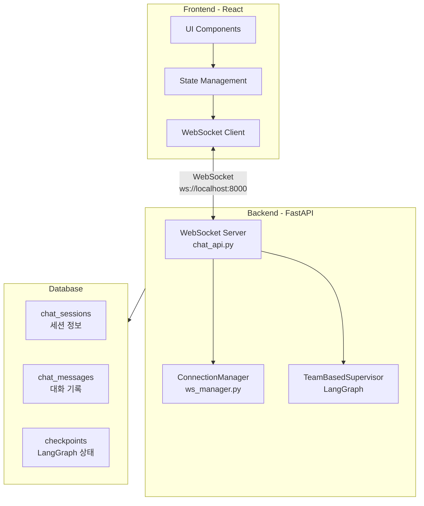
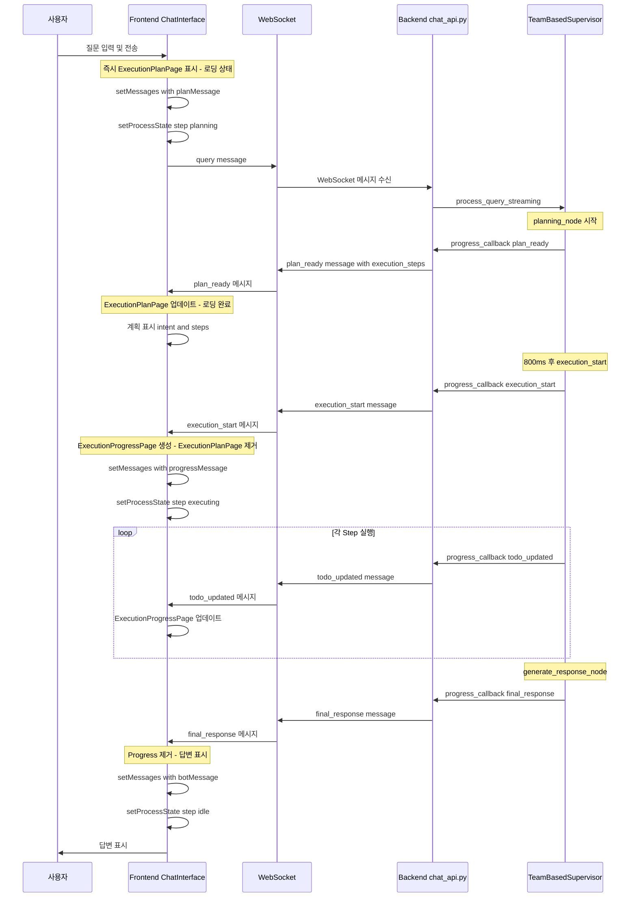
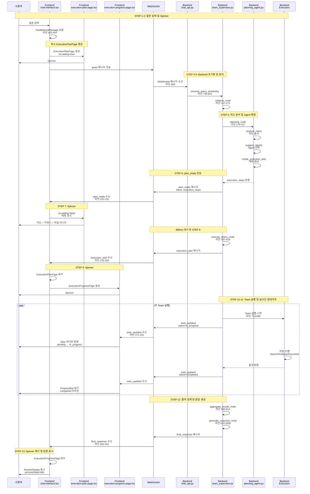

# Frontend/Backend 아키텍처 분석 보고서

**작성일**: 2025-10-22
**목적**: Spinner 수정을 위한 시스템 아키텍처 파악
**범위**: Frontend (React) ↔ Backend (FastAPI + WebSocket) 통신 흐름

---

## 📋 목차

1. [시스템 개요](#시스템-개요)
2. [아키텍처 레이어 구조](#아키텍처-레이어-구조)
3. [사용자 설명 검증](#사용자-설명-검증)
4. [Frontend 구조](#frontend-구조)
5. [Backend 구조](#backend-구조)
6. [WebSocket 통신 프로토콜](#websocket-통신-프로토콜)
7. [Spinner/Progress UI 흐름](#spinnerprogress-ui-흐름)
8. [단계별 파일 및 코드 매핑](#단계별-파일-및-코드-매핑)
9. [개선 방향](#개선-방향)

---

## 시스템 개요

### 기술 스택

```
Frontend: React (Next.js) + TypeScript + WebSocket Client
Backend:  FastAPI + WebSocket + LangGraph 0.6
통신:     WebSocket (실시간 양방향 통신)
```

### 핵심 특징

- **실시간 스트리밍**: HTTP POST 방식에서 WebSocket으로 전환하여 실시간 진행 상황 전송
- **Progress Flow UI**: 계획(Plan) → 실행(Progress) → 결과(Answer) 3단계 시각화
- **Checkpointing**: LangGraph 기반 대화 상태 영속화 (PostgreSQL)

---

## 아키텍처 레이어 구조



---

## 사용자 설명 검증

### 📝 사용자가 설명한 흐름

```
사용자 질문 입력
  → Frontend : 스피너 작동 + Backend에 사용자 질문 전달
  → Backend : 사용자 질문 분석
  → Backend : 사용되는 agent (Team) 확정
  → Backend : Frontend에 사용 agent 전달
  → Frontend : spinner 작동 (execution-progress-page.tsx)
  → Backend : 완료 결과를 frontend에 전달
  → Frontend : 답변생성
```

### ✅ 검증 결과: **80% 정확**

**정확한 부분:**
- ✅ 사용자 질문 입력 → Frontend 스피너 작동
- ✅ Backend 질문 분석
- ✅ Backend Agent(Team) 확정
- ✅ Frontend에 Agent 정보 전달
- ✅ Frontend Spinner 작동
- ✅ Backend 완료 결과 전달
- ✅ Frontend 답변 생성

**누락된 핵심 사항:**

#### 1. **2개의 Spinner가 순차적으로 작동** ⚠️

사용자님이 언급한 `execution-progress-page.tsx`의 Spinner만 있는 것이 아닙니다:

```
Spinner #1: ExecutionPlanPage (execution-plan-page.tsx)
  - 질문 분석 중 표시
  - Loader2 아이콘 + 스켈레톤 UI
  - 로딩 → 계획 표시

Spinner #2: ExecutionProgressPage (execution-progress-page.tsx)  ← 사용자가 언급
  - 작업 실행 중 표시
  - Settings 아이콘 + ProgressBar
  - 진행률 0% → 100%
```

#### 2. **실시간 업데이트 메시지** ⚠️

Backend는 각 Team 실행마다 `todo_updated` 메시지를 전송:

```
execution_start → todo_updated (Step 1 시작)
              → todo_updated (Step 1 완료)
              → todo_updated (Step 2 시작)
              → todo_updated (Step 2 완료)
              → final_response
```

#### 3. **WebSocket 메시지 프로토콜** ⚠️

총 8가지 메시지 타입이 존재:
- `connected`: 연결 확인
- `planning_start`: 계획 시작 (현재 사용 안 함)
- `plan_ready`: 계획 완료 ✅
- `execution_start`: 실행 시작 ✅
- `todo_created`: Todo 생성 (현재 사용 안 함)
- `todo_updated`: 실시간 진행 상황 ✅
- `final_response`: 최종 응답 ✅
- `error`: 에러 발생

#### 4. **LangGraph 노드 구조** ⚠️

Backend는 5개의 노드로 구성:

```
initialize_node (초기화)
   ↓
planning_node (의도 분석 + Agent 확정)
   ↓
execute_teams_node (Team 실행)
   ↓
aggregate_results_node (결과 집계)
   ↓
generate_response_node (응답 생성)
```

### 🔄 보완된 정확한 흐름

```
1. 사용자 질문 입력
   ↓
2. Frontend: Spinner #1 시작 (ExecutionPlanPage - 로딩 상태)
              + WebSocket으로 query 메시지 전송
   ↓
3. Backend: WebSocket 메시지 수신
            → _process_query_async() 실행
   ↓
4. Backend: initialize_node 실행 (상태 초기화)
   ↓
5. Backend: planning_node 실행
            → analyze_intent() - 질문 의도 분석
            → suggest_agents() - 필요한 Agent 선택
            → create_execution_plan() - 실행 계획 생성
   ↓
6. Backend: plan_ready 메시지 전송 (intent, execution_steps, keywords)
   ↓
7. Frontend: Spinner #1 업데이트 (로딩 완료 → 계획 표시)
             - 의도 표시
             - 키워드 표시
             - 예정 작업 리스트 표시
   ↓
   [800ms 대기]
   ↓
8. Backend: execute_teams_node 실행 시작
            → execution_start 메시지 전송
   ↓
9. Frontend: Spinner #1 제거
             + Spinner #2 생성 (ExecutionProgressPage)
   ↓
10. Backend: Team 순차/병렬 실행
             각 Team마다:
             - todo_updated (status: in_progress)
             - Team 작업 수행
             - todo_updated (status: completed)
   ↓
11. Frontend: Spinner #2 실시간 업데이트
              - 진행률 바 증가
              - Step 상태 아이콘 변경
              - 현재 작업 메시지 표시
   ↓
12. Backend: aggregate_results_node (결과 집계)
             → generate_response_node (응답 생성)
             → final_response 메시지 전송
   ↓
13. Frontend: Spinner #2 제거
              + 답변 표시 (AnswerDisplay 또는 GuidancePage)
              + processState를 idle로 전환 (입력 활성화)
```

### 📊 요약 비교표

| 항목 | 사용자 설명 | 실제 구현 |
|------|-------------|----------|
| Spinner 개수 | 1개 | **2개** (Plan + Progress) |
| WebSocket 메시지 | 명시 없음 | **8가지** 타입 |
| Backend 노드 | 명시 없음 | **5개** 노드 (LangGraph) |
| 실시간 업데이트 | 명시 없음 | **todo_updated** (각 Step마다) |
| Agent 전달 방식 | "사용 agent 전달" | **plan_ready** (execution_steps 포함) |
| 결과 전달 방식 | "완료 결과 전달" | **final_response** (structured_data 포함) |

---

## Frontend 구조

### 디렉토리 구조

```
frontend/
├── components/
│   ├── chat-interface.tsx              ✅ 메인 채팅 인터페이스
│   ├── execution-plan-page.tsx         ✅ 실행 계획 표시
│   ├── execution-progress-page.tsx     ✅ 실행 진행 상황 표시
│   ├── step-item.tsx                   ✅ 개별 Step UI
│   ├── answer-display.tsx              ✅ 답변 표시
│   ├── guidance-page.tsx               ✅ 안내 페이지 (범위 외 질문)
│   └── ui/
│       ├── progress.tsx                ✅ Progress 컴포넌트
│       └── progress-bar.tsx            ✅ 진행률 바
│
├── lib/
│   ├── ws.ts                           ✅ WebSocket 클라이언트
│   └── types.ts                        ✅ 공통 타입
│
└── types/
    ├── process.ts                      ✅ ProcessState 타입
    └── execution.ts                    ✅ ExecutionStep, ExecutionPlan 타입
```

### 주요 컴포넌트

#### 1. ChatInterface (메인 컴포넌트)
**파일**: `frontend/components/chat-interface.tsx`

**역할**:
- WebSocket 연결 관리
- 메시지 송수신 및 상태 관리
- UI 렌더링 (Plan, Progress, Answer)

**주요 상태**:
```typescript
const [messages, setMessages] = useState<Message[]>([])
const [processState, setProcessState] = useState<ProcessState>({
  step: "idle",           // idle | planning | executing
  agentType: null,
  message: ""
})
const [todos, setTodos] = useState<ExecutionStepState[]>([])
const [wsConnected, setWsConnected] = useState(false)
```

**메시지 타입**:
```typescript
interface Message {
  id: string
  type: "user" | "bot" | "execution-plan" | "execution-progress" | "guidance"
  content: string
  timestamp: Date
  executionPlan?: ExecutionPlan       // 실행 계획
  executionSteps?: ExecutionStep[]    // 실행 단계
  structuredData?: {                  // 구조화된 답변
    sections: AnswerSection[]
    metadata: AnswerMetadata
  }
  guidanceData?: GuidanceData         // 안내 메시지
}
```

#### 2. ExecutionPlanPage (계획 표시)
**파일**: `frontend/components/execution-plan-page.tsx`

**역할**:
- 사용자 질문 입력 즉시 로딩 스피너 표시
- `plan_ready` 메시지 수신 시 실행 계획 표시

**로딩 상태**:
```typescript
if (isLoading) {
  return (
    <Card>
      <Loader2 className="animate-spin" />
      <h3>작업 계획 분석 중...</h3>
      {/* 스켈레톤 로딩 */}
    </Card>
  )
}
```

**계획 표시**:
- 감지된 의도 (intent)
- 신뢰도 (confidence)
- 키워드 (keywords)
- 예정 작업 리스트 (execution_steps)

#### 3. ExecutionProgressPage (실행 진행 표시)
**파일**: `frontend/components/execution-progress-page.tsx`

**역할**:
- 실행 중인 작업 진행 상황 실시간 업데이트
- 전체 진행률 표시
- 개별 작업 상태 표시 (pending → in_progress → completed)

**진행률 계산**:
```typescript
const totalSteps = steps.length
const completedSteps = steps.filter(s => s.status === "completed").length
const overallProgress = (completedSteps / totalSteps) * 100
```

**개별 Step 상태**:
```typescript
type StepStatus = "pending" | "in_progress" | "completed" | "failed"
```

---

## Backend 구조

### 디렉토리 구조

```
backend/
├── app/
│   ├── main.py                         ✅ FastAPI 앱 초기화
│   │
│   ├── api/
│   │   ├── chat_api.py                 ✅ WebSocket 엔드포인트
│   │   ├── ws_manager.py               ✅ ConnectionManager
│   │   ├── postgres_session_manager.py ✅ SessionManager
│   │   └── schemas.py                  ✅ API 스키마
│   │
│   └── service_agent/
│       ├── supervisor/
│       │   └── team_supervisor.py      ✅ TeamBasedSupervisor (LangGraph)
│       │
│       ├── cognitive_agents/
│       │   └── planning_agent.py       ✅ PlanningAgent
│       │
│       └── execution_agents/
│           ├── search_executor.py      ✅ SearchExecutor
│           └── analysis_executor.py    ✅ AnalysisExecutor
```

### 주요 모듈

#### 1. main.py (FastAPI 앱)
**파일**: `backend/app/main.py`

**역할**:
- FastAPI 앱 초기화
- CORS 설정
- 라우터 등록
- 로깅 설정
- Lifespan 관리 (Supervisor pre-warming)

**Lifespan**:
```python
@asynccontextmanager
async def lifespan(app: FastAPI):
    # Startup: Pre-warm TeamBasedSupervisor
    await get_supervisor(enable_checkpointing=True)

    yield

    # Shutdown: Cleanup resources
    if _supervisor_instance and _supervisor_instance.checkpointer:
        await _supervisor_instance._checkpoint_cm.__aexit__(None, None, None)
```

#### 2. chat_api.py (WebSocket 엔드포인트)
**파일**: `backend/app/api/chat_api.py`

**주요 엔드포인트**:

##### 세션 관리
```python
POST   /api/v1/chat/start                    # 세션 시작
GET    /api/v1/chat/{session_id}             # 세션 정보 조회
DELETE /api/v1/chat/{session_id}             # 세션 삭제
```

##### Chat History & State
```python
GET    /api/v1/chat/sessions                 # 세션 목록 조회
POST   /api/v1/chat/sessions                 # 세션 생성
GET    /api/v1/chat/sessions/{id}/messages   # 메시지 조회
PATCH  /api/v1/chat/sessions/{id}            # 세션 제목 수정
DELETE /api/v1/chat/sessions/{id}            # 세션 삭제 (hard/soft)
```

##### WebSocket
```python
WS     /api/v1/chat/ws/{session_id}          # 실시간 채팅
```

**WebSocket 핸들러**:
```python
@router.websocket("/ws/{session_id}")
async def websocket_chat(websocket: WebSocket, session_id: str):
    # 1. 세션 검증
    validation_result = await session_mgr.validate_session(session_id)

    # 2. WebSocket 연결
    await conn_mgr.connect(session_id, websocket)

    # 3. 연결 확인 메시지 전송
    await conn_mgr.send_message(session_id, {"type": "connected"})

    # 4. Supervisor 인스턴스 가져오기
    supervisor = await get_supervisor(enable_checkpointing=True)

    # 5. 메시지 수신 루프
    while True:
        data = await websocket.receive_json()
        message_type = data.get("type")

        if message_type == "query":
            # 비동기 쿼리 처리
            asyncio.create_task(_process_query_async(...))
```

**쿼리 처리**:
```python
async def _process_query_async(supervisor, query, session_id, ...):
    # 1. 사용자 메시지 DB 저장
    await _save_message_to_db(session_id, "user", query)

    # 2. Supervisor에 쿼리 전송 (스트리밍)
    result = await supervisor.process_query_streaming(
        query=query,
        session_id=session_id,
        progress_callback=progress_callback  # 실시간 진행 상황 전송
    )

    # 3. 최종 응답 전송
    await conn_mgr.send_message(session_id, {
        "type": "final_response",
        "response": result["final_response"]
    })

    # 4. AI 응답 DB 저장
    await _save_message_to_db(session_id, "assistant", response_content)
```

#### 3. ws_manager.py (ConnectionManager)
**파일**: `backend/app/api/ws_manager.py`

**역할**:
- WebSocket 연결 관리
- 메시지 큐잉 (연결 끊김 시)
- 재연결 시 큐잉된 메시지 전송

**주요 메서드**:
```python
class ConnectionManager:
    async def connect(session_id: str, websocket: WebSocket)
    def disconnect(session_id: str)
    async def send_message(session_id: str, message: dict) -> bool
    def is_connected(session_id: str) -> bool
    async def _queue_message(session_id: str, message: dict)
    async def _flush_queued_messages(session_id: str)
```

**직렬화**:
```python
def _serialize_datetimes(self, obj: Any) -> Any:
    """datetime, Enum 객체를 JSON 직렬화 가능한 형식으로 변환"""
    if isinstance(obj, datetime):
        return obj.isoformat()
    elif isinstance(obj, Enum):
        return obj.value
    elif isinstance(obj, dict):
        return {key: self._serialize_datetimes(value) for key, value in obj.items()}
    # ...
```

---

## WebSocket 통신 프로토콜

### Client → Server

| 메시지 타입 | 필드 | 설명 |
|------------|------|------|
| `query` | `query`, `enable_checkpointing` | 사용자 쿼리 전송 |
| `interrupt_response` | `action`, `modified_todos` | Plan 승인/수정 (미구현) |
| `todo_skip` | `todo_id` | Todo 건너뛰기 (미구현) |

**예시**:
```json
{
  "type": "query",
  "query": "전세금 인상기준은?",
  "enable_checkpointing": true
}
```

### Server → Client

| 메시지 타입 | 발생 시점 | 필드 | Frontend 동작 |
|------------|----------|------|---------------|
| `connected` | WebSocket 연결 시 | `session_id`, `timestamp` | 연결 확인 |
| `planning_start` | planning_node 시작 | `message` | ❌ **제거됨** (즉시 ExecutionPlanPage 표시) |
| `plan_ready` | planning_node 완료 | `intent`, `confidence`, `execution_steps`, `estimated_total_time`, `keywords` | ExecutionPlanPage 업데이트 |
| `execution_start` | execute_teams_node 시작 | `message`, `execution_steps` | ExecutionProgressPage 생성 |
| `todo_created` | 초기 todo 생성 | `execution_steps` | (미사용) |
| `todo_updated` | Step 상태 변경 | `execution_steps` | ExecutionProgressPage의 steps 업데이트 |
| `step_start` | Step 시작 | `agent`, `task` | processState 업데이트 |
| `final_response` | generate_response_node 완료 | `response` (content/answer/message) | Progress 제거, 답변 표시, idle 전환 |
| `error` | 에러 발생 | `error`, `details` | 에러 메시지 표시, idle 전환 |

### 메시지 예시

#### plan_ready
```json
{
  "type": "plan_ready",
  "intent": "legal_consult",
  "confidence": 0.95,
  "execution_steps": [
    {
      "step_id": "step-001",
      "team": "search_team",
      "task": "법률 정보 검색",
      "description": "전세금 인상기준 관련 법률 검색",
      "status": "pending",
      "estimated_duration": 3
    }
  ],
  "execution_strategy": "sequential",
  "estimated_total_time": 5,
  "keywords": ["전세금", "인상기준", "임대차법"],
  "timestamp": "2025-10-22T10:30:00.000Z"
}
```

#### execution_start
```json
{
  "type": "execution_start",
  "message": "작업 실행을 시작합니다...",
  "execution_steps": [
    {
      "step_id": "step-001",
      "status": "in_progress",
      ...
    }
  ],
  "timestamp": "2025-10-22T10:30:02.000Z"
}
```

#### todo_updated
```json
{
  "type": "todo_updated",
  "execution_steps": [
    {
      "step_id": "step-001",
      "status": "completed",
      ...
    }
  ],
  "timestamp": "2025-10-22T10:30:05.000Z"
}
```

#### final_response
```json
{
  "type": "final_response",
  "response": {
    "type": "summary",
    "answer": "전세금 인상기준은...",
    "structured_data": {
      "sections": [...],
      "metadata": {...}
    }
  },
  "timestamp": "2025-10-22T10:30:10.000Z"
}
```

---

## Spinner/Progress UI 흐름

### 전체 플로우



### 4개 페이지 전체 호출 흐름도

```mermaid
sequenceDiagram
    participant User as 사용자
    participant FE_Chat as Frontend<br/>chat-interface.tsx
    participant FE_Plan as Frontend<br/>execution-plan-page.tsx
    participant FE_Progress as Frontend<br/>execution-progress-page.tsx
    participant FE_Answer as Frontend<br/>answer-display.tsx
    participant FE_Guidance as Frontend<br/>guidance-page.tsx
    participant WS as WebSocket
    participant BE_API as Backend<br/>chat_api.py
    participant BE_Supervisor as Backend<br/>team_supervisor.py

    rect rgb(240, 248, 255)
    Note over User,BE_Supervisor: 📝 PHASE 1: 질문 입력 및 즉시 반응
    User->>FE_Chat: 질문 입력 및 전송<br/>handleSendMessage 호출

    Note over FE_Chat: ⚡ Backend 대기 없이 즉시 생성
    FE_Chat->>FE_Plan: 페이지 #1 생성<br/>isLoading=true
    activate FE_Plan
    FE_Plan-->>User: 🔄 Spinner #1 표시<br/>"작업 계획 분석 중..."<br/>Loader2 + 스켈레톤

    FE_Chat->>WS: query 메시지 전송<br/>라인 447
    end

    rect rgb(255, 250, 240)
    Note over WS,BE_Supervisor: 🔍 PHASE 2: Backend 분석 (Frontend는 대기)
    WS->>BE_API: WebSocket 수신
    BE_API->>BE_Supervisor: process_query_streaming
    BE_Supervisor->>BE_Supervisor: initialize_node
    BE_Supervisor->>BE_Supervisor: planning_node<br/>의도 분석 + Agent 확정
    end

    rect rgb(240, 255, 240)
    Note over BE_Supervisor,FE_Plan: ✅ PHASE 3: 계획 완료 및 표시
    BE_Supervisor->>WS: plan_ready 메시지<br/>intent, execution_steps
    WS->>FE_Chat: plan_ready 수신<br/>라인 101-131

    FE_Chat->>FE_Plan: 페이지 #1 업데이트<br/>isLoading=false
    FE_Plan-->>User: 📋 계획 표시<br/>의도 + 키워드 + 예정 작업
    deactivate FE_Plan
    end

    rect rgb(255, 245, 240)
    Note over BE_Supervisor,FE_Progress: ⚙️ PHASE 4: 실행 시작 및 진행

    Note over BE_Supervisor: 800ms 대기
    BE_Supervisor->>BE_Supervisor: execute_teams_node
    BE_Supervisor->>WS: execution_start 메시지
    WS->>FE_Chat: execution_start 수신<br/>라인 133-169

    Note over FE_Chat: ExecutionPlanPage 제거
    FE_Chat->>FE_Plan: 페이지 #1 제거

    FE_Chat->>FE_Progress: 페이지 #2 생성
    activate FE_Progress
    FE_Progress-->>User: 🔄 Spinner #2 표시<br/>"작업 실행 중"<br/>Settings + ProgressBar
    end

    rect rgb(245, 240, 255)
    Note over BE_Supervisor,FE_Progress: 🔄 PHASE 5: 실시간 업데이트 (반복)

    loop 각 Team 실행
        BE_Supervisor->>BE_Supervisor: Team 실행 시작
        BE_Supervisor->>WS: todo_updated<br/>status=in_progress
        WS->>FE_Chat: todo_updated 수신<br/>라인 171-191
        FE_Chat->>FE_Progress: executionSteps 업데이트
        FE_Progress-->>User: 📊 진행률 업데이트<br/>Step 아이콘 변경

        BE_Supervisor->>BE_Supervisor: Team 작업 완료
        BE_Supervisor->>WS: todo_updated<br/>status=completed
        WS->>FE_Chat: todo_updated 수신
        FE_Chat->>FE_Progress: executionSteps 업데이트
        FE_Progress-->>User: 📊 진행률 증가<br/>ProgressBar 업데이트
    end
    end

    rect rgb(255, 240, 245)
    Note over BE_Supervisor,FE_Guidance: 🎯 PHASE 6: 결과 생성 및 표시

    BE_Supervisor->>BE_Supervisor: aggregate_results_node
    BE_Supervisor->>BE_Supervisor: generate_response_node

    alt 정상 답변
        BE_Supervisor->>WS: final_response<br/>type≠guidance
        WS->>FE_Chat: final_response 수신<br/>라인 202-242

        Note over FE_Chat: ExecutionProgressPage 제거
        FE_Chat->>FE_Progress: 페이지 #2 제거
        deactivate FE_Progress

        alt 구조화된 답변
            FE_Chat->>FE_Answer: 페이지 #3 생성<br/>structuredData 존재
            activate FE_Answer
            FE_Answer-->>User: 📄 답변 표시<br/>섹션별 구조화
            deactivate FE_Answer
        else 일반 텍스트 답변
            FE_Chat-->>User: 💬 텍스트 답변 표시<br/>Card UI
        end

    else 범위 외 질문
        BE_Supervisor->>WS: final_response<br/>type=guidance
        WS->>FE_Chat: final_response 수신

        Note over FE_Chat: ExecutionProgressPage 제거
        FE_Chat->>FE_Progress: 페이지 #2 제거
        deactivate FE_Progress

        FE_Chat->>FE_Guidance: 페이지 #4 생성
        activate FE_Guidance
        FE_Guidance-->>User: 🔔 안내 메시지 표시<br/>IRRELEVANT/UNCLEAR
        deactivate FE_Guidance
    end

    Note over FE_Chat: processState = idle
    FE_Chat-->>User: ✅ 입력 활성화
    end
```

### 페이지별 생성/제거 타이밍 다이어그램

```mermaid
gantt
    title Frontend 페이지 생명주기 (4개 페이지)
    dateFormat X
    axisFormat %L

    section 질문 입력
    사용자 질문 입력          :milestone, m1, 0, 0

    section 페이지 #1
    ExecutionPlanPage 생성 (로딩)    :active, page1a, 0, 2
    ExecutionPlanPage 업데이트 (계획) :crit, page1b, 2, 4
    ExecutionPlanPage 제거           :milestone, m2, 4, 0

    section 페이지 #2
    ExecutionProgressPage 생성       :active, page2, 4, 10
    실시간 업데이트 (todo_updated)   :crit, page2update, 5, 10
    ExecutionProgressPage 제거       :milestone, m3, 10, 0

    section 페이지 #3/#4
    AnswerDisplay 또는 GuidancePage  :done, page3, 10, 12
    답변 표시 완료                   :milestone, m4, 12, 0

    section Backend
    Backend 분석 시작                :milestone, b1, 0, 0
    planning_node 실행               :backend1, 0, 2
    plan_ready 전송                  :milestone, b2, 2, 0
    800ms 대기                       :wait, 2, 4
    execute_teams_node 실행          :backend2, 4, 10
    generate_response_node           :backend3, 10, 11
    final_response 전송              :milestone, b3, 11, 0
```



### 상세 플로우 다이어그램 (기존)



### 페이지별 호출 타이밍 요약표

| Phase | 시간 | 트리거 | 페이지 | 상태 | 동작 | 파일 위치 |
|-------|------|--------|--------|------|------|-----------|
| **1** | 0ms | 질문 입력 | - | - | handleSendMessage 호출 | chat-interface.tsx:403 |
| **1** | 0ms | 즉시 | ExecutionPlanPage | 생성 (isLoading=true) | Spinner #1 표시 | execution-plan-page.tsx:23 |
| **1** | 0ms | 즉시 | - | - | WebSocket query 전송 | chat-interface.tsx:447 |
| **2** | 0-2s | Backend 처리 | ExecutionPlanPage | 로딩 중 | 사용자 대기 | - |
| **3** | ~2s | plan_ready 수신 | ExecutionPlanPage | 업데이트 (isLoading=false) | 계획 표시 | chat-interface.tsx:101 |
| **3** | ~2-4s | 800ms 대기 | ExecutionPlanPage | 계획 표시 | 사용자가 계획 확인 | - |
| **4** | ~4s | execution_start 수신 | ExecutionPlanPage | 제거 | 페이지 제거 | chat-interface.tsx:159 |
| **4** | ~4s | 동시 | ExecutionProgressPage | 생성 | Spinner #2 표시 | chat-interface.tsx:157 |
| **5** | 4-10s | todo_updated (x N) | ExecutionProgressPage | 실시간 업데이트 | 진행률 증가 | chat-interface.tsx:171 |
| **6** | ~10s | final_response 수신 | ExecutionProgressPage | 제거 | 페이지 제거 | chat-interface.tsx:205 |
| **6a** | ~10s | 정상 답변 | AnswerDisplay | 생성 | 구조화된 답변 표시 | chat-interface.tsx:527 |
| **6b** | ~10s | 범위 외 질문 | GuidancePage | 생성 | 안내 메시지 표시 | chat-interface.tsx:518 |
| **6** | ~10s | 동시 | - | processState = idle | 입력 활성화 | chat-interface.tsx:237 |

### UI 상태 전환

```
질문 입력 (0ms)
   ↓ 즉시
[ExecutionPlanPage (로딩)]        ← Spinner #1 | processState.step = "planning"
                                     파일: execution-plan-page.tsx:23-50
   ↓ plan_ready (~2s)
[ExecutionPlanPage (계획 표시)]    ← Spinner #1 업데이트 | 800ms 대기
                                     파일: execution-plan-page.tsx:77-151
   ↓ execution_start (~4s)
[ExecutionProgressPage]           ← Spinner #2 시작 | processState.step = "executing"
                                     파일: execution-progress-page.tsx:34-94
   ↓ todo_updated (x N) (~4-10s)
[ExecutionProgressPage (업데이트)] ← Spinner #2 실시간 업데이트 | ProgressBar 증가
   ↓ final_response (~10s)
[AnswerDisplay 또는 GuidancePage] ← Spinner 제거 | processState.step = "idle"
                                     파일: answer-display.tsx 또는 guidance-page.tsx
```

### 4개 페이지 생명주기 상세

```
시간축: 0s ──────► 2s ──────► 4s ──────────────────► 10s ────► 12s

페이지 #1 (ExecutionPlanPage)
  ├─ 0s:  생성 (isLoading=true) "작업 계획 분석 중..."
  ├─ 2s:  업데이트 (isLoading=false) 계획 표시
  └─ 4s:  제거 ✗

페이지 #2 (ExecutionProgressPage)
  ├─ 4s:  생성 "작업 실행 중"
  ├─ 4-10s: 실시간 업데이트 (todo_updated)
  │   ├─ Step 1: pending → in_progress → completed
  │   ├─ Step 2: pending → in_progress → completed
  │   └─ ProgressBar: 0% → 50% → 100%
  └─ 10s: 제거 ✗

페이지 #3 (AnswerDisplay) - 정상 답변
  └─ 10s: 생성 및 표시 ✓

또는

페이지 #4 (GuidancePage) - 범위 외 질문
  └─ 10s: 생성 및 표시 ✓
```

### 코드 흐름

#### 1. 질문 입력 시 (Frontend)
**위치**: `chat-interface.tsx:403-454`

```typescript
const handleSendMessage = async (content: string) => {
  // 1. 사용자 메시지 추가
  const userMessage: Message = {
    id: Date.now().toString(),
    type: "user",
    content,
    timestamp: new Date(),
  }

  // 2. 즉시 ExecutionPlanPage 추가 (로딩 상태)
  const planMessage: Message = {
    id: `execution-plan-${Date.now()}`,
    type: "execution-plan",
    content: "",
    timestamp: new Date(),
    executionPlan: {
      intent: "분석 중...",
      confidence: 0,
      execution_steps: [],
      execution_strategy: "sequential",
      estimated_total_time: 0,
      keywords: [],
      isLoading: true  // ✅ 로딩 상태
    }
  }

  setMessages((prev) => [...prev, userMessage, planMessage])

  // 3. processState 업데이트
  setProcessState({
    step: "planning",
    agentType: detectAgentType(content),
    message: STEP_MESSAGES.planning,
    startTime: Date.now()
  })

  // 4. WebSocket으로 쿼리 전송
  wsClientRef.current.send({
    type: "query",
    query: content,
    enable_checkpointing: true
  })
}
```

#### 2. plan_ready 수신 시 (Frontend)
**위치**: `chat-interface.tsx:101-131`

```typescript
case 'plan_ready':
  if (message.intent && message.execution_steps && message.execution_steps.length > 0) {
    // ✅ 정상 케이스: execution_steps가 있는 경우만 업데이트
    setMessages((prev) =>
      prev.map(m =>
        m.type === "execution-plan" && m.executionPlan?.isLoading
          ? {
              ...m,
              executionPlan: {
                intent: message.intent,
                confidence: message.confidence || 0,
                execution_steps: message.execution_steps,
                execution_strategy: message.execution_strategy || "sequential",
                estimated_total_time: message.estimated_total_time || 5,
                keywords: message.keywords,
                isLoading: false  // ✅ 로딩 완료
              }
            }
          : m
      )
    )
    setTodos(message.execution_steps)
  } else {
    // ✅ IRRELEVANT/UNCLEAR: execution_steps가 빈 배열이므로 ExecutionPlanPage 제거
    setMessages((prev) => prev.filter(m => m.type !== "execution-plan"))
  }
  break
```

#### 3. execution_start 수신 시 (Frontend)
**위치**: `chat-interface.tsx:133-169`

```typescript
case 'execution_start':
  if (message.execution_steps) {
    const progressMessage: Message = {
      id: `execution-progress-${Date.now()}`,
      type: "execution-progress",
      content: "",
      timestamp: new Date(),
      executionPlan: {
        intent: message.intent,
        confidence: message.confidence,
        execution_steps: message.execution_steps,
        execution_strategy: message.execution_strategy,
        estimated_total_time: message.estimated_total_time,
        keywords: message.keywords
      },
      executionSteps: message.execution_steps.map((step: ExecutionStep) => ({
        ...step,
        status: step.status || "pending"
      }))
    }

    // ✅ Remove ExecutionPlanPage and add ExecutionProgressPage
    setMessages((prev) => prev
      .filter(m => m.type !== "execution-plan")
      .concat(progressMessage)
    )

    setProcessState({
      step: "executing",
      agentType: null,
      message: message.message || "작업을 실행하고 있습니다..."
    })
  }
  break
```

#### 4. todo_updated 수신 시 (Frontend)
**위치**: `chat-interface.tsx:171-191`

```typescript
case 'todo_updated':
  if (message.execution_steps) {
    setTodos(message.execution_steps)

    // ExecutionProgressPage 메시지 찾아서 steps 업데이트
    setMessages((prev) => {
      return prev.map(msg => {
        if (msg.type === "execution-progress") {
          return {
            ...msg,
            executionSteps: message.execution_steps
          }
        }
        return msg
      })
    })
  }
  break
```

#### 5. final_response 수신 시 (Frontend)
**위치**: `chat-interface.tsx:202-242`

```typescript
case 'final_response':
  // ✅ ExecutionPlan과 Progress 모두 제거
  setMessages((prev) => prev.filter(m =>
    m.type !== "execution-progress" && m.type !== "execution-plan"
  ))

  // ✅ Guidance 응답 체크
  if (message.response?.type === "guidance") {
    const guidanceMessage: Message = {
      id: (Date.now() + 1).toString(),
      type: "guidance",
      content: message.response.message,
      timestamp: new Date(),
      guidanceData: {...}
    }
    setMessages((prev) => [...prev, guidanceMessage])
  } else {
    // 봇 응답 추가
    const botMessage: Message = {
      id: (Date.now() + 1).toString(),
      type: "bot",
      content: message.response?.answer || ...,
      structuredData: message.response?.structured_data,
      timestamp: new Date(),
    }
    setMessages((prev) => [...prev, botMessage])
  }
  setTodos([])

  // 프로세스 완료 - idle 상태로 전환하여 입력 활성화
  setProcessState({
    step: "idle",
    agentType: null,
    message: ""
  })
  break
```

---

## 4개 페이지 구조 요약

### 📄 페이지별 특성

| 페이지 | 파일 | 생성 시점 | 제거 시점 | 목적 | 주요 UI 요소 |
|--------|------|----------|----------|------|-------------|
| **#1 ExecutionPlanPage** | execution-plan-page.tsx | 질문 입력 **즉시** (0ms) | execution_start 수신 (~4s) | Backend 분석 대기 + 계획 표시 | Loader2 Spinner + 스켈레톤 UI → 의도 + 키워드 + 예정 작업 |
| **#2 ExecutionProgressPage** | execution-progress-page.tsx | execution_start 수신 (~4s) | final_response 수신 (~10s) | 작업 실행 진행률 표시 | Settings Spinner + ProgressBar + StepItem |
| **#3 AnswerDisplay** | answer-display.tsx | final_response (정상 답변) | 유지 (제거 안 됨) | 구조화된 답변 표시 | 섹션별 Accordion + Badge + ProgressBar |
| **#4 GuidancePage** | guidance-page.tsx | final_response (범위 외) | 유지 (제거 안 됨) | 안내 메시지 + 예시 질문 | Alert + 아이콘 + 도움말 |

### 🔄 페이지 전환 흐름

```
사용자 입력 (0ms)
    ↓
┌─────────────────────────────────────┐
│ 페이지 #1: ExecutionPlanPage       │  ← Backend 대기 없이 즉시 생성
│ - 로딩 (0-2s)                      │
│ - 계획 표시 (2-4s)                 │
└─────────────────────────────────────┘
    ↓ execution_start (~4s)
    ↓ 페이지 #1 제거
    ↓
┌─────────────────────────────────────┐
│ 페이지 #2: ExecutionProgressPage   │
│ - 작업 실행 중 (4-10s)             │
│ - 실시간 업데이트 (todo_updated)   │
└─────────────────────────────────────┘
    ↓ final_response (~10s)
    ↓ 페이지 #2 제거
    ↓
┌─────────────────────────────────────┐ 또는 ┌─────────────────────────────────────┐
│ 페이지 #3: AnswerDisplay           │      │ 페이지 #4: GuidancePage            │
│ - 구조화된 답변                     │      │ - 안내 메시지                       │
│ - 섹션별 표시                       │      │ - 예시 질문                         │
└─────────────────────────────────────┘      └─────────────────────────────────────┘
```

### 🎯 핵심 포인트

1. **페이지 #1은 즉시 생성**: Backend 응답을 기다리지 않고 질문 입력과 동시에 생성
2. **페이지 #1과 #2는 교체**: execution_start 메시지 수신 시 #1 제거 후 #2 생성
3. **페이지 #2는 실시간 업데이트**: todo_updated 메시지로 진행률 증가
4. **페이지 #3과 #4는 배타적**: 정상 답변이면 #3, 범위 외 질문이면 #4
5. **페이지 #3/#4는 유지**: 제거되지 않고 대화 기록으로 남음

---

## 단계별 파일 및 코드 매핑

### 📊 전체 흐름 요약표

| 단계 | 동작 | Frontend 파일 | Backend 파일 | Spinner 상태 | 라인 번호 |
|------|------|---------------|--------------|--------------|-----------|
| **1** | 질문 입력 | chat-interface.tsx | - | - | 403-454 |
| **2** | Spinner #1 시작 | execution-plan-page.tsx | - | Loader2 회전 | 23-50 |
| **3** | WebSocket 전송 | chat-interface.tsx | chat_api.py | Spinner #1 작동 | 447 / 659 |
| **4** | 초기화 | - | team_supervisor.py | Spinner #1 작동 | 157-172 |
| **5** | 의도 분석 | - | team_supervisor.py<br/>planning_agent.py | Spinner #1 작동 | 174-417 |
| **6** | Agent 확정 | - | planning_agent.py | Spinner #1 작동 | - |
| **7** | plan_ready 전송 | chat-interface.tsx | team_supervisor.py | Spinner #1 작동 | 101 / 405 |
| **8** | Spinner #1 업데이트 | execution-plan-page.tsx | - | 계획 표시 | 77-151 |
| **9** | execution_start | chat-interface.tsx | team_supervisor.py | Spinner #1→#2 | 133 / 567 |
| **10** | Spinner #2 시작 | execution-progress-page.tsx | - | Settings 회전 | 34-94 |
| **11** | Team 실행 (순차) | - | team_supervisor.py<br/>executors | Spinner #2 작동 | 716-849 |
| **12** | todo_updated (x N) | chat-interface.tsx<br/>execution-progress-page.tsx | team_supervisor.py | 실시간 업데이트 | 171 / 747 |
| **13** | 결과 집계 | - | team_supervisor.py | Spinner #2 작동 | 883-912 |
| **14** | 응답 생성 | - | team_supervisor.py | Spinner #2 작동 | 914-1000 |
| **15** | final_response | chat-interface.tsx | team_supervisor.py | Spinner 제거 | 202 / 947 |
| **16** | 답변 표시 | answer-display.tsx | - | idle 상태 | - |

### 🎯 Spinner 수정 대상 파일

#### Frontend (수정 필요)

1. **ExecutionPlanPage** (Spinner #1)
   ```
   파일: C:\kdy\Projects\holmesnyangz\beta_v001\frontend\components\execution-plan-page.tsx
   라인: 23-50 (로딩 상태)
   컴포넌트: Loader2 + 스켈레톤 UI
   ```

2. **ExecutionProgressPage** (Spinner #2)
   ```
   파일: C:\kdy\Projects\holmesnyangz\beta_v001\frontend\components\execution-progress-page.tsx
   라인: 34-94 (실행 진행)
   컴포넌트: Settings + ProgressBar + StepItem
   ```

3. **StepItem** (개별 Step 상태)
   ```
   파일: C:\kdy\Projects\holmesnyangz\beta_v001\frontend\components\step-item.tsx
   상태: pending / in_progress / completed / failed
   ```

4. **ChatInterface** (메시지 핸들러)
   ```
   파일: C:\kdy\Projects\holmesnyangz\beta_v001\frontend\components\chat-interface.tsx
   라인: 101-242 (WebSocket 메시지 처리)
   ```

#### Backend (수정 불필요 - 참고용)

1. **TeamBasedSupervisor**
   ```
   파일: C:\kdy\Projects\holmesnyangz\beta_v001\backend\app\service_agent\supervisor\team_supervisor.py
   주요 메서드:
   - planning_node (라인 174-417): 의도 분석 + Agent 확정
   - execute_teams_node (라인 567-618): Team 실행 시작
   - _execute_teams_sequential (라인 716-818): 순차 실행 + todo_updated 전송
   - aggregate_results_node (라인 883-912): 결과 집계
   - generate_response_node (라인 914-1000): 응답 생성
   ```

2. **ChatAPI**
   ```
   파일: C:\kdy\Projects\holmesnyangz\beta_v001\backend\app\api\chat_api.py
   주요 엔드포인트:
   - websocket_chat (라인 595-698): WebSocket 엔드포인트
   - _process_query_async (라인 746-823): 비동기 쿼리 처리
   ```

### 📝 코드 스니펫 위치 맵

#### Spinner #1 (ExecutionPlanPage)

**로딩 상태:**
```typescript
// execution-plan-page.tsx:23-50
if (isLoading) {
  return (
    <Card className="p-4 bg-card border flex-1">
      <div className="flex items-center gap-3">
        <Loader2 className="w-5 h-5 text-primary animate-spin" />  // ← 수정 대상
        {/* ... */}
      </div>
      {/* 스켈레톤 UI */}
      <div className="mt-4 space-y-3">
        <div className="h-20 bg-muted/50 animate-pulse rounded-lg"></div>  // ← 수정 대상
        {/* ... */}
      </div>
    </Card>
  )
}
```

**계획 표시:**
```typescript
// execution-plan-page.tsx:77-151
return (
  <Card className="p-4 bg-card border flex-1">
    <h3 className="text-lg font-semibold flex items-center gap-2">
      <Target className="w-5 h-5 text-primary" />
      작업 계획이 수립되었습니다
    </h3>
    {/* 의도 정보 + 키워드 + 예정 작업 */}
  </Card>
)
```

#### Spinner #2 (ExecutionProgressPage)

**실행 진행:**
```typescript
// execution-progress-page.tsx:34-94
return (
  <Card className="p-4 bg-card border flex-1">
    <h3 className="text-lg font-semibold flex items-center gap-2">
      <Settings className="w-5 h-5 text-primary animate-spin-slow" />  // ← 수정 대상
      작업 실행 중
      <span>({completedSteps}/{totalSteps} 완료)</span>
    </h3>

    {/* 전체 진행률 */}
    <ProgressBar
      value={overallProgress}  // 0-100
      size="md"
      variant={failedSteps > 0 ? "warning" : "default"}
    />  // ← 수정 대상

    {/* 작업 리스트 */}
    {steps.map((step, index) => (
      <StepItem key={step.step_id} step={step} index={index} />  // ← 수정 대상
    ))}
  </Card>
)
```

#### WebSocket 메시지 핸들러

**plan_ready:**
```typescript
// chat-interface.tsx:101-131
case 'plan_ready':
  setMessages((prev) =>
    prev.map(m =>
      m.type === "execution-plan" && m.executionPlan?.isLoading
        ? { ...m, executionPlan: { ...message, isLoading: false } }
        : m
    )
  )
  break
```

**execution_start:**
```typescript
// chat-interface.tsx:133-169
case 'execution_start':
  const progressMessage: Message = {
    type: "execution-progress",
    executionSteps: message.execution_steps
  }
  setMessages((prev) => prev
    .filter(m => m.type !== "execution-plan")
    .concat(progressMessage)
  )
  break
```

**todo_updated:**
```typescript
// chat-interface.tsx:171-191
case 'todo_updated':
  setMessages((prev) =>
    prev.map(msg =>
      msg.type === "execution-progress"
        ? { ...msg, executionSteps: message.execution_steps }
        : msg
    )
  )
  break
```

**final_response:**
```typescript
// chat-interface.tsx:202-242
case 'final_response':
  setMessages((prev) => prev.filter(m =>
    m.type !== "execution-progress" && m.type !== "execution-plan"
  ))
  const botMessage: Message = {
    type: "bot",
    content: message.response?.answer,
    structuredData: message.response?.structured_data
  }
  setMessages((prev) => [...prev, botMessage])
  setProcessState({ step: "idle" })
  break
```

---

## 개선 방향

### 현재 Spinner 구현 분석

#### ExecutionPlanPage (계획 로딩)
**위치**: `execution-plan-page.tsx:23-50`

**현재 구현**:
```tsx
if (isLoading) {
  return (
    <Card className="p-4 bg-card border flex-1">
      <div className="flex items-center gap-3">
        <Loader2 className="w-5 h-5 text-primary animate-spin" />  ← ✅ 회전 스피너
        <div>
          <h3 className="text-lg font-semibold">작업 계획 분석 중...</h3>
          <p className="text-sm text-muted-foreground mt-1">
            질문을 분석하고 실행 계획을 수립하고 있습니다
          </p>
        </div>
      </div>

      {/* 스켈레톤 로딩 */}
      <div className="mt-4 space-y-3">
        <div className="h-20 bg-muted/50 animate-pulse rounded-lg"></div>  ← ✅ 스켈레톤
        <div className="space-y-2">
          <div className="h-12 bg-muted/30 animate-pulse rounded-md"></div>
          <div className="h-12 bg-muted/30 animate-pulse rounded-md"></div>
        </div>
      </div>
    </Card>
  )
}
```

**특징**:
- ✅ Spinner: `Loader2` 아이콘 + `animate-spin` (Lucide React)
- ✅ 스켈레톤: `bg-muted/50` + `animate-pulse` (Tailwind CSS)
- ✅ 로딩 메시지: "작업 계획 분석 중..."

#### ExecutionProgressPage (실행 진행)
**위치**: `execution-progress-page.tsx:34-94`

**현재 구현**:
```tsx
<div className="flex items-start justify-between mb-4">
  <div>
    <h3 className="text-lg font-semibold flex items-center gap-2">
      <Settings className="w-5 h-5 text-primary animate-spin-slow" />  ← ✅ 느린 회전
      작업 실행 중
      <span className="text-sm font-normal text-muted-foreground">
        ({completedSteps}/{totalSteps} 완료)
      </span>
    </h3>
    {currentStep && (
      <p className="text-sm text-muted-foreground mt-1">
        현재: {currentStep.description}
      </p>
    )}
  </div>
</div>

{/* 전체 진행률 */}
<div className="mb-4">
  <ProgressBar
    value={overallProgress}
    size="md"
    variant={failedSteps > 0 ? "warning" : "default"}
  />  ← ✅ 진행률 바
</div>

{/* 작업 리스트 */}
<div className="space-y-2">
  {steps.map((step, index) => (
    <StepItem key={step.step_id} step={step} index={index} />  ← ✅ 개별 Step
  ))}
</div>
```

**특징**:
- ✅ Spinner: `Settings` 아이콘 + `animate-spin-slow`
- ✅ Progress Bar: `ProgressBar` 컴포넌트 (0-100%)
- ✅ Step Items: `StepItem` 컴포넌트 (pending/in_progress/completed/failed)

### 수정 가능한 부분

#### 1. Spinner 스타일 변경
**목적**: 브랜드 아이덴티티 반영, UX 개선

**옵션**:
- **아이콘 변경**: `Loader2` → `Loader`, `RefreshCw`, `Circle`, Custom SVG
- **색상 변경**: `text-primary` → 브랜드 컬러
- **크기 변경**: `w-5 h-5` → `w-6 h-6` (더 눈에 띄게)
- **애니메이션 변경**: `animate-spin` → `animate-bounce`, `animate-pulse`

**예시**:
```tsx
// 1. 더 큰 스피너
<Loader2 className="w-8 h-8 text-primary animate-spin" />

// 2. 브랜드 컬러
<Loader2 className="w-5 h-5 text-blue-500 animate-spin" />

// 3. 커스텀 아이콘
<RefreshCw className="w-5 h-5 text-primary animate-spin" />
```

#### 2. 스켈레톤 UI 개선
**목적**: 실제 콘텐츠 레이아웃 미리 보여주기

**옵션**:
- **구체적인 스켈레톤**: 의도 박스, Step 리스트 형태
- **애니메이션 속도**: `animate-pulse` → 커스텀 duration
- **색상 변경**: `bg-muted/50` → 브랜드 컬러

**예시**:
```tsx
<div className="mt-4 space-y-3">
  {/* 의도 박스 스켈레톤 */}
  <div className="bg-muted/50 rounded-lg p-3 animate-pulse">
    <div className="h-4 bg-muted/70 rounded w-32 mb-2"></div>
    <div className="h-3 bg-muted/70 rounded w-24"></div>
  </div>

  {/* Step 리스트 스켈레톤 */}
  <div className="space-y-2">
    {[1, 2].map(i => (
      <div key={i} className="bg-muted/30 rounded-md p-2 animate-pulse">
        <div className="h-4 bg-muted/50 rounded w-48"></div>
      </div>
    ))}
  </div>
</div>
```

#### 3. Progress Bar 커스터마이징
**목적**: 진행률 시각화 개선

**옵션**:
- **색상 변경**: 진행률에 따라 색상 변경 (0-50%: 노랑, 50-100%: 초록)
- **애니메이션 추가**: 증가 애니메이션
- **텍스트 추가**: 진행률 퍼센트 표시

**예시**:
```tsx
<ProgressBar
  value={overallProgress}
  size="md"
  variant={
    overallProgress < 30 ? "default" :
    overallProgress < 70 ? "warning" :
    "success"
  }
  showPercentage={true}  // 퍼센트 표시
/>
```

#### 4. Step 상태 아이콘 변경
**목적**: 상태 시각화 개선

**위치**: `step-item.tsx` (별도 파일로 추정)

**옵션**:
- **pending**: `Circle` → `Clock`, `Hourglass`
- **in_progress**: `Loader2` → `Zap`, `Activity`
- **completed**: `CheckCircle` → `CheckCircle2`, `ThumbsUp`
- **failed**: `XCircle` → `AlertCircle`, `AlertTriangle`

#### 5. 로딩 메시지 다양화
**목적**: UX 개선, 대기 시간 체감 감소

**옵션**:
- **진행 단계별 메시지**: "의도 분석 중..." → "작업 계획 수립 중..." → "실행 중..."
- **재미있는 메시지**: "홈즈냥즈가 고민하고 있어요..." (브랜드 아이덴티티)
- **예상 시간 표시**: "약 5초 소요될 예정입니다"

**예시**:
```tsx
<p className="text-sm text-muted-foreground mt-1">
  질문을 분석하고 실행 계획을 수립하고 있습니다
  <span className="text-xs block mt-1">예상 시간: 약 {estimatedTime}초</span>
</p>
```

### 추천 개선 사항

#### Option 1: 미니멀 개선 (현재 UI 유지)
- Spinner 크기만 키우기 (`w-5 h-5` → `w-6 h-6`)
- 브랜드 컬러 적용 (`text-primary` → `text-blue-500`)
- 예상 시간 표시 추가

#### Option 2: 중간 개선 (스켈레톤 UI 개선)
- 구체적인 스켈레톤 레이아웃 적용
- Progress Bar 색상 단계화
- Step 아이콘 변경

#### Option 3: 전면 개선 (커스텀 애니메이션)
- 커스텀 SVG 스피너 제작
- Lottie 애니메이션 적용
- 인터랙티브 Progress UI (클릭 시 상세 정보)

---

## 결론

### 시스템 아키텍처 요약

```
Frontend (React)
  ├── 질문 입력 → 즉시 ExecutionPlanPage (로딩)
  ├── plan_ready → ExecutionPlanPage (계획 표시)
  ├── execution_start → ExecutionProgressPage (진행 표시)
  ├── todo_updated → ExecutionProgressPage (업데이트)
  └── final_response → AnswerDisplay (답변 표시)
     ↕ WebSocket
Backend (FastAPI)
  ├── WebSocket 엔드포인트 (/ws/{session_id})
  ├── ConnectionManager (ws_manager.py)
  └── TeamBasedSupervisor (LangGraph)
     ├── planning_node → plan_ready
     ├── execute_teams_node → execution_start, todo_updated
     └── generate_response_node → final_response
```

### Spinner 수정 시 고려사항

1. **Frontend만 수정**: UI 컴포넌트만 수정하면 됨 (Backend 변경 불필요)
2. **파일 위치**:
   - `frontend/components/execution-plan-page.tsx` (계획 로딩)
   - `frontend/components/execution-progress-page.tsx` (실행 진행)
   - `frontend/components/step-item.tsx` (개별 Step, 별도 확인 필요)
3. **일관성 유지**: Plan, Progress, Step 전체 스타일 통일
4. **성능**: 애니메이션 최적화 (CSS transform/opacity 사용)

### 다음 단계

1. Spinner 디자인 결정 (Option 1/2/3 선택)
2. UI 컴포넌트 수정
3. 테스트 (다양한 시나리오)
4. 사용자 피드백 수집
5. 반복 개선

---

**작성자**: Claude Code
**작성일**: 2025-10-22
**버전**: 1.0
