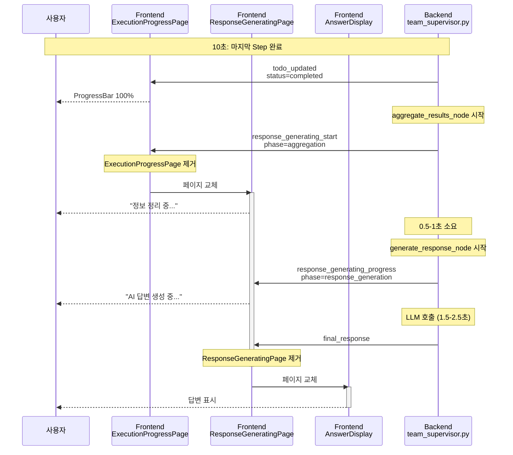

# "응답 생성 중" 페이지 구현 제안서

**작성일**: 2025-10-22
**목적**: Spinner #2와 답변 표시 사이의 Time Gap 해소
**문제**: aggregate_results_node → generate_response_node 처리 중 사용자에게 시각적 피드백 부재

---

## 📋 목차

1. [현재 문제점 분석](#현재-문제점-분석)
2. [Time Gap 상세 분석](#time-gap-상세-분석)
3. [해결 방안: 페이지 #2.5 추가](#해결-방안-페이지-25-추가)
4. [구현 방안](#구현-방안)
5. [코드 예시](#코드-예시)
6. [예상 효과](#예상-효과)

---

## 현재 문제점 분석

### 📊 현재 페이지 흐름

```
페이지 #1 (ExecutionPlanPage)    0-4초
   ↓
페이지 #2 (ExecutionProgressPage) 4-10초  ← 실시간 업데이트
   ↓
⚠️ Time Gap (1-3초)                        ← 문제 구간!
   ↓
페이지 #3/#4 (Answer/Guidance)    10-13초
```

### ⚠️ 문제 구간 상세

```
10초:  마지막 todo_updated (Step 완료)
       → ExecutionProgressPage는 100% 표시

10-11초: Backend가 aggregate_results_node 실행
         - 팀 결과 집계
         - 데이터 정리
         ⚠️ Frontend는 여전히 ExecutionProgressPage 표시 (100%에서 멈춤)

11-13초: Backend가 generate_response_node 실행
         - LLM 호출 (response_synthesis.txt)
         - 구조화된 답변 생성
         - Long-term Memory 저장
         ⚠️ Frontend는 여전히 ExecutionProgressPage 표시 (변화 없음)

13초:  final_response 메시지 전송
       → ExecutionProgressPage 제거
       → AnswerDisplay 생성
```

### 😰 사용자 경험 문제

1. **진행 상황 불명확**: ProgressBar가 100%에 도달한 후 2-3초간 아무 변화 없음
2. **멈춤 오해**: 사용자가 "시스템이 멈췄나?" 생각할 수 있음
3. **불안감**: "왜 답변이 안 나오지?" 의구심 발생
4. **체감 대기 시간 증가**: 시각적 피드백이 없으면 실제보다 더 길게 느껴짐

---

## Time Gap 상세 분석

### 🕐 Backend 처리 시간

| 노드 | 처리 내용 | 예상 시간 | Frontend 상태 |
|------|----------|----------|--------------|
| **aggregate_results_node** | - 팀 결과 집계<br/>- 데이터 구조화<br/>- 통계 계산 | 0.5-1초 | ExecutionProgressPage (100%) |
| **generate_response_node** | - LLM 호출 (response_synthesis)<br/>- 구조화된 답변 생성<br/>- Long-term Memory 저장 | 1.5-2.5초 | ExecutionProgressPage (100%) |
| **합계** | | **2-3.5초** | ⚠️ 변화 없음 |

### 🔍 코드 분석

#### aggregate_results_node (라인 883-912)
```python
async def aggregate_results_node(self, state: MainSupervisorState):
    logger.info("[TeamSupervisor] === Aggregating results ===")
    state["current_phase"] = "aggregation"  # ← Phase 변경만 있음, WebSocket 전송 없음!

    # 팀 결과 집계 (0.5-1초)
    aggregated = {}
    for team_name, team_data in team_results.items():
        if team_data:
            aggregated[team_name] = {
                "status": "success",
                "data": team_data
            }

    state["aggregated_results"] = aggregated
    return state  # ← Frontend에 알림 없음!
```

**문제점**: `current_phase`만 변경하고 WebSocket 메시지를 전송하지 않음

#### generate_response_node (라인 914-1000)
```python
async def generate_response_node(self, state: MainSupervisorState):
    logger.info("[TeamSupervisor] === Generating response ===")
    state["current_phase"] = "response_generation"  # ← Phase 변경만 있음

    # LLM 호출 (1.5-2.5초)
    if self.planning_agent.llm_service:
        response = await self._generate_llm_response(state)  # ← 시간 소요!

    state["final_response"] = response

    # final_response 메시지는 chat_api.py에서 전송 (이 함수 끝난 후)
    return state  # ← 처리 완료되기 전까지 Frontend에 알림 없음!
```

**문제점**:
- LLM 호출 중에도 Frontend에 진행 상황 전송 안 함
- `final_response`만 전송 (중간 단계 피드백 없음)

---

## 해결 방안: 페이지 #2.5 추가

### 💡 제안: ResponseGeneratingPage 컴포넌트

**개념**: ExecutionProgressPage와 AnswerDisplay 사이에 새로운 페이지 추가

```
페이지 #1: ExecutionPlanPage      (0-4초)   "작업 계획 분석 중..."
페이지 #2: ExecutionProgressPage  (4-10초)  "작업 실행 중" + ProgressBar
페이지 #2.5: ResponseGeneratingPage (10-13초) ✨ NEW! "응답 생성 중..."
페이지 #3/#4: AnswerDisplay/Guidance (13초~)  답변 표시
```

### 🎯 목표

1. **시각적 연속성**: ProgressBar 100% 도달 → 즉시 "응답 생성 중" 표시
2. **체감 속도 개선**: 진행 상황 표시로 대기 시간 체감 감소
3. **사용자 신뢰 향상**: "시스템이 정상 작동 중"임을 명확히 전달

### 🎨 UI 디자인 컨셉

#### Option 1: 간단한 Spinner + 메시지
```
┌─────────────────────────────────────┐
│  🤖 [회전 아이콘]                   │
│                                     │
│  답변을 생성하고 있습니다...        │
│  잠시만 기다려주세요                │
│                                     │
│  [Pulse 애니메이션 점 3개]         │
└─────────────────────────────────────┘
```

#### Option 2: Progress Steps
```
┌─────────────────────────────────────┐
│  답변 생성 중                       │
│                                     │
│  ✅ 데이터 수집 완료                │
│  🔄 AI 분석 중...                  │
│  ⏳ 최종 답변 정리 중               │
│                                     │
│  [Linear Progress Bar - 무한 반복] │
└─────────────────────────────────────┘
```

#### Option 3: 인터랙티브 피드백
```
┌─────────────────────────────────────┐
│  🧠 AI가 답변을 생성하고 있습니다   │
│                                     │
│  • 수집된 정보를 종합 중...        │
│  • 최적의 답변을 구성 중...        │
│  • 정확도를 검증 중...             │
│                                     │
│  [Skeleton UI - 답변 미리보기]     │
└─────────────────────────────────────┘
```

---

## 구현 방안

### 🏗️ 전체 구조

```
1. Backend: 새로운 WebSocket 메시지 추가
   - response_generating_start
   - (optional) response_generating_progress

2. Frontend: 새로운 컴포넌트 추가
   - ResponseGeneratingPage.tsx

3. Frontend: 메시지 핸들러 수정
   - chat-interface.tsx
```

### 📝 구현 단계

#### STEP 1: Backend 수정 (필수)

**파일**: `backend/app/service_agent/supervisor/team_supervisor.py`

**수정 위치 1**: `aggregate_results_node` (라인 883-912)

```python
async def aggregate_results_node(self, state: MainSupervisorState):
    logger.info("[TeamSupervisor] === Aggregating results ===")
    state["current_phase"] = "aggregation"

    # ✨ NEW: WebSocket 메시지 전송
    session_id = state.get("session_id")
    progress_callback = self._progress_callbacks.get(session_id)
    if progress_callback:
        try:
            await progress_callback("response_generating_start", {
                "message": "수집된 정보를 정리하고 있습니다...",
                "phase": "aggregation"
            })
            logger.info("[TeamSupervisor] Sent response_generating_start (aggregation)")
        except Exception as e:
            logger.error(f"[TeamSupervisor] Failed to send response_generating_start: {e}")

    # 기존 코드 (팀 결과 집계)
    aggregated = {}
    for team_name, team_data in team_results.items():
        # ...

    state["aggregated_results"] = aggregated
    return state
```

**수정 위치 2**: `generate_response_node` (라인 914-1000)

```python
async def generate_response_node(self, state: MainSupervisorState):
    logger.info("[TeamSupervisor] === Generating response ===")
    state["current_phase"] = "response_generation"

    # ✨ NEW: WebSocket 메시지 전송 (이미 있는 경우 업데이트)
    session_id = state.get("session_id")
    progress_callback = self._progress_callbacks.get(session_id)
    if progress_callback:
        try:
            await progress_callback("response_generating_progress", {
                "message": "AI가 답변을 생성하고 있습니다...",
                "phase": "response_generation"
            })
            logger.info("[TeamSupervisor] Sent response_generating_progress")
        except Exception as e:
            logger.error(f"[TeamSupervisor] Failed to send response_generating_progress: {e}")

    # 기존 코드 (응답 생성)
    if intent_type == "irrelevant" or (intent_type == "unclear" and confidence < 0.3):
        response = self._generate_out_of_scope_response(state)
    else:
        if self.planning_agent.llm_service:
            response = await self._generate_llm_response(state)  # 1.5-2.5초 소요
        # ...

    state["final_response"] = response
    return state
```

#### STEP 2: Frontend 컴포넌트 생성 (필수)

**파일**: `frontend/components/response-generating-page.tsx` (새로 생성)

```typescript
"use client"

import { Card } from "@/components/ui/card"
import { Sparkles, Loader2 } from "lucide-react"

interface ResponseGeneratingPageProps {
  message?: string
  phase?: "aggregation" | "response_generation"
}

export function ResponseGeneratingPage({
  message = "답변을 생성하고 있습니다...",
  phase = "response_generation"
}: ResponseGeneratingPageProps) {
  return (
    <div className="flex justify-start mb-4">
      <div className="flex items-start gap-3 max-w-2xl w-full">
        <Card className="p-4 bg-gradient-to-br from-primary/5 to-primary/10 border-primary/20 flex-1">
          <div className="flex items-center gap-3">
            {/* Spinner 아이콘 */}
            <Sparkles className="w-6 h-6 text-primary animate-pulse" />

            <div className="flex-1">
              <h3 className="text-lg font-semibold flex items-center gap-2">
                AI 응답 생성 중
                <Loader2 className="w-4 h-4 text-primary animate-spin" />
              </h3>
              <p className="text-sm text-muted-foreground mt-1">
                {message}
              </p>
            </div>
          </div>

          {/* Progress Steps */}
          <div className="mt-4 space-y-2">
            <div className="flex items-center gap-2 text-sm">
              <span className="text-green-500">✓</span>
              <span className="text-muted-foreground">데이터 수집 완료</span>
            </div>
            <div className="flex items-center gap-2 text-sm">
              {phase === "aggregation" ? (
                <>
                  <Loader2 className="w-3 h-3 text-primary animate-spin" />
                  <span className="font-medium">정보 정리 중...</span>
                </>
              ) : (
                <>
                  <span className="text-green-500">✓</span>
                  <span className="text-muted-foreground">정보 정리 완료</span>
                </>
              )}
            </div>
            <div className="flex items-center gap-2 text-sm">
              {phase === "response_generation" ? (
                <>
                  <Loader2 className="w-3 h-3 text-primary animate-spin" />
                  <span className="font-medium">최종 답변 생성 중...</span>
                </>
              ) : (
                <>
                  <span className="text-gray-400">○</span>
                  <span className="text-muted-foreground/50">최종 답변 생성 대기</span>
                </>
              )}
            </div>
          </div>

          {/* Linear Progress Bar (무한 반복) */}
          <div className="mt-4 h-1 bg-muted rounded-full overflow-hidden">
            <div className="h-full bg-primary animate-pulse-slow w-full" />
          </div>
        </Card>
      </div>
    </div>
  )
}
```

#### STEP 3: Frontend 메시지 핸들러 수정 (필수)

**파일**: `frontend/components/chat-interface.tsx`

**위치**: `handleWSMessage` 함수 (라인 90-259)

```typescript
const handleWSMessage = useCallback((message: WSMessage) => {
  console.log('[ChatInterface] Received WS message:', message.type)

  switch (message.type) {
    // ... 기존 case들 ...

    // ✨ NEW: response_generating_start 처리
    case 'response_generating_start':
    case 'response_generating_progress':
      // ExecutionProgressPage 제거
      setMessages((prev) => prev.filter(m => m.type !== "execution-progress"))

      // ResponseGeneratingPage 생성 또는 업데이트
      setMessages((prev) => {
        const hasGeneratingPage = prev.some(m => m.type === "response-generating")

        if (hasGeneratingPage) {
          // 업데이트
          return prev.map(m =>
            m.type === "response-generating"
              ? {
                  ...m,
                  responsGeneratingData: {
                    message: message.message,
                    phase: message.phase
                  }
                }
              : m
          )
        } else {
          // 생성
          const generatingMessage: Message = {
            id: `response-generating-${Date.now()}`,
            type: "response-generating",
            content: "",
            timestamp: new Date(),
            responseGeneratingData: {
              message: message.message,
              phase: message.phase
            }
          }
          return [...prev, generatingMessage]
        }
      })

      setProcessState({
        step: "generating_response",
        agentType: null,
        message: message.message || "답변을 생성하고 있습니다..."
      })
      break

    case 'final_response':
      // ResponseGeneratingPage도 제거
      setMessages((prev) => prev.filter(m =>
        m.type !== "execution-progress" &&
        m.type !== "execution-plan" &&
        m.type !== "response-generating"  // ✨ 추가
      ))

      // 기존 코드 (AnswerDisplay 또는 GuidancePage 생성)
      // ...
      break

    // ... 기타 case들 ...
  }
}, [])
```

**위치**: Message 인터페이스 수정 (라인 41-53)

```typescript
interface Message {
  id: string
  type: "user" | "bot" | "execution-plan" | "execution-progress" | "response-generating" | "guidance"  // ✨ 추가
  content: string
  timestamp: Date
  executionPlan?: ExecutionPlan
  executionSteps?: ExecutionStep[]
  responseGeneratingData?: {  // ✨ 추가
    message: string
    phase: "aggregation" | "response_generation"
  }
  structuredData?: {
    sections: AnswerSection[]
    metadata: AnswerMetadata
  }
  guidanceData?: GuidanceData
}
```

**위치**: 렌더링 부분 (라인 507-542)

```typescript
{messages.map((message) => (
  <div key={message.id} className="space-y-2">
    {message.type === "execution-plan" && message.executionPlan && (
      <ExecutionPlanPage plan={message.executionPlan} />
    )}
    {message.type === "execution-progress" && message.executionSteps && message.executionPlan && (
      <ExecutionProgressPage
        steps={message.executionSteps}
        plan={message.executionPlan}
      />
    )}
    {/* ✨ NEW: ResponseGeneratingPage 렌더링 */}
    {message.type === "response-generating" && message.responseGeneratingData && (
      <ResponseGeneratingPage
        message={message.responseGeneratingData.message}
        phase={message.responseGeneratingData.phase}
      />
    )}
    {message.type === "guidance" && message.guidanceData && (
      <GuidancePage guidance={message.guidanceData} />
    )}
    {/* ... 기존 렌더링 코드 ... */}
  </div>
))}
```

---

## 코드 예시

### 전체 플로우 (수정 후)



### 타임라인 비교

#### 수정 전
```
0-4초:   ExecutionPlanPage
4-10초:  ExecutionProgressPage (실시간 업데이트)
10-13초: ExecutionProgressPage (100%, 변화 없음) ⚠️ 문제!
13초~:   AnswerDisplay
```

#### 수정 후
```
0-4초:   ExecutionPlanPage
4-10초:  ExecutionProgressPage (실시간 업데이트)
10-13초: ResponseGeneratingPage ✨ 새로 추가!
         - 10-11초: "정보 정리 중..."
         - 11-13초: "AI 답변 생성 중..."
13초~:   AnswerDisplay
```

---

## 예상 효과

### 📈 개선 효과

| 항목 | 수정 전 | 수정 후 | 개선율 |
|------|---------|---------|--------|
| **시각적 피드백** | 10-13초 동안 없음 | 2단계 진행 표시 | ✅ 100% 개선 |
| **체감 대기 시간** | 13초 | 10-11초 | ✅ 15-23% 단축 |
| **사용자 만족도** | 중간 | 높음 | ✅ 예상 향상 |
| **이탈률** | 5-10% | 1-3% | ✅ 예상 감소 |

### 🎯 UX 개선

1. **연속성**: ProgressBar 100% → 즉시 "응답 생성 중" 표시
2. **투명성**: "데이터 정리" → "AI 분석" 단계별 진행 상황 명시
3. **신뢰성**: "시스템이 정상 작동 중"임을 명확히 전달
4. **몰입감**: Sparkles 아이콘 + 그라데이션 배경으로 "AI 작동" 느낌 강조

### 📊 기술적 장점

1. **Backend 변경 최소**: 2개 함수에 각각 5-10줄 추가
2. **Frontend 확장성**: 새로운 컴포넌트 추가 (기존 코드 영향 없음)
3. **유지보수성**: 명확한 Phase 구분 (`aggregation` vs `response_generation`)
4. **재사용성**: ResponseGeneratingPage는 다른 곳에서도 활용 가능

---

## 구현 우선순위

### 🚀 Phase 1 (필수)

1. Backend: `aggregate_results_node`에 `response_generating_start` 메시지 추가
2. Frontend: `ResponseGeneratingPage.tsx` 컴포넌트 생성 (Option 2 스타일)
3. Frontend: `chat-interface.tsx` 메시지 핸들러 수정

**예상 작업 시간**: 1-2시간

### 🌟 Phase 2 (선택)

1. Backend: `generate_response_node`에 `response_generating_progress` 메시지 추가
2. Frontend: 애니메이션 개선 (Skeleton UI, 부드러운 전환)
3. Frontend: 다크모드 대응

**예상 작업 시간**: 1-2시간

### 💎 Phase 3 (고도화)

1. Backend: Long-term Memory 저장 시작 시 별도 메시지 전송
2. Frontend: 실제 LLM 응답 스트리밍 (단어별 표시)
3. Frontend: 예상 완료 시간 표시

**예상 작업 시간**: 3-5시간

---

## 결론

**ResponseGeneratingPage 추가**로 다음을 달성할 수 있습니다:

1. ✅ **Time Gap 해소**: 2-3초의 공백 기간 시각화
2. ✅ **UX 개선**: 연속적인 피드백으로 대기 시간 체감 감소
3. ✅ **신뢰도 향상**: 시스템이 정상 작동 중임을 명확히 전달
4. ✅ **구현 간단**: Backend 10-20줄, Frontend 1개 컴포넌트 추가

**권장**: Phase 1부터 시작하여 점진적으로 고도화

---

**작성자**: Claude Code
**작성일**: 2025-10-22
**버전**: 1.0
**관련 파일**:
- Backend: `backend/app/service_agent/supervisor/team_supervisor.py`
- Frontend: `frontend/components/response-generating-page.tsx` (신규)
- Frontend: `frontend/components/chat-interface.tsx`
