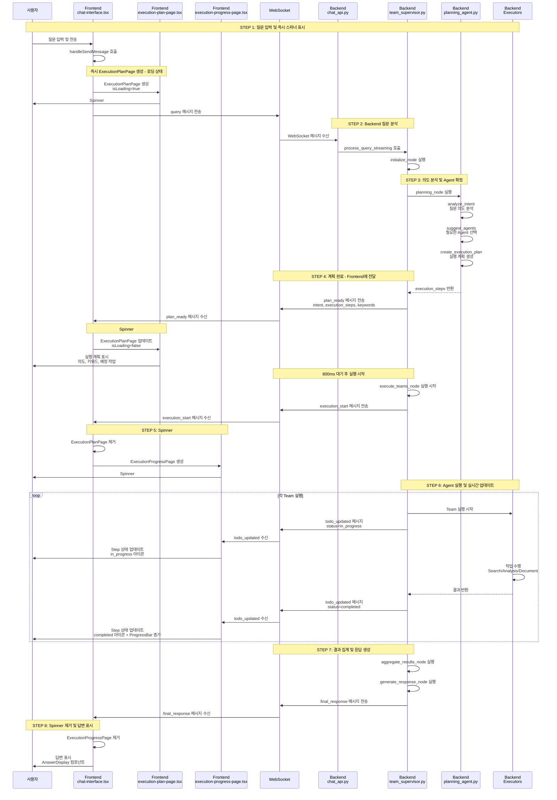

# Spinner 작동 흐름 분석 및 검증 보고서

**작성일**: 2025-10-22
**목적**: 사용자가 설명한 흐름 검증 및 실제 코드 기반 보완
**범위**: Spinner 관련 전체 플로우 (Frontend ↔ Backend)

---

## 📋 사용자 설명 흐름

```
사용자 질문 입력
  → Frontend : 스피너 작동 + Backend에 사용자 질문 전달
  → Backend : 사용자 질문 분석
  → Backend : 사용되는 agent (Team) 확정
  → Backend : Frontend에 사용 agent 전달
  → Frontend : spinner 작동 (execution-progress-page.tsx)
  → Backend : 완료 결과를 frontend에 전달
  → Frontend : 답변생성
```

---

## ✅ 검증 결과

### 전체 평가: **80% 정확** (일부 누락 및 보완 필요)

**정확한 부분:**
- ✅ 사용자 질문 입력 → Frontend 스피너 작동
- ✅ Backend 질문 분석
- ✅ Backend Agent(Team) 확정
- ✅ Frontend Spinner 작동
- ✅ Backend 완료 결과 전달
- ✅ Frontend 답변 생성

**누락된 부분:**
- ❌ **2개의 Spinner가 순차적으로 작동** (ExecutionPlanPage → ExecutionProgressPage)
- ❌ **중간 과정의 실시간 업데이트** (todo_updated)
- ❌ **WebSocket 메시지 프로토콜 상세**
- ❌ **LangGraph 노드 구조**

---

## 🔍 실제 코드 기반 보완된 흐름

### 전체 플로우 (상세)



---

## 📂 단계별 파일 및 코드 매핑

### STEP 1: 질문 입력 및 즉시 Spinner #1 표시

#### Frontend
**파일**: `C:\kdy\Projects\holmesnyangz\beta_v001\frontend\components\chat-interface.tsx`

**위치**: 라인 403-454

**코드**:
```typescript
const handleSendMessage = async (content: string) => {
  const activeSessionId = currentSessionId || sessionId
  if (!content.trim() || !activeSessionId || !wsClientRef.current) return

  // 1. 사용자 메시지 추가
  const userMessage: Message = {
    id: Date.now().toString(),
    type: "user",
    content,
    timestamp: new Date(),
  }

  // 2. ✅ 즉시 ExecutionPlanPage 추가 (로딩 상태)
  const planMessage: Message = {
    id: `execution-plan-${Date.now()}`,
    type: "execution-plan",
    content: "",
    timestamp: new Date(),
    executionPlan: {
      intent: "분석 중...",
      confidence: 0,
      execution_steps: [],
      execution_strategy: "sequential",
      estimated_total_time: 0,
      keywords: [],
      isLoading: true  // ✅ 로딩 상태
    }
  }

  setMessages((prev) => [...prev, userMessage, planMessage])
  setInputValue("")

  // 3. processState 업데이트
  setProcessState({
    step: "planning",
    agentType: detectAgentType(content),
    message: STEP_MESSAGES.planning,
    startTime: Date.now()
  })

  // 4. ✅ WebSocket으로 쿼리 전송
  wsClientRef.current.send({
    type: "query",
    query: content,
    enable_checkpointing: true
  })
}
```

**Spinner #1 렌더링**:
**파일**: `C:\kdy\Projects\holmesnyangz\beta_v001\frontend\components\execution-plan-page.tsx`

**위치**: 라인 23-50

**코드**:
```tsx
if (isLoading) {
  return (
    <Card className="p-4 bg-card border flex-1">
      <div className="flex items-center gap-3">
        <Loader2 className="w-5 h-5 text-primary animate-spin" />  {/* ✅ Spinner #1 */}
        <div>
          <h3 className="text-lg font-semibold">작업 계획 분석 중...</h3>
          <p className="text-sm text-muted-foreground mt-1">
            질문을 분석하고 실행 계획을 수립하고 있습니다
          </p>
        </div>
      </div>

      {/* ✅ 스켈레톤 로딩 */}
      <div className="mt-4 space-y-3">
        <div className="h-20 bg-muted/50 animate-pulse rounded-lg"></div>
        <div className="space-y-2">
          <div className="h-12 bg-muted/30 animate-pulse rounded-md"></div>
          <div className="h-12 bg-muted/30 animate-pulse rounded-md"></div>
        </div>
      </div>
    </Card>
  )
}
```

---

### STEP 2: Backend 질문 분석

#### Backend API
**파일**: `C:\kdy\Projects\holmesnyangz\beta_v001\backend\app\api\chat_api.py`

**위치**: 라인 595-698 (websocket_chat 함수)

**코드**:
```python
@router.websocket("/ws/{session_id}")
async def websocket_chat(websocket: WebSocket, session_id: str, ...):
    # 1. 세션 검증
    validation_result = await session_mgr.validate_session(session_id)

    # 2. WebSocket 연결
    await conn_mgr.connect(session_id, websocket)

    # 3. 연결 확인 메시지
    await conn_mgr.send_message(session_id, {"type": "connected"})

    # 4. Supervisor 인스턴스 가져오기
    supervisor = await get_supervisor(enable_checkpointing=True)

    # 5. 메시지 수신 루프
    while True:
        data = await websocket.receive_json()
        message_type = data.get("type")

        if message_type == "query":
            query = data.get("query")

            # ✅ 비동기 쿼리 처리 시작
            asyncio.create_task(
                _process_query_async(
                    supervisor=supervisor,
                    query=query,
                    session_id=session_id,
                    enable_checkpointing=enable_checkpointing,
                    progress_callback=progress_callback,
                    conn_mgr=conn_mgr,
                    session_mgr=session_mgr
                )
            )
```

**비동기 쿼리 처리**:
**위치**: 라인 746-823

**코드**:
```python
async def _process_query_async(supervisor, query, session_id, ...):
    # 1. 사용자 메시지 DB 저장
    await _save_message_to_db(session_id, "user", query)

    # 2. ✅ Supervisor에 쿼리 전송 (스트리밍)
    result = await supervisor.process_query_streaming(
        query=query,
        session_id=session_id,
        chat_session_id=session_id,
        user_id=user_id,
        progress_callback=progress_callback  # ✅ 실시간 진행 상황 전송
    )

    # 3. 최종 응답 전송
    await conn_mgr.send_message(session_id, {
        "type": "final_response",
        "response": final_response,
        "timestamp": datetime.now().isoformat()
    })
```

---

### STEP 3: 의도 분석 및 Agent(Team) 확정

#### Backend Supervisor
**파일**: `C:\kdy\Projects\holmesnyangz\beta_v001\backend\app\service_agent\supervisor\team_supervisor.py`

**위치**: 라인 1231-1348 (process_query_streaming 메서드)

**코드**:
```python
async def process_query_streaming(
    self,
    query: str,
    session_id: str = "default",
    chat_session_id: Optional[str] = None,
    user_id: Optional[int] = None,
    progress_callback: Optional[Callable[[str, dict], Awaitable[None]]] = None
) -> Dict[str, Any]:
    # 1. Checkpointer 초기화
    await self._ensure_checkpointer()

    # 2. ✅ Progress Callback 등록 (WebSocket 전송용)
    if progress_callback:
        self._progress_callbacks[session_id] = progress_callback

    # 3. ✅ 초기 상태 생성
    initial_state = MainSupervisorState(
        query=query,
        session_id=session_id,
        chat_session_id=chat_session_id,
        user_id=user_id,
        # ... 기타 필드
    )

    # 4. ✅ 워크플로우 실행 (LangGraph)
    final_state = await self.app.ainvoke(initial_state, config=config)

    return final_state
```

**Planning Node** (의도 분석):
**위치**: 라인 174-417

**코드**:
```python
async def planning_node(self, state: MainSupervisorState) -> MainSupervisorState:
    logger.info("[TeamSupervisor] Planning phase")
    state["current_phase"] = "planning"

    # ✅ WebSocket: Planning 시작 알림 (현재 사용 안 함)
    session_id = state.get("session_id")
    progress_callback = self._progress_callbacks.get(session_id)
    if progress_callback:
        await progress_callback("planning_start", {
            "message": "계획을 수립하고 있습니다..."
        })

    # ✅ 의도 분석 (PlanningAgent 호출)
    query = state.get("query", "")
    intent_result = await self.planning_agent.analyze_intent(query, context)

    # ✅ 실행 계획 생성 (Agent/Team 확정)
    execution_plan = await self.planning_agent.create_execution_plan(intent_result)

    # ✅ Planning State 생성 (execution_steps 포함)
    planning_state = PlanningState(
        raw_query=query,
        analyzed_intent={
            "intent_type": intent_result.intent_type.value,
            "confidence": intent_result.confidence,
            "keywords": intent_result.keywords,
            "entities": intent_result.entities
        },
        execution_steps=[
            {
                "step_id": f"step_{i}",
                "team": self._get_team_for_agent(step.agent_name),  # ✅ Team 확정
                "task": self._get_task_name_for_agent(...),
                "description": self._get_task_description_for_agent(...),
                "status": "pending",
                # ...
            }
            for i, step in enumerate(execution_plan.steps)
        ],
        # ...
    )

    state["planning_state"] = planning_state
    state["active_teams"] = active_teams  # ✅ 사용할 Team 리스트

    # ✅ WebSocket: 계획 완료 알림
    if progress_callback:
        await progress_callback("plan_ready", {
            "intent": intent_result.intent_type.value,
            "confidence": intent_result.confidence,
            "execution_steps": planning_state["execution_steps"],  # ✅ Frontend에 전달
            "execution_strategy": execution_plan.strategy.value,
            "estimated_total_time": execution_plan.estimated_time,
            "keywords": intent_result.keywords
        })

    return state
```

**PlanningAgent** (실제 의도 분석):
**파일**: `C:\kdy\Projects\holmesnyangz\beta_v001\backend\app\service_agent\cognitive_agents\planning_agent.py`

**주요 메서드**:
- `analyze_intent()`: LLM을 사용하여 의도 분석
- `suggest_agents()`: 필요한 Agent 선택
- `create_execution_plan()`: 실행 계획 생성

---

### STEP 4: 계획 완료 - Frontend에 전달

#### Frontend 메시지 핸들러
**파일**: `C:\kdy\Projects\holmesnyangz\beta_v001\frontend\components\chat-interface.tsx`

**위치**: 라인 101-131

**코드**:
```typescript
case 'plan_ready':
  if (message.intent && message.execution_steps && message.execution_steps.length > 0) {
    // ✅ ExecutionPlanPage 업데이트 (로딩 완료)
    setMessages((prev) =>
      prev.map(m =>
        m.type === "execution-plan" && m.executionPlan?.isLoading
          ? {
              ...m,
              executionPlan: {
                intent: message.intent,
                confidence: message.confidence || 0,
                execution_steps: message.execution_steps,  // ✅ Backend에서 받은 계획
                execution_strategy: message.execution_strategy || "sequential",
                estimated_total_time: message.estimated_total_time || 5,
                keywords: message.keywords,
                isLoading: false  // ✅ 로딩 완료
              }
            }
          : m
      )
    )
    setTodos(message.execution_steps)
  } else {
    // ✅ IRRELEVANT/UNCLEAR: ExecutionPlanPage 제거
    setMessages((prev) => prev.filter(m => m.type !== "execution-plan"))
  }
  break
```

**ExecutionPlanPage 업데이트** (로딩 완료):
**파일**: `C:\kdy\Projects\holmesnyangz\beta_v001\frontend\components\execution-plan-page.tsx`

**위치**: 라인 77-151

**코드**:
```tsx
return (
  <Card className="p-4 bg-card border flex-1">
    {/* 헤더 */}
    <div>
      <h3 className="text-lg font-semibold flex items-center gap-2">
        <Target className="w-5 h-5 text-primary" />
        작업 계획이 수립되었습니다
      </h3>
    </div>

    {/* ✅ 의도 정보 */}
    <div className="bg-muted/50 rounded-lg p-3 mb-4">
      <div className="flex items-center justify-between mb-2">
        <div className="flex items-center gap-2">
          <span className="text-sm font-medium">감지된 의도:</span>
          <Badge variant="secondary">{intentName}</Badge>
        </div>
        <div className="text-xs text-muted-foreground">
          신뢰도: {(confidence * 100).toFixed(0)}%
        </div>
      </div>

      {/* 키워드 */}
      {keywords && keywords.length > 0 && (
        <div className="flex items-center gap-2 mt-2">
          <span className="text-xs text-muted-foreground">키워드:</span>
          <div className="flex gap-1 flex-wrap">
            {keywords.map((keyword, idx) => (
              <Badge key={idx} variant="outline">{keyword}</Badge>
            ))}
          </div>
        </div>
      )}
    </div>

    {/* ✅ 예정 작업 리스트 */}
    <div className="space-y-2">
      <div className="text-sm font-medium mb-2">예정 작업:</div>
      {execution_steps.map((step, index) => (
        <div key={step.step_id} className="flex items-start gap-3 p-2 rounded-md bg-muted/30">
          <div className="flex-shrink-0 w-6 h-6 rounded-full bg-muted flex items-center justify-center text-xs font-medium">
            {index + 1}
          </div>
          <div className="flex-1 min-w-0">
            <div className="flex items-center gap-2">
              <span className="text-sm font-medium">{step.task || step.description}</span>
              <Badge variant="outline">{teamNameMap[step.team] || step.team}</Badge>
            </div>
          </div>
        </div>
      ))}
    </div>
  </Card>
)
```

---

### STEP 5: Spinner #2 표시 - ExecutionProgressPage

#### Frontend 메시지 핸들러
**파일**: `C:\kdy\Projects\holmesnyangz\beta_v001\frontend\components\chat-interface.tsx`

**위치**: 라인 133-169

**코드**:
```typescript
case 'execution_start':
  if (message.execution_steps) {
    const progressMessage: Message = {
      id: `execution-progress-${Date.now()}`,
      type: "execution-progress",
      content: "",
      timestamp: new Date(),
      executionPlan: {
        intent: message.intent,
        confidence: message.confidence,
        execution_steps: message.execution_steps,
        execution_strategy: message.execution_strategy,
        estimated_total_time: message.estimated_total_time,
        keywords: message.keywords
      },
      executionSteps: message.execution_steps.map((step: ExecutionStep) => ({
        ...step,
        status: step.status || "pending"
      }))
    }

    // ✅ ExecutionPlanPage 제거하고 ExecutionProgressPage 추가
    setMessages((prev) => prev
      .filter(m => m.type !== "execution-plan")
      .concat(progressMessage)
    )

    setProcessState({
      step: "executing",
      agentType: null,
      message: message.message || "작업을 실행하고 있습니다..."
    })
  }
  break
```

**Spinner #2 렌더링**:
**파일**: `C:\kdy\Projects\holmesnyangz\beta_v001\frontend\components\execution-progress-page.tsx`

**위치**: 라인 34-94

**코드**:
```tsx
return (
  <Card className="p-4 bg-card border flex-1">
    {/* 헤더 */}
    <div className="flex items-start justify-between mb-4">
      <div>
        <h3 className="text-lg font-semibold flex items-center gap-2">
          <Settings className="w-5 h-5 text-primary animate-spin-slow" />  {/* ✅ Spinner #2 */}
          작업 실행 중
          <span className="text-sm font-normal text-muted-foreground">
            ({completedSteps}/{totalSteps} 완료)
          </span>
        </h3>
        {currentStep && (
          <p className="text-sm text-muted-foreground mt-1">
            현재: {currentStep.description}
          </p>
        )}
      </div>
    </div>

    {/* ✅ 전체 진행률 */}
    <div className="mb-4">
      <div className="flex items-center justify-between mb-2">
        <span className="text-sm font-medium">전체 진행률</span>
        <span className="text-sm text-muted-foreground">
          {overallProgress.toFixed(0)}%
        </span>
      </div>
      <ProgressBar
        value={overallProgress}
        size="md"
        variant={failedSteps > 0 ? "warning" : "default"}
      />
    </div>

    {/* ✅ 작업 리스트 */}
    <div className="space-y-2">
      <div className="text-sm font-medium mb-2">진행 상황:</div>
      {steps.map((step, index) => (
        <StepItem key={step.step_id} step={step} index={index} />  {/* ✅ 개별 Step */}
      ))}
    </div>
  </Card>
)
```

---

### STEP 6: Agent 실행 및 실시간 업데이트

#### Backend Supervisor - 팀 실행
**파일**: `C:\kdy\Projects\holmesnyangz\beta_v001\backend\app\service_agent\supervisor\team_supervisor.py`

**위치**: 라인 567-618

**코드**:
```python
async def execute_teams_node(self, state: MainSupervisorState) -> MainSupervisorState:
    logger.info("[TeamSupervisor] Executing teams")
    state["current_phase"] = "executing"

    # ✅ WebSocket: 실행 시작 알림
    session_id = state.get("session_id")
    progress_callback = self._progress_callbacks.get(session_id)
    planning_state = state.get("planning_state")

    if progress_callback and planning_state:
        await progress_callback("execution_start", {
            "message": "작업 실행을 시작합니다...",
            "execution_steps": planning_state.get("execution_steps", []),
            "intent": analyzed_intent.get("intent_type", "unknown"),
            "confidence": analyzed_intent.get("confidence", 0.0),
            "execution_strategy": planning_state.get("execution_strategy", "sequential"),
            "estimated_total_time": planning_state.get("estimated_total_time", 0),
            "keywords": analyzed_intent.get("keywords", [])
        })

    # ✅ 팀 순차/병렬 실행
    execution_strategy = state.get("execution_plan", {}).get("strategy", "sequential")
    active_teams = state.get("active_teams", [])

    if execution_strategy == "parallel":
        results = await self._execute_teams_parallel(active_teams, shared_state, state)
    else:
        results = await self._execute_teams_sequential(active_teams, shared_state, state)

    return state
```

**순차 실행 + 실시간 업데이트**:
**위치**: 라인 716-818

**코드**:
```python
async def _execute_teams_sequential(
    self,
    teams: List[str],
    shared_state: SharedState,
    main_state: MainSupervisorState
) -> Dict[str, Any]:
    results = {}
    planning_state = main_state.get("planning_state")

    for team_name in teams:
        if team_name in self.teams:
            step_id = self._find_step_id_for_team(team_name, planning_state)

            try:
                # ✅ 실행 전: status = "in_progress"
                if step_id and planning_state:
                    planning_state = StateManager.update_step_status(
                        planning_state,
                        step_id,
                        "in_progress",
                        progress=0
                    )
                    main_state["planning_state"] = planning_state

                    # ✅ WebSocket: TODO 상태 변경 알림 (in_progress)
                    session_id = main_state.get("session_id")
                    progress_callback = self._progress_callbacks.get(session_id)
                    if progress_callback:
                        await progress_callback("todo_updated", {
                            "execution_steps": planning_state["execution_steps"]
                        })

                # ✅ 팀 실행
                result = await self._execute_single_team(team_name, shared_state, main_state)
                results[team_name] = result

                # ✅ 실행 성공: status = "completed"
                if step_id and planning_state:
                    planning_state = StateManager.update_step_status(
                        planning_state,
                        step_id,
                        "completed",
                        progress=100
                    )
                    main_state["planning_state"] = planning_state

                    # ✅ WebSocket: TODO 상태 변경 알림 (completed)
                    if progress_callback:
                        await progress_callback("todo_updated", {
                            "execution_steps": planning_state["execution_steps"]
                        })

            except Exception as e:
                # ✅ 실행 실패: status = "failed"
                if step_id and planning_state:
                    planning_state = StateManager.update_step_status(
                        planning_state,
                        step_id,
                        "failed",
                        error=str(e)
                    )
                    if progress_callback:
                        await progress_callback("todo_updated", {
                            "execution_steps": planning_state["execution_steps"]
                        })

    return results
```

**개별 팀 실행**:
**위치**: 라인 820-849

**코드**:
```python
async def _execute_single_team(
    self,
    team_name: str,
    shared_state: SharedState,
    main_state: MainSupervisorState
) -> Any:
    team = self.teams[team_name]

    if team_name == "search":
        # ✅ SearchExecutor 실행
        return await team.execute(shared_state)

    elif team_name == "document":
        # ✅ DocumentExecutor 실행
        doc_type = self._extract_document_type(main_state)
        return await team.execute(shared_state, document_type=doc_type)

    elif team_name == "analysis":
        # ✅ AnalysisExecutor 실행
        input_data = main_state.get("team_results", {})
        return await team.execute(shared_state, analysis_type="comprehensive", input_data=input_data)

    return {"status": "skipped"}
```

**Agent Executors**:
- **SearchExecutor**: `C:\kdy\Projects\holmesnyangz\beta_v001\backend\app\service_agent\execution_agents\search_executor.py`
- **AnalysisExecutor**: `C:\kdy\Projects\holmesnyangz\beta_v001\backend\app\service_agent\execution_agents\analysis_executor.py`
- **DocumentExecutor**: `C:\kdy\Projects\holmesnyangz\beta_v001\backend\app\service_agent\execution_agents\document_executor.py`

---

#### Frontend - 실시간 업데이트
**파일**: `C:\kdy\Projects\holmesnyangz\beta_v001\frontend\components\chat-interface.tsx`

**위치**: 라인 171-191

**코드**:
```typescript
case 'todo_updated':
  if (message.execution_steps) {
    setTodos(message.execution_steps)

    // ✅ ExecutionProgressPage 메시지 찾아서 steps 업데이트
    setMessages((prev) => {
      return prev.map(msg => {
        if (msg.type === "execution-progress") {
          return {
            ...msg,
            executionSteps: message.execution_steps  // ✅ 실시간 업데이트
          }
        }
        return msg
      })
    })
  }
  break
```

---

### STEP 7: 결과 집계 및 응답 생성

#### Backend Supervisor
**파일**: `C:\kdy\Projects\holmesnyangz\beta_v001\backend\app\service_agent\supervisor\team_supervisor.py`

**위치**: 라인 883-912 (aggregate_results_node)

**코드**:
```python
async def aggregate_results_node(self, state: MainSupervisorState) -> MainSupervisorState:
    logger.info("[TeamSupervisor] === Aggregating results ===")
    state["current_phase"] = "aggregation"

    # ✅ 팀 결과 집계
    aggregated = {}
    team_results = state.get("team_results", {})

    for team_name, team_data in team_results.items():
        if team_data:
            aggregated[team_name] = {
                "status": "success",
                "data": team_data
            }

    state["aggregated_results"] = aggregated
    return state
```

**응답 생성**:
**위치**: 라인 914-1000 (generate_response_node)

**코드**:
```python
async def generate_response_node(self, state: MainSupervisorState) -> MainSupervisorState:
    logger.info("[TeamSupervisor] === Generating response ===")
    state["current_phase"] = "response_generation"

    # ✅ 기능 외 질문 체크
    planning_state = state.get("planning_state", {})
    analyzed_intent = planning_state.get("analyzed_intent", {})
    intent_type = analyzed_intent.get("intent_type", "")

    if intent_type == "irrelevant" or (intent_type == "unclear" and confidence < 0.3):
        # ✅ 안내 메시지 반환
        response = self._generate_out_of_scope_response(state)
    else:
        # ✅ 정상적인 응답 생성 (LLM 사용)
        aggregated_results = state.get("aggregated_results", {})
        if self.planning_agent.llm_service:
            response = await self._generate_llm_response(state)
        else:
            response = self._generate_simple_response(state)

    state["final_response"] = response
    state["status"] = "completed"

    return state
```

**LLM 응답 생성**:
**위치**: 라인 1017-1038

**코드**:
```python
async def _generate_llm_response(self, state: MainSupervisorState) -> Dict:
    query = state.get("query", "")
    aggregated = state.get("aggregated_results", {})
    intent_info = state.get("planning_state", {}).get("analyzed_intent", {})

    # ✅ LLMService의 generate_final_response 호출
    response = await self.planning_agent.llm_service.generate_final_response(
        query=query,
        aggregated_results=aggregated,
        intent_info=intent_info
    )

    return response
```

---

### STEP 8: Spinner 제거 및 답변 표시

#### Frontend 메시지 핸들러
**파일**: `C:\kdy\Projects\holmesnyangz\beta_v001\frontend\components\chat-interface.tsx`

**위치**: 라인 202-242

**코드**:
```typescript
case 'final_response':
  // ✅ ExecutionPlan과 Progress 모두 제거
  setMessages((prev) => prev.filter(m =>
    m.type !== "execution-progress" && m.type !== "execution-plan"
  ))

  // ✅ Guidance 응답 체크
  if (message.response?.type === "guidance") {
    const guidanceMessage: Message = {
      id: (Date.now() + 1).toString(),
      type: "guidance",
      content: message.response.message,
      timestamp: new Date(),
      guidanceData: {
        detected_intent: message.response.detected_intent || "unknown",
        original_query: message.response.original_query || "",
        message: message.response.message
      }
    }
    setMessages((prev) => [...prev, guidanceMessage])
  } else {
    // ✅ 봇 응답 추가 (structured_data 포함)
    const botMessage: Message = {
      id: (Date.now() + 1).toString(),
      type: "bot",
      content: message.response?.answer || message.response?.content || ...,
      structuredData: message.response?.structured_data,  // ✅ 구조화된 답변
      timestamp: new Date(),
    }
    setMessages((prev) => [...prev, botMessage])
  }
  setTodos([])

  // ✅ 프로세스 완료 - idle 상태로 전환하여 입력 활성화
  setProcessState({
    step: "idle",
    agentType: null,
    message: ""
  })
  break
```

**답변 표시**:
**파일**: `C:\kdy\Projects\holmesnyangz\beta_v001\frontend\components\answer-display.tsx`

---

## 📊 보완된 흐름 요약표

| 단계 | Frontend | Backend | Spinner 상태 | 코드 위치 |
|------|----------|---------|--------------|-----------|
| 1. 질문 입력 | `chat-interface.tsx:403` | - | Spinner #1 시작 (Loader2) | `execution-plan-page.tsx:23` |
| 2. WebSocket 전송 | `chat-interface.tsx:447` | `chat_api.py:595` | Spinner #1 작동 중 | - |
| 3. 초기화 | - | `team_supervisor.py:157` | Spinner #1 작동 중 | - |
| 4. 의도 분석 | - | `team_supervisor.py:174` | Spinner #1 작동 중 | - |
| 5. Agent 확정 | - | `planning_agent.py` | Spinner #1 작동 중 | - |
| 6. plan_ready 전송 | `chat-interface.tsx:101` | `team_supervisor.py:405` | Spinner #1 업데이트 | `execution-plan-page.tsx:77` |
| 7. 실행 시작 | `chat-interface.tsx:133` | `team_supervisor.py:567` | Spinner #2 시작 (Settings) | `execution-progress-page.tsx:34` |
| 8. Team 실행 (순차) | - | `team_supervisor.py:716` | Spinner #2 작동 중 | - |
| 9. todo_updated (x N) | `chat-interface.tsx:171` | `team_supervisor.py:747` | Spinner #2 업데이트 | `execution-progress-page.tsx:74` |
| 10. 결과 집계 | - | `team_supervisor.py:883` | Spinner #2 작동 중 | - |
| 11. 응답 생성 | - | `team_supervisor.py:914` | Spinner #2 작동 중 | - |
| 12. final_response | `chat-interface.tsx:202` | `team_supervisor.py:947` | Spinner 제거 | `answer-display.tsx` |

---

## 🎯 Spinner 수정 시 주요 파일

### Frontend
1. **ExecutionPlanPage** (Spinner #1)
   - 파일: `C:\kdy\Projects\holmesnyangz\beta_v001\frontend\components\execution-plan-page.tsx`
   - 라인: 23-50 (로딩 상태)
   - 아이콘: `Loader2` + 스켈레톤 UI

2. **ExecutionProgressPage** (Spinner #2)
   - 파일: `C:\kdy\Projects\holmesnyangz\beta_v001\frontend\components\execution-progress-page.tsx`
   - 라인: 34-94
   - 아이콘: `Settings` + `ProgressBar`

3. **StepItem** (개별 Step 상태)
   - 파일: `C:\kdy\Projects\holmesnyangz\beta_v001\frontend\components\step-item.tsx`
   - 상태별 아이콘: pending/in_progress/completed/failed

4. **ChatInterface** (메시지 핸들러)
   - 파일: `C:\kdy\Projects\holmesnyangz\beta_v001\frontend\components\chat-interface.tsx`
   - WebSocket 메시지 처리

### Backend (수정 불필요 - UI만 변경)
Backend는 이미 정상적으로 WebSocket 메시지를 전송하므로 수정 불필요합니다.

---

## 📝 결론

### 사용자 설명 vs 실제 코드

**사용자 설명 (간략화)**:
```
질문 입력 → 스피너 → 질문 분석 → Agent 확정 → Agent 전달 → spinner → 결과 전달 → 답변
```

**실제 코드 (상세)**:
```
질문 입력
  → Spinner #1 (ExecutionPlanPage - 로딩)
  → 질문 분석 (analyze_intent)
  → Agent 확정 (suggest_agents + create_execution_plan)
  → plan_ready 전송
  → Spinner #1 업데이트 (계획 표시)
  → execution_start 전송
  → Spinner #2 (ExecutionProgressPage)
  → Team 실행 (순차/병렬)
  → todo_updated (실시간 x N회)
  → Spinner #2 업데이트 (진행률 증가)
  → 결과 집계 (aggregate_results_node)
  → 응답 생성 (generate_response_node)
  → final_response 전송
  → Spinner 제거
  → 답변 표시 (AnswerDisplay)
```

### 핵심 차이점
1. **2개의 Spinner**: ExecutionPlanPage → ExecutionProgressPage
2. **실시간 업데이트**: `todo_updated` 메시지로 진행 상황 전송
3. **LangGraph 노드 구조**: initialize → planning → execute → aggregate → response
4. **WebSocket 프로토콜**: 7가지 메시지 타입 (connected, plan_ready, execution_start, todo_updated, final_response, error)

---

**작성자**: Claude Code
**작성일**: 2025-10-22
**버전**: 1.0
