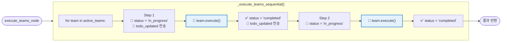
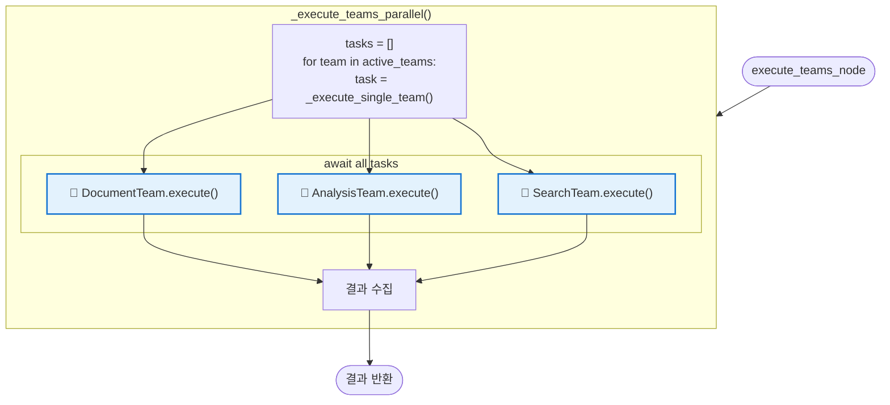
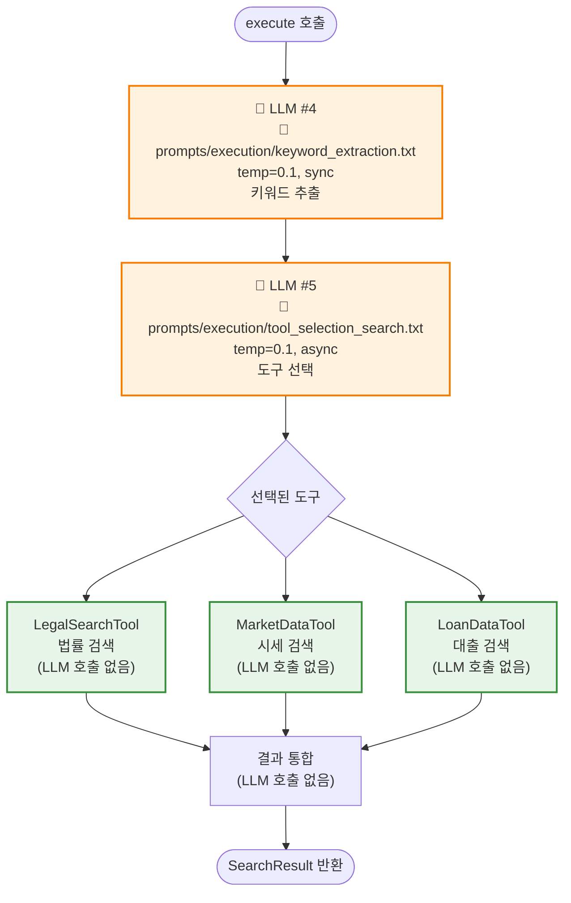
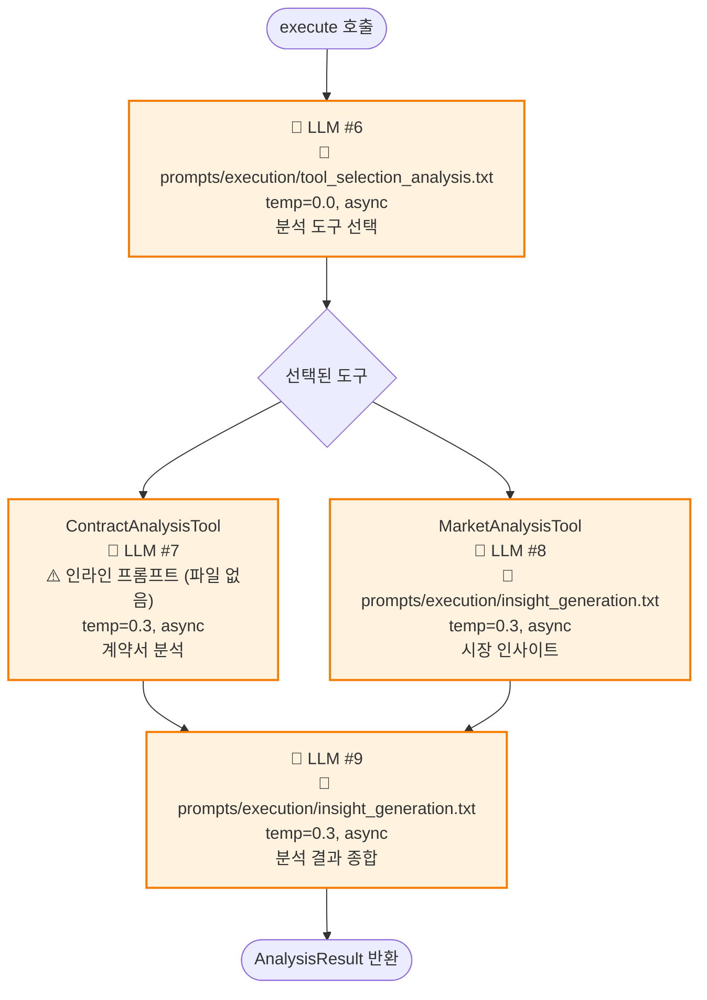
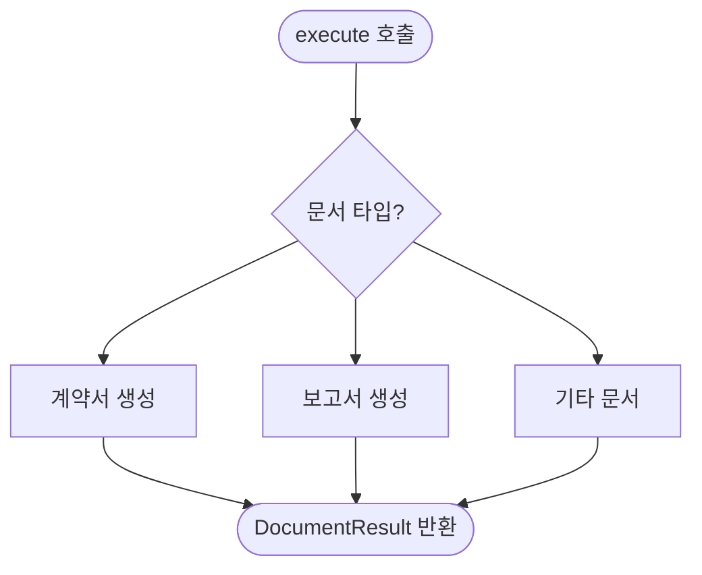
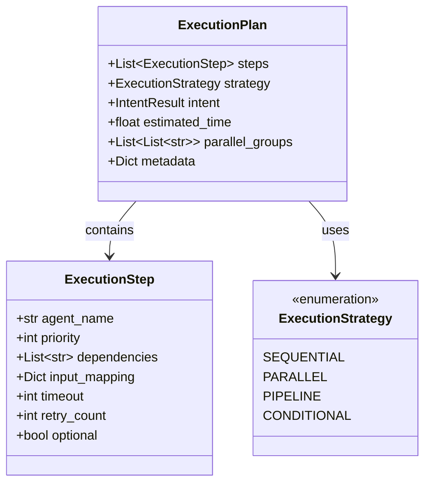
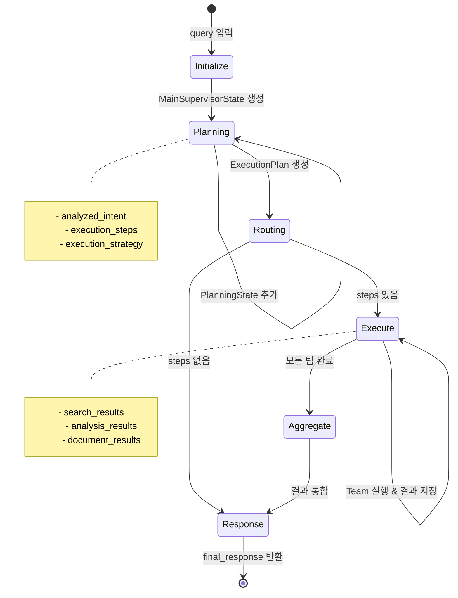

# Agent 흐름도 (Supervisor 기준)

**버전**: 1.0
**작성일**: 2025-10-10
**목적**: TeamBasedSupervisor를 중심으로 한 에이전트 실행 흐름 (입력 → 출력)

---

## 📊 전체 흐름 (Input → Output)

```mermaid
flowchart TD
    Start [사용자 쿼리]

    %% ============================================
    %% Main Supervisor Flow
    %% ============================================
    subgraph Supervisor["🎯 TeamBasedSupervisor (LangGraph)"]
        direction TB

        Init["1. initialize_node<br/>📝 초기 상태 설정"]
        Planning["2. planning_node<br/>🧠 의도 분석 & 계획 수립"]
        Route{"3. route_after_planning<br/>🔀 실행 여부 결정"}
        Execute["4. execute_teams_node<br/>⚙️ 팀 실행"]
        Aggregate["5. aggregate_results_node<br/>📊 결과 통합"]
        Response["6. generate_response_node<br/>📝 최종 응답 생성"]

        Init --> Planning
        Planning --> Route
        Route -->|execution_steps 있음| Execute
        Route -->|execution_steps 없음| Response
        Execute --> Aggregate
        Aggregate --> Response
    end

    Start --> Init

    %% ============================================
    %% Planning Agent Details
    %% ============================================
    subgraph PlanningDetails["🧠 Planning Node 상세"]
        direction TB

        PA_Intent["PlanningAgent.analyze_intent()<br/>🤖 LLM #1<br/>📄 prompts/cognitive/intent_analysis.txt<br/>temp=0.0, async"]
        PA_Check{intent_type?}
        PA_Skip["⚡ Skip LLM #2<br/>(IRRELEVANT/UNCLEAR)"]
        PA_Agent["PlanningAgent.suggest_agents()<br/>🤖 LLM #2<br/>📄 prompts/cognitive/agent_selection.txt<br/>temp=0.0, async"]
        PA_Decomp["QueryDecomposer.decompose()<br/>🤖 LLM #3<br/>📄 prompts/cognitive/query_decomposition.txt<br/>temp=0.1, async<br/>(복합 질문만)"]
        PA_Plan["PlanningAgent.create_execution_plan()<br/>📋 ExecutionPlan 생성<br/>(LLM 호출 없음)"]

        PA_Intent --> PA_Check
        PA_Check -->|IRRELEVANT<br/>or UNCLEAR| PA_Skip
        PA_Check -->|정상| PA_Agent
        PA_Skip --> PA_Plan
        PA_Agent --> PA_Decomp
        PA_Decomp --> PA_Plan
    end

    Planning --> PA_Intent
    PA_Plan --> Route

    %% ============================================
    %% Execute Teams Details
    %% ============================================
    subgraph ExecuteDetails["⚙️ Execute Teams Node 상세"]
        direction TB

        Strategy{"execution_strategy?"}
        Parallel["_execute_teams_parallel()<br/>병렬 실행"]
        Sequential["_execute_teams_sequential()<br/>순차 실행"]

        Strategy -->|parallel & teams > 1| Parallel
        Strategy -->|기타| Sequential

        subgraph Teams["🔧 Team Executors"]
            direction LR
            SearchTeam["SearchExecutor<br/>🤖 LLM #4: keyword_extraction.txt (temp=0.1, sync)<br/>🤖 LLM #5: tool_selection_search.txt (temp=0.1, async)"]
            AnalysisTeam["AnalysisExecutor<br/>🤖 LLM #6: tool_selection_analysis.txt (temp=0.0, async)<br/>🤖 LLM #7: ContractAnalysis (inline, temp=0.3, async)<br/>🤖 LLM #8: insight_generation.txt (temp=0.3, async)<br/>🤖 LLM #9: insight_generation.txt (temp=0.3, async)"]
            DocumentTeam["DocumentExecutor<br/>(LLM 호출 없음)"]
        end

        Parallel --> Teams
        Sequential --> Teams
    end

    Execute --> Strategy
    Teams --> Aggregate

    %% ============================================
    %% Response Generation Details
    %% ============================================
    subgraph ResponseDetails["📝 Response Generation 상세"]
        direction TB

        Resp_Check{intent_type?}
        Resp_Guide["_generate_out_of_scope_response()<br/>안내 메시지<br/>(LLM 호출 없음)"]
        Resp_Check2{결과 있음?}
        Resp_LLM["_generate_llm_response()<br/>🤖 LLM #10<br/>📄 prompts/execution/response_synthesis.txt<br/>temp=0.3, async"]
        Resp_Simple["_generate_simple_response()<br/>단순 응답<br/>(LLM 호출 없음)"]

        Resp_Check -->|IRRELEVANT<br/>or UNCLEAR| Resp_Guide
        Resp_Check -->|정상| Resp_Check2
        Resp_Check2 -->|Yes| Resp_LLM
        Resp_Check2 -->|No| Resp_Simple
    end

    Response --> Resp_Check
    Resp_Guide --> End
    Resp_LLM --> End
    Resp_Simple --> End

    End([최종 응답 반환])

    %% ============================================
    %% Styling
    %% ============================================
    classDef supervisorNode fill:#e3f2fd,stroke:#1976d2,stroke-width:3px
    classDef llmNode fill:#fff3e0,stroke:#f57c00,stroke-width:2px
    classDef teamNode fill:#e8f5e9,stroke:#388e3c,stroke-width:2px
    classDef skipNode fill:#ffebee,stroke:#c62828,stroke-width:2px

    class Init,Planning,Route,Execute,Aggregate,Response supervisorNode
    class PA_Intent,PA_Agent,PA_Decomp,SearchTeam,AnalysisTeam,Resp_LLM llmNode
    class Teams teamNode
    class PA_Skip skipNode
```

---

## 🔄 실행 전략별 팀 실행 흐름

### 1. Sequential (순차 실행) - 기본값



**코드 위치**: [team_supervisor.py:557-626](backend/app/service_agent/supervisor/team_supervisor.py#L557)

---

### 2. Parallel (병렬 실행)



**코드 위치**: [team_supervisor.py:530-555](backend/app/service_agent/supervisor/team_supervisor.py#L530)

**⚠️ 주의**: 현재 구현은 순차 await로 되어 있어 실제 병렬 실행 안 됨

---

## 🧩 각 팀 Executor 내부 흐름

### SearchExecutor



**코드 위치**: [search_executor.py](backend/app/service_agent/execution_agents/search_executor.py)

---

### AnalysisExecutor



**코드 위치**: [analysis_executor.py](backend/app/service_agent/execution_agents/analysis_executor.py)

---

### DocumentExecutor



**코드 위치**: [document_executor.py](backend/app/service_agent/execution_agents/document_executor.py)

---

## 📋 ExecutionPlan 구조



**코드 위치**: [planning_agent.py:46-87](backend/app/service_agent/cognitive_agents/planning_agent.py#L46)

---

## 🎯 시나리오별 전체 흐름

### 시나리오 1: "안녕" (IRRELEVANT)

```
Input: "안녕"
  ↓
1. initialize_node (LLM 호출 없음)
  → State 초기화
  ↓
2. planning_node
  → analyze_intent() → 🤖 LLM #1: intent_analysis → IRRELEVANT
  → ⚡ skip suggest_agents() (LLM #2 생략)
  → create_execution_plan() → steps = [] (LLM 호출 없음)
  ↓
3. route_after_planning (LLM 호출 없음)
  → if intent_type == "irrelevant" → return "respond"
  ↓
⚡ execute_teams_node 건너뛰기 (바로 4번으로)
⚡ aggregate_results_node 건너뛰기
  ↓
4. generate_response_node (LLM 호출 없음)
  → if intent_type == "irrelevant":
  → _generate_out_of_scope_response()
  → "죄송합니다. 부동산 관련 질문만..."
  ↓
Output: 안내 메시지
```

**거치는 노드**: initialize → planning → route → generate_response → END
**건너뛴 노드**: ❌ execute_teams, ❌ aggregate

**LLM 호출**: 1회만 (LLM #1: intent_analysis)
**소요 시간**: ~0.6초

---

### 시나리오 2: "전세금 인상기준은?" (LEGAL_CONSULT)

```
Input: "전세금 인상기준은?"
  ↓
1. initialize_node (LLM 호출 없음)
  → State 초기화
  ↓
2. planning_node
  → analyze_intent() → 🤖 LLM #1: intent_analysis → LEGAL_CONSULT
  → suggest_agents() → 🤖 LLM #2: agent_selection → ["search_team"]
  → create_execution_plan() → steps = [search] (LLM 호출 없음)
  ↓
3. route_after_planning (LLM 호출 없음)
  → if execution_steps 있음 → return "execute"
  ↓
4. execute_teams_node
  → strategy = "sequential"
  → _execute_teams_sequential(["search"])
    ├─ SearchExecutor.execute()
    │  → 🤖 LLM #4: keyword_extraction
    │  → 🤖 LLM #5: tool_selection_search
    │  → LegalSearchTool.search() (LLM 호출 없음)
    │  → return SearchResult
  ↓
5. aggregate_results_node (LLM 호출 없음)
  → 검색 결과 통합
  ↓
6. generate_response_node
  → _generate_llm_response()
  → 🤖 LLM #10: response_synthesis
  → "전세금 인상 한도는 5%입니다..."
  ↓
Output: 최종 응답
```

**거치는 노드**: initialize → planning → route → execute_teams → aggregate → generate_response → END
**모든 노드 통과** ✅

**LLM 호출**: 5회 (LLM #1, #2, #4, #5, #10)
**소요 시간**: ~5-7초

---

### 시나리오 3: "강남구 아파트 시세와 위험도 분석" (COMPREHENSIVE)

```
Input: "강남구 아파트 시세와 위험도 분석"
  ↓
1. initialize_node (LLM 호출 없음)
  → State 초기화
  ↓
2. planning_node
  → analyze_intent() → 🤖 LLM #1: intent_analysis → COMPREHENSIVE
  → suggest_agents() → 🤖 LLM #2: agent_selection → ["search_team", "analysis_team"]
  → decompose() → 🤖 LLM #3: query_decomposition → [시세 조회, 위험도 분석]
  → create_execution_plan() → steps = [search, analysis] (LLM 호출 없음)
  ↓
3. route_after_planning (LLM 호출 없음)
  → if execution_steps 있음 → return "execute"
  ↓
4. execute_teams_node
  → strategy = "sequential" (기본값)
  → _execute_teams_sequential(["search", "analysis"])
    │
    ├─ SearchExecutor.execute()
    │  → 🤖 LLM #4: keyword_extraction
    │  → 🤖 LLM #5: tool_selection_search
    │  → MarketDataTool.search() (LLM 호출 없음)
    │  → return SearchResult
    │
    ├─ AnalysisExecutor.execute()
    │  → 🤖 LLM #6: tool_selection_analysis
    │  → MarketAnalysisTool
    │    → 🤖 LLM #8: insight_generation
    │  → 🤖 LLM #9: insight_generation (분석 종합)
    │  → return AnalysisResult
  ↓
5. aggregate_results_node (LLM 호출 없음)
  → 검색 + 분석 결과 통합
  ↓
6. generate_response_node
  → _generate_llm_response()
  → 🤖 LLM #10: response_synthesis
  → "강남구 아파트 시세는... 위험도는..."
  ↓
Output: 최종 응답
```

**거치는 노드**: initialize → planning → route → execute_teams → aggregate → generate_response → END
**모든 노드 통과** ✅

**LLM 호출**: 최대 10회 (LLM #1, #2, #3, #4, #5, #6, #8, #9, #10)
**참고**: LLM #7 (ContractAnalysisTool)은 계약서 분석 시에만 호출
**소요 시간**: ~15-20초

---

## 🔧 주요 코드 위치

| 구성요소 | 파일 | 주요 메서드 |
|---------|------|-----------|
| **Supervisor** | `team_supervisor.py` | `initialize_node`, `planning_node`, `execute_teams_node`, `aggregate_results_node`, `generate_response_node` |
| **PlanningAgent** | `planning_agent.py` | `analyze_intent`, `suggest_agents`, `create_execution_plan` |
| **QueryDecomposer** | `query_decomposer.py` | `decompose`, `_analyze_complexity` |
| **SearchExecutor** | `search_executor.py` | `execute`, `_extract_keywords`, `_select_tools` |
| **AnalysisExecutor** | `analysis_executor.py` | `execute`, `_select_analysis_tools`, `_synthesize_insights` |
| **DocumentExecutor** | `document_executor.py` | `execute` |

---

## 🚀 실행 전략 (ExecutionStrategy)

| 전략 | 설명 | 구현 상태 | 용도 |
|-----|------|---------|------|
| **SEQUENTIAL** | 순차 실행 | ✅ 완전 구현 | 의존성 있는 작업 |
| **PARALLEL** | 병렬 실행 | ⚠️ 부분 구현 | 독립적인 작업 (현재 순차 await) |
| **PIPELINE** | 파이프라인 | ❌ 미구현 | 데이터 스트리밍 |
| **CONDITIONAL** | 조건부 실행 | ❌ 미구현 | 동적 라우팅 |

---

## 🤖 LLM 호출 지점 전체 요약

| # | 호출 위치 | 메서드/클래스 | 프롬프트 파일 | Temp | 방식 | 목적 |
|---|----------|--------------|-------------|------|------|------|
| **1** | Planning Node | `PlanningAgent.analyze_intent()` | `prompts/cognitive/intent_analysis.txt` | 0.0 | async | 사용자 의도 분석 |
| **2** | Planning Node | `PlanningAgent.suggest_agents()` | `prompts/cognitive/agent_selection.txt` | 0.0 | async | Agent 선택 ⚡ IRRELEVANT/UNCLEAR 시 생략 |
| **3** | Planning Node | `QueryDecomposer.decompose()` | `prompts/cognitive/query_decomposition.txt` | 0.1 | async | 복합 질문 분해 (복합 질문만) |
| **4** | SearchExecutor | `_extract_keywords()` | `prompts/execution/keyword_extraction.txt` | 0.1 | **sync** | 검색 키워드 추출 |
| **5** | SearchExecutor | `_select_tools()` | `prompts/execution/tool_selection_search.txt` | 0.1 | async | 검색 도구 선택 |
| **6** | AnalysisExecutor | `_select_analysis_tools()` | `prompts/execution/tool_selection_analysis.txt` | 0.0 | async | 분석 도구 선택 |
| **7** | AnalysisExecutor | `ContractAnalysisTool` | ⚠️ **인라인 프롬프트** (파일 없음) | 0.3 | async | 계약서 분석 |
| **8** | AnalysisExecutor | `MarketAnalysisTool` | `prompts/execution/insight_generation.txt` | 0.3 | async | 시장 인사이트 생성 |
| **9** | AnalysisExecutor | `_synthesize_insights()` | `prompts/execution/insight_generation.txt` | 0.3 | async | 분석 인사이트 종합 |
| **10** | Response Node | `_generate_llm_response()` | `prompts/execution/response_synthesis.txt` | 0.3 | async | 최종 응답 생성 |

### 프롬프트 파일 경로 구조

```
backend/app/service_agent/llm_manager/prompts/
├── cognitive/              # 인지 에이전트 (Planning, Decomposer)
│   ├── intent_analysis.txt          # LLM #1
│   ├── agent_selection.txt          # LLM #2
│   └── query_decomposition.txt      # LLM #3
│
└── execution/              # 실행 에이전트 (Search, Analysis, Response)
    ├── keyword_extraction.txt       # LLM #4
    ├── tool_selection_search.txt    # LLM #5
    ├── tool_selection_analysis.txt  # LLM #6
    ├── insight_generation.txt       # LLM #8, #9 (공유)
    └── response_synthesis.txt       # LLM #10
```

### ⚠️ 누락된 프롬프트 파일
- **LLM #7**: ContractAnalysisTool이 인라인 프롬프트 사용
- 권장: `prompts/execution/contract_analysis.txt` 생성 필요

---

## 📊 State 흐름



---

**작성일**: 2025-10-10
**버전**: 1.0
**참고**: [SYSTEM_FLOW_DIAGRAM.md](SYSTEM_FLOW_DIAGRAM.md) (전체 시스템 흐름도)
