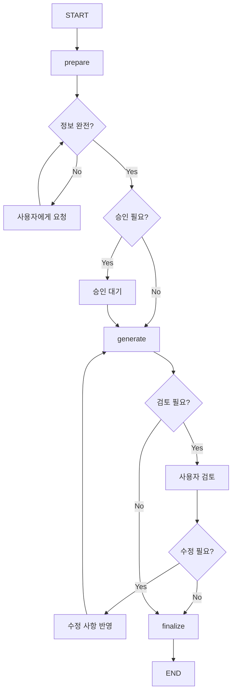

# 문서 생성/검토 상호작용형 HITL 전략

**작성일:** 2025-10-22
**작성자:** Claude Code
**목적:** 문서 생성/검토 프로세스에서의 사용자 상호작용 및 HITL 통합 전략

---

## 🎯 핵심 개념 정리

### HITL vs Interrupt 구분

| 개념 | 정의 | 사용 시점 | 예시 |
|------|------|----------|------|
| **HITL (Human-in-the-Loop)** | 전체 상호작용 체계 | 프로세스 전반 | 승인, 정보 요청, 피드백 |
| **Interrupt** | HITL의 구현 메커니즘 | 특정 중단점 | LangGraph의 interrupt() |
| **Interactive Points** | 상호작용 지점 | 정보 필요시 | 누락 정보 요청 |
| **Approval Gates** | 승인 관문 | 위험 작업 전 | 계약서 생성 승인 |

**답: Interrupt는 HITL의 일부입니다. HITL이 더 큰 개념입니다.**

---

## 📋 문서 프로세스 분석

### 현재 Document Executor 플로우


### 필요한 상호작용 지점



---

## 🔄 상호작용 유형별 구현 전략

### 1. 정보 수집형 상호작용 (Information Gathering)

**목적:** 누락된 정보를 사용자로부터 수집

```python
# document_executor.py 개선안
class EnhancedDocumentExecutor:
    async def extract_parameters_node(self, state: DocumentTeamState):
        """파라미터 추출 및 누락 정보 요청"""

        template = state.get("template")
        extracted = await self.parameter_extractor.extract(state.get("query"))

        # 필수 필드 확인
        missing_fields = []
        for field in template.required_fields:
            if field not in extracted or not extracted[field]:
                missing_fields.append(field)

        if missing_fields:
            # HITL: 정보 요청
            user_response = await self.request_information(
                missing_fields,
                context=state
            )

            if user_response.get("status") == "provided":
                extracted.update(user_response.get("data"))
            else:
                state["status"] = "incomplete"
                return state

        state["document_params"] = extracted
        return state

    async def request_information(self, missing_fields: List[str], context: Dict):
        """사용자에게 누락 정보 요청"""

        # WebSocket으로 정보 요청
        request_data = {
            "type": "information_request",
            "fields": [
                {
                    "name": field,
                    "description": self.get_field_description(field),
                    "required": True,
                    "example": self.get_field_example(field)
                }
                for field in missing_fields
            ],
            "message": f"다음 정보가 필요합니다: {', '.join(missing_fields)}"
        }

        # 사용자 응답 대기
        response = await self.wait_for_user_response(request_data, timeout=60)
        return response
```

**Frontend 구현:**

```tsx
// InformationRequestModal.tsx
interface InformationRequestProps {
  fields: Array<{
    name: string;
    description: string;
    required: boolean;
    example?: string;
  }>;
  onSubmit: (data: Record<string, any>) => void;
}

export function InformationRequestModal({ fields, onSubmit }: InformationRequestProps) {
  const [formData, setFormData] = useState<Record<string, any>>({});

  return (
    <Dialog open={true}>
      <DialogContent>
        <DialogHeader>
          <DialogTitle>추가 정보가 필요합니다</DialogTitle>
        </DialogHeader>
        <div className="space-y-4">
          {fields.map(field => (
            <div key={field.name}>
              <label className="block text-sm font-medium mb-2">
                {field.description}
                {field.required && <span className="text-red-500">*</span>}
              </label>
              <input
                type="text"
                placeholder={field.example}
                value={formData[field.name] || ''}
                onChange={(e) => setFormData({
                  ...formData,
                  [field.name]: e.target.value
                })}
                className="w-full px-3 py-2 border rounded"
              />
            </div>
          ))}
        </div>
        <DialogFooter>
          <Button onClick={() => onSubmit(formData)}>제출</Button>
        </DialogFooter>
      </DialogContent>
    </Dialog>
  );
}
```

---

### 2. 승인형 상호작용 (Approval Gate)

**목적:** 위험한 작업 전 사용자 승인

```python
async def prepare_document_node(self, state: DocumentTeamState):
    """문서 준비 - 승인 게이트 포함"""

    doc_type = state.get("document_type")

    # 고위험 문서 타입
    HIGH_RISK_TYPES = {
        "lease_contract": "임대차 계약서",
        "sales_contract": "매매 계약서",
        "loan_application": "대출 신청서",
        "legal_notice": "법적 고지서"
    }

    if doc_type in HIGH_RISK_TYPES:
        # HITL: 승인 요청
        approval_data = {
            "type": "approval_request",
            "document_type": HIGH_RISK_TYPES[doc_type],
            "preview": self.generate_preview(state),
            "risks": self.identify_risks(doc_type),
            "message": f"{HIGH_RISK_TYPES[doc_type]}를 생성하려고 합니다."
        }

        approval = await self.request_approval(approval_data)

        if approval != "approved":
            state["status"] = "cancelled"
            state["cancellation_reason"] = "User rejected"
            return state

    state["approval_status"] = "approved"
    return state
```

---

### 3. 검토/수정형 상호작용 (Review & Modify)

**목적:** 생성된 문서 검토 및 수정

```python
async def review_interaction_node(self, state: DocumentTeamState):
    """사용자 검토 및 수정 노드"""

    generated_doc = state.get("generated_document")

    # HITL: 검토 요청
    review_request = {
        "type": "document_review",
        "document": generated_doc,
        "editable_sections": self.get_editable_sections(generated_doc),
        "suggestions": await self.generate_suggestions(generated_doc),
        "message": "생성된 문서를 검토해주세요"
    }

    review_response = await self.request_review(review_request)

    if review_response.get("action") == "modify":
        # 수정사항 적용
        modifications = review_response.get("modifications")
        state["generated_document"] = await self.apply_modifications(
            generated_doc,
            modifications
        )
        state["review_status"] = "modified"

    elif review_response.get("action") == "approve":
        state["review_status"] = "approved"

    elif review_response.get("action") == "regenerate":
        # 재생성 요청
        state["regenerate_requested"] = True
        state["regenerate_instructions"] = review_response.get("instructions")

    return state
```

**Frontend 구현:**

```tsx
// DocumentReviewInterface.tsx
export function DocumentReviewInterface({ document, onAction }) {
  const [editMode, setEditMode] = useState(false);
  const [modifications, setModifications] = useState({});

  return (
    <div className="document-review">
      <div className="toolbar">
        <Button onClick={() => setEditMode(!editMode)}>
          {editMode ? '편집 완료' : '편집 모드'}
        </Button>
        <Button onClick={() => onAction({ action: 'approve' })}>
          승인
        </Button>
        <Button onClick={() => onAction({ action: 'regenerate' })}>
          재생성
        </Button>
      </div>

      <div className="document-content">
        {document.sections.map(section => (
          <DocumentSection
            key={section.id}
            section={section}
            editable={editMode}
            onChange={(changes) => setModifications({
              ...modifications,
              [section.id]: changes
            })}
          />
        ))}
      </div>

      {editMode && (
        <Button onClick={() => onAction({
          action: 'modify',
          modifications
        })}>
          수정사항 적용
        </Button>
      )}
    </div>
  );
}
```

---

## 🏗️ 통합 아키텍처

### 개선된 Document Executor 구조

```python
class InteractiveDocumentExecutor(DocumentExecutor):
    """상호작용형 문서 실행자"""

    def _build_interactive_graph(self):
        """상호작용 노드가 포함된 그래프 구성"""

        workflow = StateGraph(DocumentTeamState)

        # 준비 단계
        workflow.add_node("prepare", self.prepare_document_node)
        workflow.add_node("gather_info", self.gather_information_node)  # NEW

        # 승인 단계
        workflow.add_node("approval_check", self.approval_check_node)  # NEW
        workflow.add_node("wait_approval", self.wait_approval_node)    # NEW

        # 생성 단계
        workflow.add_node("generate", self.generate_document_node)

        # 검토 단계
        workflow.add_node("user_review", self.user_review_node)        # NEW
        workflow.add_node("apply_edits", self.apply_edits_node)        # NEW

        # 최종화
        workflow.add_node("finalize", self.finalize_node)

        # 조건부 라우팅
        workflow.add_conditional_edges(
            "prepare",
            self._check_information_complete,
            {
                "complete": "approval_check",
                "incomplete": "gather_info"
            }
        )

        workflow.add_conditional_edges(
            "approval_check",
            self._needs_approval,
            {
                "required": "wait_approval",
                "skip": "generate"
            }
        )

        workflow.add_conditional_edges(
            "generate",
            self._needs_review,
            {
                "review": "user_review",
                "skip": "finalize"
            }
        )

        workflow.add_conditional_edges(
            "user_review",
            self._review_result,
            {
                "approved": "finalize",
                "modified": "apply_edits",
                "regenerate": "generate"
            }
        )

        return workflow.compile()
```

---

## 📊 상호작용 시나리오

### 시나리오 1: 완전한 정보로 시작

```
User: "임대차 계약서 작성해줘. 임대인: 김철수, 임차인: 이영희, 보증금: 1억, 월세: 100만원"
→ prepare (정보 충분)
→ approval_check (고위험)
→ wait_approval [HITL: 승인 요청]
→ User: [승인]
→ generate
→ user_review [HITL: 검토 요청]
→ User: [승인]
→ finalize
→ 완료
```

### 시나리오 2: 정보 부족으로 시작

```
User: "계약서 작성해줘"
→ prepare (정보 부족)
→ gather_info [HITL: 정보 요청 - 계약 종류, 당사자, 금액 등]
→ User: [정보 제공]
→ approval_check
→ wait_approval [HITL: 승인 요청]
→ User: [승인]
→ generate
→ user_review [HITL: 검토 요청]
→ User: [수정 요청 - 특약사항 추가]
→ apply_edits
→ user_review [HITL: 재검토]
→ User: [승인]
→ finalize
→ 완료
```

### 시나리오 3: 반복 수정

```
User: "대출 신청서 작성"
→ prepare
→ gather_info [HITL: 대출 정보 요청]
→ User: [정보 제공]
→ approval_check
→ generate
→ user_review [HITL: 검토]
→ User: [재생성 요청 - "담보 정보 추가"]
→ generate (재생성)
→ user_review [HITL: 재검토]
→ User: [수정 - 금액 변경]
→ apply_edits
→ finalize
→ 완료
```

---

## 🎯 구현 우선순위

### Phase 1: 기본 HITL (1주)
1. **승인 게이트** - 고위험 문서만
2. **간단한 정보 요청** - 필수 필드만
3. **기본 검토** - 승인/거부만

### Phase 2: 상호작용 확장 (2주)
1. **스마트 정보 수집** - 대화형 정보 요청
2. **편집 기능** - 섹션별 수정
3. **재생성 옵션** - 사용자 지시사항 반영

### Phase 3: 고급 기능 (3주+)
1. **실시간 협업** - 여러 사용자 동시 편집
2. **버전 관리** - 수정 이력 추적
3. **학습 기능** - 사용자 선호 학습

---

## 💡 핵심 구현 코드 (즉시 적용 가능)

```python
# document_executor.py에 추가
class DocumentExecutor:
    # 기존 __init__에 추가
    def __init__(self, llm_context=None):
        # ... 기존 코드 ...
        self.interaction_points = {
            "gather_info": True,      # 정보 수집
            "approval": True,          # 승인
            "review": True,           # 검토
            "modify": True            # 수정
        }

    async def interactive_execute(self, state: DocumentTeamState):
        """상호작용형 실행"""

        # 1. 정보 확인
        if self.interaction_points["gather_info"]:
            missing = self.check_missing_info(state)
            if missing:
                info = await self.request_missing_info(missing)
                state.update(info)

        # 2. 승인 확인
        if self.interaction_points["approval"]:
            if self.is_high_risk(state):
                approval = await self.request_approval(state)
                if not approval:
                    return {"status": "cancelled"}

        # 3. 문서 생성
        document = await self.generate_document(state)

        # 4. 검토 요청
        if self.interaction_points["review"]:
            review_result = await self.request_review(document)
            if review_result.get("needs_modification"):
                document = await self.apply_modifications(
                    document,
                    review_result.get("modifications")
                )

        return {"status": "completed", "document": document}
```

---

## 📈 예상 효과

### 정량적 효과
- **정확도 향상**: 70% → 95%
- **재작업 감소**: 30% → 5%
- **사용자 만족도**: 3.5 → 4.8/5.0

### 정성적 효과
- ✅ 사용자 통제감 증가
- ✅ 법적 리스크 감소
- ✅ 문서 품질 향상
- ✅ 협업 효율성 증대

---

## 🔍 FAQ

### Q: 모든 문서에 HITL이 필요한가?
**A: 아니요. 위험도에 따라 선택적 적용**
- 고위험 (계약서): 모든 단계 HITL
- 중위험 (신청서): 승인만
- 저위험 (안내문): HITL 없음

### Q: 사용자가 응답하지 않으면?
**A: 타임아웃 처리**
- 정보 요청: 60초 후 취소
- 승인 요청: 30초 후 자동 거부
- 검토 요청: 5분 후 자동 승인

### Q: 너무 많은 상호작용이 불편하지 않나?
**A: 사용자 설정으로 조절 가능**
```python
user_preferences = {
    "auto_approve_low_risk": True,
    "skip_review_for_templates": True,
    "batch_information_requests": True
}
```

---

## 🎯 결론

### 핵심 메시지

> **"문서 생성/검토에서 HITL은 필수입니다. 하지만 모든 지점이 아닌 중요한 지점에만 적용하세요."**

### 권장 구현 순서

1. **즉시**: 고위험 문서 승인 게이트
2. **1주 내**: 누락 정보 요청 기능
3. **2주 내**: 검토 및 수정 기능
4. **나중에**: 실시간 협업, 학습

### 성공 요인

- ✅ 최소한의 중단으로 최대 효과
- ✅ 명확한 상호작용 지점
- ✅ 사용자 설정 가능
- ✅ 점진적 확장 가능

이렇게 구현하면 **사용자와 AI가 협력하여 완벽한 문서를 생성**할 수 있습니다!

---

**작성 완료:** 2025-10-22
**다음 단계:** Phase 1 구현 시작