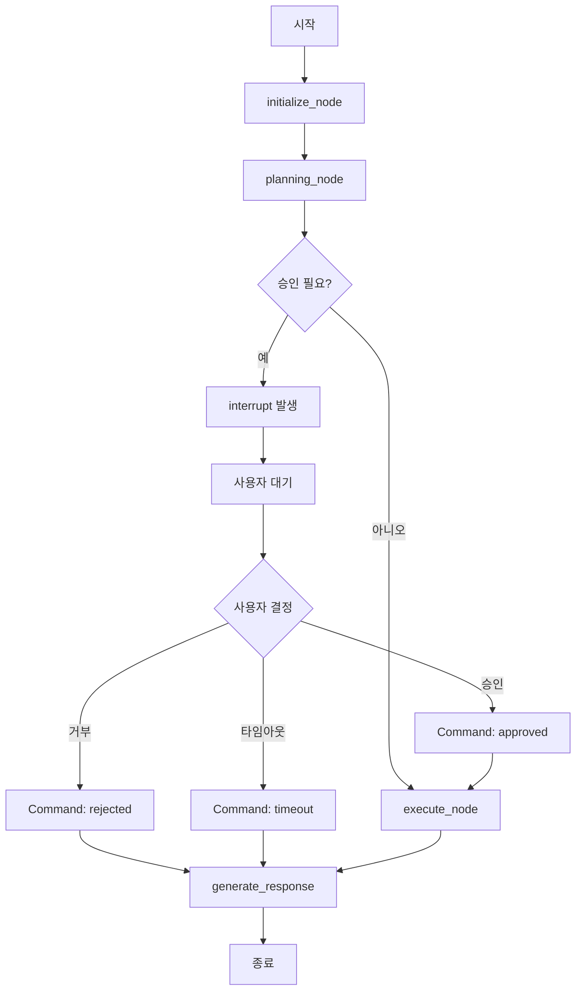

# Human-in-the-Loop & Interrupt 기능 구현 계획서

**작성일:** 2025-10-22
**작성자:** Claude Code
**목적:** Todo Management 시스템의 하위 개념인 HITL 및 Interrupt 기능 구현
**상태:** 🟢 Ready for Implementation

---

## 📋 Executive Summary

### 프로젝트 배경

Todo Management 시스템을 구축하기 위해서는 먼저 하위 개념인 **Human-in-the-Loop (HITL)** 및 **Interrupt 기능**을 구현해야 합니다.

### 핵심 개념 정리

| 개념 | 설명 | 필요성 |
|------|------|---------|
| **HITL (Human-in-the-Loop)** | 워크플로우 중간에 사용자 개입 지점 삽입 | Todo 수락/거부 판단 |
| **Interrupt** | LangGraph의 워크플로우 중단 메커니즘 | 사용자 응답 대기 |
| **Command** | 중단된 워크플로우 재개 명령 | 승인/거부 후 진행 |
| **Checkpoint** | 워크플로우 상태 저장 | 중단/재개 시 상태 복원 |

### 구현 우선순위

1. **Phase 1:** Interrupt 기반 구조 (Foundation) ← **현재 목표**
2. **Phase 2:** HITL 통합 (Integration)
3. **Phase 3:** Todo Management 시스템 구축

---

## 🎯 프로젝트 목표

### Primary Goals

1. **Interrupt 메커니즘 구현**
   - planning_node 이후 interrupt 지점 추가
   - 사용자 승인 대기 구현
   - Command를 통한 재개 처리

2. **HITL Foundation 구축**
   - 승인이 필요한 액션 식별
   - 승인 UI/UX 구현
   - WebSocket 실시간 통신

### Secondary Goals

3. **Todo Management 준비**
   - Task 상태 관리 구조
   - Rollback 메커니즘 기초
   - Time Travel 인프라

---

## 🏗️ 아키텍처 설계

### 전체 플로우



### 컴포넌트 구조

```
backend/
├── app/
│   ├── service_agent/
│   │   ├── supervisor/
│   │   │   ├── team_supervisor.py        # Graph 구성 수정
│   │   │   └── approval_handler.py       # NEW: 승인 처리 로직
│   │   ├── foundation/
│   │   │   └── separated_states.py       # State 확장
│   │   └── nodes/
│   │       └── plan_approval_node.py     # NEW: 승인 노드
│   ├── api/
│   │   ├── chat_api.py                   # Command 처리 추가
│   │   └── ws_manager.py                  # WebSocket 이벤트
│   └── core/
│       └── approval_types.py             # NEW: 승인 타입 정의

frontend/
├── components/
│   ├── chat-interface.tsx                # 승인 모달 통합
│   └── approval/
│       ├── ApprovalModal.tsx            # NEW: 승인 UI
│       └── ApprovalProgress.tsx         # NEW: 진행 표시
└── hooks/
    └── use-approval.ts                   # NEW: 승인 Hook
```

---

## 💻 구현 상세

### Phase 1: Core Interrupt Implementation

#### 1.1 Plan Approval Node 구현

**파일:** `backend/app/service_agent/nodes/plan_approval_node.py`

```python
from typing import Dict, Any
from langgraph.types import interrupt
from app.service_agent.foundation.separated_states import MainSupervisorState
import logging

logger = logging.getLogger(__name__)

class PlanApprovalNode:
    """Planning 결과에 대한 사용자 승인 처리"""

    async def __call__(self, state: MainSupervisorState) -> MainSupervisorState:
        """
        Plan 승인 처리

        Note: planning_node를 수정하지 않고 별도 노드로 구현
        """
        planning_result = state.get("planning_result")

        if not planning_result:
            logger.info("[PlanApprovalNode] No planning result to approve")
            state["approval_status"] = "auto_approved"
            return state

        # 승인이 필요한지 확인
        if not self._requires_approval(planning_result):
            state["approval_status"] = "auto_approved"
            return state

        logger.info(f"[PlanApprovalNode] Interrupting for approval: {planning_result.get('task_type')}")

        # Interrupt 발생 - 워크플로우 중단
        user_decision = interrupt({
            "type": "plan_approval_required",
            "planning_result": planning_result,
            "tasks": planning_result.get("tasks", []),
            "estimated_duration": planning_result.get("estimated_duration"),
            "message": self._generate_approval_message(planning_result)
        })

        # Command(resume=...)로 재개될 때까지 대기
        logger.info(f"[PlanApprovalNode] User decision: {user_decision}")

        # 승인 상태 업데이트
        state["approval_status"] = user_decision

        if user_decision == "rejected":
            state["next_action"] = None  # 실행 취소
            state["planning_result"] = None

        return state

    def _requires_approval(self, planning_result: Dict) -> bool:
        """승인 필요 여부 판단"""
        # TODO: 실제 로직 구현
        task_type = planning_result.get("task_type", "")

        # 항상 승인이 필요한 타입
        always_require = ["contract", "legal", "transaction", "high_value"]

        return any(keyword in task_type.lower() for keyword in always_require)

    def _generate_approval_message(self, planning_result: Dict) -> str:
        """승인 요청 메시지 생성"""
        tasks = planning_result.get("tasks", [])
        task_count = len(tasks)

        return f"""
다음 계획을 실행하려고 합니다:

📋 작업 개수: {task_count}개
⏱️ 예상 시간: {planning_result.get('estimated_duration', '즉시')}
🎯 목적: {planning_result.get('purpose', '미정')}

실행할 작업:
{self._format_tasks(tasks)}

이 계획을 승인하시겠습니까?
"""

    def _format_tasks(self, tasks: list) -> str:
        """작업 목록 포맷팅"""
        if not tasks:
            return "- 작업 없음"

        formatted = []
        for i, task in enumerate(tasks, 1):
            formatted.append(f"{i}. {task.get('description', 'Unknown task')}")

        return "\n".join(formatted)

# 노드 인스턴스 생성
plan_approval_node = PlanApprovalNode()
```

#### 1.2 State 확장

**파일:** `backend/app/service_agent/foundation/separated_states.py` (수정)

```python
from typing import TypedDict, Optional, Dict, Any, List
from datetime import datetime

class MainSupervisorState(TypedDict):
    # 기존 필드
    user_id: int
    query: str
    chat_session_id: str
    current_agent: Optional[str]
    next_action: Optional[str]
    messages: List[Any]

    # NEW: Planning 관련
    planning_result: Optional[Dict[str, Any]]  # planning_node 결과

    # NEW: HITL 관련
    approval_status: Optional[str]  # "pending" | "approved" | "rejected" | "timeout" | "auto_approved"
    approval_metadata: Optional[Dict[str, Any]]  # 승인 메타데이터
    interrupt_data: Optional[Dict[str, Any]]  # interrupt 시 전달할 데이터
```

#### 1.3 Graph 구조 수정

**파일:** `backend/app/service_agent/supervisor/team_supervisor.py` (수정)

```python
from app.service_agent.nodes.plan_approval_node import plan_approval_node

class TeamSupervisor:
    def _build_graph_with_checkpointer(self) -> None:
        """Checkpointer와 함께 그래프 재구성"""

        builder = StateGraph(MainSupervisorState)

        # 기존 노드들
        builder.add_node("initialize", self.initialize_node)
        builder.add_node("planning", self.planning_node)

        # NEW: Plan approval 노드 추가
        builder.add_node("plan_approval", plan_approval_node)

        builder.add_node("execute", self.execute_node)
        builder.add_node("generate_response", self.generate_response_node)

        # Edge 구성 변경
        builder.add_edge(START, "initialize")
        builder.add_edge("initialize", "planning")

        # NEW: planning → plan_approval
        builder.add_edge("planning", "plan_approval")

        # NEW: plan_approval → conditional routing
        builder.add_conditional_edges(
            "plan_approval",
            self._route_after_approval,
            {
                "approved": "execute",
                "rejected": "generate_response",
                "timeout": "generate_response",
                "auto_approved": "execute"
            }
        )

        # 기존 edges
        builder.add_edge("execute", "generate_response")
        builder.add_edge("generate_response", END)

        # Checkpointer와 함께 컴파일
        self.graph = builder.compile(
            checkpointer=self.checkpointer,
            # interrupt_before=["plan_approval"]  # 선택사항
        )

        logger.info("Graph recompiled with plan approval node")

    def _route_after_approval(self, state: MainSupervisorState) -> str:
        """승인 후 라우팅"""
        approval_status = state.get("approval_status", "auto_approved")

        routing_map = {
            "approved": "approved",
            "rejected": "rejected",
            "timeout": "timeout",
            "auto_approved": "auto_approved",
            None: "auto_approved"  # 기본값
        }

        return routing_map.get(approval_status, "rejected")

    async def planning_node(self, state: MainSupervisorState) -> MainSupervisorState:
        """계획 수립 노드 (수정)"""
        # 기존 planning 로직...

        # NEW: planning 결과를 state에 저장
        state["planning_result"] = {
            "task_type": next_action,
            "tasks": [
                {"id": 1, "description": "데이터 검색", "agent": "search"},
                {"id": 2, "description": "분석 수행", "agent": "analysis"},
                {"id": 3, "description": "응답 생성", "agent": "response"}
            ],
            "estimated_duration": "10초",
            "purpose": "사용자 질문에 대한 답변"
        }

        # NEW: 승인 상태 초기화
        state["approval_status"] = None

        return state
```

---

### Phase 2: WebSocket Integration

#### 2.1 WebSocket 이벤트 처리

**파일:** `backend/app/api/chat_api.py` (수정)

```python
from langgraph.types import Command
from fastapi import HTTPException

@router.websocket("/ws/{session_id}")
async def websocket_endpoint(
    websocket: WebSocket,
    session_id: str,
    db: AsyncSession = Depends(get_async_db)
):
    """WebSocket 엔드포인트"""
    await manager.connect(session_id, websocket)

    try:
        while True:
            data = await websocket.receive_json()
            message_type = data.get("type")

            if message_type == "query":
                # 쿼리 처리
                query = data.get("query")
                config = {
                    "configurable": {
                        "thread_id": session_id,
                        "checkpoint_ns": ""
                    }
                }

                # Graph 실행
                result = await supervisor.graph.ainvoke(
                    {"query": query, "chat_session_id": session_id},
                    config
                )

                # Interrupt 확인
                state = await supervisor.graph.aget_state(config)
                if state.tasks and state.tasks[0].interrupts:
                    # 승인 요청 전송
                    interrupt_data = state.tasks[0].interrupts[0].value
                    await manager.send_json(session_id, {
                        "type": "approval_required",
                        "data": interrupt_data
                    })
                else:
                    # 일반 응답
                    await manager.send_json(session_id, {
                        "type": "response",
                        "data": result
                    })

            elif message_type == "approve":
                # 승인 처리
                config = {
                    "configurable": {
                        "thread_id": session_id,
                        "checkpoint_ns": ""
                    }
                }

                result = await supervisor.graph.ainvoke(
                    Command(resume="approved"),
                    config
                )

                await manager.send_json(session_id, {
                    "type": "approval_result",
                    "status": "approved",
                    "data": result
                })

            elif message_type == "reject":
                # 거부 처리
                config = {
                    "configurable": {
                        "thread_id": session_id,
                        "checkpoint_ns": ""
                    }
                }

                result = await supervisor.graph.ainvoke(
                    Command(resume="rejected"),
                    config
                )

                await manager.send_json(session_id, {
                    "type": "approval_result",
                    "status": "rejected",
                    "data": result
                })

    except WebSocketDisconnect:
        manager.disconnect(session_id)
```

---

### Phase 3: Frontend Implementation

#### 3.1 Approval Modal Component

**파일:** `frontend/components/approval/ApprovalModal.tsx`

```tsx
import React, { useState, useEffect } from 'react';
import { Button } from '@/components/ui/button';
import {
  Dialog,
  DialogContent,
  DialogDescription,
  DialogFooter,
  DialogHeader,
  DialogTitle,
} from '@/components/ui/dialog';

interface ApprovalModalProps {
  isOpen: boolean;
  approvalData: {
    planning_result: {
      tasks: Array<{
        id: number;
        description: string;
        agent: string;
      }>;
      estimated_duration: string;
      purpose: string;
    };
    message: string;
  } | null;
  onApprove: () => void;
  onReject: () => void;
  onClose: () => void;
}

export function ApprovalModal({
  isOpen,
  approvalData,
  onApprove,
  onReject,
  onClose
}: ApprovalModalProps) {
  const [timeRemaining, setTimeRemaining] = useState(30); // 30초 타임아웃

  useEffect(() => {
    if (!isOpen) return;

    const timer = setInterval(() => {
      setTimeRemaining((prev) => {
        if (prev <= 1) {
          onReject(); // 타임아웃 시 자동 거부
          return 0;
        }
        return prev - 1;
      });
    }, 1000);

    return () => clearInterval(timer);
  }, [isOpen, onReject]);

  if (!approvalData) return null;

  return (
    <Dialog open={isOpen} onOpenChange={onClose}>
      <DialogContent className="sm:max-w-[600px]">
        <DialogHeader>
          <DialogTitle>🔔 계획 승인 요청</DialogTitle>
          <DialogDescription>
            다음 작업 계획을 검토하고 승인 여부를 결정해주세요.
          </DialogDescription>
        </DialogHeader>

        <div className="grid gap-4 py-4">
          {/* 계획 요약 */}
          <div className="rounded-lg border p-4">
            <h4 className="font-semibold mb-2">📋 실행 계획</h4>
            <div className="space-y-2 text-sm">
              <div>
                <span className="text-gray-500">목적:</span>{' '}
                <span>{approvalData.planning_result.purpose}</span>
              </div>
              <div>
                <span className="text-gray-500">예상 시간:</span>{' '}
                <span>{approvalData.planning_result.estimated_duration}</span>
              </div>
            </div>
          </div>

          {/* 작업 목록 */}
          <div className="rounded-lg border p-4">
            <h4 className="font-semibold mb-2">📝 작업 목록</h4>
            <ol className="space-y-1 list-decimal list-inside text-sm">
              {approvalData.planning_result.tasks.map((task) => (
                <li key={task.id}>
                  {task.description}
                  <span className="text-gray-500 ml-2">({task.agent})</span>
                </li>
              ))}
            </ol>
          </div>

          {/* 타이머 */}
          <div className="text-center text-sm text-gray-500">
            남은 시간: <span className="font-mono">{timeRemaining}초</span>
          </div>
        </div>

        <DialogFooter>
          <Button variant="outline" onClick={onReject}>
            거부
          </Button>
          <Button onClick={onApprove}>
            승인
          </Button>
        </DialogFooter>
      </DialogContent>
    </Dialog>
  );
}
```

#### 3.2 Chat Interface 통합

**파일:** `frontend/components/chat-interface.tsx` (수정)

```tsx
import { ApprovalModal } from './approval/ApprovalModal';
import { useState, useEffect } from 'react';

export function ChatInterface() {
  const [approvalData, setApprovalData] = useState(null);
  const [isApprovalOpen, setIsApprovalOpen] = useState(false);

  // WebSocket 메시지 처리
  useEffect(() => {
    if (!ws) return;

    ws.onmessage = (event) => {
      const message = JSON.parse(event.data);

      if (message.type === 'approval_required') {
        setApprovalData(message.data);
        setIsApprovalOpen(true);
      } else if (message.type === 'approval_result') {
        setIsApprovalOpen(false);
        // 결과 처리...
      }
    };
  }, [ws]);

  const handleApprove = () => {
    ws.send(JSON.stringify({
      type: 'approve',
      session_id: currentSessionId
    }));
  };

  const handleReject = () => {
    ws.send(JSON.stringify({
      type: 'reject',
      session_id: currentSessionId
    }));
  };

  return (
    <div className="chat-container">
      {/* 기존 채팅 UI */}
      <MessageList messages={messages} />
      <InputArea onSend={sendMessage} />

      {/* 승인 모달 */}
      <ApprovalModal
        isOpen={isApprovalOpen}
        approvalData={approvalData}
        onApprove={handleApprove}
        onReject={handleReject}
        onClose={() => setIsApprovalOpen(false)}
      />
    </div>
  );
}
```

---

## 🔄 구현 단계별 체크리스트

### Phase 1: Backend Core (Days 1-3)

- [ ] **Day 1: Foundation**
  - [ ] `plan_approval_node.py` 구현
  - [ ] State 확장 (`separated_states.py`)
  - [ ] 승인 타입 정의 (`approval_types.py`)

- [ ] **Day 2: Graph Integration**
  - [ ] TeamSupervisor graph 수정
  - [ ] Routing logic 구현
  - [ ] Checkpointer 통합 확인

- [ ] **Day 3: Testing**
  - [ ] Unit tests for approval node
  - [ ] Integration tests for interrupt flow
  - [ ] Command resumption tests

### Phase 2: API & WebSocket (Days 4-5)

- [ ] **Day 4: API Implementation**
  - [ ] WebSocket message handlers
  - [ ] Command processing
  - [ ] State retrieval endpoints

- [ ] **Day 5: Real-time Communication**
  - [ ] WebSocket event types
  - [ ] Connection management
  - [ ] Error handling

### Phase 3: Frontend (Days 6-7)

- [ ] **Day 6: UI Components**
  - [ ] ApprovalModal component
  - [ ] ApprovalProgress indicator
  - [ ] Integration with ChatInterface

- [ ] **Day 7: Testing & Polish**
  - [ ] E2E tests
  - [ ] UI/UX refinement
  - [ ] Documentation

---

## 🧪 테스트 계획

### Unit Tests

```python
# tests/test_plan_approval.py

import pytest
from langgraph.types import interrupt
from app.service_agent.nodes.plan_approval_node import PlanApprovalNode

@pytest.mark.asyncio
async def test_approval_required():
    """승인이 필요한 경우 interrupt 발생 확인"""
    node = PlanApprovalNode()
    state = {
        "planning_result": {
            "task_type": "contract_creation",
            "tasks": [{"description": "계약서 작성"}]
        }
    }

    # Mock interrupt
    with patch('langgraph.types.interrupt') as mock_interrupt:
        mock_interrupt.return_value = "approved"
        result = await node(state)

        assert mock_interrupt.called
        assert result["approval_status"] == "approved"

@pytest.mark.asyncio
async def test_auto_approval():
    """승인이 필요없는 경우 auto_approved 확인"""
    node = PlanApprovalNode()
    state = {
        "planning_result": {
            "task_type": "simple_search",
            "tasks": [{"description": "검색"}]
        }
    }

    result = await node(state)
    assert result["approval_status"] == "auto_approved"
```

### Integration Tests

```python
# tests/integration/test_hitl_flow.py

@pytest.mark.asyncio
async def test_complete_hitl_flow():
    """전체 HITL 플로우 테스트"""

    # 1. Graph 실행
    config = {"configurable": {"thread_id": "test-123"}}
    state = {"query": "계약서 작성해줘", "chat_session_id": "test-123"}

    result = await supervisor.graph.ainvoke(state, config)

    # 2. Interrupt 상태 확인
    current_state = await supervisor.graph.aget_state(config)
    assert current_state.tasks[0].interrupts is not None

    # 3. 승인으로 재개
    approved = await supervisor.graph.ainvoke(
        Command(resume="approved"),
        config
    )

    assert approved["approval_status"] == "approved"
```

---

## 📊 성공 지표

### Technical Metrics

| 지표 | 목표 | 측정 방법 |
|------|------|-----------|
| Interrupt 정확도 | > 95% | 필요한 경우에만 interrupt 발생 |
| Resume 성공률 | > 99% | Command 처리 성공률 |
| 응답 시간 | < 2초 | Interrupt to UI 표시 시간 |
| State 복원 정확도 | 100% | Checkpoint 복원 성공률 |

### Business Metrics

| 지표 | 목표 | 측정 방법 |
|------|------|-----------|
| 사용자 승인률 | > 80% | 승인/거부 비율 |
| 타임아웃률 | < 10% | 30초 내 미응답 비율 |
| 사용자 만족도 | > 4.5/5 | 설문조사 |

---

## 🚀 배포 계획

### Prerequisites

1. **Dependencies 업데이트**
   ```bash
   pip install langgraph>=0.6.0
   npm install @/components/ui/dialog
   ```

2. **환경 변수 설정**
   ```env
   APPROVAL_TIMEOUT=30
   ENABLE_HITL=true
   ```

3. **Database 확인**
   - Checkpoint 테이블 존재 확인 ✅
   - AsyncPostgresSaver 초기화 확인 ✅

### Deployment Steps

```bash
# Backend
cd backend
git pull origin hitl-implementation
pip install -r requirements.txt
python -m pytest tests/

# Frontend
cd frontend
git pull origin hitl-implementation
npm install
npm run build
npm test

# Deploy
pm2 restart all
```

---

## 🔍 모니터링

### Prometheus Metrics

```python
from prometheus_client import Counter, Histogram

# HITL metrics
hitl_interrupts = Counter(
    'hitl_interrupts_total',
    'Total HITL interrupts',
    ['type', 'node']
)

hitl_decisions = Counter(
    'hitl_decisions_total',
    'User decisions',
    ['decision', 'node']
)

hitl_latency = Histogram(
    'hitl_latency_seconds',
    'Time from interrupt to decision',
    ['node']
)
```

### Grafana Dashboard

- Interrupt Rate (interrupts/hour)
- Decision Distribution (pie chart)
- Average Decision Time (line graph)
- Timeout Rate (gauge)

---

## 📚 참고 문서

### 내부 문서
- [CHECKPOINT_SCHEMA_FINAL_VALIDATION_251022.md](./CHECKPOINT_SCHEMA_FINAL_VALIDATION_251022.md)
- [HUMAN_IN_THE_LOOP_IMPLEMENTATION_PLAN_251021.md](../human_in_the_loop/HUMAN_IN_THE_LOOP_IMPLEMENTATION_PLAN_251021.md)
- [CHECKPOINTER_COMPLETE_GUIDE.md](../human_in_the_loop/CHECKPOINTER_COMPLETE_GUIDE.md)

### LangGraph 문서
- [Human-in-the-Loop Concepts](https://langchain-ai.github.io/langgraph/concepts/human_in_the_loop/)
- [Interrupt and Command](https://langchain-ai.github.io/langgraph/how-tos/human_in_the_loop/wait-user-input/)

---

## 🎯 다음 단계

### Immediate (Week 1)
1. ✅ Plan Approval Node 구현
2. ✅ Graph 구조 수정
3. ✅ WebSocket 통합

### Short-term (Week 2)
4. ⏳ Frontend UI 구현
5. ⏳ E2E 테스트
6. ⏳ 문서화

### Long-term (Week 3+)
7. 📋 Todo Management 시스템 구축
8. 📋 Rollback 메커니즘
9. 📋 Time Travel UI

---

## ⚠️ 리스크 및 대응

### Technical Risks

| 리스크 | 영향도 | 대응 방안 |
|--------|--------|-----------|
| Interrupt 실패 | High | Fallback to auto-approval |
| State 복원 실패 | High | Checkpoint validation 강화 |
| WebSocket 연결 끊김 | Medium | Reconnection logic 구현 |
| 타임아웃 처리 | Low | 자동 거부 처리 |

### Mitigation Strategies

1. **Graceful Degradation**
   - HITL 실패 시 자동 승인 모드
   - WebSocket 실패 시 REST API fallback

2. **Monitoring & Alerts**
   - Interrupt 실패율 모니터링
   - State corruption 감지

3. **Testing Coverage**
   - Unit tests: > 80%
   - Integration tests: > 70%
   - E2E tests: Critical paths

---

## 📝 노트

### 중요 고려사항

1. **planning_node 수정 방지**
   - 기존 노드를 직접 수정하지 않음
   - 별도 `plan_approval_node` 추가
   - 확장성과 유지보수성 확보

2. **Checkpoint 활용**
   - 이미 구축된 AsyncPostgresSaver 활용
   - checkpoint_id, parent_checkpoint_id 활용
   - Time Travel 기능 준비

3. **Progressive Enhancement**
   - HITL 실패 시에도 기본 기능 동작
   - 점진적 기능 추가 가능
   - 롤백 가능한 구조

---

**작성 완료:** 2025-10-22
**다음 리뷰:** 2025-10-23
**상태:** 🟢 Ready for Implementation

---

**End of Document**