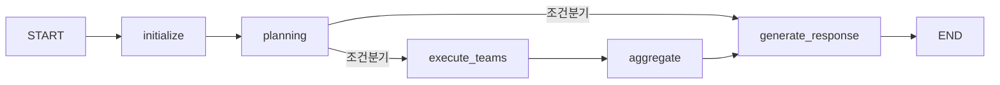
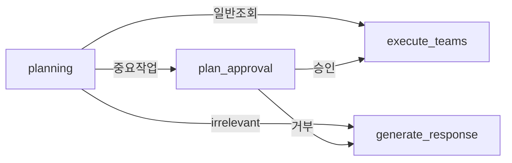

# Interrupt 구현 지점 분석 및 권장사항

**작성일:** 2025-10-22
**작성자:** Claude Code
**목적:** HITL/Interrupt 기능의 최적 구현 지점 결정

---

## 🎯 핵심 질문

> **"어느 지점에 Interrupt를 구현하는지가 관건이다. 지금 지점이 맞는가?"**

### 답변 요약

현재 제안된 지점(`planning_node` 이후)은 **부분적으로 적절**하지만, **더 나은 대안들이 존재**합니다.

---

## 📊 현재 Graph 구조 분석

### 현재 노드 흐름



### 현재 분기 조건 (_route_after_planning)

```python
def _route_after_planning(self, state):
    # IRRELEVANT → 바로 응답
    if intent_type == "irrelevant":
        return "respond"

    # UNCLEAR (낮은 신뢰도) → 바로 응답
    if intent_type == "unclear" and confidence < 0.3:
        return "respond"

    # 실행 계획이 있으면 → 실행
    if execution_steps:
        return "execute"

    # 기본값 → 응답
    return "respond"
```

---

## 🔍 Interrupt 구현 가능 지점 분석

### Option 1: Planning 이후 (원래 제안) ⭐⭐⭐

**위치:** `planning` → `[INTERRUPT]` → `execute_teams`

```python
# Graph 수정
workflow.add_node("plan_approval", plan_approval_node)
workflow.add_edge("planning", "plan_approval")
workflow.add_conditional_edges("plan_approval", ...)
```

**장점:**
- ✅ 계획이 완성된 후 승인
- ✅ 사용자가 전체 계획 검토 가능
- ✅ 기존 코드 변경 최소화

**단점:**
- ❌ 모든 계획에 대해 승인 필요 (과도한 중단)
- ❌ 간단한 조회도 승인 대기
- ❌ UX 저하 가능성

**적합한 경우:**
- 모든 작업이 중요한 경우
- 높은 수준의 통제가 필요한 경우

---

### Option 2: Execute Teams 내부 (팀별 승인) ⭐⭐⭐⭐

**위치:** 각 팀 실행 전 개별 승인

```python
async def _execute_single_team(self, team_name, ...):
    # 특정 팀만 승인 필요
    if self._requires_approval_for_team(team_name, state):
        approval = interrupt({
            "team": team_name,
            "action": self._get_team_action(team_name, state)
        })
        if approval != "approved":
            return {"status": "skipped"}

    # 팀 실행
    return await team.execute(...)
```

**장점:**
- ✅ 세밀한 제어 가능
- ✅ 중요한 팀만 승인 (예: DocumentTeam)
- ✅ SearchTeam은 자동 실행 가능
- ✅ 유연한 정책 적용

**단점:**
- ❌ 여러 번 승인 필요할 수 있음
- ❌ 구현 복잡도 증가

**적합한 경우:**
- 팀별로 위험도가 다른 경우
- 선택적 승인이 필요한 경우

---

### Option 3: Intent 기반 조건부 (추천) ⭐⭐⭐⭐⭐

**위치:** Planning 이후, **BUT 특정 Intent만**

```python
def _route_after_planning(self, state):
    intent_type = state.get("planning_state", {}).get("analyzed_intent", {}).get("intent_type")

    # 승인이 필요한 Intent
    REQUIRES_APPROVAL = [
        "contract_creation",    # 계약서 작성
        "contract_review",      # 계약서 검토
        "legal_consult",       # 법률 상담 (중요)
        "transaction_execute"   # 거래 실행
    ]

    if intent_type in REQUIRES_APPROVAL:
        return "plan_approval"  # Interrupt 발생

    # 기존 로직
    if intent_type == "irrelevant":
        return "respond"

    if execution_steps:
        return "execute"  # 바로 실행 (승인 불필요)

    return "respond"
```

**Graph 구조:**


**장점:**
- ✅ **최적의 UX** (필요한 경우만 중단)
- ✅ 일반 조회는 빠르게 처리
- ✅ 중요 작업만 승인 대기
- ✅ 구현 난이도 적절
- ✅ 점진적 확장 가능

**단점:**
- ❌ Intent 분류 정확도에 의존

**적합한 경우:**
- **대부분의 실제 서비스**
- UX와 보안의 균형이 필요한 경우

---

### Option 4: 동적 Configuration 기반 ⭐⭐⭐⭐

**위치:** 사용자/세션별 설정에 따라 동적 결정

```python
class ApprovalPolicy:
    ALWAYS = "always"          # 항상 승인
    NEVER = "never"           # 승인 불필요
    HIGH_RISK = "high_risk"   # 고위험만
    CUSTOM = "custom"         # 사용자 정의

async def planning_node(self, state):
    # 사용자별 정책 로드
    user_id = state.get("user_id")
    policy = await self._get_user_approval_policy(user_id)

    state["approval_policy"] = policy
    # ...

def _route_after_planning(self, state):
    policy = state.get("approval_policy", ApprovalPolicy.HIGH_RISK)

    if policy == ApprovalPolicy.ALWAYS:
        return "plan_approval"
    elif policy == ApprovalPolicy.NEVER:
        return "execute" if execution_steps else "respond"
    elif policy == ApprovalPolicy.HIGH_RISK:
        # Option 3 로직 적용
        if intent_type in HIGH_RISK_INTENTS:
            return "plan_approval"
    # ...
```

**장점:**
- ✅ 사용자별 맞춤 설정
- ✅ 기업/개인 구분 가능
- ✅ A/B 테스트 가능
- ✅ 런타임 변경 가능

**단점:**
- ❌ 구현 복잡도 높음
- ❌ 설정 관리 필요

---

## 💡 권장 구현 전략

### 1단계: Option 3 구현 (Intent 기반)

```python
# 1. Intent 분류 강화
HIGH_RISK_INTENTS = {
    "contract_creation": "계약서를 작성합니다",
    "contract_review": "계약서를 검토합니다",
    "transaction_execute": "거래를 실행합니다",
    "legal_binding": "법적 구속력이 있는 작업입니다"
}

MEDIUM_RISK_INTENTS = {
    "legal_consult": "법률 자문을 제공합니다",
    "investment_advice": "투자 조언을 제공합니다"
}

LOW_RISK_INTENTS = {
    "market_inquiry": "시세 조회",
    "general_search": "일반 검색",
    "information_lookup": "정보 조회"
}

# 2. 조건부 라우팅
def _route_after_planning(self, state):
    intent_type = self._get_intent_type(state)
    risk_level = self._assess_risk_level(intent_type)

    if risk_level == "high":
        return "plan_approval"
    elif risk_level == "medium" and self._is_large_amount(state):
        return "plan_approval"
    else:
        return "execute" if has_steps else "respond"

# 3. Plan Approval Node
async def plan_approval_node(self, state):
    if not self._requires_approval(state):
        state["approval_status"] = "auto_approved"
        return state

    # Interrupt with rich context
    decision = interrupt({
        "intent": intent_type,
        "risk_level": risk_level,
        "tasks": execution_steps,
        "estimated_impact": self._estimate_impact(state),
        "message": HIGH_RISK_INTENTS.get(intent_type, "승인이 필요합니다")
    })

    state["approval_status"] = decision
    return state
```

### 2단계: 점진적 확장

1. **Phase 1:** High Risk Intent만 승인
2. **Phase 2:** Medium Risk + 조건부 승인
3. **Phase 3:** 사용자 설정 추가 (Option 4)
4. **Phase 4:** 팀별 세밀한 제어 (Option 2)

---

## 📋 구현 지점별 비교표

| 구현 지점 | UX | 보안 | 구현난이도 | 유연성 | 추천도 |
|----------|----|----|----------|--------|--------|
| **Option 1** (Planning 후 전체) | ⭐⭐ | ⭐⭐⭐⭐⭐ | ⭐⭐⭐⭐ | ⭐⭐ | ⭐⭐⭐ |
| **Option 2** (팀별 개별) | ⭐⭐⭐ | ⭐⭐⭐⭐ | ⭐⭐ | ⭐⭐⭐⭐ | ⭐⭐⭐⭐ |
| **Option 3** (Intent 기반) | ⭐⭐⭐⭐⭐ | ⭐⭐⭐⭐ | ⭐⭐⭐ | ⭐⭐⭐⭐ | ⭐⭐⭐⭐⭐ |
| **Option 4** (동적 설정) | ⭐⭐⭐⭐ | ⭐⭐⭐⭐ | ⭐ | ⭐⭐⭐⭐⭐ | ⭐⭐⭐⭐ |

---

## 🎯 최종 권장사항

### 즉시 구현 (Week 1)

**Option 3 (Intent 기반 조건부)를 우선 구현**

```python
# reports/todo_management/HITL_INTERRUPT_IMPLEMENTATION_PLAN_251022.md 수정

# 기존:
workflow.add_edge("planning", "plan_approval")  # 모든 경우

# 변경:
workflow.add_conditional_edges(
    "planning",
    self._route_after_planning_with_approval,  # 새로운 라우터
    {
        "approval_required": "plan_approval",
        "execute": "execute_teams",
        "respond": "generate_response"
    }
)
```

### 이유

1. **최적의 UX**: 필요한 경우만 중단
2. **빠른 구현**: 기존 구조 활용
3. **점진적 확장**: 나중에 Option 2, 4 추가 가능
4. **실전 검증**: 대부분의 서비스가 이 방식 사용

### 구현 우선순위

1. **Week 1**: Option 3 구현
   - HIGH_RISK_INTENTS 정의
   - 조건부 라우팅 구현
   - plan_approval_node 구현

2. **Week 2**: 테스트 및 개선
   - Intent 분류 정확도 향상
   - Risk level 세분화
   - UI/UX 개선

3. **Week 3+**: 확장
   - Option 2 (팀별 제어) 추가
   - Option 4 (사용자 설정) 추가

---

## 🔄 마이그레이션 경로

### 현재 → Option 3

```python
# Step 1: Intent 분류 강화
class IntentRiskAssessor:
    @staticmethod
    def assess(intent_type: str, context: dict) -> str:
        if intent_type in HIGH_RISK_INTENTS:
            return "high"
        # ...

# Step 2: 라우터 수정
def _route_after_planning_with_approval(self, state):
    risk = IntentRiskAssessor.assess(...)
    if risk == "high":
        return "approval_required"
    # 기존 로직

# Step 3: Graph 수정 (최소 변경)
workflow.add_conditional_edges(...)  # 위 참조
```

### Option 3 → Option 2 확장

```python
# 나중에 추가
class TeamApprovalPolicy:
    def requires_approval(self, team: str, context: dict) -> bool:
        if team == "document" and context.get("doc_type") == "contract":
            return True
        # ...
```

---

## 📝 결론

### 핵심 답변

> **Q: 지금 지점(planning 이후)이 맞는가?**

**A: 부분적으로 맞지만, 개선 필요**

- ✅ Planning 이후는 적절한 지점
- ❌ 모든 경우 승인은 과도함
- ✅ **Intent 기반 조건부 승인이 최적**

### 다음 액션

1. `HITL_INTERRUPT_IMPLEMENTATION_PLAN_251022.md` 수정
2. Intent 기반 조건부 라우팅 구현
3. HIGH_RISK_INTENTS 정의
4. 테스트 및 반복 개선

---

**작성 완료:** 2025-10-22
**검토 예정:** 구현 후 피드백 반영

---