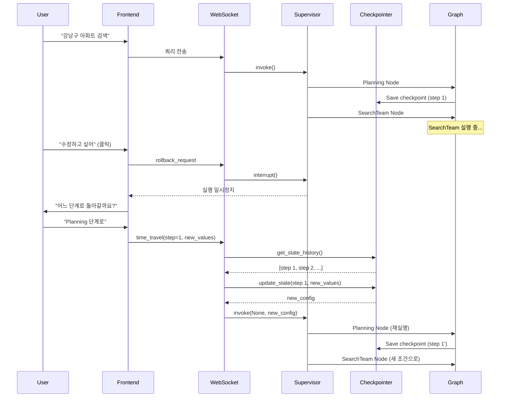

# Todo Management 구현 가이드 (Time Travel + HITL)

**작성일**: 2025-10-22
**예상 구현 시간**: 2-3주
**난이도**: 🔴 높음
**필수 기능**: Human-in-the-Loop + State Time Travel

---

## 구현 개요

사용자가 **AI 작업 실행 중에 되돌아가서 수정하고 다시 시작**할 수 있는 기능입니다.

### 핵심 시나리오

```
사용자: "강남구 아파트 검색해줘"
  ├─ Step 1: Planning ✅ (완료)
  ├─ Step 2: SearchTeam 실행 중... ⏸️
  │   └─ 사용자: "잠깐! 검색 조건 바꾸고 싶어"
  │
  ├─ 🔄 Time Travel: Step 1으로 되돌아가기
  ├─ ✏️ 상태 수정: {"area": "서초구"로 변경}
  └─ ▶️ Step 1부터 다시 실행
```

**사용 기술:**
- **HITL (interrupt/Command)**: 사용자 요청으로 일시정지/재개
- **Time Travel (get_state_history/update_state)**: 과거 상태로 되돌아가기
- **Checkpointer**: 모든 단계 저장/복원

---

## 아키텍처 설계

### 전체 흐름도



---

## 구현 단계별 가이드

---

## Phase 1: Backend Core (1주)

### 1-1. State Schema 확장

**파일**: `backend/app/core/state_schema.py`

**추가 필드**:
```python
from typing import TypedDict, Optional, List, Dict, Any

class MainSupervisorState(TypedDict, total=False):
    # ... 기존 필드들 ...

    # 🆕 Todo Management 관련
    rollback_requested: bool              # 사용자가 되돌리기 요청
    rollback_target_step: Optional[str]   # 되돌아갈 단계 이름
    modification_data: Optional[Dict]     # 수정할 데이터
    available_checkpoints: List[Dict]     # 되돌아갈 수 있는 체크포인트 목록
```

**코드 라인 수**: 10줄

---

### 1-2. RollbackNode 클래스 생성

**파일**: `backend/app/service_agent/cognitive_agents/rollback_manager.py` (새 파일)

```python
"""
Rollback Manager - Time Travel + HITL 통합
"""
import logging
from typing import Dict, Any, List, Optional
from datetime import datetime
from langgraph.types import interrupt
from langgraph.checkpoint.base import BaseCheckpointSaver

logger = logging.getLogger(__name__)


class RollbackManager:
    """
    사용자 요청에 따라 이전 상태로 되돌아가는 관리자
    """

    def __init__(self, checkpointer: BaseCheckpointSaver):
        self.checkpointer = checkpointer

    async def check_rollback_request(
        self,
        state: Dict[str, Any],
        current_step: str
    ) -> Dict[str, Any]:
        """
        각 노드 실행 전에 되돌리기 요청 확인

        Args:
            state: 현재 상태
            current_step: 현재 실행하려는 단계 이름

        Returns:
            업데이트된 state (rollback_requested=True면 interrupt 발생)
        """
        # 되돌리기 요청이 있는지 확인
        if state.get("rollback_requested", False):
            logger.info(f"🔄 Rollback requested at step: {current_step}")

            # HITL: 사용자에게 체크포인트 선택 요청
            user_choice = interrupt({
                "type": "rollback_confirmation",
                "current_step": current_step,
                "message": "어느 단계로 돌아가시겠습니까?",
                "available_checkpoints": state.get("available_checkpoints", [])
            })

            # 사용자 선택 저장
            state["rollback_target_step"] = user_choice.get("target_step")
            state["modification_data"] = user_choice.get("modifications", {})

        return state

    async def get_available_checkpoints(
        self,
        thread_id: str
    ) -> List[Dict[str, Any]]:
        """
        되돌아갈 수 있는 체크포인트 목록 조회

        Args:
            thread_id: 세션 ID

        Returns:
            체크포인트 목록 (step_name, checkpoint_id, timestamp 포함)
        """
        try:
            config = {"configurable": {"thread_id": thread_id}}

            # Checkpointer에서 히스토리 조회
            checkpoints = []
            async for checkpoint in self.checkpointer.aget_history(config):
                metadata = checkpoint.metadata or {}

                checkpoints.append({
                    "checkpoint_id": checkpoint.config["configurable"]["checkpoint_id"],
                    "step_name": metadata.get("step", "unknown"),
                    "timestamp": metadata.get("ts", ""),
                    "parent_id": checkpoint.parent_config.get("configurable", {}).get("checkpoint_id") if checkpoint.parent_config else None
                })

            logger.info(f"📋 Found {len(checkpoints)} checkpoints for thread {thread_id}")
            return checkpoints

        except Exception as e:
            logger.error(f"❌ Error getting checkpoints: {e}")
            return []

    async def execute_time_travel(
        self,
        thread_id: str,
        target_checkpoint_id: str,
        modifications: Dict[str, Any]
    ) -> Dict[str, Any]:
        """
        Time Travel 실행: 특정 체크포인트로 되돌아가서 상태 수정

        Args:
            thread_id: 세션 ID
            target_checkpoint_id: 되돌아갈 체크포인트 ID
            modifications: 수정할 상태 값들

        Returns:
            새 config (이 config로 invoke 하면 수정된 상태부터 재실행됨)
        """
        try:
            config = {"configurable": {"thread_id": thread_id}}

            # 1. 히스토리에서 target checkpoint 찾기
            target_checkpoint = None
            async for checkpoint in self.checkpointer.aget_history(config):
                if checkpoint.config["configurable"]["checkpoint_id"] == target_checkpoint_id:
                    target_checkpoint = checkpoint
                    break

            if not target_checkpoint:
                logger.error(f"❌ Checkpoint {target_checkpoint_id} not found")
                return None

            logger.info(f"🎯 Found target checkpoint: {target_checkpoint_id}")

            # 2. 상태 수정 (update_state)
            # LangGraph의 graph.update_state() 사용
            # 주의: 이 부분은 graph 인스턴스가 필요하므로 Supervisor에서 호출해야 함

            return {
                "target_config": target_checkpoint.config,
                "modifications": modifications,
                "checkpoint_id": target_checkpoint_id
            }

        except Exception as e:
            logger.error(f"❌ Error in time travel: {e}")
            return None


class RollbackNode:
    """
    각 노드 실행 전에 삽입되는 체크 노드
    """

    def __init__(self, manager: RollbackManager, step_name: str):
        self.manager = manager
        self.step_name = step_name

    async def __call__(self, state: Dict[str, Any]) -> Dict[str, Any]:
        """
        되돌리기 요청 확인 및 처리
        """
        return await self.manager.check_rollback_request(state, self.step_name)
```

**코드 라인 수**: 150줄

**핵심 메서드:**
1. `check_rollback_request()`: 각 노드 전에 호출, 되돌리기 요청 있으면 interrupt()
2. `get_available_checkpoints()`: 되돌아갈 수 있는 단계 목록 조회
3. `execute_time_travel()`: 특정 체크포인트로 되돌아가서 상태 수정

---

### 1-3. TeamSupervisor 통합

**파일**: `backend/app/service_agent/supervisor/team_supervisor.py`

#### 수정 1: RollbackManager 초기화 (5줄)

```python
from app.service_agent.cognitive_agents.rollback_manager import RollbackManager

class TeamSupervisor:
    def __init__(self, ...):
        # ... 기존 코드 ...

        # 🆕 RollbackManager 초기화
        self.rollback_manager = RollbackManager(self.checkpointer)
```

#### 수정 2: 각 노드 전에 Rollback 체크 추가 (30줄)

```python
async def planning_node(self, state: MainSupervisorState) -> MainSupervisorState:
    """Planning 단계 - 되돌리기 체크 포함"""

    # 🆕 되돌리기 요청 확인
    state = await self.rollback_manager.check_rollback_request(state, "planning")

    # 기존 Planning 로직
    # ...
    return state


async def search_team_node(self, state: MainSupervisorState) -> MainSupervisorState:
    """SearchTeam 실행 - 되돌리기 체크 포함"""

    # 🆕 되돌리기 요청 확인
    state = await self.rollback_manager.check_rollback_request(state, "search_team")

    # 기존 SearchTeam 로직
    # ...
    return state


async def analysis_team_node(self, state: MainSupervisorState) -> MainSupervisorState:
    """AnalysisTeam 실행 - 되돌리기 체크 포함"""

    # 🆕 되돌리기 요청 확인
    state = await self.rollback_manager.check_rollback_request(state, "analysis_team")

    # 기존 AnalysisTeam 로직
    # ...
    return state
```

#### 수정 3: Time Travel 실행 메서드 추가 (40줄)

```python
async def execute_rollback(
    self,
    thread_id: str,
    target_checkpoint_id: str,
    modifications: Dict[str, Any]
) -> Any:
    """
    Time Travel 실행 및 재실행

    Args:
        thread_id: 세션 ID
        target_checkpoint_id: 되돌아갈 체크포인트 ID
        modifications: 수정할 상태 값

    Returns:
        재실행 결과
    """
    try:
        # 1. Time Travel 정보 가져오기
        travel_info = await self.rollback_manager.execute_time_travel(
            thread_id, target_checkpoint_id, modifications
        )

        if not travel_info:
            logger.error("❌ Time travel failed")
            return None

        target_config = travel_info["target_config"]

        # 2. 상태 수정 (graph.update_state 사용)
        new_config = self.graph.update_state(
            target_config,
            values=modifications,
            as_node="__start__"  # 시작 지점으로
        )

        logger.info(f"✏️ State updated at checkpoint {target_checkpoint_id}")

        # 3. 수정된 상태부터 재실행
        result = await self.graph.ainvoke(
            None,  # Input은 None (이미 상태에 있음)
            config=new_config
        )

        logger.info("✅ Rollback execution completed")
        return result

    except Exception as e:
        logger.error(f"❌ Rollback execution error: {e}")
        return None
```

**총 코드 라인 수**: 75줄

---

### 1-4. 단위 테스트

**파일**: `backend/tests/test_rollback_manager.py` (새 파일)

```python
import pytest
from app.service_agent.cognitive_agents.rollback_manager import RollbackManager
from unittest.mock import Mock, AsyncMock


@pytest.fixture
def mock_checkpointer():
    checkpointer = Mock()
    checkpointer.aget_history = AsyncMock(return_value=[
        Mock(
            config={"configurable": {"checkpoint_id": "ckpt-1"}},
            metadata={"step": "planning", "ts": "2025-10-22T10:00:00"},
            parent_config=None
        ),
        Mock(
            config={"configurable": {"checkpoint_id": "ckpt-2"}},
            metadata={"step": "search_team", "ts": "2025-10-22T10:01:00"},
            parent_config={"configurable": {"checkpoint_id": "ckpt-1"}}
        )
    ])
    return checkpointer


@pytest.mark.asyncio
async def test_get_available_checkpoints(mock_checkpointer):
    """체크포인트 목록 조회 테스트"""
    manager = RollbackManager(mock_checkpointer)

    checkpoints = await manager.get_available_checkpoints("session-123")

    assert len(checkpoints) == 2
    assert checkpoints[0]["step_name"] == "planning"
    assert checkpoints[1]["step_name"] == "search_team"


@pytest.mark.asyncio
async def test_check_rollback_request_no_request():
    """되돌리기 요청 없을 때"""
    manager = RollbackManager(Mock())

    state = {"rollback_requested": False}
    result = await manager.check_rollback_request(state, "planning")

    assert result == state  # 변경 없음


@pytest.mark.asyncio
async def test_execute_time_travel(mock_checkpointer):
    """Time Travel 실행 테스트"""
    manager = RollbackManager(mock_checkpointer)

    result = await manager.execute_time_travel(
        thread_id="session-123",
        target_checkpoint_id="ckpt-1",
        modifications={"query": "modified query"}
    )

    assert result is not None
    assert result["checkpoint_id"] == "ckpt-1"
    assert result["modifications"]["query"] == "modified query"
```

**코드 라인 수**: 60줄

---

## Phase 2: WebSocket API (3-4일)

### 2-1. API 엔드포인트 추가

**파일**: `backend/app/api/chat_api.py`

#### 엔드포인트 1: GET /rollback/checkpoints (체크포인트 목록 조회)

```python
@router.get("/rollback/checkpoints/{session_id}")
async def get_rollback_checkpoints(
    session_id: str,
    db: AsyncSession = Depends(get_db)
):
    """
    되돌아갈 수 있는 체크포인트 목록 조회
    """
    try:
        # RollbackManager 사용
        supervisor = get_supervisor()  # 싱글톤 Supervisor
        checkpoints = await supervisor.rollback_manager.get_available_checkpoints(session_id)

        return {
            "session_id": session_id,
            "checkpoints": checkpoints,
            "count": len(checkpoints)
        }

    except Exception as e:
        logger.error(f"❌ Error getting checkpoints: {e}")
        raise HTTPException(status_code=500, detail=str(e))
```

#### 엔드포인트 2: POST /rollback/execute (Time Travel 실행)

```python
from pydantic import BaseModel

class RollbackRequest(BaseModel):
    session_id: str
    target_checkpoint_id: str
    modifications: Dict[str, Any]


@router.post("/rollback/execute")
async def execute_rollback(
    request: RollbackRequest,
    db: AsyncSession = Depends(get_db)
):
    """
    Time Travel 실행: 특정 체크포인트로 되돌아가서 수정 후 재실행
    """
    try:
        supervisor = get_supervisor()

        # Time Travel + 재실행
        result = await supervisor.execute_rollback(
            thread_id=request.session_id,
            target_checkpoint_id=request.target_checkpoint_id,
            modifications=request.modifications
        )

        if not result:
            raise HTTPException(status_code=400, detail="Rollback failed")

        return {
            "success": True,
            "session_id": request.session_id,
            "checkpoint_id": request.target_checkpoint_id,
            "message": "Rollback executed successfully"
        }

    except Exception as e:
        logger.error(f"❌ Rollback execution error: {e}")
        raise HTTPException(status_code=500, detail=str(e))
```

**코드 라인 수**: 60줄

---

### 2-2. WebSocket 이벤트 추가

**파일**: `backend/app/api/websocket_handler.py`

```python
async def handle_websocket_message(websocket: WebSocket, data: dict):
    """WebSocket 메시지 핸들러"""

    message_type = data.get("type")

    # 🆕 Rollback 요청 처리
    if message_type == "rollback_request":
        await handle_rollback_request(websocket, data)

    # 🆕 Checkpoint 목록 요청
    elif message_type == "get_checkpoints":
        await handle_get_checkpoints(websocket, data)

    # ... 기존 메시지 타입들 ...


async def handle_rollback_request(websocket: WebSocket, data: dict):
    """되돌리기 요청 처리"""
    try:
        session_id = data.get("session_id")

        # 1. 체크포인트 목록 조회
        supervisor = get_supervisor()
        checkpoints = await supervisor.rollback_manager.get_available_checkpoints(session_id)

        # 2. 클라이언트에게 목록 전송
        await websocket.send_json({
            "type": "checkpoint_list",
            "session_id": session_id,
            "checkpoints": checkpoints
        })

    except Exception as e:
        logger.error(f"❌ Rollback request error: {e}")
        await websocket.send_json({
            "type": "error",
            "message": str(e)
        })


async def handle_get_checkpoints(websocket: WebSocket, data: dict):
    """체크포인트 목록만 조회"""
    try:
        session_id = data.get("session_id")
        supervisor = get_supervisor()
        checkpoints = await supervisor.rollback_manager.get_available_checkpoints(session_id)

        await websocket.send_json({
            "type": "checkpoints",
            "session_id": session_id,
            "checkpoints": checkpoints
        })

    except Exception as e:
        logger.error(f"❌ Get checkpoints error: {e}")
        await websocket.send_json({
            "type": "error",
            "message": str(e)
        })
```

**코드 라인 수**: 70줄

---

## Phase 3: Frontend (1주)

### 3-1. RollbackModal 컴포넌트

**파일**: `frontend/src/components/chat/RollbackModal.tsx` (새 파일)

```typescript
import React, { useState, useEffect } from 'react';
import {
  Modal,
  ModalContent,
  ModalHeader,
  ModalBody,
  ModalFooter,
  Button,
  RadioGroup,
  Radio,
  Textarea
} from '@nextui-org/react';

interface Checkpoint {
  checkpoint_id: string;
  step_name: string;
  timestamp: string;
  parent_id?: string;
}

interface RollbackModalProps {
  isOpen: boolean;
  onClose: () => void;
  sessionId: string;
  onRollback: (checkpointId: string, modifications: any) => void;
}

export const RollbackModal: React.FC<RollbackModalProps> = ({
  isOpen,
  onClose,
  sessionId,
  onRollback
}) => {
  const [checkpoints, setCheckpoints] = useState<Checkpoint[]>([]);
  const [selectedCheckpoint, setSelectedCheckpoint] = useState<string>('');
  const [modifications, setModifications] = useState<string>('');
  const [loading, setLoading] = useState(false);

  // 체크포인트 목록 로드
  useEffect(() => {
    if (isOpen && sessionId) {
      fetchCheckpoints();
    }
  }, [isOpen, sessionId]);

  const fetchCheckpoints = async () => {
    try {
      setLoading(true);
      const response = await fetch(`/api/rollback/checkpoints/${sessionId}`);
      const data = await response.json();
      setCheckpoints(data.checkpoints || []);
    } catch (error) {
      console.error('Failed to load checkpoints:', error);
    } finally {
      setLoading(false);
    }
  };

  const handleRollback = () => {
    if (!selectedCheckpoint) {
      alert('되돌아갈 단계를 선택해주세요.');
      return;
    }

    let parsedModifications = {};
    if (modifications.trim()) {
      try {
        parsedModifications = JSON.parse(modifications);
      } catch (e) {
        alert('수정 내용이 올바른 JSON 형식이 아닙니다.');
        return;
      }
    }

    onRollback(selectedCheckpoint, parsedModifications);
    onClose();
  };

  return (
    <Modal isOpen={isOpen} onClose={onClose} size="2xl">
      <ModalContent>
        <ModalHeader>🔄 작업 되돌리기</ModalHeader>
        <ModalBody>
          {loading ? (
            <div>로딩 중...</div>
          ) : (
            <>
              <div className="mb-4">
                <h3 className="text-lg font-semibold mb-2">되돌아갈 단계 선택</h3>
                <RadioGroup
                  value={selectedCheckpoint}
                  onValueChange={setSelectedCheckpoint}
                >
                  {checkpoints.map((cp) => (
                    <Radio key={cp.checkpoint_id} value={cp.checkpoint_id}>
                      <div className="flex flex-col">
                        <span className="font-medium">{cp.step_name}</span>
                        <span className="text-sm text-gray-500">
                          {new Date(cp.timestamp).toLocaleString()}
                        </span>
                      </div>
                    </Radio>
                  ))}
                </RadioGroup>
              </div>

              <div>
                <h3 className="text-lg font-semibold mb-2">수정 내용 (선택 사항)</h3>
                <Textarea
                  placeholder='{"query": "수정된 질문", "area": "서초구"}'
                  value={modifications}
                  onChange={(e) => setModifications(e.target.value)}
                  minRows={3}
                  description="JSON 형식으로 입력하세요"
                />
              </div>
            </>
          )}
        </ModalBody>
        <ModalFooter>
          <Button color="danger" variant="light" onPress={onClose}>
            취소
          </Button>
          <Button color="primary" onPress={handleRollback} isDisabled={!selectedCheckpoint}>
            되돌리기
          </Button>
        </ModalFooter>
      </ModalContent>
    </Modal>
  );
};
```

**코드 라인 수**: 130줄

---

### 3-2. useRollback Hook

**파일**: `frontend/src/hooks/useRollback.ts` (새 파일)

```typescript
import { useState, useCallback } from 'react';

interface UseRollbackReturn {
  isRollbackModalOpen: boolean;
  openRollbackModal: () => void;
  closeRollbackModal: () => void;
  executeRollback: (checkpointId: string, modifications: any) => Promise<void>;
  isRollingBack: boolean;
}

export const useRollback = (
  sessionId: string,
  websocket: WebSocket | null
): UseRollbackReturn => {
  const [isRollbackModalOpen, setIsRollbackModalOpen] = useState(false);
  const [isRollingBack, setIsRollingBack] = useState(false);

  const openRollbackModal = useCallback(() => {
    setIsRollbackModalOpen(true);
  }, []);

  const closeRollbackModal = useCallback(() => {
    setIsRollbackModalOpen(false);
  }, []);

  const executeRollback = useCallback(
    async (checkpointId: string, modifications: any) => {
      if (!websocket || !sessionId) {
        console.error('WebSocket or sessionId not available');
        return;
      }

      try {
        setIsRollingBack(true);

        // WebSocket으로 Rollback 요청 전송
        websocket.send(
          JSON.stringify({
            type: 'rollback_execute',
            session_id: sessionId,
            target_checkpoint_id: checkpointId,
            modifications: modifications
          })
        );

        console.log('Rollback request sent:', { checkpointId, modifications });
      } catch (error) {
        console.error('Rollback execution failed:', error);
      } finally {
        setIsRollingBack(false);
      }
    },
    [websocket, sessionId]
  );

  return {
    isRollbackModalOpen,
    openRollbackModal,
    closeRollbackModal,
    executeRollback,
    isRollingBack
  };
};
```

**코드 라인 수**: 60줄

---

### 3-3. ChatInterface 통합

**파일**: `frontend/src/components/chat/ChatInterface.tsx`

```typescript
import { useRollback } from '@/hooks/useRollback';
import { RollbackModal } from './RollbackModal';

export const ChatInterface = () => {
  // ... 기존 코드 ...

  // 🆕 Rollback Hook 사용
  const {
    isRollbackModalOpen,
    openRollbackModal,
    closeRollbackModal,
    executeRollback,
    isRollingBack
  } = useRollback(sessionId, websocket);

  return (
    <div className="chat-interface">
      {/* 기존 UI */}

      {/* 🆕 Rollback 버튼 */}
      <Button
        color="warning"
        startContent={<Icon icon="solar:history-line-duotone" />}
        onPress={openRollbackModal}
        isDisabled={!sessionId || isRollingBack}
      >
        되돌리기
      </Button>

      {/* 🆕 Rollback Modal */}
      <RollbackModal
        isOpen={isRollbackModalOpen}
        onClose={closeRollbackModal}
        sessionId={sessionId}
        onRollback={executeRollback}
      />
    </div>
  );
};
```

**코드 라인 수**: 30줄

---

## Phase 4: 테스트 & 배포 (3-4일)

### 4-1. 통합 테스트 시나리오

**파일**: `backend/tests/integration/test_rollback_flow.py`

```python
import pytest
from httpx import AsyncClient

@pytest.mark.asyncio
async def test_full_rollback_flow(test_client: AsyncClient):
    """전체 Rollback 플로우 테스트"""

    # 1. 첫 번째 쿼리 실행
    response1 = await test_client.post("/chat", json={
        "session_id": "test-session",
        "query": "강남구 아파트 검색"
    })
    assert response1.status_code == 200

    # 2. 체크포인트 목록 조회
    response2 = await test_client.get("/rollback/checkpoints/test-session")
    assert response2.status_code == 200
    checkpoints = response2.json()["checkpoints"]
    assert len(checkpoints) > 0

    # 3. Planning 단계로 되돌리기
    planning_checkpoint = [cp for cp in checkpoints if cp["step_name"] == "planning"][0]

    response3 = await test_client.post("/rollback/execute", json={
        "session_id": "test-session",
        "target_checkpoint_id": planning_checkpoint["checkpoint_id"],
        "modifications": {"query": "서초구 아파트 검색"}
    })
    assert response3.status_code == 200
    assert response3.json()["success"] is True

    # 4. 재실행 결과 확인
    # (WebSocket으로 결과 수신 확인)
```

**코드 라인 수**: 40줄

---

### 4-2. E2E 테스트

**파일**: `frontend/tests/e2e/rollback.spec.ts` (Playwright)

```typescript
import { test, expect } from '@playwright/test';

test('Rollback flow', async ({ page }) => {
  // 1. 채팅 시작
  await page.goto('/chat');
  await page.fill('[data-testid="chat-input"]', '강남구 아파트 검색');
  await page.click('[data-testid="send-button"]');

  // 2. 응답 대기
  await page.waitForSelector('[data-testid="assistant-message"]');

  // 3. Rollback 버튼 클릭
  await page.click('[data-testid="rollback-button"]');

  // 4. 모달 열림 확인
  await expect(page.locator('[data-testid="rollback-modal"]')).toBeVisible();

  // 5. Planning 단계 선택
  await page.click('text=planning');

  // 6. 수정 내용 입력
  await page.fill('[data-testid="modifications-input"]', '{"query": "서초구 아파트"}');

  // 7. 되돌리기 실행
  await page.click('[data-testid="rollback-confirm-button"]');

  // 8. 재실행 결과 확인
  await page.waitForSelector('text=서초구');
});
```

**코드 라인 수**: 30줄

---

## 구현 통계

| 항목 | 값 |
|------|------|
| 총 수정/생성 파일 | 12개 |
| Backend 코드 | 500줄 |
| Frontend 코드 | 250줄 |
| 테스트 코드 | 130줄 |
| 총 코드 라인 | 880줄 |
| 예상 구현 시간 | 2-3주 |
| 난이도 | 🔴 높음 |

---

## 파일별 수정 요약

### Backend (7개 파일)

| 파일 | 상태 | 코드 라인 | 설명 |
|------|------|-----------|------|
| `core/state_schema.py` | 수정 | 10줄 | State 필드 추가 |
| `cognitive_agents/rollback_manager.py` | 신규 | 150줄 | RollbackManager 클래스 |
| `supervisor/team_supervisor.py` | 수정 | 115줄 | Rollback 통합 |
| `api/chat_api.py` | 수정 | 60줄 | API 엔드포인트 |
| `api/websocket_handler.py` | 수정 | 70줄 | WebSocket 이벤트 |
| `tests/test_rollback_manager.py` | 신규 | 60줄 | 단위 테스트 |
| `tests/integration/test_rollback_flow.py` | 신규 | 40줄 | 통합 테스트 |

### Frontend (5개 파일)

| 파일 | 상태 | 코드 라인 | 설명 |
|------|------|-----------|------|
| `components/chat/RollbackModal.tsx` | 신규 | 130줄 | 모달 컴포넌트 |
| `hooks/useRollback.ts` | 신규 | 60줄 | 커스텀 훅 |
| `components/chat/ChatInterface.tsx` | 수정 | 30줄 | Rollback 통합 |
| `types/rollback.ts` | 신규 | 20줄 | 타입 정의 |
| `tests/e2e/rollback.spec.ts` | 신규 | 30줄 | E2E 테스트 |

---

## 기대 효과

### 사용자 경험

- ✅ **유연성**: 실수 수정 가능 → 사용자 만족도 ↑
- ✅ **효율성**: 재검색 불필요 → 시간 절약
- ✅ **학습 곡선**: "되돌리기" 직관적 → 사용 쉬움

### 성능

- **응답 시간**: 재실행 시 이미 완료된 단계 건너뛰기 (Replay 기능)
- **비용 절감**: 불필요한 LLM 호출 감소

---

## 주의사항 및 제한사항

### ⚠️ 제한사항

1. **Linear History Only**: 브랜치 기록 미지원 (단일 히스토리만)
   - 예: A → B → C → (Rollback to B) → D
   - C로 다시 돌아갈 수 없음 (덮어씌워짐)

2. **Checkpoint 보존 기간**: 기본 7일 (설정 변경 가능)

3. **동시 Rollback 불가**: 한 번에 하나의 Rollback만 실행 가능

### 💡 Best Practices

1. **명확한 Step 이름**: 사용자가 어느 단계인지 알기 쉽게
2. **Metadata 활용**: 각 checkpoint에 설명 추가
3. **에러 처리**: Rollback 실패 시 원래 상태 유지

---

## 추후 개선 가능성

### Phase 5 (선택적)

1. **Branch History**: 여러 시나리오 동시 탐색
   ```
   A → B → C (메인)
       └─→ D (브랜치 1)
       └─→ E (브랜치 2)
   ```

2. **Checkpoint 이름 변경**: 사용자가 이름 지정 가능

3. **자동 Checkpoint**: 중요 단계마다 자동 저장

4. **Diff 표시**: 수정 전/후 비교 UI

---

## 참고 문서

- **LangGraph Time Travel**: [CHECKPOINTER_COMPLETE_GUIDE.md](../human_in_the_loop/CHECKPOINTER_COMPLETE_GUIDE.md) - Section 3
- **HITL 구현**: [HUMAN_IN_THE_LOOP_IMPLEMENTATION_PLAN_251021.md](../human_in_the_loop/HUMAN_IN_THE_LOOP_IMPLEMENTATION_PLAN_251021.md)
- **Checkpointer 역사**: [LANGGRAPH_CHECKPOINTER_HISTORY.md](../human_in_the_loop/LANGGRAPH_CHECKPOINTER_HISTORY.md)

---

**마지막 업데이트**: 2025-10-22
**작성자**: Claude Code
**상태**: 📋 구현 준비 완료
