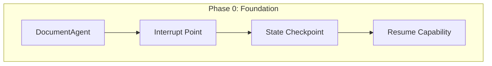
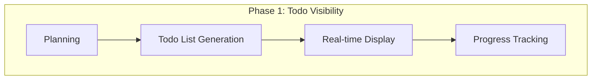
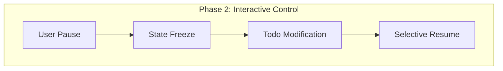
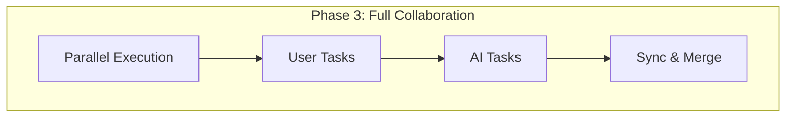

# 사용자 주도 Todo Management 아키텍처 설계

**작성일:** 2025-10-22
**작성자:** Claude Code
**목적:** 사용자가 언제든 중단하고 Todo를 수정하며 작업할 수 있는 시스템 설계

---

## 🎯 비전과 목표

### 최종 비전 (Future State)

> **"사용자가 AI의 작업 계획을 실시간으로 보고, 언제든 중단하고, Todo를 수정하며, 함께 작업하는 시스템"**

```
사용자: "이 부동산 계약서 작성해줘"

AI: [Todo 리스트 생성]
1. ✅ 매물 정보 조회
2. 🔄 계약 조건 확인
3. ⏸️ 계약서 초안 작성 ← [사용자가 여기서 중단]
4. ⬜ 법률 검토
5. ⬜ 최종 문서 생성

사용자: "3번 수정해줘. 특약사항 추가하고 싶어"
AI: "네, Todo를 수정하고 계속 진행하겠습니다"
```

### 현재 목표 (Initial Implementation)

**DocumentAgent에 기초 인프라 구축**
- Interrupt 메커니즘 구현
- Todo 상태 관리 구조
- 추후 확장 가능한 아키텍처

---

## 🏗️ 단계별 구현 전략

### Phase 0: Foundation (현재)
**목표:** 기반 인프라 구축



**구현 내용:**
- DocumentAgent에 interrupt 지점 추가
- Checkpoint를 통한 상태 저장
- Command를 통한 재개 메커니즘

### Phase 1: Todo Visibility
**목표:** 작업 계획 가시화



**구현 내용:**
- Planning 결과를 Todo 리스트로 변환
- WebSocket으로 실시간 전송
- Frontend Todo UI 컴포넌트

### Phase 2: Interactive Control
**목표:** 사용자 상호작용



**구현 내용:**
- 언제든 중단 가능한 UI
- Todo 아이템 수정/삭제/추가
- 선택적 재개 (특정 단계부터)

### Phase 3: Full Collaboration
**목표:** AI-Human 협업



---

## 💡 초기 구현 방안 (DocumentAgent 중심)

### 왜 DocumentAgent부터?

1. **가장 리스크가 높은 작업**
   - 계약서 작성/수정
   - 법률 문서 생성
   - 중요 서류 처리

2. **명확한 단계 구분**
   - 문서 유형 선택
   - 템플릿 로드
   - 내용 작성
   - 검토 및 수정

3. **사용자 개입이 필수적**
   - 계약 조건 확인
   - 특약사항 추가
   - 최종 검토

### 구현 아키텍처

```python
# backend/app/service_agent/teams/document_team.py

class DocumentTeam:
    async def execute_with_todo(self, task: Dict, state: Dict) -> Dict:
        """Todo Management가 가능한 실행"""

        # 1. Todo 리스트 생성
        todo_list = self._generate_todo_list(task)
        await self._send_todo_list(todo_list)

        # 2. 각 단계별 실행
        for idx, todo_item in enumerate(todo_list):
            # 중단 가능 지점
            if self._should_interrupt(todo_item):
                user_action = interrupt({
                    "type": "todo_checkpoint",
                    "current_todo": todo_item,
                    "completed": todo_list[:idx],
                    "remaining": todo_list[idx:],
                    "can_modify": True
                })

                if user_action.get("action") == "modify":
                    todo_list = user_action.get("modified_todos")
                elif user_action.get("action") == "skip":
                    continue
                elif user_action.get("action") == "abort":
                    break

            # Todo 실행
            result = await self._execute_todo_item(todo_item)
            todo_item["status"] = "completed"
            await self._update_todo_status(todo_item)

        return {"todos": todo_list, "results": results}

    def _generate_todo_list(self, task: Dict) -> List[Dict]:
        """작업을 Todo 리스트로 변환"""
        doc_type = task.get("document_type")

        if doc_type == "contract":
            return [
                {"id": 1, "task": "매물 정보 확인", "risk": "low"},
                {"id": 2, "task": "계약 조건 설정", "risk": "medium"},
                {"id": 3, "task": "계약서 초안 작성", "risk": "high", "interrupt": True},
                {"id": 4, "task": "법률 조항 검토", "risk": "high", "interrupt": True},
                {"id": 5, "task": "최종 문서 생성", "risk": "medium"}
            ]
        # ...

    def _should_interrupt(self, todo_item: Dict) -> bool:
        """중단 여부 결정"""
        # Phase 0: high risk만 중단
        # Phase 1: 사용자 설정에 따라
        # Phase 2: 언제든 중단 가능
        return todo_item.get("interrupt", False) or todo_item.get("risk") == "high"
```

### State 확장

```python
# backend/app/service_agent/foundation/separated_states.py

class TodoManagementState(TypedDict):
    """Todo Management를 위한 상태"""

    # Todo 리스트
    todo_list: List[Dict[str, Any]]
    current_todo_index: int
    completed_todos: List[Dict[str, Any]]

    # 중단/재개 관련
    is_paused: bool
    pause_reason: Optional[str]
    checkpoint_data: Optional[Dict[str, Any]]

    # 사용자 수정 사항
    user_modifications: List[Dict[str, Any]]
    modification_history: List[Dict[str, Any]]

class MainSupervisorState(TypedDict):
    # 기존 필드...

    # Todo Management (Phase 0)
    todo_management: Optional[TodoManagementState]
    active_team_todos: Optional[Dict[str, List[Dict]]]  # 팀별 Todo
```

---

## 🔄 확장 가능한 구조

### 1. Interface 정의 (향후 모든 Agent가 구현)

```python
# backend/app/service_agent/interfaces/todo_capable.py

from abc import ABC, abstractmethod
from typing import List, Dict, Any

class TodoCapable(ABC):
    """Todo Management를 지원하는 Agent/Team의 인터페이스"""

    @abstractmethod
    async def generate_todos(self, task: Dict) -> List[Dict]:
        """작업을 Todo 리스트로 변환"""
        pass

    @abstractmethod
    async def execute_with_todos(self, todos: List[Dict]) -> Dict:
        """Todo 기반 실행"""
        pass

    @abstractmethod
    async def handle_interruption(self, state: Dict) -> Dict:
        """중단 처리"""
        pass

    @abstractmethod
    async def resume_from_checkpoint(self, checkpoint: Dict) -> Dict:
        """체크포인트에서 재개"""
        pass
```

### 2. 점진적 확장 경로

```python
# Phase 0: DocumentTeam만
class DocumentTeam(TodoCapable):
    # 구현...

# Phase 1: 중요 Team들 추가
class LegalTeam(TodoCapable):
    # 구현...

class TransactionTeam(TodoCapable):
    # 구현...

# Phase 2: 모든 Team
class SearchTeam(TodoCapable):
    # 간단한 구현 (자동 실행)
    async def generate_todos(self, task):
        return [{"task": "검색 실행", "auto": True}]
```

### 3. Frontend 준비

```tsx
// frontend/components/todo/TodoManager.tsx

interface TodoItem {
  id: string;
  task: string;
  status: 'pending' | 'in_progress' | 'completed' | 'paused';
  team: string;
  risk: 'low' | 'medium' | 'high';
  canModify: boolean;
  canSkip: boolean;
}

export function TodoManager() {
  const [todos, setTodos] = useState<TodoItem[]>([]);
  const [isPaused, setIsPaused] = useState(false);

  const handlePause = () => {
    ws.send(JSON.stringify({
      type: 'pause_execution',
      at_todo: currentTodoId
    }));
  };

  const handleModifyTodo = (todoId: string, newContent: string) => {
    ws.send(JSON.stringify({
      type: 'modify_todo',
      todo_id: todoId,
      new_content: newContent
    }));
  };

  const handleResume = () => {
    ws.send(JSON.stringify({
      type: 'resume_execution',
      from_todo: currentTodoId
    }));
  };

  return (
    <div className="todo-manager">
      <div className="controls">
        <Button onClick={handlePause} disabled={!isExecuting}>
          ⏸️ 일시정지
        </Button>
        <Button onClick={handleResume} disabled={!isPaused}>
          ▶️ 계속
        </Button>
      </div>

      <div className="todo-list">
        {todos.map(todo => (
          <TodoItem
            key={todo.id}
            todo={todo}
            onModify={handleModifyTodo}
            canEdit={isPaused && todo.canModify}
          />
        ))}
      </div>
    </div>
  );
}
```

---

## 📊 구현 우선순위

### Immediate (Phase 0 - 현재)

| 작업 | 우선순위 | 이유 |
|-----|---------|------|
| DocumentTeam interrupt 구현 | 🔴 High | 가장 리스크 높은 작업 |
| Checkpoint 메커니즘 | 🔴 High | 중단/재개의 기반 |
| Command 처리 | 🔴 High | 사용자 입력 처리 |

### Short-term (Phase 1 - 1개월)

| 작업 | 우선순위 | 이유 |
|-----|---------|------|
| Todo 리스트 생성 | 🟡 Medium | 가시성 확보 |
| WebSocket 이벤트 | 🟡 Medium | 실시간 업데이트 |
| Frontend UI | 🟡 Medium | 사용자 인터페이스 |

### Long-term (Phase 2+ - 3개월)

| 작업 | 우선순위 | 이유 |
|-----|---------|------|
| 모든 Team 확장 | 🟢 Low | 점진적 확장 |
| 병렬 실행 | 🟢 Low | 고급 기능 |
| AI-Human 협업 | 🟢 Low | 최종 목표 |

---

## 🎯 DocumentAgent 초기 구현 상세

### Step 1: Interrupt 지점 추가

```python
# backend/app/service_agent/teams/document_team.py

async def execute(self, task: Dict, context: Dict) -> Dict:
    """문서 작업 실행"""

    doc_type = task.get("document_type")

    # HIGH RISK 작업 식별
    HIGH_RISK_DOCS = ["contract", "legal_notice", "power_of_attorney"]

    if doc_type in HIGH_RISK_DOCS:
        # Interrupt 발생
        approval = interrupt({
            "type": "document_approval",
            "document_type": doc_type,
            "preview": self._generate_preview(task),
            "risks": self._identify_risks(doc_type),
            "message": f"{doc_type} 문서를 작성하려고 합니다. 승인하시겠습니까?"
        })

        if approval != "approved":
            return {"status": "cancelled", "reason": "User rejected"}

    # 문서 생성 진행
    result = await self._create_document(task, context)
    return result
```

### Step 2: Todo 생성 (준비)

```python
def _prepare_todo_structure(self, task: Dict) -> Dict:
    """향후 Todo Management를 위한 구조 준비"""

    # 지금은 메타데이터로만 저장
    # Phase 1에서 실제 Todo로 변환

    return {
        "steps": [
            {
                "step": 1,
                "description": "문서 유형 확인",
                "status": "pending",
                "interruptible": False
            },
            {
                "step": 2,
                "description": "템플릿 로드",
                "status": "pending",
                "interruptible": False
            },
            {
                "step": 3,
                "description": "내용 작성",
                "status": "pending",
                "interruptible": True,  # 중단 가능
                "user_input_required": True
            },
            {
                "step": 4,
                "description": "법률 검토",
                "status": "pending",
                "interruptible": True
            }
        ]
    }
```

### Step 3: WebSocket 이벤트 준비

```python
# backend/app/api/ws_manager.py

async def handle_todo_events(self, event_type: str, data: Dict):
    """Todo 관련 이벤트 처리 (향후 확장용)"""

    if event_type == "pause_at_todo":
        # Phase 1에서 구현
        pass
    elif event_type == "modify_todo":
        # Phase 2에서 구현
        pass
    elif event_type == "skip_todo":
        # Phase 2에서 구현
        pass
```

---

## 🔍 성공 지표

### Phase 0 (현재)
- ✅ DocumentTeam에서 interrupt 동작
- ✅ 승인/거부 처리 가능
- ✅ Checkpoint 저장/복원

### Phase 1 (1개월 후)
- ✅ Todo 리스트 표시
- ✅ 실행 진행상황 추적
- ✅ 기본적인 중단/재개

### Phase 2 (3개월 후)
- ✅ Todo 수정 가능
- ✅ 선택적 실행
- ✅ 여러 Agent 지원

### Phase 3 (6개월 후)
- ✅ 완전한 협업 모드
- ✅ 병렬 작업
- ✅ AI-Human 동시 작업

---

## 📝 핵심 결정 사항

### Q: 왜 모든 Agent가 아닌 DocumentAgent부터?

**A: 점진적 확장 전략**
1. 가장 필요한 곳부터 (리스크 높음)
2. 구조 검증 후 확장
3. 사용자 피드백 반영

### Q: 지금 당장 Todo UI를 만들어야 하나?

**A: 아니요, 단계적 접근**
1. **Phase 0**: Interrupt 메커니즘만 (Backend)
2. **Phase 1**: Todo 가시화 (Frontend)
3. **Phase 2**: 상호작용 (Full-stack)

### Q: 다른 Agent들은 언제?

**A: 우선순위에 따라**
1. **Month 1**: DocumentTeam
2. **Month 2**: LegalTeam, TransactionTeam
3. **Month 3+**: 나머지 Team들

---

## 🚀 Action Items

### 즉시 시작 (Today)

```bash
# 1. DocumentTeam 수정
cd backend/app/service_agent/teams
# document_team.py에 interrupt 추가

# 2. State 확장
cd backend/app/service_agent/foundation
# separated_states.py에 todo_management 필드 추가

# 3. 테스트
pytest tests/test_document_interrupt.py
```

### 이번 주 (Week 1)

- [ ] DocumentTeam interrupt 구현
- [ ] Checkpoint 테스트
- [ ] Command 처리 확인

### 다음 주 (Week 2)

- [ ] Todo 구조 설계 확정
- [ ] WebSocket 이벤트 정의
- [ ] Frontend 목업 준비

---

## 📚 참고 자료

### 내부 문서
- [CHECKPOINT_SCHEMA_FINAL_VALIDATION_251022.md](./CHECKPOINT_SCHEMA_FINAL_VALIDATION_251022.md)
- [HITL_INTERRUPT_IMPLEMENTATION_PLAN_251022.md](./HITL_INTERRUPT_IMPLEMENTATION_PLAN_251022.md)
- [INTERRUPT_IMPLEMENTATION_POINT_ANALYSIS_251022.md](./INTERRUPT_IMPLEMENTATION_POINT_ANALYSIS_251022.md)

### 외부 참고
- [LangGraph Human-in-the-Loop](https://langchain-ai.github.io/langgraph/concepts/human_in_the_loop/)
- [Building Collaborative AI Systems](https://arxiv.org/abs/2304.14991)

---

**작성 완료:** 2025-10-22
**다음 리뷰:** Phase 0 구현 후
**상태:** 🟢 Ready for Implementation

---